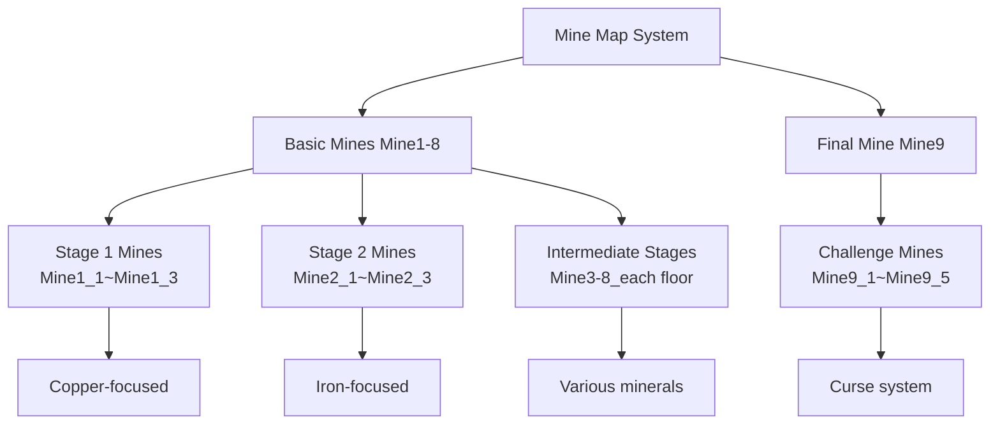
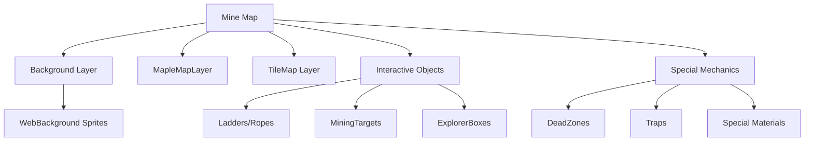

# Core Architecture - Map System - Mine Maps

## Overview
Mine maps are the core content of Mine Simulator where players mine resources and gain experience. There are a total of 25 mine maps from Mine1_1 to Mine9_5, each with unique difficulty levels and special mechanisms.

## Mine Map Structure

### Map Classification System


### Mine-Specific Features

#### **Stage 1-2 Mines (Mine1-2)**
- **Difficulty**: Beginner
- **Main Minerals**: Copper (Mine1), Iron (Mine2)
- **Features**: Learning basic mining system

#### **Stage 3-8 Mines (Mine3-8)**
- **Mine3**: 25% chance to obtain Icicle special material
- **Mine6**: Stardust acquisition (when using MP), "Excited!" mode (consumes 10 materials)
- **Mine7**: Cloud Fragment acquisition, Shield effect (consumes 10 materials)
- **Mine8**: Advanced minerals and trap system

#### **Stage 9 Mines (Mine9_1-9_5)**
- **Features**: Curse stack system
- **Mechanism**: Accumulates curse stacks every 30 seconds
- **Risk Level**: Highest difficulty area

## Related File Paths

### Map Files
```
map/
├── Mine1_1.map ~ Mine1_3.map          # Stage 1 mines (copper)
├── Mine2_1.map ~ Mine2_3.map          # Stage 2 mines (iron)
├── Mine3_1.map ~ Mine3_3.map          # Stage 3 mines (icicle)
├── Mine4_1.map ~ Mine4_3.map          # Stage 4 mines
├── Mine5_1.map ~ Mine5_3.map          # Stage 5 mines
├── Mine6_1.map ~ Mine6_2.map          # Stage 6 mines (stardust)
├── Mine7_1.map ~ Mine7_2.map          # Stage 7 mines (cloud fragment)
├── Mine8_1.map ~ Mine8_2.map          # Stage 8 mines
└── Mine9_1.map ~ Mine9_5.map          # Stage 9 mines (curse)
```

### Mine-Related Component Scripts
```
RootDesk/MyDesk/Components/Mine/
├── MiningGame.mlua                     # Mining game core logic
├── MiningTargetManager.mlua            # Mining vein generation and management
├── MiningTargetObject.mlua             # Individual mining vein object
├── ExplorerBoxInteraction.mlua         # Explorer box interaction
├── DeadZone.mlua                       # Danger zone (instant death)
├── DroppedItem.mlua                    # Item drop handling
├── DroppedGoldBox.mlua                 # Gold box drop
├── DroppedRelicBox.mlua               # Relic box drop
├── DroppedMaterial.mlua               # Special material drop
└── Lights/                            # Lighting system
    ├── LightComponent.mlua            # Light component
    └── LightInteraction.mlua          # Light interaction
```

### Image Resources
```
RootDesk/MyDesk/Images/광맥/
├── 광맥_가넷, 자수정.sprite           # Gem vein images
├── 광맥_강철.sprite                   # Steel vein image
├── 광맥_구리.sprite                   # Copper vein image
├── 광맥_다이아몬드.sprite             # Diamond vein image
├── 광맥_루비, 사파이어.sprite         # Ruby/Sapphire vein images
├── 광맥_에메랄드.sprite               # Emerald vein image
├── 광맥_은.sprite                     # Silver vein image
├── 광맥_철.sprite                     # Iron vein image
└── 광맥_황금.sprite                   # Gold vein image
```

## Mining System Detailed Analysis

### Mining Vein Level System
```lua
-- Mining reward system implemented in MiningTargetObject.mlua

method void HandleMiningReward(Entity player)
    local miningTargetTable = _DataService:GetTable("MiningTarget")
    
    -- Acquire 3 basic minerals
    for i=1, 3 do
        local amount = tonumber(miningTargetTable:GetCell(self.level, 2))
        
        -- In temple, increase by 60% per floor
        if self.level >= 27 then
            amount = amount * (1 + 0.6 * (currentTempleFloor - 1))
        end
        
        local trifectaAmount = math.floor(amount/3)
        player.PlayerBackpack:AddItem(i, trifectaAmount)
    end
end
```

### Special Material System

#### Mine3: Icicle System
```lua
-- 25% chance to obtain icicle
if currentMine == 3 then
    local randomValue = _UtilLogic:RandomDouble()
    if randomValue < 0.25 then
        self:DropMaterial(player, 3)
        player.PlayerStateAtStage:GetMaterial(1)
        -- Display UI log: "Icicle" acquired
    end
end
```

#### Mine6: Stardust and "Excited!" Mode
```lua
-- Obtain stardust only when MP usage rate is not 0
if currentMine == 6 then
    if player.PlayerIngameData.MPUseRate ~= 0 then
        self:DropMaterial(player, 6)
        player.PlayerStateAtStage:GetMaterial(1)
    end
end

-- PlayerStateAtStage.mlua: Effect when holding 10 stardust
if stageNum == 6 and self.HavingMaterialNum >= 10 then
    self:StartExitedMode(self.Entity.OwnerId)  -- Activate "Excited!" mode
    self:LoseMaterial(10, false)
end
```

#### Mine7: Cloud Fragment and Shield
```lua
-- Always obtain cloud fragment
if currentMine == 7 then
    self:DropMaterial(player, 7, player.OwnerId)
    player.PlayerStateAtStage:GetMaterial(1)
end

-- Obtain shield when holding 10 cloud fragments
if stageNum == 7 and self.HavingMaterialNum >= 10 then
    self.Entity.PlayerIngameData:GetProtector()
    self:LoseMaterial(10, false)
end
```

### Gem/Fossil System

#### Gem Acquisition Probability
```lua
-- Determine gem probability and type by level
local jewerlyProb = 보석확률테이블[self.level]

if randomValue < jewerlyProb then
    local dropIdx = self.level * 2 + 1  -- Default is raw stone
    
    if self.level >= 2 and self.level <= 19 then
        -- Level 2-19: 90% raw stone, 10% gem
        if _UtilLogic:RandomDouble() >= 0.9 then
            dropIdx = self.level * 2 + 2  -- Change to gem
        end
    elseif self.level == 27 then
        -- Temple: Random gem (index 4-42)
        dropIdx = _UtilLogic:RandomIntegerRange(4, 42)
    end
    
    player.PlayerBackpack:AddItem(dropIdx, 1)
end
```

#### Fossil System
```lua
-- Fossil acquisition (index 43-49)
if randomValue < fossilProb then
    local dropIdx = _UtilLogic:RandomIntegerRange(43, 49)
    player.PlayerBackpack:AddItem(dropIdx, 1)
    self:DropFossilBox(player, dropIdx, player.OwnerId)
end
```

## Mine9 Curse System

### Curse Stack Mechanism
```lua
-- PlayerStateAtStage.mlua: Mine9-specific curse system
method void UpdateCurseSystem(number delta)
    if self.StageNum == 9 then
        self.CurseCoolTime = self.CurseCoolTime + delta
        
        -- Increase curse stack every 30 seconds
        if self.CurseCoolTime >= 30 then
            self.CurseCoolTime = 0
            self:GetCurseStack()
            -- Display curse stack in UI
        end
    end
end
```

### Danger Zone (DeadZone)
```lua
-- DeadZone.mlua: Instant death when player touches
method void HandleTriggerEnterEvent(TriggerEnterEvent event)
    local TriggerBodyEntity = event.TriggerBodyEntity
    
    if TriggerBodyEntity.TagComponent and
       TriggerBodyEntity.TagComponent.Tags[1] == "player" then
        TriggerBodyEntity.PlayerIngameData:Die()
    end
end
```

## Basic Map Structure by Mine

### Common Map Components
1. **MapComponent**: Basic map information
2. **FootholdComponent**: Platform system
3. **SoundComponent**: Background music
4. **LoadingManager**: Map loading management
5. **MapOptimizeComponent**: Performance optimization

### Map Layer Structure


### Mining Vein Placement System
```lua
-- MiningTargetManager.mlua: Dynamic mining vein generation system
method void SpawnMiningTargets()
    -- Determine number and positions of mining veins by map
    local targetCount = self:GetTargetCountForLevel()
    local spawnPositions = self:GetValidSpawnPositions()
    
    for i = 1, targetCount do
        local position = spawnPositions[i]
        local miningTarget = self:CreateMiningTarget(position)
        miningTarget.level = self:CalculateMiningLevel()
    end
end
```

## Gameplay Flow

### Mining Process
1. **Discover Vein**: Interact with mining vein object in map
2. **Start Mining**: Activate MiningGame component
3. **Mining Progress**: Progress increases based on player input
4. **Obtain Rewards**: Various item drops based on probability
5. **Special Effects**: Special effects activate based on materials

### Difficulty Curve
- **Mine1-3**: Tutorial and basic learning
- **Mine4-6**: Intermediate difficulty, special materials introduced
- **Mine7-8**: Advanced difficulty, complex mechanisms
- **Mine9**: Endgame content, highest difficulty

## Expansion and Development Guide

### Adding New Mine
1. **Create Map File**: Define map layout in `.map` format
2. **Add Mining Vein Data**: Add new level data to MiningTarget CSV
3. **Implement Special Mechanisms**: Develop new components if needed
4. **Configure Reward Tables**: Set up probability and item tables

### Performance Optimization
- **MapOptimizeComponent**: Disable off-screen objects
- **Dynamic Loading**: Load only necessary sections
- **Object Pooling**: Reuse dropped items

## Common Problem Solving

### When Mining Doesn't Work
1. Check MiningTargetObject's level setting
2. Check PlayerBackpack's available space
3. Check mining vein interaction trigger range

### When Special Materials Don't Drop
1. Check corresponding mine number (currentMine)
2. Debug probability calculation logic
3. Check PlayerStateAtStage component state

