# Core Architecture - Map System - Temple Maps

## Overview
Temple maps are advanced content in Mine Simulator, consisting of 8 special maps themed around Greek mythology. Each temple has unique mechanisms, traps, and reward systems that match the characteristics of their respective gods, providing challenging yet rewarding gameplay for players.

## Temple Map System

### 8 Temple Structure

```mermaid
graph TD
    A[Greek Mythology Temple System] --> B[8 of the 12 Olympian Gods]
    
    B --> C[Zeus_1<br/>⚡ Zeus - God of Lightning]
    B --> D[Poseidon_2<br/>🌊 Poseidon - God of the Sea]
    B --> E[Apollon_3<br/>☀️ Apollo - God of the Sun]
    B --> F[Athena_4<br/>🛡️ Athena - Goddess of War]
    B --> G[Artemis_5<br/>🌙 Artemis - Goddess of the Moon]
    B --> H[Aphrodite_6<br/>💖 Aphrodite - Goddess of Love]
    B --> I[Demeter_7<br/>🌾 Demeter - Goddess of Agriculture]
    B --> J[Hades_8<br/>💀 Hades - God of the Underworld]
    
    C --> K[Lightning Trap System]
    D --> L[Water & Marine Life Traps]
    E --> M[Sunship & Planet Mechanics]
    F --> N[Arrow & Spear Traps]
    G --> O[Moonlight & Hunting Mechanics]
    H --> P[Love Magic & Cupid]
    I --> Q[Nature & Seasonal Traps]
    J --> R[Ghost & Throne Traps]
```


## Temple-Specific Detailed Analysis

### 1. Temple_Zeus_1 (Zeus Temple)
**Theme**: Master of Lightning and Thunder
- **Core Mechanism**: Lightning trap system
- **Main Traps**:
  - `Trap_ThunderCloud`: Summon thunder clouds
  - `Trap_ThunderMonster`: Summon lightning monsters
  - `Trap_ThunderPriest`: Lightning priest attacks

### 2. Temple_Poseidon_2 (Poseidon Temple)  
**Theme**: Sea and Marine Life
- **Core Mechanism**: Water traps and marine creature attacks
- **Main Traps**:
  - `Trap_SeaOfPoseidon`: Summon Poseidon's sea
  - `Trap_Torpedo`: Torpedo attacks
  - `Trap_Squid`: Giant squid attacks
  - `Trap_InkBullet`: Ink projectiles

### 3. Temple_Apollon_3 (Apollo Temple)
**Theme**: Sun and Planetary Movement
- **Core Mechanism**: Sunbeam and planetary orbit system
- **Main Elements**:
  - `Model_SunShip`: Sunship model
  - `Model_Planet`: Planet objects
  - `PlanetMovement`: Planetary orbital movement

### 4. Temple_Athena_4 (Athena Temple)
**Theme**: War and Wisdom Strategy
- **Core Mechanism**: Precise arrow and spear traps
- **Main Traps**:
  - `Trap_Arrow`: Arrow firing traps
  - `Trap_ArrowShooter`: Arrow launchers
  - `Model_StaticSpear`: Static spear traps

### 5. Temple_Artemis_5 (Artemis Temple)
**Theme**: Moonlight and Hunting
- **Core Mechanism**: Moon fragment collection and guide system
- **Special Items**:
  - `Model_MoonPiece`: Moon fragments
  - `Model_Guide_Key`: Guide keys

### 6. Temple_Aphrodite_6 (Aphrodite Temple)
**Theme**: Love Magic and Cupid
- **Core Mechanism**: Love status effects and emotion manipulation
- **Main Traps**:
  - `Trap_Cupid`: Summon Cupid
  - `Trap_CupidArrow`: Cupid's arrows
  - `Trap_LovePoison`: Love poison
  - `Trap_HeartBullet`: Heart projectiles
  - `Trap_LittleDevil`: Summon little devils

### 7. Temple_Demeter_7 (Demeter Temple)
**Theme**: Agriculture and Seasonal Changes
- **Core Mechanism**: Seasonal changes and nature traps
- **Environmental Elements**: Agriculture-themed traps and seasonal effects

### 8. Temple_Hades_8 (Hades Temple)
**Theme**: Death and Underworld
- **Core Mechanism**: Ghost summoning and throne traps
- **Main Traps**:
  - `Trap_Hades_Throne`: Hades' throne
  - `SpawnThroneManager`: Throne spawn manager
  - Various ghost traps

## Related File Paths

### Temple Map Files
```
map/
├── Temple_Zeus_1.map                   # Zeus temple (lightning)
├── Temple_Poseidon_2.map              # Poseidon temple (sea)
├── Temple_Apollon_3.map               # Apollo temple (sun)
├── Temple_Athena_4.map                # Athena temple (war)
├── Temple_Artemis_5.map               # Artemis temple (moon)
├── Temple_Aphrodite_6.map             # Aphrodite temple (love)
├── Temple_Demeter_7.map               # Demeter temple (agriculture)
└── Temple_Hades_8.map                 # Hades temple (underworld)
```

### Temple-Specific Level Design Components
```
RootDesk/MyDesk/LevelDesign0109~/
├── Zeus/                               # Zeus temple exclusive components
│   ├── Trap_ThunderCloud.mlua         # Thunder cloud trap
│   ├── Trap_ThunderMonster.mlua       # Thunder monster
│   ├── Trap_ThunderPriest.mlua        # Thunder priest
│   └── ... (16 files)
├── Poseidon/                          # Poseidon temple exclusive
│   ├── Trap_SeaOfPoseidon.mlua        # Sea summoning trap
│   ├── Trap_Torpedo.mlua              # Torpedo trap
│   ├── Trap_Squid.mlua                # Squid trap
│   └── ... (11 files)
├── Apollon/                           # Apollo temple exclusive
│   ├── Model_SunShip_1.model          # Sunship model
│   ├── PlanetMovement.mlua            # Planet movement
│   └── ... (11 files)
├── Athena/                            # Athena temple exclusive
│   ├── Trap_Arrow.mlua                # Arrow trap
│   ├── Trap_ArrowShooter.mlua         # Arrow launcher
│   └── ... (9 files)
├── Artemis/                           # Artemis temple exclusive
│   ├── Model_MoonPiece.model          # Moon fragment model
│   └── Model_Guide_Key.model          # Guide key model
├── Aphrodite_Love/                    # Aphrodite temple exclusive
│   ├── Trap_Cupid.mlua                # Cupid trap
│   ├── Trap_LovePoison.mlua           # Love poison
│   ├── GoldApple.mlua                 # Golden apple
│   └── ... (32 files)
├── Demeter/                           # Demeter temple exclusive
│   └── ... (10 files)
└── Hades/                             # Hades temple exclusive
    ├── Trap_Hades_Throne.mlua         # Hades throne trap
    ├── SpawnThroneManager.mlua         # Throne spawn manager
    └── ... (13 files)
```

### Common Temple System
```
RootDesk/MyDesk/
├── InteractionTemplePortal.mlua        # Temple portal interaction
├── ModelForTemple/                     # Temple-exclusive models
│   ├── RelatedComponents/              # Temple interaction components
│   │   ├── TemplePegasus.mlua          # Pegasus interaction
│   │   ├── TempleGemBox.mlua           # Gem box (Hades treasure)
│   │   ├── TempleGoldstatus.mlua       # Gold staff (Plutus)
│   │   └── TempleExplorerBox.mlua      # Temple explorer box
│   └── Model_TempleFountain.model      # Temple fountain model
└── Components/Player/PlayerIngameData.mlua  # Temple entry management
```

## Temple System Mechanisms

### Temple Entry and Portal System
```lua
-- InteractionTemplePortal.mlua: Temple portal system
method void UsePortal()
    local player = _UserService.LocalPlayer
    local destination = ""
    
    -- When leaving Hades temple
    if isvalid(player.CurrentMap.TempleHadesManager) then
        destination = player.PlayerIngameData.latestTempleName
        -- Recover HP/MP by half
        player.PlayerIngameData:RecoverHP(player.PlayerIngameData.HPMax/2)
        player.PlayerIngameData.MP = player.PlayerIngameData.MPMax/2
    else
        -- Determine next temple from temple table
        if #player.PlayerIngameData.EntranceTempleTable >= 1 then 
            destination = player.PlayerIngameData:GetTempleTable()
        else 
            destination = player.PlayerIngameData:InitTempleTable()
        end
    end
    
    -- Execute teleport
    _TeleportService:TeleportToEntityPath(player, "/maps/Temple_"..destination.."/SpawnLocation")
end
```

### Temple Floor System
```lua
-- PlayerIngameData.mlua: Temple progression system
method void HandleTempleProgression()
    if string.sub(enteredMap.Name, 1, 4) == "Temp" then
        if self.entered then 
            -- If already entered, go up one floor at a time
            if not isvalid(self.Entity.CurrentMap.TempleHadesManager) then 
                self:AddCurrentTempleFloor(1, false, self.Entity.PlayerComponent.UserId)
            end 
        else 
            -- On first entry, go up by starting floor amount (based on construction level)
            local floorCount = self.Entity.PlayerConstruction.TempleStartingFloor
            self:AddCurrentTempleFloor(floorCount, false, self.Entity.PlayerComponent.UserId)
        end
        self.entered = true
    end
end
```

### Special Interaction Objects

#### Pegasus (TemplePegasus)
```lua
-- Convert all inventory items to gold (requires construction level 9)
method void OnInteractionEvent()
    local havingItemCount = 0
    for i=1, #_UserService.LocalPlayer.PlayerBackpack.storageList do
        havingItemCount = havingItemCount + _UserService.LocalPlayer.PlayerBackpack.storageList[i]
    end
    
    if havingItemCount < 1 then
        _UIToast:ShowMessage("No items in possession.")
        return
    end
    
    local constuctionLv = _UserService.LocalPlayer.PlayerConstruction.haveItems[8] 
    if constuctionLv > 1 then
        self:OnInteractionEventOnServer(_UserService.LocalPlayer)
    end
end
```

#### Hades' Treasure Box (TempleGemBox)
```lua
-- Obtain gems (requires construction level 8)
method void OnInteractionEventOnServer(Entity player)
    local constuctionLv = player.PlayerConstruction.haveItems[8] 
    local amount = _UtilLogic:RandomIntegerRange(10, 15) * constuctionLv
    player.PlayerStorage:AddCurrencyItems(2, amount, true) -- Give gems
end
```

#### Plutus' Golden Staff (TempleGoldstatus)
```lua
-- Obtain massive gold (requires construction level 7)
method void OnInteractionEventOnServer(Entity player)
    local currentFloor = player.PlayerIngameData.TempleFloor_Current
    local goldAmount = 50000000000 * (1+ 0.6*(currentFloor-1)) * _UtilLogic:RandomIntegerRange(100, 300)/100
    player.PlayerData:GetMoney(goldAmount)
end
```

## Temple-Specific Trap System Details

### Zeus Temple - Lightning System


### Aphrodite Temple - Love Magic System
```lua
-- Trap_LovePoison.mlua: Love poison trap
method void ApplyLoveEffect(Entity target)
    -- Apply love status effect
    target.StatusEffectComponent:AddEffect("LovePoison", 10.0)
    
    -- Effects like reversing player control direction
    target.PlayerController.IsReversed = true
end
```

### Hades Temple - Death Throne System
```lua
-- SpawnThroneManager.mlua: Throne spawn management
method void ManageThroneSpawning()
    -- Summon Hades' throne under specific conditions
    -- Instant death when touching throne but special rewards also exist
end
```

## Temple Reward System

### Basic Mining Rewards
- **Temple Mining Veins**: Fixed at level 27
- **Reward Multiplier**: Increases by 60% per floor
- **Special Gems**: Random from index range 4-42

### Construction-Linked Rewards
1. **Construction Level 7**: Can discover Plutus' golden staff
2. **Construction Level 8**: Can discover Hades' treasure box  
3. **Construction Level 9**: Can interact with Pegasus

## Gameplay Strategy

### Temple Selection Strategy
1. **Beginners**: Zeus, Poseidon (relatively simple patterns)
2. **Intermediate**: Apollo, Athena (medium difficulty)
3. **Advanced**: Aphrodite, Hades (complex mechanisms)

### Progression Tips
- Learn trap patterns for each temple
- Unlock special rewards through construction level upgrades
- Research optimal equipment combinations for each temple

## Expansion and Development Guide

### Adding New Temples
1. **Mythology Research**: Study other gods in Greek mythology
2. **Trap Design**: Unique mechanisms matching the god's characteristics
3. **Reward Balance**: Consider balance with existing temples

### Expanding Trap Systems
```lua
-- New trap component template
@Component
script Trap_NewGod extends Component
    method void OnTrapActivated(Entity target)
        -- Implement unique effects matching the god's characteristics
    end
end
```

## Performance Optimization

### Large-Scale Trap Management
- Disable off-screen traps
- Trap object pooling system
- Utilize LOD (Level of Detail) system

