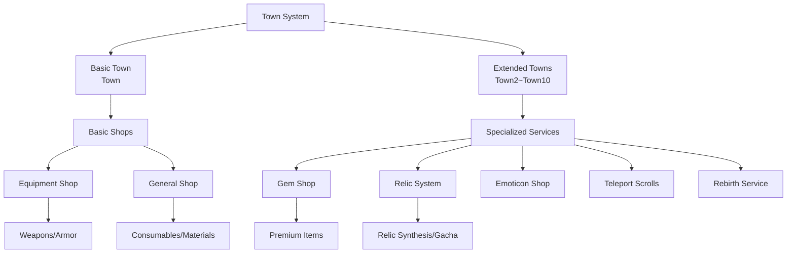
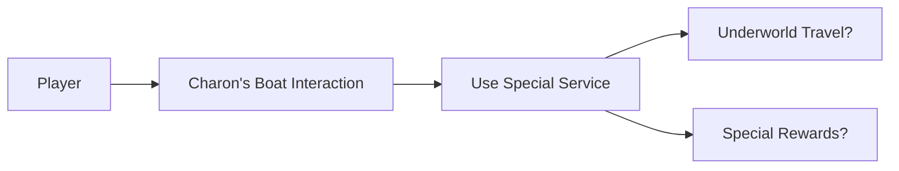

# Core Architecture - Map System - Town Maps

## Overview
Town maps serve as the central hub of Mine Simulator, providing safe spaces where players can trade at shops, interact with NPCs, and travel to other areas. There are a total of 11 towns from Town to Town10, each offering unique shops and services.

## Town Map Structure

### Town System


### Town-Specific Features

#### **Town (Basic Town)**
- **Role**: Game starting point, provides basic services
- **Main NPCs**: Equipment merchant, general merchant
- **Features**: Concentrates all basic functions

#### **Town2~Town5 (Beginner-Intermediate Towns)**
- **Specialized Services**: Unique NPCs and services for each town
- **Town5 Example**: Mineral merchant, emoticon merchant, etc.

#### **Town6~Town10 (Advanced Towns)**
- **Town8**: Teleport scroll merchant, general merchant
- **Town9**: Various merchants (NEW/OLD version distinction)
- **Features**: Specialized services for advanced players

## Related File Paths

### Town Map Files
```
map/
├── Town.map                           # Basic town
├── Town2.map                          # 2nd town
├── Town3.map                          # 3rd town
├── Town4.map                          # 4th town
├── Town5.map                          # 5th town
├── Town6.map                          # 6th town
├── Town7.map                          # 7th town
├── Town8.map                          # 8th town
├── Town9.map                          # 9th town
└── Town10.map                         # 10th town
```

### Town-Related Component Scripts
```
RootDesk/MyDesk/Components/Town/
├── NPCInteraction.mlua                # NPC interaction basic system
├── EquipmentShop/                     # Equipment shop system
│   ├── EquipmentShopUI.mlua           # Equipment shop UI
│   ├── EquipmentShopSlotButton.mlua   # Shop slot button
│   └── MythicEquipmentShopUI.mlua     # Mythic equipment shop
├── GemShop/                           # Gem shop system  
│   ├── GemShopUI.mlua                 # Gem shop UI
│   ├── GemShopLogic.mlua              # Gem shop logic
│   └── GemShopUI_SlotButton.mlua      # Gem shop slot
├── RelicMergeShop/                    # Relic synthesis shop
│   ├── RelicMergeShopUI.mlua          # Relic synthesis UI
│   ├── RelicMergeShopUI_MaterialButton.mlua    # Material button
│   └── RelicMergeShopUI_MaterialSlotButton.mlua # Material slot
├── RebornShop/                        # Rebirth shop
│   └── RebornShopUI.mlua              # Rebirth UI
├── ShopUI.mlua                        # General shop UI
├── LeaderBoardUI.mlua                 # Leaderboard UI
├── RelicGachaShopUI.mlua              # Relic gacha shop
├── RelicBinUI.mlua                    # Relic trash bin
└── CharonBoatUI_UseButton.mlua        # Charon's boat UI (Greek mythology)
```

### Portal and Movement System
```
RootDesk/MyDesk/Components/Portals/
├── Portal_TownToTownInteraction.mlua  # Town-to-town movement portal
├── PortalToMineInteraction.mlua       # Town→Mine movement
├── PortalToTownInteraction.mlua       # →Town movement
├── TeleportNpcComponent.mlua          # NPC teleport function
└── TeleportTownController.mlua        # Town teleport controller
```

## NPC System Detailed Analysis

### NPCInteraction Component
```lua
-- NPCInteraction.mlua: Base class for all NPC interactions
@Component
script NPCInteraction extends InteractionComponent

    property Entity TargetUI = nil        -- UI to open
    property string UIOpenSound = ""      -- Interaction sound
    property boolean SetSortingLayerAutomately = true

    method void OnInteractionEvent()
        -- UI flickering animation effect
        local flickeringAnimation = function()
            -- Flickering effect by adjusting alpha value
            for i=1, 60 do
                if (i >=1 and i <= 10) or (i>=21 and i<=30) or (i>=41 and i<=50) then
                    _TimerService:SetTimerOnce(flickeringDown, 0.04*i)
                else 
                    _TimerService:SetTimerOnce(flickeringUp, 0.04*i)
                end
            end
        end
        
        -- Automatic sorting layer setup
        if self.SetSortingLayerAutomately then
            self.TargetUI.SortingLayer = 30
        end
        
        -- Activate UI and play sound
        self.TargetUI.Enable = true
        if self.UIOpenSound ~= "" then
            _SoundService:PlaySound(self.UIOpenSound, 0.7)
        end
    end
end
```

### NPC Placement by Town

#### Town5 NPC Configuration
- **NPC_Mineral Merchant**: Sell and buy mined minerals
- **NPC_Emoticon Merchant**: Purchase and manage emoticons

#### Town8 NPC Configuration  
- **NPC_Merchant**: Basic item trading
- **NPC_Teleport Scroll Merchant**: Sell fast travel items
- **NPC_Equipment Merchant**: Equipment purchase/sale

#### Town9 NPC Configuration (Most Complex)
- **NPC_Teleport Scroll Merchant**: Movement-related services
- **NPC_Relic Box Merchant**: Sell relic boxes
- **NPC_Equipment Merchant (NEW/OLD)**: Distinguish between new and old equipment merchants
- **NPC_Merchant (NEW/OLD)**: Distinguish between new and old general merchants

## Shop System Detailed Analysis

### Equipment Shop (EquipmentShop)
```lua
-- EquipmentShopUI.mlua: Core logic of equipment shop
@Component
script EquipmentShopUI extends Component

    property number filterIdx = 1         -- Filter index (equipment type)
    property number recentBuyIndex = 0    -- Recently purchased item
    
    method void OnBeginPlay()
        -- Set up 4 equipment type filters
        local EquipShopFilterList = _EntityService:GetEntityByPath("/ui/EquipShopGroup/EquipShop/Panel/FilterList")
        for i=1, 4 do
            EquipShopFilterList:GetChildByName("Filter_"..tostring(i)).TextComponent.Text = 
                _LocalizationService:GetText("EquipType_"..tostring(i))
        end
        
        -- Create 40 equipment slots
        for i=1, 40 do
            local slotButton = self:CreateEquipmentSlot(i)
            slotButton:SetupSlotData(i)
        end
    end
    
    method void RefreshShop()
        -- Update equipment list according to filter
        -- Display player ownership status
        -- Update price information
    end
end
```

### Gem Shop (GemShop)
```lua
-- GemShopUI.mlua: Premium currency shop
method void HandleGemPurchase(number itemId, number cost)
    local player = _UserService.LocalPlayer
    
    -- Check gem holdings
    if player.PlayerStorage:GetCurrency(GEM_CURRENCY_ID) >= cost then
        -- Deduct gems and give item
        player.PlayerStorage:SpendCurrency(GEM_CURRENCY_ID, cost)
        player.PlayerBackpack:AddItem(itemId, 1)
    else
        -- Display insufficient gems message
        _UIToast:ShowMessage(_LocalizationService:GetText("InsufficientGems"))
    end
end
```

### Relic Synthesis Shop (RelicMergeShop)
```lua
-- RelicMergeShopUI.mlua: Relic synthesis system
method void AttemptRelicMerge()
    local materialSlots = self:GetSelectedMaterials()  -- Select 4 materials
    
    -- Material validation
    if #materialSlots ~= 4 then
        _UIToast:ShowMessage("4 materials are required.")
        return
    end
    
    -- Check grade matching
    local baseGrade = materialSlots[1].grade
    for i=2, 4 do
        if materialSlots[i].grade ~= baseGrade then
            _UIToast:ShowMessage("All materials must be of the same grade.")
            return
        end
    end
    
    -- Execute synthesis
    local result = player.PlayerRelic:Merge(materialSlots)
    self:ShowMergeResult(result)
end
```

## Portal and Movement System

### Town-to-Town Movement System
```lua
-- Portal_TownToTownInteraction.mlua: Town-to-town portal
method void OnInteractionEventOnClient()
    local currentTownIdx = string.sub(self.Entity.Parent.Name, 5, -1)
    if tonumber(currentTownIdx) == nil then
        currentTownIdx = "1"
    end
    
    local Player = _UserService.LocalPlayer
    local destination = ""
    
    -- Determine destination town
    if self.TownCategory == 1 then
        destination = "/maps/Town/Portal_TownToTown_"..currentTownIdx
    else
        destination = "/maps/Town"..tostring(math.floor(self.TownCategory)).."/Portal_TownToTown_"..currentTownIdx
    end
    
    -- Execute teleport
    _TeleportService:TeleportToEntityPath(Player, destination)
end
```

### Mine Entry System
```lua
-- PortalToMineInteraction.mlua: From town to mine
method void OnBeginPlay()
    -- Calculate and display recommended mining power
    local mapTable = _DataService:GetTable("Map_Mine")
    local minPower = tonumber(mapTable:GetCell(mineLevel * 4 - 3, 5))
    local maxPower = tonumber(mapTable:GetCell(mineLevel * 4 - 3, 6))
    local userPower = _UserService.LocalPlayer.PlayerIngameData.MiningPower
    
    local recommendInfo = ""
    if minPower <= userPower and userPower < maxPower then
        recommendInfo = "[Recommended]"
    elseif minPower > userPower then
        recommendInfo = "[Hard]"
    else
        recommendInfo = "[Easy]"
    end
    
    -- Display information in UI
    self:DisplayMineInfo(minPower, maxPower, recommendInfo)
end
```

## Special Systems

### Charon's Boat (CharonBoat) - Greek Mythology Element


### Leaderboard System
- Display player rankings
- Rankings by various categories
- Real-time updates

### Rebirth System (Reborn)
- Character restart system
- Special bonuses provided
- Progress retention options

## Town Layout and Design

### Common Structural Elements
1. **Background Layer**: MapleMapLayer, Background
2. **Terrain**: Floor and structures composed of TileMap
3. **NPC Placement**: Specialized NPC positions for each town
4. **Portals**: Movement points to other areas

### Town-Specific Characteristics
- **Town**: Basic and well-balanced layout
- **Town5**: Layout specialized for mineral trading
- **Town9**: Complex town with concentrated various services

## Data Management System

### Town Data Tables
```
RootDesk/MyDesk/DataSets/
├── Map_Town.csv                       # Basic town information
├── Map_Town.userdataset              # Town dataset
├── ShopData.csv                       # Shop item information
└── NPCData.csv                        # NPC information
```

### Localization System
```lua
-- Display NPC names with multi-language support
local mapName = _LocalizationService:GetText(string.format("%d", 7200+self.TownCategory))
npcNameTag.TextComponent.Text = _LocalizationService:GetText("NPC_Name_"..npcId)
```

## Performance Optimization

### Map Optimization
```lua
-- Use MapOptimizeComponent in some towns
-- Automatically disable off-screen objects
-- NPC animation LOD system
```

### UI Optimization
- Load shop UI only when needed
- Slot button pooling system
- Pagination for large item lists

## Expansion Guide

### Adding New Town
1. **Create Map File**: Create in TownX.map format
2. **NPC Placement**: Select NPCs suitable for the town's theme
3. **Portal Connection**: Consider connectivity with existing towns
4. **Update Data Tables**: Add information to Map_Town.csv

### Adding New Shop Type
1. **Develop UI Component**: Reference existing shop UI structure
2. **Write Logic Script**: Implement specialized functions for each shop
3. **NPC Integration**: Connect new shop UI in NPCInteraction
4. **Design Data Structure**: Create shop-specific CSV tables

## Common Problem Solving

### When NPC Interaction Doesn't Work
1. Check NPCInteraction component
2. Check TargetUI reference settings
3. Inspect InteractionComponent basic settings

### When Portal Movement Doesn't Work
1. Check destination map path
2. Check SpawnLocation entity existence
3. Inspect TeleportService permissions

### When Shop UI Doesn't Display
1. Check UI entity path
2. Inspect SortingLayer settings
3. Check Enable state

