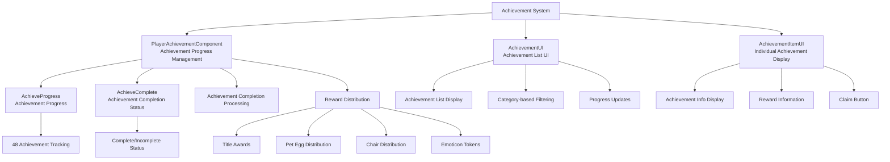

# Feature Guide - Achievement System - Achievement Management

## Overview
The achievement system tracks players' game progress and provides rewards when specific objectives are completed. It offers achievements across various categories including adventure, ore collection, jewelry collection, fossil excavation, construction, and temple exploration, automatically managing progress tracking, completion notifications, and reward distribution.

## Achievement System Structure

### System Architecture


## Related File Paths

### Achievement System Core Components
```
RootDesk/MyDesk/Achievement/Component/
├── PlayerAchievementComponent.mlua   # Achievement progress and completion management
├── PlayerAchievementComponent.codeblock # Achievement system visual
├── AchievementUI.mlua                # Achievement list UI
├── AchievementUI.codeblock           # Achievement list visual
├── AchievementItemUI.mlua            # Individual achievement item UI
├── AchievementItemUI.codeblock       # Achievement item visual
├── AchievementRewardClaimButtonUI.mlua # Reward claim button
└── AchievementRewardClaimButtonUI.codeblock # Reward button visual
```

### Achievement-related UI
```
ui/
└── AchievementGroup.ui               # Achievement UI group
```

### Achievement Data Tables
```
RootDesk/MyDesk/Achievement/DataSet/
├── AchievementDataSet.csv            # Achievement information (objectives, conditions, rewards)
├── AchievementDataSet.userdataset    # Achievement dataset
├── AchievementRewardItemDataSet.csv  # Achievement reward item information
├── AchievementRewardItemDataSet.userdataset # Reward item dataset
├── AchievementTypeDataSet.csv        # Achievement type classification
├── AchievementTypeDataSet.userdataset # Achievement type dataset
├── BadgeDataSet.csv                  # Badge/title information
└── BadgeDataSet.userdataset          # Badge dataset
```

## PlayerAchievementComponent - Achievement Management System

### Core Data Structure
```lua
@Component
script PlayerAchievementComponent extends Component

    property SyncTable<number> AchieveProgress    -- Progress per achievement
    property SyncTable<boolean> AchieveComplete   -- Achievement completion status
    property AchievementUI achievementPopupUI     -- Achievement UI reference
```

### Achievement Progress Processing
```lua
@ExecSpace("Server")
method void GetProgress(number idx, number amount)
    local achievementTable = _DataService:GetTable("AchievementDataSet")
    local completeCondition = tonumber(achievementTable:GetCell(idx, 4))  -- Completion condition
    
    -- Initialization safety check
    if self.AchieveProgress[idx] == nil then
        self.AchieveProgress[idx] = 0
    end
    
    -- Adjust progress not to exceed completion condition
    local recordedAmount = amount
    if (self.AchieveProgress[idx] + amount) >= completeCondition then
        recordedAmount = completeCondition - self.AchieveProgress[idx]
    end
    
    -- Update progress
    self.AchieveProgress[idx] = self.AchieveProgress[idx] + recordedAmount
    self:SetTableElementClient("AchieveProgress", idx, 
        tostring(self.AchieveProgress[idx]), self.Entity.OwnerId)
    
    -- Process achievement completion
    if recordedAmount > 0 and (self.AchieveProgress[idx] >= completeCondition) then
        self:PopupCompleteUI(idx, self.Entity.OwnerId)
        _UIAlarmMarker:SetEnableMarker("quest", true, self.Entity.OwnerId)
    end
end
```

### Achievement Completion Notification System
```lua
@ExecSpace("Client")
method void PopupCompleteUI(number idx)
    local completeUI = _EntityService:GetEntity("cc20d638-3fda-4feb-8292-4c312d2f7a84")
    local alphaColor = 0
    
    -- Fade in effect
    local SetAlphaColorUp = function()
        alphaColor = alphaColor + 1/30
        
        local panel = completeUI:GetChildByName("Panel")
        panel.SpriteGUIRendererComponent.Color.a = alphaColor
        panel:GetChildByName("Effect").SpriteGUIRendererComponent.Color.a = alphaColor
        panel:GetChildByName("Effect_1").SpriteGUIRendererComponent.Color.a = alphaColor
        panel:GetChildByName("QuestName").TextComponent.FontColor.a = alphaColor
        panel:GetChildByName("Title").TextComponent.FontColor.a = alphaColor
    end
    
    -- Fade out effect
    local SetAlphaColorDown = function()
        alphaColor = alphaColor - 1/30
        
        local panel = completeUI:GetChildByName("Panel")
        panel.SpriteGUIRendererComponent.Color.a = alphaColor
        panel:GetChildByName("Effect").SpriteGUIRendererComponent.Color.a = alphaColor
        panel:GetChildByName("Effect_1").SpriteGUIRendererComponent.Color.a = alphaColor
        panel:GetChildByName("QuestName").TextComponent.FontColor.a = alphaColor
        panel:GetChildByName("Title").TextComponent.FontColor.a = alphaColor
    end
    
    -- 1 second fade in, 2 seconds hold, 1 second fade out
    for i=1, 30 do
        _TimerService:SetTimerOnce(SetAlphaColorUp, i/30)
        _TimerService:SetTimerOnce(SetAlphaColorDown, 2+i/30)
    end
    
    -- Display achievement name
    local nameUI = _EntityService:GetEntity("abc09666-5ff2-4270-8a92-ea98067c8f37")
    local name = _DataService:GetCell("AchievementDataSet", idx, 2)
    nameUI.TextComponent.Text = _LocalizationService:GetText(name)
    
    -- Activate UI and deactivate after 3.5 seconds
    completeUI.Enable = true
    local disable = function()
        completeUI.Enable = false
    end
    _TimerService:SetTimerOnce(disable, 3.5)
end
```

### Reward Distribution System
```lua
@ExecSpace("Server")
method void GiveReward(number idx)
    local achievementTable = _DataService:GetTable("AchievementDataSet")
    
    -- Check achievement completion status
    if self.AchieveComplete[idx] == true then
        log("Already received reward for achievement: " .. idx)
        return
    end
    
    -- Check achievement completion condition
    local completeCondition = tonumber(achievementTable:GetCell(idx, 4))
    if self.AchieveProgress[idx] < completeCondition then
        log("Achievement not completed: " .. idx)
        return
    end
    
    -- Process reward distribution (up to 3 rewards)
    for i=1, 3 do
        local rewardName = achievementTable:GetCell(idx, "RewardName"..i)
        local rewardQuantity = achievementTable:GetCell(idx, "RewardQuantity"..i)
        
        if rewardName ~= "" and rewardQuantity ~= "" then
            self:GiveSpecificReward(rewardName, tonumber(rewardQuantity))
        end
    end
    
    -- Set achievement to completed status
    self.AchieveComplete[idx] = true
    self:SetTableElementClient("AchieveComplete", idx, "true", self.Entity.OwnerId)
    
    -- Refresh UI
    _UIAlarmMarker:SetEnableMarker("quest", false, self.Entity.OwnerId)
end

method void GiveSpecificReward(string rewardName, number quantity)
    if string.sub(rewardName, 1, 11) == "PlayerTitle" then
        -- Give player title
        self.Entity.PlayerTitle:GetTitle(rewardName)
        
    elseif rewardName == "AchiReward_PetEgg" then
        -- Give pet egg
        self.Entity.PlayerData.PetEgg = self.Entity.PlayerData.PetEgg + quantity
        
    elseif rewardName == "AchiReward_EmotToken" then
        -- Give emoticon token
        self.Entity.PlayerEmoticon.EmotToken = self.Entity.PlayerEmoticon.EmotToken + quantity
        
    elseif string.sub(rewardName, 1, 9) == "ChairName" then
        -- Give chair
        local chairIdx = tonumber(string.sub(rewardName, 11, -1))
        self.Entity.PlayerChair:GetChair(chairIdx)
        
    elseif rewardName == "AchiReward_Gem" then
        -- Give gem
        self.Entity.PlayerStorage:AddCurrencyItems(2, quantity, true)
        
    elseif rewardName == "AchiReward_Gold" then
        -- Give gold
        self.Entity.PlayerData:AddMoney(quantity)
    end
    
    -- Reward acquisition message
    _CustomLocalizationLogic:SendLocalizedFormattedToastMessageFromServer(
        "Message_ReceivedAchievementReward", {_LocalizationService:GetText(rewardName), quantity}, 
        self.Entity.OwnerId)
end
```

## AchievementUI - Achievement List System

### UI Initialization and Data Loading
```lua
@Component
script AchievementUI extends Component

    property table itemTable = {}                    -- Achievement data table
    property GridViewComponent achiList = "GUID"     -- Achievement list grid
    property Entity achiSlot = "GUID"                 -- Achievement slot template
    property table ruidFromType = {}                  -- RUID by type icon
    property table ruidFromReward = {}                -- RUID by reward icon
    property boolean needRefresh = false              -- Refresh needed flag

    @ExecSpace("ClientOnly")
    method void OnBeginPlay()
        self.achiList.ItemEntity = self.achiSlot
        self.achiList.OnRefresh = self.OnRefresh
        self.achiList.OnClear = self.OnClear
        
        self:InitAchievementDataTable()
        self:LoadAchievementRUIDDataTable()
        
        self.achiList.TotalCount = #self.itemTable
        self.achiList:Refresh()
    end
```

### Achievement Data Initialization
```lua
method void InitAchievementDataTable()
    local dataSet = _DataService:GetTable("AchievementDataSet")
    
    for i=1, dataSet:GetRowCount() do
        local itemData = {
            ["idx"] = i,
            ["type"] = dataSet:GetCell(i, "Type"),
            ["objective"] = dataSet:GetCell(i, "Objective"),
            ["description"] = dataSet:GetCell(i, "Description"),
            ["condition"] = tonumber(dataSet:GetCell(i, "Condition")),
            ["rewardName1"] = dataSet:GetCell(i, "RewardName1"),
            ["rewardQuantity1"] = dataSet:GetCell(i, "RewardQuantity1"),
            ["rewardName2"] = dataSet:GetCell(i, "RewardName2"),
            ["rewardQuantity2"] = dataSet:GetCell(i, "RewardQuantity2"),
            ["rewardName3"] = dataSet:GetCell(i, "RewardName3"),
            ["rewardQuantity3"] = dataSet:GetCell(i, "RewardQuantity3"),
            ["progress"] = _UserService.LocalPlayer.PlayerAchievementComponent.AchieveProgress[i],
            ["isComplete"] = _UserService.LocalPlayer.PlayerAchievementComponent.AchieveComplete[i]
        }
        
        self.itemTable[i] = itemData
    end
end

method void LoadAchievementRUIDDataTable()
    -- Load achievement type icon RUIDs
    local typeDataSet = _DataService:GetTable("AchievementTypeDataSet")
    for i=1, typeDataSet:GetRowCount() do
        local typeName = typeDataSet:GetCell(i, "Type")
        local iconRUID = typeDataSet:GetCell(i, "IconRUID")
        self.ruidFromType[typeName] = iconRUID
    end
    
    -- Load reward item icon RUIDs
    local rewardDataSet = _DataService:GetTable("AchievementRewardItemDataSet")
    for i=1, rewardDataSet:GetRowCount() do
        local itemName = rewardDataSet:GetCell(i, "아이템이름")
        local iconRUID = rewardDataSet:GetCell(i, "아이콘RUID")
        self.ruidFromReward[itemName] = iconRUID
    end
end
```

### Achievement Slot Refresh
```lua
method void OnRefresh(number index, Entity entity)
    local slot = entity.AchievementItemUI
    
    slot.data = self.itemTable[index+1]
    slot.index = index
    slot:Refresh()
end

method void OnClear(number index, Entity entity)
    local slot = entity.AchievementItemUI
    slot:Clear()
end
```

## AchievementItemUI - Individual Achievement Display

### Achievement Item Display System
```lua
@Component
script AchievementItemUI extends Component

    method void Refresh()
        if self.data == nil then return end
        
        -- 1. Set achievement type icon
        local typeIcon = self.Entity:GetChildByName("TypeIcon")
        local typeRUID = self:GetTypeIconRUID(self.data.type)
        typeIcon.SpriteGUIRendererComponent.ImageRUID = typeRUID
        
        -- 2. Achievement title and description
        local titleUI = self.Entity:GetChildByName("Title")
        local descUI = self.Entity:GetChildByName("Description")
        
        titleUI.TextComponent.Text = _LocalizationService:GetText(self.data.objective)
        descUI.TextComponent.Text = _LocalizationService:GetText(self.data.description)
        
        -- 3. Display progress
        local progressUI = self.Entity:GetChildByName("Progress")
        local progressText = string.format("%d / %d", 
            self.data.progress or 0, self.data.condition)
        progressUI.TextComponent.Text = progressText
        
        -- 4. Progress bar
        local progressBar = self.Entity:GetChildByName("ProgressBar/Fill")
        local progressRatio = (self.data.progress or 0) / self.data.condition
        progressBar.UITransformComponent.RectSize = 
            Vector2(300 * progressRatio, progressBar.UITransformComponent.RectSize.y)
        
        -- 5. Display reward information
        self:DisplayRewards()
        
        -- 6. UI settings based on completion status
        self:UpdateCompletionStatus()
    end
```

### Reward Information Display
```lua
method void DisplayRewards()
    for i=1, 3 do
        local rewardName = self.data["rewardName"..i]
        local rewardQuantity = self.data["rewardQuantity"..i]
        local rewardSlot = self.Entity:GetChildByName("RewardSlot"..i)
        
        if rewardName ~= "" and rewardQuantity ~= "" then
            -- Activate reward slot
            rewardSlot.Enable = true
            
            -- Reward icon
            local rewardIcon = rewardSlot:GetChildByName("Icon")
            local iconRUID = self:GetRewardIconRUID(rewardName)
            rewardIcon.SpriteGUIRendererComponent.ImageRUID = iconRUID
            
            -- Reward quantity
            local quantityUI = rewardSlot:GetChildByName("Quantity")
            quantityUI.TextComponent.Text = "x" .. rewardQuantity
            
            -- Reward name
            local nameUI = rewardSlot:GetChildByName("Name")
            nameUI.TextComponent.Text = _LocalizationService:GetText(rewardName)
        else
            -- Deactivate reward slot
            rewardSlot.Enable = false
        end
    end
end

method void UpdateCompletionStatus()
    local progressValue = self.data.progress or 0
    local isCompleted = progressValue >= self.data.condition
    local isRewardClaimed = self.data.isComplete or false
    
    local claimButton = self.Entity:GetChildByName("ClaimButton")
    local completeBadge = self.Entity:GetChildByName("CompleteBadge")
    
    if isRewardClaimed then
        -- Reward claimed completed
        claimButton.Enable = false
        completeBadge.Enable = true
        completeBadge:GetChildByName("Text").TextComponent.Text = 
            _LocalizationService:GetText("Achievement_Completed")
            
    elseif isCompleted then
        -- Completed but reward not claimed
        claimButton.Enable = true
        claimButton.AchievementRewardClaimButtonUI.idx = self.data.idx
        claimButton:GetChildByName("Text").TextComponent.Text = 
            _LocalizationService:GetText("Achievement_ClaimReward")
        completeBadge.Enable = false
        
    else
        -- Not completed
        claimButton.Enable = false
        completeBadge.Enable = false
    end
end
```

## Achievement Category Classification

### Achievement Types (Based on AchievementDataSet.csv)

#### 1. Adventure Achievements (9)
- **Content**: Visit each region, discover special objects
- **Rewards**: Titles, pet eggs, chairs, emoticon tokens
```csv
Adventure,Achi_Objective_1,Achi_Desc_VisitMine,1,PlayerTitle_Name_1,1
Adventure,Achi_Objective_2,Achi_Desc_BreakKeyBox,1,AchiReward_PetEgg,1
Adventure,Achi_Objective_3,Achi_Desc_VisitTown2,1,ChairName_1,1
```

#### 2. Ore Collection Achievements (7)
- **Content**: Ore collection milestone achievements (100 → 100,000,000)
- **Rewards**: Player titles (Name_2 ~ Name_8)
```csv
Ore Collection,Achi_Objective_10,Achi_Desc_Ore,100,PlayerTitle_Name_2,1
Ore Collection,Achi_Objective_11,Achi_Desc_Ore,1000,PlayerTitle_Name_3,1
Ore Collection,Achi_Objective_16,Achi_Desc_Ore,100000000,PlayerTitle_Name_8,1
```

#### 3. Jewelry Collection Achievements (10)
- **Content**: Jewelry discovery and collection (1 → 10,000)
- **Rewards**: Player titles (Name_9 ~ Name_18)
```csv
Jewelry Collection,Achi_Objective_17,Achi_Desc_Jewerly,1,PlayerTitle_Name_9,1
Jewelry Collection,Achi_Objective_26,Achi_Desc_Jewerly,10000,PlayerTitle_Name_18,1
```

#### 4. Fossil Excavation Achievements (10)
- **Content**: Fossil excavation and collection (1 → 10,000)
- **Rewards**: Player titles (Name_19 ~ Name_28)
```csv
Fossil,Achi_Objective_27,Achi_Desc_Fossil,1,PlayerTitle_Name_19,1
Fossil,Achi_Objective_36,Achi_Desc_Fossil,10000,PlayerTitle_Name_28,1
```

#### 5. Construction Achievements (4)
- **Content**: Construction of specific buildings
- **Rewards**: Player titles (Name_29 ~ Name_30)
```csv
Construction,Achi_Objective_31,Achi_Desc_Build1,1,PlayerTitle_Name_29,1
Construction,Achi_Objective_32,Achi_Desc_Build2,1,PlayerTitle_Name_30,1
```

#### 6. Temple Exploration Achievements (8)
- **Content**: Temple floor achievement (10 → 300)
- **Rewards**: Player titles (Name_31 ~ Name_38)
```csv
Temple,Achi_Objective_41,Achi_Desc_Temple,10,PlayerTitle_Name_31,1
Temple,Achi_Objective_48,Achi_Desc_Temple,300,PlayerTitle_Name_38,1
```

## AchievementRewardClaimButtonUI - Reward Claim

### Reward Claim Button
```lua
@Component
script AchievementRewardClaimButtonUI extends Component

    property number idx = 0    -- Achievement index

    @EventSender("Self")
    handler HandleButtonClickEvent(ButtonClickEvent event)
        local Entity = event.Entity
        
        -- Process reward claim
        _UserService.LocalPlayer.PlayerAchievementComponent:GiveReward(self.idx)
        
        -- Disable button (prevent duplicate claims)
        Entity.ButtonComponent.Enable = false
    end
```

## Achievement Integration System

### Integration with Game Systems
```lua
-- On ore mining
method void OnMinedOre(number oreType, number amount)
    self.Entity.PlayerAchievementComponent:GetProgress(10, amount)  -- Ore collection achievement
end

-- On jewelry discovery
method void OnFoundJewelry(number jewelryType)
    self.Entity.PlayerAchievementComponent:GetProgress(17, 1)  -- Jewelry collection achievement
end

-- On fossil excavation
method void OnFoundFossil(number fossilType)
    self.Entity.PlayerAchievementComponent:GetProgress(27, 1)  -- Fossil excavation achievement
end

-- On map visit
method void OnVisitMap(string mapName)
    if mapName == "Mine1_1" then
        self.Entity.PlayerAchievementComponent:GetProgress(1, 1)  -- First mine visit
    elseif mapName == "Town2" then
        self.Entity.PlayerAchievementComponent:GetProgress(3, 1)  -- Town2 visit
    end
end

-- On construction completion
method void OnConstructionCompleted(number buildingType)
    if buildingType == 1 then
        self.Entity.PlayerAchievementComponent:GetProgress(31, 1)  -- First building construction
    elseif buildingType == 2 then
        self.Entity.PlayerAchievementComponent:GetProgress(32, 1)  -- Second building construction
    end
end

-- On reaching temple floor
method void OnReachTempleFloor(number floor)
    self.Entity.PlayerAchievementComponent:GetProgress(41, floor)  -- Temple floor 10 achievement
    self.Entity.PlayerAchievementComponent:GetProgress(42, floor)  -- Temple floor 20 achievement
    -- ... (check by floor)
end
```

## Achievement Notification System

### UI Notification Marker
```lua
-- Activate notification on achievement completion
_UIAlarmMarker:SetEnableMarker("quest", true, playerId)

-- Deactivate notification after reward claim
_UIAlarmMarker:SetEnableMarker("quest", false, playerId)
```

### Toast Messages
```lua
-- Reward acquisition message
_CustomLocalizationLogic:SendLocalizedFormattedToastMessageFromServer(
    "Message_ReceivedAchievementReward", 
    {rewardName, quantity}, 
    playerId)

-- Achievement completion message (separate from popup UI)
_CustomLocalizationLogic:SendLocalizedToastMessageFromServer(
    "Message_AchievementCompleted", playerId)
```

## Data Management System

### Progress Save and Load
```lua
@ExecSpace("Server")
method void SaveAchievementData()
    -- Save achievement progress to player data
    local progressData = _UtilLogic:TableToString(self.AchieveProgress)
    local completeData = _UtilLogic:TableToString(self.AchieveComplete)
    
    self.Entity.PlayerData:SetCustomData("AchievementProgress", progressData)
    self.Entity.PlayerData:SetCustomData("AchievementComplete", completeData)
end

@ExecSpace("Server")
method void LoadAchievementData()
    -- Restore achievement progress from player data
    local progressData = self.Entity.PlayerData:GetCustomData("AchievementProgress")
    local completeData = self.Entity.PlayerData:GetCustomData("AchievementComplete")
    
    if progressData ~= "" then
        self.AchieveProgress = _UtilLogic:StringToTable(progressData)
    end
    
    if completeData ~= "" then
        self.AchieveComplete = _UtilLogic:StringToTable(completeData)
    end
    
    -- Set default values for uninitialized achievements
    local achievementCount = _DataService:GetRowCount("AchievementDataSet")
    for i=1, achievementCount do
        if self.AchieveProgress[i] == nil then
            self.AchieveProgress[i] = 0
        end
        if self.AchieveComplete[i] == nil then
            self.AchieveComplete[i] = false
        end
    end
end
```

## Performance Optimization

### Achievement Check Optimization
```lua
-- Optimized function that only checks necessary achievements
method void CheckSpecificAchievements(table achievementIds)
    for _, achievementId in ipairs(achievementIds) do
        if not self.AchieveComplete[achievementId] then
            -- Only check incomplete achievements
            self:CheckAchievementCondition(achievementId)
        end
    end
end

-- Batch update (update multiple achievements at once)
method void BatchUpdateAchievements(table updates)
    for achievementId, progress in pairs(updates) do
        self:GetProgress(achievementId, progress)
    end
    
    -- Sync all changes to client at once
    self:SyncAllChangesToClient()
end
```

### Memory Management
- Stop tracking progress for completed achievements
- Optimize UI refresh intervals
- Prevent unnecessary achievement checks

## Extensibility

### Adding New Achievements
```lua
-- Dynamic achievement addition system
method void AddDynamicAchievement(table achievementData)
    local newIdx = #self.itemTable + 1
    
    -- Add achievement data
    self.itemTable[newIdx] = achievementData
    
    -- Initialize progress
    self.AchieveProgress[newIdx] = 0
    self.AchieveComplete[newIdx] = false
    
    -- Refresh UI
    self.achiList.TotalCount = #self.itemTable
    self.achiList:Refresh()
end

-- Seasonal achievement system
method void ActivateSeasonalAchievements(number season)
    local seasonAchievements = _DataService:GetTable("SeasonalAchievements")
    
    for i=1, seasonAchievements:GetRowCount() do
        local seasonType = tonumber(seasonAchievements:GetCell(i, "Season"))
        if seasonType == season then
            self:AddDynamicAchievement(seasonAchievements:GetRow(i))
        end
    end
end
```

### Advanced Achievement Features
```lua
-- Chain achievement system
method void CheckChainAchievements(number completedAchievement)
    local chainTable = _DataService:GetTable("AchievementChain")
    
    for i=1, chainTable:GetRowCount() do
        local prerequisite = tonumber(chainTable:GetCell(i, "Prerequisite"))
        local nextAchievement = tonumber(chainTable:GetCell(i, "NextAchievement"))
        
        if prerequisite == completedAchievement then
            self:UnlockAchievement(nextAchievement)
        end
    end
end

-- Hidden achievement system
method void CheckHiddenAchievements()
    -- Hidden achievements only revealed under special conditions
end

-- Achievement score system
method number CalculateAchievementScore()
    local totalScore = 0
    local scoreTable = _DataService:GetTable("AchievementScore")
    
    for i=1, #self.AchieveComplete do
        if self.AchieveComplete[i] then
            local score = tonumber(scoreTable:GetCell(i, "Score"))
            totalScore = totalScore + score
        end
    end
    
    return totalScore
end
```

## Common Troubleshooting

### When Achievement Progress is Not Updating
1. Check if `GetProgress` method is being called
2. Verify achievement index is correct
3. Confirm completion condition value is accurate

### When Rewards are Not Distributed
1. Check `GiveReward` method execution permissions
2. Inspect reward type-specific distribution logic
3. Verify player data save status

### When UI is Not Displaying Correctly
1. Check if `RefreshUI` is being called
2. Inspect achievement data and UI synchronization status
3. Verify RUID table loading status

