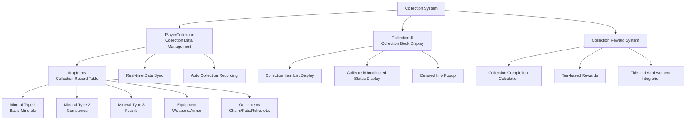

# Feature Guide - Player Management - Collection System

## Overview
The Collection System manages records of all items acquired by players during gameplay and provides rewards based on collection progress. This system enhances player achievement satisfaction and provides long-term game objectives to maintain continuous play motivation.

## Collection System Architecture

### System Architecture


## Related File Paths

### Core Collection System Components
```
RootDesk/MyDesk/Components/Player/Collection/
├── PlayerCollection.mlua             # Collection data management system
├── PlayerCollection.codeblock        # Collection data visual scripting
├── CollectionUI.mlua                 # Collection book UI
├── CollectionUI.codeblock            # Collection book visual
├── CollectionSlotButton.mlua         # Collection item slot button
├── CollectionSlotButton.codeblock    # Collection slot visual
├── CollectionOpenButton.mlua         # Collection book open button
└── CollectionOpenButton.codeblock    # Book open button visual
```

### Collection-related UI
```
ui/
└── CollectionGroup.ui                # Collection book UI group
```

### Collection Data Tables
```
RootDesk/MyDesk/DataSets/
├── DropItem.csv                      # Collection target item information
├── DropItem.userdataset              # Drop item dataset
├── CollectionReward.csv              # Collection reward information (estimated)
└── Achievement.csv                   # Collection-related achievements
```

## PlayerCollection System Detailed Analysis

### Core Data Structure
```lua
@Component
script PlayerCollection extends Component

    property SyncTable<number> dropItems    -- Collection quantity record by item
```

### Initialization System
```lua
method void OnBeginPlay()
    -- Configure table synchronization
    self._T.tableList = {dropItems = self.dropItems}
    self._T.tableType = {dropItems = "number"}
    
    -- Initialize all collectible items to 0
    local dropItemTable = _DataService:GetTable("DropItem")
    for i=1, dropItemTable:GetRowCount() do
        self.dropItems[i] = 0
    end
end
```

### Collection Recording System
```lua
@ExecSpace("Server")
method void RecordData(number idx, number amount)
    -- Accumulate collection quantity
    self.dropItems[idx] = self.dropItems[idx] + amount
    
    -- Real-time synchronization to client
    self:SetTableElementClient("dropItems", idx, tostring(self.dropItems[idx]), self.Entity.OwnerId)
end
```

### Auto Collection Integration
```lua
-- Auto-called from AddItem method in PlayerBackpack.mlua
method void AddItem(number itemIdx, number amount)
    -- ... item addition logic ...
    
    -- Auto record to collection system
    self.Entity.PlayerCollection:RecordData(itemIdx, amount)
    
    -- ... other processing ...
end
```

### Client Synchronization System
```lua
@ExecSpace("Client")
method void SetTableElementClient(string tableName, number index, string value)
    -- Apply server-sent data to client table
    local t = self._T.tableList[tableName]
    if not t then return end
    
    -- Parse string to appropriate type
    local parsedValue = _ParsingLogic:ParseByType(value, self._T.tableType[tableName])
    t[index] = parsedValue
    
    -- Trigger UI update
    self:ChangedTable(tableName)
end

@ExecSpace("Client")
method void ChangedTable(string tableName)
    if tableName == "dropItems" then
        -- Auto refresh collection UI
        local collectionUI = _EntityService:GetEntity("ca878eef-354f-475d-8f7e-62ebb4b2e661")
        collectionUI.CollectionUI:RefreshUI()
    end
end
```

### Collection Data Reset
```lua
@ExecSpace("ServerOnly")
method void ClearAllProperty()
    local dropItemTable = _DataService:GetTable("DropItem")
    local count = dropItemTable:GetRowCount()
    
    -- Reset all collection records
    for i=1, count do
        self.dropItems[i] = 0
    end
    
    -- Send reset info to client
    self:ClearTableClient("dropItems", "0", count, self.Entity.OwnerId)
end
```

## CollectionUI System - Collection Book

### UI Initialization and Slot Creation
```lua
@Component
script CollectionUI extends Component

    @ExecSpace("ClientOnly")
    method void OnBeginPlay()
        -- Get base slot entity
        local slot = _EntityService:GetEntity("cebbdd75-fd7e-4d87-8542-131a3e4bdb62")
        local itemTable = _DataService:GetTable("DropItem")
        
        -- Create slots for all collectible items
        for i=1, itemTable:GetRowCount() do
            slot:Clone("Slot_"..tostring(i))
        end
        
        -- Initialize detailed description UI
        self:RefreshDescUI()
    end
```

### Real-time UI Update System
```lua
@ExecSpace("ClientOnly")
method void OnUpdate(number delta)
    -- Check UI refresh per frame
    if self._T.refreshUI then
        self:RefreshUI_Inner()
        self._T.refreshUI = false
    end
end

@ExecSpace("Client")
method void RefreshUI()
    -- Request UI refresh
    self._T.refreshUI = true
end
```

### Collection Item List Display Logic
```lua
@ExecSpace("Client")
method void RefreshUI_Inner()
    local dropItemTable = _DataService:GetTable("DropItem")
    local playerCollection = _UserService.LocalPlayer.PlayerCollection
    
    for i=1, dropItemTable:GetRowCount() do
        local listEntityId = "6337ee0e-fa49-4fa1-a79c-55d4435f2de5"
        local listUI = _EntityService:GetEntity(listEntityId) 
        local slotUI = listUI:GetChildByName("Slot_"..tostring(i))
        
        -- Item grade information
        local grade = dropItemTable:GetCell(i, 3)
        
        -- Set item icon
        local iconUI = slotUI:GetChildByName("Icon")
        local iconRUID = dropItemTable:GetCell(i, 2)
        iconUI.SpriteGUIRendererComponent.ImageRUID = iconRUID
        
        -- Display based on collection status
        if playerCollection.dropItems[i] == nil then
            -- Data loading
        elseif playerCollection.dropItems[i] > 0 then
            -- Collected: bright display
            iconUI.SpriteGUIRendererComponent.Color = Color(1, 1, 1, 1)
        else
            -- Uncollected: dark display  
            iconUI.SpriteGUIRendererComponent.Color = Color(0, 0, 0, 0.4)
        end
    end
    
    -- Update detailed description UI
    self:RefreshDescUI()
end
```

### Collection Completion Calculation
```lua
method void RefreshDescUI()
    local dropItemTable = _DataService:GetTable("DropItem")
    local playerCollection = _UserService.LocalPlayer.PlayerCollection
    local collectedCount = 0
    local totalCount = dropItemTable:GetRowCount()
    
    -- Calculate number of collected items
    for i=1, totalCount do
        if playerCollection.dropItems[i] ~= nil and playerCollection.dropItems[i] > 0 then
            collectedCount = collectedCount + 1
        end
    end
    
    -- Calculate completion percentage
    local completionRate = (collectedCount / totalCount) * 100
    
    -- Display in UI
    local descUI = _EntityService:GetEntity("collection-desc-ui-id")
    if descUI then
        descUI:GetChildByName("CompletionText").TextComponent.Text = 
            string.format("Collection Progress: %d/%d (%.1f%%)", collectedCount, totalCount, completionRate)
    end
end
```

## CollectionSlotButton System

### Slot Click Handling
```lua
@Component
script CollectionSlotButton extends Component

    @EventSender("Self")
    handler HandleButtonClickEvent(ButtonClickEvent event)
        -- Extract slot number (Slot_1, Slot_2, ... format)
        local idx = tonumber(string.sub(self.Entity.Name, 6, -1))
        
        -- Update detailed info UI
        local collectionUI = _EntityService:GetEntity("ca878eef-354f-475d-8f7e-62ebb4b2e661")
        collectionUI.CollectionUI:SetDescUI(idx)
    end
```

### Item Detail Information Display
```lua  
method void SetDescUI(number itemIdx)
    local dropItemTable = _DataService:GetTable("DropItem")
    local playerCollection = _UserService.LocalPlayer.PlayerCollection
    
    -- Item basic information
    local itemName = dropItemTable:GetCell(itemIdx, 1)
    local itemGrade = dropItemTable:GetCell(itemIdx, 3)
    local itemType = dropItemTable:GetCell(itemIdx, 6)
    local collectedAmount = playerCollection.dropItems[itemIdx] or 0
    
    -- Update detailed info UI
    local detailPanel = _EntityService:GetEntity("collection-detail-panel-id")
    detailPanel:GetChildByName("ItemName").TextComponent.Text = itemName
    detailPanel:GetChildByName("ItemGrade").TextComponent.Text = "Grade: " .. itemGrade
    detailPanel:GetChildByName("ItemType").TextComponent.Text = "Type: " .. itemType
    detailPanel:GetChildByName("CollectedAmount").TextComponent.Text = 
        "Collected: " .. _ThousandsSeparator:ConvertToMetricPrefixString(collectedAmount)
    
    -- Display collection status
    if collectedAmount > 0 then
        detailPanel:GetChildByName("CollectionStatus").TextComponent.Text = "✓ Collected"
        detailPanel:GetChildByName("CollectionStatus").TextComponent.FontColor = Color.green
    else
        detailPanel:GetChildByName("CollectionStatus").TextComponent.Text = "Not Collected"
        detailPanel:GetChildByName("CollectionStatus").TextComponent.FontColor = Color.gray
    end
end
```

## Collection Category Filtering System

### Item Type Filtering
```lua
method void FilterByItemType(string itemType)
    local dropItemTable = _DataService:GetTable("DropItem")
    local filteredItems = {}
    
    -- Filter by item type
    for i=1, dropItemTable:GetRowCount() do
        local currentItemType = dropItemTable:GetCell(i, 6)
        if currentItemType == itemType then
            table.insert(filteredItems, i)
        end
    end
    
    -- Display only filtered items in UI
    self:DisplayFilteredItems(filteredItems)
end

-- Major item types
local ITEM_TYPES = {
    "MineralType1",  -- Basic minerals
    "MineralType2",  -- Gemstones
    "MineralType3",  -- Fossils
    "Equipment",     -- Equipment
    "Chair",         -- Chairs
    "Pet",           -- Pets
    "Relic"          -- Relics
}
```

### Grade Filtering System
```lua
method void FilterByGrade(string grade)
    local dropItemTable = _DataService:GetTable("DropItem")
    local gradeItems = {}
    
    -- Filter by grade
    for i=1, dropItemTable:GetRowCount() do
        local itemGrade = dropItemTable:GetCell(i, 3)
        if itemGrade == grade then
            table.insert(gradeItems, i)
        end
    end
    
    self:DisplayFilteredItems(gradeItems)
end

-- Major grade categories
local ITEM_GRADES = {
    "Common",        -- Common
    "Uncommon",      -- Advanced
    "Rare",          -- Rare
    "Epic",          -- Epic
    "Legendary"      -- Legendary
}
```

## Collection Reward System

### Tier-based Reward Structure
```lua
method void CheckCollectionRewards()
    local totalItems = _DataService:GetTable("DropItem"):GetRowCount()
    local collectedItems = self:GetCollectedItemCount()
    local completionRate = (collectedItems / totalItems) * 100
    
    -- Check tier-based rewards
    local rewardThresholds = {
        {percent = 10, reward = "Gold 100,000", claimed = false},
        {percent = 25, reward = "Pet Eggs x5", claimed = false},
        {percent = 50, reward = "Rare Equipment Box", claimed = false},
        {percent = 75, reward = "Legendary Title", claimed = false},
        {percent = 100, reward = "Collector Emblem", claimed = false}
    }
    
    for _, threshold in ipairs(rewardThresholds) do
        if completionRate >= threshold.percent and not threshold.claimed then
            self:ClaimCollectionReward(threshold)
        end
    end
end

method void ClaimCollectionReward(table rewardInfo)
    -- Reward distribution logic
    if rewardInfo.reward == "Gold 100,000" then
        _UserService.LocalPlayer.PlayerData:GetMoney(100000)
    elseif rewardInfo.reward == "Pet Eggs x5" then
        _UserService.LocalPlayer.PlayerStorage:AddCurrencyItems(3, 5, true)
    -- ... other reward processing
    end
    
    -- Mark reward as claimed
    rewardInfo.claimed = true
    
    -- UI notification
    _UIToast:ShowMessage("Collection Reward Earned: " .. rewardInfo.reward)
end
```

### Achievement System Integration
```lua
-- Update achievement progress during collection in PlayerBackpack.mlua
method void UpdateCollectionAchievements(number itemType, number amount)
    local achievementComponent = self.Entity.PlayerAchievementComponent
    
    if itemType == "MineralType1" then
        -- Basic mineral collection achievements (10-16)
        for i=10, 16 do
            achievementComponent:GetProgress(i, amount)
        end
    elseif itemType == "MineralType2" then
        -- Gemstone collection achievements (17-21)
        for i=17, 21 do
            achievementComponent:GetProgress(i, amount)
        end
    elseif itemType == "MineralType3" then
        -- Fossil collection achievements (22-25)
        for i=22, 25 do
            achievementComponent:GetProgress(i, amount)
        end
    end
end
```

## Collection Statistics System

### Detailed Statistics Provision
```lua
method table GetCollectionStatistics()
    local stats = {
        totalItems = 0,
        collectedItems = 0,
        byType = {},
        byGrade = {},
        rarest = nil,
        mostCollected = nil
    }
    
    local dropItemTable = _DataService:GetTable("DropItem")
    local playerCollection = _UserService.LocalPlayer.PlayerCollection
    
    stats.totalItems = dropItemTable:GetRowCount()
    
    for i=1, stats.totalItems do
        local itemType = dropItemTable:GetCell(i, 6)
        local itemGrade = dropItemTable:GetCell(i, 3)
        local collectedAmount = playerCollection.dropItems[i] or 0
        
        -- Calculate collected item count
        if collectedAmount > 0 then
            stats.collectedItems = stats.collectedItems + 1
        end
        
        -- Statistics by type
        if not stats.byType[itemType] then
            stats.byType[itemType] = {total = 0, collected = 0}
        end
        stats.byType[itemType].total = stats.byType[itemType].total + 1
        if collectedAmount > 0 then
            stats.byType[itemType].collected = stats.byType[itemType].collected + 1
        end
        
        -- Statistics by grade
        if not stats.byGrade[itemGrade] then
            stats.byGrade[itemGrade] = {total = 0, collected = 0}
        end
        stats.byGrade[itemGrade].total = stats.byGrade[itemGrade].total + 1
        if collectedAmount > 0 then
            stats.byGrade[itemGrade].collected = stats.byGrade[itemGrade].collected + 1
        end
        
        -- Track most collected item
        if not stats.mostCollected or collectedAmount > playerCollection.dropItems[stats.mostCollected] then
            stats.mostCollected = i
        end
    end
    
    return stats
end
```

### Collection Progress Visualization
```lua
method void UpdateProgressVisualization()
    local stats = self:GetCollectionStatistics()
    
    -- Overall progress bar
    local progressBar = _EntityService:GetEntity("collection-progress-bar")
    local progressPercent = (stats.collectedItems / stats.totalItems) * 100
    progressBar.SpriteGUIRendererComponent.FillAmount = progressPercent / 100
    
    -- Progress by type
    for itemType, typeStats in pairs(stats.byType) do
        local typeProgressBar = _EntityService:GetEntity("progress-bar-" .. itemType)
        local typePercent = (typeStats.collected / typeStats.total) * 100
        typeProgressBar.SpriteGUIRendererComponent.FillAmount = typePercent / 100
        
        -- Update percentage text
        local percentText = _EntityService:GetEntity("progress-text-" .. itemType)
        percentText.TextComponent.Text = string.format("%.1f%% (%d/%d)", 
            typePercent, typeStats.collected, typeStats.total)
    end
end
```

## Performance Optimization

### Large Collection Data Handling
```lua
-- UI optimization through paging
method void DisplayItemsWithPaging(number page, number itemsPerPage)
    local startIdx = (page - 1) * itemsPerPage + 1
    local endIdx = math.min(startIdx + itemsPerPage - 1, dropItemTable:GetRowCount())
    
    -- Activate only current page items
    for i=startIdx, endIdx do
        self:EnableSlot(i, true)
        self:UpdateSlotData(i)
    end
    
    -- Deactivate other slots
    for i=1, dropItemTable:GetRowCount() do
        if i < startIdx or i > endIdx then
            self:EnableSlot(i, false)
        end
    end
end
```

### Memory Usage Optimization
```lua
-- Texture caching system
local iconCache = {}

method void LoadIconWithCache(number itemIdx)
    local iconRUID = dropItemTable:GetCell(itemIdx, 2)
    
    if not iconCache[iconRUID] then
        -- Load if not in cache
        iconCache[iconRUID] = _ResourceService:LoadTexture(iconRUID)
    end
    
    return iconCache[iconRUID]
end
```

## Extensibility

### Adding New Collection Categories
```lua
-- Tasks needed when adding new item types
method void AddNewItemType(string newType)
    -- 1. Add new item info to DropItem.csv
    -- 2. Add new category tab to UI filter  
    -- 3. Add new type rewards to collection reward table
    -- 4. Add new collection achievements to achievement system
end
```

### Social Feature Extensions
```lua
-- Collection competition with friends
method void CompareCollectionWithFriend(string friendId)
    local myStats = self:GetCollectionStatistics()
    local friendStats = self:GetFriendCollectionStats(friendId)
    
    -- Display collection comparison UI
    self:ShowCollectionComparison(myStats, friendStats)
end

-- Collection item trading system
method void RequestItemTrade(string targetPlayerId, number myItemId, number requestedItemId)
    -- Request collection item trade between players
end
```

## Common Troubleshooting

### When Collection Records Don't Update
1. Check if `RecordData` is called from `PlayerBackpack.AddItem`
2. Verify server-client synchronization status
3. Check `dropItems` table index range

### When UI Doesn't Refresh
1. Check if UI refresh is called in `ChangedTable` method
2. Verify UI entity reference ID accuracy
3. Check `RefreshUI` flag status

### Collection Completion Calculation Errors
1. Verify `dropItemTable:GetRowCount()` return value
2. Check nil value handling logic
3. Validate collection quantity accumulation calculation
