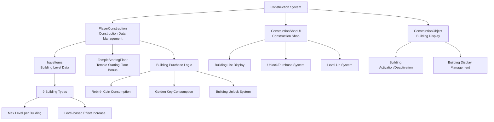

# Feature Guide - Player Management - Construction System

## Overview
The Construction System is a feature that allows players to use Rebirth Coins and Golden Keys to build various structures and gain special effects that assist in gameplay. The constructed buildings can be leveled up, each providing unique functions and bonuses.

## Construction System Architecture

### System Architecture


## Related File Paths

### Core Construction System Components
```
RootDesk/MyDesk/Components/Player/
├── PlayerConstruction.mlua           # Construction data and purchase logic management
├── PlayerConstruction.codeblock      # Construction data visual scripting
└── Construction/                     # Construction-related UI components
    ├── ConstructionShopUI.mlua       # Construction shop main UI
    ├── ConstructionShopUI.codeblock  # Construction shop visual
    ├── ConstructionObject.mlua       # Building object management
    ├── ConstructionObject.codeblock  # Building object visual
    ├── ConstructionShopUI_BuyButton.mlua # Purchase button
    ├── ConstructionShopUI_BuyButton.codeblock # Purchase button visual
    ├── ConstructionShopUI_UnlockButton.mlua # Unlock button
    └── ConstructionShopUI_UnlockButton.codeblock # Unlock button visual
```

### Construction-related UI
```
ui/
└── ConstructionGroup.ui              # Construction shop UI group
```

### Construction Data Tables
```
RootDesk/MyDesk/DataSets/
├── Construction.csv                  # Building information and effects
└── Construction.userdataset          # Construction dataset
```

### Building Model Resources
```
RootDesk/MyDesk/Models/
└── (Building-related models - location needs verification)
```

## PlayerConstruction System Detailed Analysis

### Core Data Structure
```lua
@Component
script PlayerConstruction extends Component

    property SyncTable<number> haveItems        -- Building level data by type
    property number TempleStartingFloor = 1     -- Temple starting floor (special effect)
```

### Construction System Initialization
```lua
method void OnBeginPlay()
    -- Configure table synchronization
    self._T.tableList = { haveItems = self.haveItems }
    self._T.tableType = { haveItems = "number" }
    
    if self:IsClient() then
        self.TempleStartingFloor = 1  -- Default temple starting floor
    end
end
```

### Construction Data Loading
```lua
@ExecSpace("Server")
method void LoadedData(string haveItemsStr)
    local itemTable = _DataService:GetTable("Construction")
    
    if haveItemsStr == nil then
        -- Initialize all buildings to level 0 if no data exists
        for i=1, itemTable:GetRowCount() do
            self.haveItems[i] = 0  -- 0=unlocked, 1=unlocked+level 0, 2=level 1, ...
        end
    else
        -- Restore existing data
        local haveItemsTable = _UtilLogic:StringToTable(haveItemsStr)
        for i=1, #haveItemsTable do
            self.haveItems[i] = haveItemsTable[i]
        end
    end
    
    -- Calculate temple starting floor (based on Chronos Clock Tower level)
    self:CalculateTempleStartingFloor()
end
```

### Building Purchase System
```lua
@ExecSpace("Server")
method void BuyConstruction(number idx)
    local itemTable = _DataService:GetTable("Construction")
    
    -- 1. Validation phase
    
    -- Check unlock status
    if self.haveItems[idx] < 1 then
        log("Not unlocked")
        return
    end
    
    -- Check max level (0=unlocked, 1=unlocked+level 0, 2=level 1, ..., N=(N-1) level)
    local maxLevel = tonumber(itemTable:GetCell(idx, "MaxLevel")) + 1
    if self.haveItems[idx] >= maxLevel then
        log("Max level exceeded")
        return
    end
    
    -- Calculate and check cost
    local cost = tonumber(itemTable:GetCell(idx, "ConstructionCost"))
    if cost == nil then
        -- Chronos Clock Tower uses dynamic cost calculation
        cost = 4 * self.haveItems[idx]
    end
    
    if self.Entity.PlayerStorage.currencyItems[5] < cost then  -- Insufficient Rebirth Coins
        log("Insufficient cost: Have=", self.Entity.PlayerStorage.currencyItems[5], ", Need=", cost)
        return
    end
    
    -- 2. Execution phase
    
    -- Increase building level
    self.haveItems[idx] = self.haveItems[idx] + 1
    
    -- Deduct cost (Rebirth Coins)
    self.Entity.PlayerStorage:UseCurrencyItems(5, cost)
    
    -- Client synchronization
    self:SetTableElementClient("haveItems", idx, tostring(self.haveItems[idx]), self.Entity.OwnerId)
    
    -- Play purchase effect
    self:PlayPurchaseDirection("buy", idx, self.haveItems[idx], self.Entity.OwnerId)
    
    -- Update achievement progress
    self:CheckConstructionAchievements(idx)
    
    -- Apply special effects
    self:ApplyConstructionEffects(idx)
end
```

### Building Unlock System
```lua
@ExecSpace("Server")
method void UnlockConstruction(number idx)
    local itemTable = _DataService:GetTable("Construction")
    local unlockCost = tonumber(itemTable:GetCell(idx, "UnlockCost"))
    
    -- Check if already unlocked
    if self.haveItems[idx] >= 1 then
        log("Already unlocked")
        return
    end
    
    -- Check Golden Key availability
    if self.Entity.PlayerStorage.currencyItems[6] < unlockCost then  -- Insufficient Golden Keys
        log("Insufficient unlock cost")
        return
    end
    
    -- Execute unlock
    self.haveItems[idx] = 1  -- Change to unlocked state
    self.Entity.PlayerStorage:UseCurrencyItems(6, unlockCost)  -- Deduct Golden Keys
    
    -- Synchronization and effects
    self:SetTableElementClient("haveItems", idx, tostring(self.haveItems[idx]), self.Entity.OwnerId)
    self:PlayPurchaseDirection("unlock", idx, 1, self.Entity.OwnerId)
end
```

### Temple Starting Floor Calculation
```lua
method void CalculateTempleStartingFloor()
    -- Temple starting floor bonus based on Chronos Clock Tower level
    local clockTowerLevel = self.haveItems[10] or 0  -- Chronos Clock Tower index
    
    if clockTowerLevel <= 1 then
        self.TempleStartingFloor = 1  -- Default
    else
        -- Starting floor increases with level
        self.TempleStartingFloor = clockTowerLevel - 1
    end
end
```

## ConstructionShopUI - Construction Shop System

### UI Initialization and Data Display
```lua
@Component
script ConstructionShopUI extends Component

    property number showingBuyIdx = 0    -- Current purchase popup index being displayed

    @ExecSpace("Client")
    method void RefreshUI()
        local itemTable = _DataService:GetTable("Construction")
        
        -- 1. Display currency information (Rebirth Coins, Golden Keys)
        local rebirthCoin = _UserService.LocalPlayer.PlayerStorage.currencyItems[5]
        local goldKey = _UserService.LocalPlayer.PlayerStorage.currencyItems[6]
        
        _EntityService:GetEntityByPath("/ui/ConstructionGroup/ConstructionShop/Bg_Panel_List/RebirthCoin/Amount")
            .TextComponent.Text = _ThousandsSeparator:ConvertToMetricPrefixString(rebirthCoin)
        _EntityService:GetEntityByPath("/ui/ConstructionGroup/ConstructionShop/Bg_Panel_List/GoldKey/Amount")
            .TextComponent.Text = _ThousandsSeparator:ConvertToMetricPrefixString(goldKey)
        
        -- 2. Create and update building list
        local listEntity = _EntityService:GetEntityByPath("/ui/ConstructionGroup/ConstructionShop/ListPanel")
        
        for i=1, itemTable:GetRowCount() do
            local slot = listEntity:GetChildByName("Slot_"..tostring(i))
            
            if slot == nil then
                -- Create new slot if it doesn't exist
                slot = listEntity:GetChildByName("Slot"):Clone("Slot_"..tostring(i))
                
                -- Set basic information
                slot:GetChildByName("Icon").SpriteGUIRendererComponent.ImageRUID = 
                    itemTable:GetCell(i, "IconRUID")
                slot:GetChildByName("Name").TextComponent.Text = 
                    _LocalizationService:GetText(itemTable:GetCell(i, "Name"))
                slot:GetChildByName("Desc").TextComponent.Text = 
                    _LocalizationService:GetText(itemTable:GetCell(i, "Desc"))
                
                -- Display unlock button cost
                _EntityService:GetEntityByPath(slot.Path.."/LockedPanel/UnlockButton/CostAmount")
                    .TextComponent.Text = _ThousandsSeparator:ConvertToMetricPrefixString(
                    tonumber(itemTable:GetCell(i, "UnlockCost")))
            end
            
            -- 3. Update UI based on building state
            self:UpdateConstructionSlotUI(slot, i, itemTable)
        end
    end
```

### Construction Slot UI Update
```lua
method void UpdateConstructionSlotUI(Entity slot, number idx, table itemTable)
    local level = _UserService.LocalPlayer.PlayerConstruction.haveItems[idx]
    local maxLevel = tonumber(itemTable:GetCell(idx, "MaxLevel")) + 1
    
    -- UI element references
    local nameUI = slot:GetChildByName("Name")
    local descUI = slot:GetChildByName("Desc")
    local levelNumUI = _EntityService:GetEntityByPath(slot.Path.."/Level/Fill_frame/RatioNum")
    local levelSliderUI = _EntityService:GetEntityByPath(slot.Path.."/Level/Fill_frame/Fill")
    local levelupBtnText = _EntityService:GetEntityByPath(slot.Path.."/Button_Buy/txt_levelup")
    local costUI = _EntityService:GetEntityByPath(slot.Path.."/Button_Buy/CostAmount")
    
    if level == nil then return end
    
    if level == 0 then
        -- Locked state
        slot:GetChildByName("LockedPanel").Enable = true
        slot:GetChildByName("UnlockedPanel").Enable = false
        nameUI.TextComponent.FontColor = Color.gray
        descUI.TextComponent.FontColor = Color.gray
        
    elseif level >= maxLevel then
        -- Max level achieved
        slot:GetChildByName("LockedPanel").Enable = false  
        slot:GetChildByName("UnlockedPanel").Enable = true
        levelNumUI.TextComponent.Text = "MAX"
        levelSliderUI.UITransformComponent.RectSize = Vector2(270, 23)  -- 100% fill
        levelupBtnText.TextComponent.Text = _LocalizationService:GetText("Complete")
        
        -- Disable button
        _EntityService:GetEntityByPath(slot.Path.."/Button_Buy").ButtonComponent.Enable = false
        
    else
        -- Unlocked + upgradeable
        slot:GetChildByName("LockedPanel").Enable = false
        slot:GetChildByName("UnlockedPanel").Enable = true
        
        -- Display level
        levelNumUI.TextComponent.Text = string.format("Lv.%d", level - 1)
        local levelProgress = (level - 1) / (maxLevel - 1)
        levelSliderUI.UITransformComponent.RectSize = Vector2(270 * levelProgress, 23)
        
        -- Button text
        if level < 2 then
            levelupBtnText.TextComponent.Text = _LocalizationService:GetText("Construct")
        else
            levelupBtnText.TextComponent.Text = _LocalizationService:GetText("LevelUp")
        end
        
        -- Display cost
        local cost = tonumber(itemTable:GetCell(idx, "ConstructionCost"))
        if cost == nil then
            -- Dynamic cost calculation (Chronos Clock Tower)
            cost = 4 * level
        end
        costUI.TextComponent.Text = _ThousandsSeparator:ConvertToMetricPrefixString(cost)
    end
end
```

## ConstructionObject - Building Object Management

### Building Display System
```lua
@Component
script ConstructionObject extends Component

    @Sync
    property number Idx = 0    -- Building index

    @ExecSpace("ClientOnly")
    method void OnBeginPlay()
        if self.Idx == 0 then
            log("Building index is 0")
            return
        end
        
        self:SetNametagLocalization()
        self:RefreshEntityEnable()
    end

    @ExecSpace("Client")
    method void RefreshEntityEnable()
        -- Wait for PlayerConstruction data to load
        local waitCount = 0
        while true do
            if _UserService.LocalPlayer.PlayerConstruction.haveItems[self.Idx] == nil then
                waitCount = waitCount + 1
                wait(1)
                
                if waitCount > 8 then
                    log("Cannot load building data")
                    return
                end
            else
                break
            end
        end
        
        -- Show/hide building based on level
        if _UserService.LocalPlayer.PlayerConstruction.haveItems[self.Idx] > 1 then
            self.Entity.Enable = true   -- Built: show
        else
            self.Entity.Enable = false  -- Not built: hide
        end
    end

    @ExecSpace("Client")
    method void SetNametagLocalization()
        local constructionTable = _DataService:GetTable("Construction")
        local nameTagText = _LocalizationService:GetText(constructionTable:GetCell(self.Idx, "Name"))
        
        -- Set localized name if nametag exists
        if self.Entity.NameTagComponent then
            self.Entity.NameTagComponent.Name = nameTagText
        end
    end
```

## Building Types and Effects

### Constructible Buildings (Based on Construction.csv)
```csv
ID,Name,Desc,IconRUID,UnlockCost,ConstructionCost,MaxLevel,EffectType,EffectValue
1,Building_Warehouse,Desc_Warehouse,icon_warehouse,100,50,10,InventoryExpansion,20
2,Building_Forge,Desc_Forge,icon_forge,200,75,8,CraftingSpeed,15
3,Building_Mine,Desc_Mine,icon_mine,150,60,12,MiningEfficiency,10
4,Building_Library,Desc_Library,icon_library,300,100,6,ExpBonus,25
5,Building_Temple,Desc_Temple,icon_temple,500,150,5,PrayerBonus,30
6,Building_Market,Desc_Market,icon_market,250,80,9,TradingBonus,20
7,Building_GoldStatue,Desc_GoldStatue,icon_goldstatue,400,120,7,GoldFind,35
8,Building_GemBox,Desc_GemBox,icon_gembox,600,200,4,GemFind,40
9,Building_Pegasus,Desc_Pegasus,icon_pegasus,800,250,3,FastTravel,50
10,Building_ChronosClockTower,Desc_ClockTower,icon_clocktower,1000,,∞,TempleFloorBonus,1
```

### Detailed Effects by Building

#### 1. Warehouse
- **Effect**: Inventory capacity expansion
- **Per Level**: +20 slots
- **Max Level**: 10
- **Total Effect**: Up to +200 slots

#### 2. Forge  
- **Effect**: Crafting speed increase
- **Per Level**: +15% speed
- **Max Level**: 8
- **Total Effect**: Up to +120% speed

#### 3. Mine Facility
- **Effect**: Mining efficiency increase  
- **Per Level**: +10% mining yield
- **Max Level**: 12
- **Total Effect**: Up to +120% mining yield

#### 4. Library
- **Effect**: Experience bonus
- **Per Level**: +25% experience
- **Max Level**: 6
- **Total Effect**: Up to +150% experience

#### 5. Temple 
- **Effect**: Prayer bonus (special effect)
- **Per Level**: +30% prayer effect
- **Max Level**: 5

#### 6. Market
- **Effect**: Trading bonus (selling price increase)
- **Per Level**: +20% selling price
- **Max Level**: 9

#### 7. Golden Staff (Gold Statue)
- **Effect**: Enables finding Plutus's Golden Staff
- **Condition**: Level 2 or higher (found in underground temple)
- **Reward**: Massive gold that increases with floor level

#### 8. Gem Box
- **Effect**: Enables finding Hades's Treasure Box
- **Condition**: Level 2 or higher (found in underground temple) 
- **Reward**: Gem acquisition based on construction level

#### 9. Pegasus
- **Effect**: Enables meeting Pegasus in temple
- **Condition**: Level 2 or higher
- **Function**: Empties inventory and gives gold equal to its value

#### 10. Chronos Clock Tower
- **Effect**: Increases temple starting floor
- **Per Level**: +1 starting floor
- **Max Level**: Unlimited
- **Special**: Dynamic cost calculation (level × 4 Rebirth Coins)

## Construction Effect Application System

### Gameplay Effect Application
```lua
method void ApplyConstructionEffects(number idx)
    local itemTable = _DataService:GetTable("Construction")
    local effectType = itemTable:GetCell(idx, "EffectType")
    local effectValue = tonumber(itemTable:GetCell(idx, "EffectValue"))
    local currentLevel = self.haveItems[idx]
    
    if effectType == "InventoryExpansion" then
        -- Inventory expansion
        local additionalSlots = effectValue * (currentLevel - 1)
        self.Entity.PlayerBackpack.maxStorageNum = self.Entity.PlayerBackpack.maxStorageNum + effectValue
        
    elseif effectType == "MiningEfficiency" then
        -- Mining efficiency increase
        local efficiencyBonus = effectValue * (currentLevel - 1)
        self.Entity.PlayerData:AddBuff("MiningEfficiency", efficiencyBonus)
        
    elseif effectType == "ExpBonus" then
        -- Experience bonus
        local expMultiplier = 1 + (effectValue * (currentLevel - 1)) / 100
        self.Entity.PlayerData:AddBuff("ExpMultiplier", expMultiplier)
        
    elseif effectType == "TempleFloorBonus" then
        -- Temple starting floor bonus (Chronos Clock Tower)
        self.TempleStartingFloor = currentLevel - 1
    end
end
```

### Temple Integration Effects
```lua
-- Apply starting floor when entering temple in PlayerIngameData.mlua
method void OnMapEnter()
    if string.sub(enteredMap.Name, 1, 4) == "Temp" then  -- Temple map
        if not self.entered then  -- First entry
            local floorCount = self.Entity.PlayerConstruction.TempleStartingFloor
            self:AddCurrentTempleFloor(floorCount, false, self.Entity.PlayerComponent.UserId)
        end
    end
end
```

## Construction Currency System

### Rebirth Coin
- **Usage**: Building construction and upgrades
- **Acquisition**: Obtained through rebirth system
- **Index**: PlayerStorage.currencyItems[5]

### Golden Key  
- **Usage**: Unlocking new buildings
- **Acquisition**: Special events, rewards, etc.
- **Index**: PlayerStorage.currencyItems[6]

### Cost Structure
```lua
-- Regular buildings: fixed cost (ConstructionCost in Construction.csv)
-- Chronos Clock Tower: dynamic cost (current level × 4)

method number GetConstructionCost(number idx)
    local itemTable = _DataService:GetTable("Construction")
    local cost = tonumber(itemTable:GetCell(idx, "ConstructionCost"))
    
    if cost == nil then
        -- Chronos Clock Tower uses dynamic cost
        cost = 4 * self.haveItems[idx]
    end
    
    return cost
end
```

## Achievement System Integration

### Construction-related Achievements
```lua
method void CheckConstructionAchievements(number idx)
    if idx == 1 and self.haveItems[1] == 2 then
        -- First warehouse construction achievement
        self.Entity.PlayerAchievementComponent:GetProgress(31, 1)
    elseif idx == 2 and self.haveItems[2] == 2 then
        -- First forge construction achievement
        self.Entity.PlayerAchievementComponent:GetProgress(32, 1)  
    elseif idx == 4 and self.haveItems[4] == 2 then
        -- First library construction achievement
        self.Entity.PlayerAchievementComponent:GetProgress(33, 1)
    end
    
    -- All buildings completion achievement
    local allMaxLevel = true
    for i=1, 9 do  -- Excluding Chronos Clock Tower (unlimited level)
        if self.haveItems[i] < self:GetMaxLevel(i) then
            allMaxLevel = false
            break
        end
    end
    
    if allMaxLevel then
        self.Entity.PlayerAchievementComponent:GetProgress(40, 1)  -- Master architect achievement
    end
end
```

## Performance Optimization

### Building Display Optimization
```lua
-- Skip rendering for buildings not visible on screen
method void OnUpdate(number delta)
    if not self:IsVisibleOnScreen() then
        return
    end
    
    self:UpdateConstructionVisual(delta)
end
```

### Memory Management
- Deactivate unbuilt objects
- Building model caching system
- UI element pooling

## Extensibility

### Adding New Buildings
1. Add new building information to **Construction.csv**
2. Add building models and icons
3. Implement new effect types
4. Add UI slots

### Advanced Construction Features
```lua
-- Building interactions
method void CheckConstructionSynergy()
    -- Additional bonuses for specific building combinations
end

-- Building automation system
method void AutoUpgrade()
    -- Auto upgrade when conditions are met
end

-- Building special effects
method void ActivateSpecialEffect(number idx)
    -- Special activation effects per building
end
```

## Common Troubleshooting

### When Buildings Don't Display
1. Check if `haveItems` level is 2 or higher (1=unlocked only, 2=actually built)
2. Verify `ConstructionObject.Idx` setting
3. Check if building objects are placed on the map

### When Construction Cost Isn't Deducted
1. Check Rebirth Coin/Golden Key holdings
2. Verify `UseCurrencyItems` call
3. Validate cost calculation logic

### When Construction Effects Aren't Applied
1. Check `ApplyConstructionEffects` method call
2. Review effect type-specific application logic
3. Verify player data buff system
