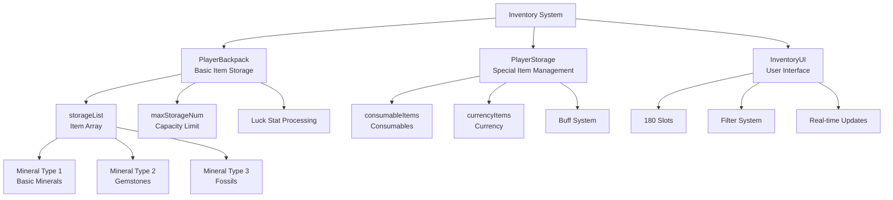

# Feature Guide - Player Management - Inventory System

## Overview
The Inventory System is a core system that stores and manages all items acquired by players, including mined minerals, purchased equipment, and consumables. It provides dynamic capacity management, item type categorization, drag and drop functionality, and an intuitive UI for efficient item management.

## Inventory System Architecture

### System Architecture


## Related File Paths

### Core Inventory Components
```
RootDesk/MyDesk/Components/Player/Inventory/
├── PlayerBackpack.mlua                # Basic item storage system
├── PlayerBackpack.codeblock          # Backpack visual scripting
├── PlayerStorage.mlua                # Special items and currency management
├── PlayerStorage.codeblock           # Storage visual scripting
├── InventoryUI.mlua                  # Inventory user interface
├── InventoryUI.codeblock             # Inventory UI visual
├── InventorySlotButton.mlua          # Inventory slot button
├── InventorySlotButton.codeblock     # Slot button visual
├── InventoryEquipedSlotButton.mlua   # Equipped slot button
├── InventoryEquipedSlotButton.codeblock # Equipped slot visual
├── StorageUI.mlua                    # Storage UI
├── StorageUI.codeblock               # Storage UI visual
├── StorageUI_SlotButton.mlua         # Storage slot button
├── StorageUI_SlotButton.codeblock    # Storage slot visual
├── EquipmentStorageUI_NormalSlotButton.mlua    # Equipment storage slot
└── EquipmentStorageUI_NormalSlotButton.codeblock # Equipment storage slot visual
```

### Inventory UI Groups
```
ui/
├── InventoryGroup.ui                 # Inventory UI group
├── EquipmentStorageGroup.ui          # Equipment storage UI group
└── VoidItemGroup.ui                  # Void item UI group
```

### Related Components
```
RootDesk/MyDesk/Components/
├── InventoryButtonUI.mlua            # Inventory button UI
└── Player/VoidItem/PlayerVoidItem.mlua # Void item system
```

### Data Tables
```
RootDesk/MyDesk/DataSets/
├── DropItem.csv                      # Drop item information
├── DropItem.userdataset             # Drop item dataset
├── Equipment.csv                     # Equipment information
├── Equipment.userdataset            # Equipment dataset
├── ConsumableItems.csv              # Consumable item information
└── ConsumableItems.userdataset      # Consumable item dataset
```

## PlayerBackpack System Detailed Analysis

### Core Data Structure
```lua
@Component
script PlayerBackpack extends Component

    property SyncTable<number> storageList    -- Item storage array
    @Sync
    property number maxStorageNum = 0         -- Maximum storage capacity
    property number failStack = 0             -- Full backpack warning stack
```

### Item Addition Logic
```lua
@ExecSpace("Server")
method void AddItem(number itemIdx, number amount)
    -- 1. Calculate current holdings
    local storageAmount = 0
    for i=1, #self.storageList do
        storageAmount = storageAmount + self.storageList[i]
    end
    
    -- 2. Apply luck stat (2x acquisition chance)
    if itemIdx > 4 then  -- Excluding basic minerals
        local randValue = _UtilLogic:RandomDouble() * 100
        if randValue < self.Entity.PlayerData.Luck then
            amount = amount * 2  -- Double on luck trigger
        end
    end
    
    -- 3. Check capacity limit
    local allowedAmount = self.maxStorageNum - storageAmount
    if allowedAmount < amount then
        amount = allowedAmount
        
        -- Warning message when backpack is full
        if amount <= 0 then
            _CustomLocalizationLogic:SendLocalizedToastMessageFromServer(
                "Message_BackpackIsFull", self.Entity.OwnerId)
                
            -- Increase failStack: show purchase guide after 8 accumulations
            self.failStack = self.failStack + 1
            if self.failStack >= 8 then
                local showGuideMessage = function()
                    _CustomLocalizationLogic:SendLocalizedToastMessageFromServer(
                        "Message_Tip_BuyBackpack", self.Entity.OwnerId)
                end
                _TimerService:SetTimerOnce(showGuideMessage, 4)
            end
            return
        end
    end
    
    -- 4. Store item and sync to client
    self.storageList[itemIdx] = self.storageList[itemIdx] + amount
    self:SetTableElementClient("storageList", itemIdx, tostring(self.storageList[itemIdx]), self.Entity.OwnerId)
    
    -- 5. Collection system integration
    self.Entity.PlayerCollection:RecordData(itemIdx, amount)
    
    -- 6. Item type-based logging and achievement processing
    local itemTable = _DataService:GetTable("DropItem")
    local itemType = itemTable:GetCell(itemIdx, 6)
    local itemRUID = itemTable:GetCell(itemIdx, 2)
    
    if itemType == "MineralType1" then  -- Basic minerals (white)
        _UIGetLog:AddLog(Color.white, itemTable:GetCell(itemIdx, 1), amount, true, itemType, itemRUID, self.Entity.OwnerId)
        for i=10, 16 do  -- Update related achievement progress
            self.Entity.PlayerAchievementComponent:GetProgress(i, amount)
        end
        
    elseif itemType == "MineralType2" then  -- Gemstones (red)
        _UIGetLog:AddLog(Color.FromHexCode("#FF7878"), itemTable:GetCell(itemIdx, 1), amount, true, itemType, itemRUID, self.Entity.OwnerId)
        for i=17, 21 do
            self.Entity.PlayerAchievementComponent:GetProgress(i, amount)
        end
        
    elseif itemType == "MineralType3" then  -- Fossils (yellow)
        _UIGetLog:AddLog(Color.FromHexCode("#FFD926"), itemTable:GetCell(itemIdx, 1), amount, true, itemType, itemRUID, self.Entity.OwnerId)
        for i=22, 25 do
            self.Entity.PlayerAchievementComponent:GetProgress(i, amount)
        end
    end
    
    -- 7. Play item acquisition sound
    _SoundService:PlaySound("2e4f923874f749fda5f69170aee85061", 0.5, self.Entity.OwnerId)
end
```

### Item Selling System
```lua
@ExecSpace("Server")
method void SellItem(number itemIdx, number sellAmount)
    if self.storageList[itemIdx] >= sellAmount then
        -- Deduct item
        self.storageList[itemIdx] = self.storageList[itemIdx] - sellAmount
        
        -- Calculate selling price and give gold
        local itemTable = _DataService:GetTable("DropItem")
        local sellPrice = itemTable:GetCell(itemIdx, 3) * sellAmount
        self.Entity.PlayerData:GetMoney(sellPrice)
        
        -- Client synchronization
        self:SetTableElementClient("storageList", itemIdx, tostring(self.storageList[itemIdx]), self.Entity.OwnerId)
    end
end
```

## PlayerStorage System - Special Item Management

### Data Structure
```lua
@Component  
script PlayerStorage extends Component

    -- Consumables (relic boxes, contracts, sprays, accessory boxes, etc.)
    property SyncTable<number> consumableItems
    
    -- Currencies (gold, gems, pet eggs, emotion tokens, rebirth coins, etc.)  
    property SyncTable<number> currencyItems
    
    -- Consumable usage time management
    property SyncTable<number> consumableItemStartTime
    property SyncTable<number> consumableItemDuration
    property SyncTable<boolean> consumableItemAvailable
    
    -- Buff UI system
    property Entity buffUI = "090d60e0-cba6-4fe4-8362-ead22d244aba"
    property SyncTable<string> buffIconRUID
    property SyncTable<string> buffName
    property SyncTable<string> buffDesc
```

### Consumable System
```lua
method void OnBeginPlay()
    -- Set consumable duration
    local consumableItemTable = _DataService:GetTable("ConsumableItems")
    for i=1, consumableItemTable:GetRowCount() do
        local filterIdx = tonumber(consumableItemTable:GetCell(i, "FilterType"))
        
        if filterIdx == 1 then
            self.consumableItemDuration[i] = 1800  -- 30 minutes
        elseif filterIdx == 2 then
            self.consumableItemDuration[i] = 600   -- 10 minutes  
        else
            self.consumableItemDuration[i] = 0     -- Permanent/instant use
        end 
    end
    
    -- Load buff information (client)
    if self:IsClient() then
        for i=1, consumableItemTable:GetRowCount() do
            self.buffIconRUID[i] = consumableItemTable:GetCell(i, "IconRUID")
            self.buffName[i] = _LocalizationService:GetText(consumableItemTable:GetCell(i, "Name"))
            self.buffDesc[i] = _LocalizationService:GetText(consumableItemTable:GetCell(i, "Desc"))
        end
    end
end
```

### Currency System 
```lua
-- Add currency
@ExecSpace("Server")  
method void AddCurrencyItems(number currencyType, number amount, boolean showEffect)
    self.currencyItems[currencyType] = self.currencyItems[currencyType] + amount
    
    if showEffect then
        -- Show acquisition effect
        self:ShowCurrencyGainEffect(currencyType, amount)
    end
end

-- Use currency
@ExecSpace("Server")
method boolean SpendCurrencyItems(number currencyType, number amount)
    if self.currencyItems[currencyType] >= amount then
        self.currencyItems[currencyType] = self.currencyItems[currencyType] - amount
        return true
    else
        return false  -- Insufficient balance
    end
end
```

## InventoryUI System - User Interface

### UI Structure and Initialization
```lua
@Component
script InventoryUI extends Component

    property number filterIdx = 1         -- Filter index (1:minerals, 2:equipment etc.)
    property number showDetailIdx = 0     -- Detail info display item

    @ExecSpace("ClientOnly")
    method void OnBeginPlay()
        -- 1. Set localization text
        _EntityService:GetEntityByPath("/ui/InventoryGroup/Inventory/DetailInfoPopup/Panel/Button_Equip")
            .TextComponent.Text = _LocalizationService:GetText("Equip")
        _EntityService:GetEntityByPath("/ui/InventoryGroup/Inventory/DetailInfoPopup/Panel/Button_Equip_dismount")
            .TextComponent.Text = _LocalizationService:GetText("Unequip")
        
        -- 2. Create 180 inventory slots
        local invenSlot = _EntityService:GetEntityByPath("/ui/InventoryGroup/Inventory/Panel/Panel_right/ListPanel/Slot")
        for i=1, 180 do
            invenSlot:Clone("Slot_"..tostring(i))
        end
        
        -- 3. Create 13 stat slots
        local abilitySlot = _EntityService:GetEntity("49feef06-c09d-4890-bb0c-44ffcc4faaff")
        for i=1, 13 do
            abilitySlot:Clone("List_"..tostring(i))
        end
        
        -- 4. Set default filter (minerals)
        self:SetFilterIdx(1)
    end
```

### Real-time UI Update System
```lua
@ExecSpace("ClientOnly")
method void OnUpdate(number delta)
    -- Check UI refresh per frame
    if self._T.refreshUI then
        self:RefreshUI_Inner()
        self._T.refreshUI = false
    end
end

@ExecSpace("Client")
method void RefreshUI_Inner()
    local user = _UserService.LocalPlayer
    
    -- 1. Display capacity information
    local maxStorage = user.PlayerBackpack.maxStorageNum
    local currentStorage = 0
    
    for i=1, #user.PlayerBackpack.storageList do
        if user.PlayerBackpack.storageList[i] ~= nil then
            currentStorage = currentStorage + user.PlayerBackpack.storageList[i]
        end
    end
    
    -- 2. Update capacity bar UI
    local fill = _EntityService:GetEntity("f2d5b6f7-8b9c-4321-a0e1-2f3g4h5i6j7k")
    local ratioNum = _EntityService:GetEntity("a1b2c3d4-e5f6-7890-1234-567890abcdef")
    
    fill.UITransformComponent.RectSize = Vector2(566 * currentStorage / maxStorage, 29)
    ratioNum.TextComponent.Text = string.format("%.2f%%", currentStorage / maxStorage * 100)
    
    -- 3. Display item list by filter
    if self.filterIdx == 1 then  -- Mineral filter
        self:DisplayMineralItems()
    elseif self.filterIdx == 2 then  -- Equipment filter  
        self:DisplayEquipmentItems()
    elseif self.filterIdx == 3 then  -- Chair filter
        self:DisplayChairItems()
    elseif self.filterIdx == 4 then  -- Pet filter
        self:DisplayPetItems()
    elseif self.filterIdx == 5 then  -- Title filter
        self:DisplayTitleItems()
    elseif self.filterIdx == 6 then  -- Relic filter
        self:DisplayRelicItems()
    end
end
```

### Mineral Item Display System
```lua
method void DisplayMineralItems()
    local user = _UserService.LocalPlayer
    local itemTable = _DataService:GetTable("DropItem")
    local listPanel = _EntityService:GetEntity("23b2aa35-795f-44da-b215-36c5892e1da5")
    local maxIdx = itemTable:GetRowCount()
    
    for i=1, maxIdx do
        local haveAmount = user.PlayerBackpack.storageList[i]
        local slot = listPanel:GetChildByName("Slot_"..tostring(i))
        
        -- Initialize slot state
        slot:GetChildByName("EquipedSlot").Enable = false
        slot:GetChildByName("PetGrade").Enable = false
        slot:GetChildByName("IsDirtyRelic").Enable = false
        
        if haveAmount == nil then
            log("have amount is nil")
            return
        elseif haveAmount == 0 then
            -- Hide items not owned
            slot.Enable = false
        else
            -- Display owned items
            slot.Enable = true
            slot.ButtonComponent.Enable = true
            
            -- Set item icon
            slot:GetChildByName("Icon").SpriteGUIRendererComponent.ImageRUID = itemTable:GetCell(i, 2)
            slot:GetChildByName("Icon").SpriteGUIRendererComponent.Color = Color.white
            slot:GetChildByName("Icon").SpriteGUIRendererComponent.LocalScale = Vector2.one
            
            -- Display quantity (with thousand separators)
            slot:GetChildByName("Amount").TextComponent.Text = 
                _ThousandsSeparator:ConvertToMetricPrefixString(haveAmount)
        end
    end
    
    -- Disable unused slots
    for i=maxIdx+1, 180 do
        local slot = listPanel:GetChildByName("Slot_"..tostring(i))
        slot.Enable = false
        slot.ButtonComponent.Enable = false
    end
end
```

## Inventory Button UI System

### Capacity Display and Animation
```lua
@Component
script InventoryButtonUI extends Component

    property boolean isCalledByStorageList = false  -- Storage change flag

    method void RefreshUI_Inner()
        local user = _UserService.LocalPlayer
        local maxStorage = user.PlayerBackpack.maxStorageNum
        local currentStorage = 0
        
        -- Calculate current usage
        for i=1, #user.PlayerBackpack.storageList do
            if user.PlayerBackpack.storageList[i] ~= nil then
                currentStorage = currentStorage + user.PlayerBackpack.storageList[i]
            end
        end
        
        local amountRate = currentStorage / maxStorage
        
        -- Update percentage text
        local btnAmountTextUI = _EntityService:GetEntity("c8f3715f-0080-4e95-9e4f-a080b26adc48")
        btnAmountTextUI.TextComponent.Text = string.format("%.2f%%", amountRate * 100)
        
        -- Gauge bar animation (when item acquired)
        local btnAmountFillUI = _EntityService:GetEntity("9c0a3c39-2638-4610-bd31-43ea0b0c9672")
        
        if self.isCalledByStorageList == true then
            -- Smooth gauge increase animation
            local beforeFillAmount = btnAmountFillUI.SpriteGUIRendererComponent.FillAmount
            local gap = amountRate - beforeFillAmount
            local delta = gap / 30
            
            local SetFillAmount = function()
                local currentFillAmount = btnAmountFillUI.SpriteGUIRendererComponent.FillAmount
                if currentFillAmount == nil then currentFillAmount = 0 end
                
                local newFillAmount = currentFillAmount + delta
                btnAmountFillUI.SpriteGUIRendererComponent.FillAmount = newFillAmount
            end
            
            -- Animation over 30 frames
            for i=1, 30 do
                _TimerService:SetTimerOnce(SetFillAmount, i/30)
            end
            
            self.isCalledByStorageList = false
        else
            -- Immediate update (no animation)
            btnAmountFillUI.SpriteGUIRendererComponent.FillAmount = amountRate
        end
    end
```

## Capacity Management and Expansion System

### Bag Expansion Mechanism
```lua
-- Update maxStorageNum in PlayerBackpack.mlua
@ExecSpace("Server")
method void ExpandStorage(number additionalSlots)
    self.maxStorageNum = self.maxStorageNum + additionalSlots
    -- Sync to client
    self:SyncStorageCapacity()
end

-- Bag expansion through equipment (reference EquipmentShopUI.mlua)
method void ApplyBackpackEquipment(number equipmentLevel)
    local backpackCapacity = self:GetBackpackCapacityByLevel(equipmentLevel)
    _UserService.LocalPlayer.PlayerBackpack.maxStorageNum = backpackCapacity
end
```

### Full Backpack Warning System
```lua
-- Purchase guide after 8 consecutive full backpack warnings
method void HandleFullBackpackWarning()
    self.failStack = self.failStack + 1
    
    if self.failStack >= 8 then
        local showGuideMessage = function()
            _CustomLocalizationLogic:SendLocalizedToastMessageFromServer(
                "Message_Tip_BuyBackpack", self.Entity.OwnerId)
        end
        _TimerService:SetTimerOnce(showGuideMessage, 4)
        
        -- Reset failStack
        self.failStack = 0
    end
end
```

## Item Classification and Filter System

### Item Categories
1. **Minerals (MineralType1)**: Basic minerals, white log
2. **Gemstones (MineralType2)**: Rare gems, red log  
3. **Fossils (MineralType3)**: Ancient fossils, yellow log
4. **Equipment**: Weapons, armor, accessories
5. **Chairs**: Rest furniture items
6. **Pets**: Companion pets
7. **Titles**: Player title system
8. **Relics**: Items with special effects

### Filter Switching System
```lua
method void SetFilterIdx(number newFilterIdx)
    self.filterIdx = newFilterIdx
    
    -- Update filter UI
    local filterButtons = _EntityService:GetEntityByPath("/ui/InventoryGroup/Inventory/Panel/Panel_left/FilterList")
    
    for i=1, 6 do
        local filterButton = filterButtons:GetChildByName("Filter_"..tostring(i))
        if i == newFilterIdx then
            filterButton.SpriteGUIRendererComponent.Color = Color.yellow  -- Selected
        else
            filterButton.SpriteGUIRendererComponent.Color = Color.white   -- Default color
        end
    end
    
    -- Refresh UI
    self:RefreshUI()
end
```

## Drag and Drop System

### Item Movement Between Slots
```lua
-- Implemented in InventorySlotButton.mlua
method void OnDragStart()
    -- Store item information when drag starts
    local dragData = {
        itemId = self.itemId,
        itemAmount = self.itemAmount,
        sourceSlot = self.slotIndex
    }
    
    _DragDropService:StartDrag(dragData)
end

method void OnDragEnd(Entity targetSlot)
    -- Check if drop target is valid slot
    if targetSlot and targetSlot.InventorySlotButton then
        -- Swap or move items
        self:SwapItems(targetSlot)
    end
    
    _DragDropService:EndDrag()
end
```

### Item Swap Logic
```lua
method void SwapItems(Entity targetSlot)
    local sourceItemId = self.itemId
    local sourceAmount = self.itemAmount
    local targetItemId = targetSlot.InventorySlotButton.itemId
    local targetAmount = targetSlot.InventorySlotButton.itemAmount
    
    -- Merge quantities for same item
    if sourceItemId == targetItemId then
        targetSlot.InventorySlotButton:AddAmount(sourceAmount)
        self:ClearSlot()
    else
        -- Swap positions for different items
        self:SetItem(targetItemId, targetAmount)
        targetSlot.InventorySlotButton:SetItem(sourceItemId, sourceAmount)
    end
end
```

## Performance Optimization

### UI Update Optimization
```lua
-- Refresh UI only when needed
property boolean _needsRefresh = false

method void RequestRefresh()
    self._needsRefresh = true
end

method void OnUpdate(number delta) 
    if self._needsRefresh then
        self:RefreshUI_Inner()
        self._needsRefresh = false
    end
end
```

### Memory Management
- Deactivate unused slots
- Item icon texture caching
- Virtual scrolling for large inventories

## Extensibility

### Adding New Item Types
1. Add new item information to `DropItem.csv`
2. Implement new filter logic in `InventoryUI.mlua`
3. Add new filter tab to UI
4. Implement item-specific handling logic

### Additional Feature Implementation
```lua
-- Item sorting feature
method void SortInventory()
    -- Sort by item type, grade, quantity
end

-- Quick sell feature  
method void QuickSell(table itemTypes)
    -- Batch sell specific type items
end

-- Item search feature
method void SearchItems(string keyword)
    -- Search and filter items by name
end
```

## Common Troubleshooting

### When Items Are Not Added
1. Check `maxStorageNum` capacity
2. Verify `AddItem` method permissions (Server execution space)
3. Check `storageList` index range

### When UI Doesn't Update  
1. Check `RefreshUI()` call
2. Verify client-server synchronization status
3. Check UI entity reference paths

### When Drag and Drop Doesn't Work
1. Check slot button's `ButtonComponent.Enable` state
2. Verify drag permission settings
3. Check collision area
