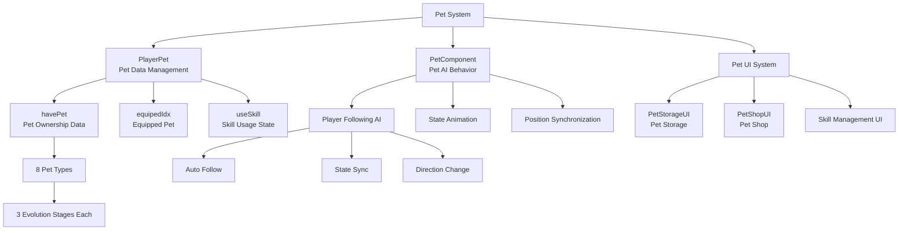

# Feature Guide - Player Management - Pet System

## Overview
The Pet System allows players to summon companion pets that assist with gameplay. Pets automatically follow the player and possess unique skills that provide various benefits. They can be obtained through Pet Eggs, and there are 8 different types of pets available.

## Pet System Architecture

### System Architecture


## Related File Paths

### Core Pet System Components
```
RootDesk/MyDesk/Components/Player/Pet/
├── PlayerPet.mlua                    # Player pet data management
├── PlayerPet.codeblock              # Pet data visual scripting
├── PetComponent.mlua                # Individual pet AI component
├── PetComponent.codeblock           # Pet AI visual scripting
├── PetStorageUI.mlua                # Pet storage UI
├── PetStorageUI.codeblock           # Pet storage visual
├── PetShopUI.mlua                   # Pet shop UI
├── PetShopUI.codeblock              # Pet shop visual
├── PetStorageUI_EquipButton.mlua    # Pet equip button
├── PetStorageUI_EquipButton.codeblock # Pet equip button visual
├── PetStorageUI_SlotInfoPopup.mlua  # Pet info popup
├── PetStorageUI_SlotInfoPopup.codeblock # Pet info popup visual
├── PetStorageUI_UseSkillButton.mlua # Pet skill use button
└── PetStorageUI_UseSkillButton.codeblock # Pet skill button visual
```

### Pet-related UI Groups
```
ui/
└── PetShopGroup.ui                  # Pet shop UI group
```

### Pet Data Tables
```
RootDesk/MyDesk/DataSets/
├── Pet.csv                          # Pet basic information
├── Pet.userdataset                  # Pet dataset
├── PetSkill.csv                     # Pet skill information (estimated)
└── PetSkill.userdataset             # Pet skill dataset (estimated)
```

### Pet Model Resources
```
RootDesk/MyDesk/Models/
└── Players/                         # Pet models (pets included in Players folder)
```

## PlayerPet System Detailed Analysis

### Core Data Structure
```lua
@Component
script PlayerPet extends Component

    @Sync
    property Entity petEntity = nil      -- Summoned pet entity
    
    property SyncTable<number> havePet   -- Owned pet data (8 types x 3 stages each)
    
    @Sync
    property number equipedIdx = 0       -- Currently equipped pet index (0=unequipped)
    
    property SyncTable<boolean> useSkill -- Pet skill usage state
```

### Pet System Initialization
```lua
method void OnBeginPlay()
    -- Configure table synchronization
    self._T.tableList = { 
        havePet = self.havePet,
        useSkill = self.useSkill,
    }
    self._T.tableType = { 
        havePet = "number",
        useSkill = "boolean",
    }
    
    -- Initialize pet data (8 types of pets)
    local petNum = _DataService:GetRowCount("Pet")
    for i=1, petNum do
        self.havePet[i] = 0  -- 0: unowned, 1-3: evolution stage
    end
    
    if self:IsServer() then
        self.equipedIdx = 0  -- Initially no pet equipped
        
        -- Spawn pet entity (inactive state)
        self.petEntity = _SpawnService:SpawnByModelId(
            "model://8d924b3c-89e6-4c50-9464-aaf62178e526",  -- Default pet model
            "Pet",
            Vector3(-self.Entity.ExtendPlayerControllerComponent.LookDirectionX, 0, 0),
            self.Entity)
        
        -- Connect pet-player
        self.petEntity.PetComponent.ownerEntity = self.Entity
        self.petEntity.NameTagComponent.Name = self.Entity.NameTagComponent.Name.."'s Pet"
        self.petEntity.NameTagComponent.Enable = false
        
        self:ChangePetEntityParameter()
    end
end
```

### Pet Equipment System
```lua
@ExecSpace("Server")
method void ChangePetEntityParameter()
    local petIdx = self.equipedIdx
    
    if petIdx == 0 then
        -- No pet equipped: deactivate pet entity
        self:EnablePetEntity(false)
        return
    else 
        -- Pet equipped: activate pet entity
        self:EnablePetEntity(true)
    end
    
    -- Load pet data
    local petTable = _DataService:GetTable("Pet")
    local petRUID = petTable:GetCell(petIdx, 2)  -- Pet sprite
    
    -- Configure pet entity
    local petEntity = self.Entity:GetChildByName("Pet")
    petEntity.SpriteRendererComponent.SpriteRUID = petRUID
    
    -- Set pet animations
    local animMove = petTable:GetCell(petIdx, 3)
    local animIdle = petTable:GetCell(petIdx, 4)
    local animJump = petTable:GetCell(petIdx, 5)
    
    -- Apply animations to StateAnimationComponent
    self:SetPetAnimations(animMove, animIdle, animJump)
end

@ExecSpace("Server")
method void EnablePetEntity(boolean enable)
    if isvalid(self.petEntity) then
        self.petEntity.Enable = enable
        
        if enable then
            -- Pet activation: place behind player
            local playerPos = self.Entity.TransformComponent.WorldPosition
            local lookDir = self.Entity.ExtendPlayerControllerComponent.LookDirectionX
            self.petEntity.TransformComponent.WorldPosition = 
                Vector3(playerPos.x - lookDir * 0.5, playerPos.y, playerPos.z)
        end
    end
end
```

### Pet Acquisition System
```lua
@ExecSpace("Server")
method void GetPet(number petIdx)
    -- Check if pet is already at max evolution
    if self.havePet[petIdx] >= 3 then
        -- Already max evolution: give other reward (e.g., gems)
        self.Entity.PlayerStorage:AddCurrencyItems(2, 10, true)  -- 10 gems
        return
    end
    
    -- Increase pet evolution stage
    self.havePet[petIdx] = self.havePet[petIdx] + 1
    
    -- Client synchronization
    self:SetTableElementClient("havePet", petIdx, tostring(self.havePet[petIdx]), self.Entity.OwnerId)
    
    -- Refresh UI
    local petStorageUI = _EntityService:GetEntityByPath("/ui/PetShopGroup/PetStorage")
    petStorageUI.PetStorageUI:RefreshUI()
end
```

## PetComponent - Pet AI System

### Pet Behavior Pattern
```lua
@Component
script PetComponent extends Component

    @Sync
    property EntityRef ownerEntity = nil  -- Owner player
    
    property SyncTable<number> animTimer  -- Animation timer

    method void OnBeginPlay()
        -- Initialize state animation
        local stateAnimCompo = self.Entity.StateAnimationComponent
        local stateCompo = self.Entity.StateComponent
        
        -- Register all animation states to StateComponent
        for i=1, stateAnimCompo.ActionSheet.Count do
            stateCompo:AddState(stateAnimCompo.ActionSheet.Keys[i])
        end
    end
```

### Pet State Management
```lua
@ExecSpace("Server")
method void ChangeState(string state)
    if state == "Move" then
        self.Entity.StateComponent:ChangeState("MOVE")
    elseif state == "Idle" then
        self.Entity.StateComponent:ChangeState("STAND")
    elseif state == "Jump" then
        self.Entity.StateComponent:ChangeState("JUMP")
    end
end
```

### Player Following System
```lua
@ExecSpace("Server")
method void ChangePos(number lookAt)
    -- Move towards player direction
    local moveDir = -lookAt
    self:ChangeState("Move")
    
    -- Smooth movement animation (120 frames over 2 seconds)
    local goToBehindPlayer = function()
        self.Entity.TransformComponent:Translate(moveDir * 1/60, 0)
    end
    
    -- Clear existing animation timers
    table.clear(self.animTimer)
    
    -- Move smoothly over 120 frames
    for i=1, 120 do
        local animFrame = _TimerService:SetTimerOnce(goToBehindPlayer, i/120)
        table.insert(self.animTimer, animFrame)
    end
    
    -- Switch to idle state after movement completes
    local changeStateToIdle = function()
        if self.ownerEntity.StateComponent.CurrentStateName == "IDLE" then
            self:ChangeState("Idle")
        end
        
        -- Face same direction as player
        local lookAt = self.ownerEntity.ExtendPlayerControllerComponent.LookDirectionX
        self.Entity.SpriteRendererComponent.FlipX = (lookAt > 0)
    end
    
    _TimerService:SetTimerOnce(changeStateToIdle, 1)
end
```

## PetStorageUI - Pet Storage System

### UI Initialization and Slot Creation
```lua
@Component
script PetStorageUI extends Component

    @ExecSpace("ClientOnly")
    method void OnBeginPlay()
        local slot = _EntityService:GetEntityByPath("/ui/PetShopGroup/PetStorage/Panel/ListPanel/Slot")
        local petTable = _DataService:GetTable("Pet")
        
        -- Create 8 pet slots
        for i=1, 8 do
            local clonedSlot = slot:Clone("Slot_"..tostring(i))
            
            -- Set pet icon
            local iconEntity = clonedSlot:GetChildByName("Icon_back"):GetChildByName("Icon")
            iconEntity.SpriteGUIRendererComponent.ImageRUID = petTable:GetCell(i, 2)
            iconEntity.SpriteGUIRendererComponent.LocalPosition = 
                Vector2(tonumber(petTable:GetCell(i, 6)), tonumber(petTable:GetCell(i, 7)))
            
            -- Set pet name
            clonedSlot:GetChildByName("Name").TextComponent.Text = 
                _LocalizationService:GetText(petTable:GetCell(i, 1))
            
            -- Set pet skill icon
            _EntityService:GetEntityByPath(clonedSlot.Path.."/Ability_skill/Icon_skill")
                .SpriteGUIRendererComponent.ImageRUID = petTable:GetCell(i, "PetSkillIconRUID")
        end
        
        -- Initialize activated skill list UI
        local activatedSkillListEntity = _EntityService:GetEntityByPath(
            "/ui/PetShopGroup/PetStorage/Panel/FixedPanel/ActiveSkill_box/Scroll_Layout")
        for i=1, 8 do
            activatedSkillListEntity:GetChildByName("skill_"..tostring(i))
                .SpriteGUIRendererComponent.ImageRUID = petTable:GetCell(i, "PetSkillIconRUID")
        end
    end
```

### Pet Status Display System
```lua
method void RefreshUI_Inner()
    local listPanel = _EntityService:GetEntityByPath("/ui/PetShopGroup/PetStorage/Panel/ListPanel")
    local petTable = _DataService:GetTable("Pet")
    local playerPet = _UserService.LocalPlayer.PlayerPet
    
    for i=1, 8 do
        local slot = listPanel:GetChildByName("Slot_"..tostring(i))
        local havePetLevel = playerPet.havePet[i] or 0
        
        -- Update UI based on pet ownership status
        if havePetLevel == 0 then
            -- Unowned: grayed out
            slot:GetChildByName("Icon_back"):GetChildByName("Icon")
                .SpriteGUIRendererComponent.Color = Color(0.3, 0.3, 0.3, 1)
            slot:GetChildByName("Name").TextComponent.FontColor = Color.gray
            slot:GetChildByName("Lock").Enable = true
            
        else
            -- Owned: normal color
            slot:GetChildByName("Icon_back"):GetChildByName("Icon")
                .SpriteGUIRendererComponent.Color = Color.white
            slot:GetChildByName("Name").TextComponent.FontColor = Color.white  
            slot:GetChildByName("Lock").Enable = false
            
            -- Display evolution stage (1-3 stars)
            for star=1, 3 do
                local starIcon = slot:GetChildByName("Star"..tostring(star))
                starIcon.Enable = (star <= havePetLevel)
            end
        end
        
        -- Display currently equipped pet
        local equippedIcon = slot:GetChildByName("EquippedIcon")
        equippedIcon.Enable = (playerPet.equipedIdx == i)
    end
end
```

## PetShopUI - Pet Shop System

### Pet Egg System
```lua
@Component
script PetShopUI extends Component

    method void RefreshUI_Inner()
        local player = _UserService.LocalPlayer
        
        -- Display owned pet egg count
        local havingEggNumUI = _EntityService:GetEntity("5f83ab94-7f35-48df-9724-963c8269c955")
        havingEggNumUI.TextComponent.Text = string.format("%d", player.PlayerData.PetEgg)
        
        -- Check if all pets are at max evolution
        local havePet = player.PlayerPet.havePet
        local haveAllPet = true
        
        for i=1, #havePet do
            if havePet[i] < 3 then  -- Less than stage 3 means not completed
                haveAllPet = false
                break
            end
        end
        
        if haveAllPet == true then
            -- All pets completed: disable button
            local hidePanel = _EntityService:GetEntity("945cdb6a-49c2-4278-8f41-549b4d5965b0")
            hidePanel.Enable = true
            self:ButtonEnable(false)
        else
            -- Incomplete pets exist: enable button
            self:ButtonEnable(true)
        end
    end
```

### Pet Gacha System
```lua
@ExecSpace("Server")
method void OpenPetEgg()
    local player = self.Entity
    
    -- Check pet egg availability
    if player.PlayerData.PetEgg <= 0 then
        _UIToast:ShowMessage("Insufficient Pet Eggs.", player.OwnerId)
        return
    end
    
    -- Consume pet egg
    player.PlayerData:UsePetEgg(1)
    
    -- Select random pet (weighted)
    local petWeights = {100, 80, 60, 40, 30, 20, 15, 10}  -- Weights for pets 1-8
    local selectedPet = self:SelectRandomPetByWeight(petWeights)
    
    -- Acquire pet
    player.PlayerPet:GetPet(selectedPet)
    
    -- Show result UI
    self:ShowPetGachaResult(selectedPet)
end

method number SelectRandomPetByWeight(table weights)
    local totalWeight = 0
    for _, weight in ipairs(weights) do
        totalWeight = totalWeight + weight
    end
    
    local randomValue = _UtilLogic:RandomDouble() * totalWeight
    local currentWeight = 0
    
    for i, weight in ipairs(weights) do
        currentWeight = currentWeight + weight
        if randomValue <= currentWeight then
            return i
        end
    end
    
    return 1  -- Default value
end
```

## Pet Skill System

### Skill Activation System
```lua
-- PetStorageUI_UseSkillButton.mlua
method void OnSkillButtonClick()
    local slotIdx = self:GetPetSlotIndex()
    local playerPet = _UserService.LocalPlayer.PlayerPet
    local currentSkillState = playerPet.useSkill[slotIdx] or false
    
    if currentSkillState then
        -- Deactivate skill
        playerPet:ChangePetSkillUseState(slotIdx, false)
        self:SetButtonState(false)
    else
        -- Activate skill
        playerPet:ChangePetSkillUseState(slotIdx, true)
        self:SetButtonState(true)
    end
end

@ExecSpace("Server")
method void ChangePetSkillUseState(number petIdx, boolean useSkill)
    self.useSkill[petIdx] = useSkill
    
    -- Client synchronization
    self:SetTableElementClient("useSkill", petIdx, tostring(useSkill), self.Entity.OwnerId)
    
    -- Apply/remove pet skill effects
    if useSkill then
        self:ApplyPetSkill(petIdx)
    else
        self:RemovePetSkill(petIdx)
    end
end
```

### Unique Skill Effects by Pet
```lua
method void ApplyPetSkill(number petIdx)
    local petTable = _DataService:GetTable("Pet")
    local skillType = petTable:GetCell(petIdx, "SkillType")
    
    if skillType == "AutoCollection" then
        -- Auto collection: automatically acquire dropped items
        self:EnableAutoCollection()
        
    elseif skillType == "AttackPower" then
        -- Attack power increase: player stat buff
        local buffAmount = tonumber(petTable:GetCell(petIdx, "SkillValue"))
        self.Entity.PlayerData:AddBuff("AttackPower", buffAmount)
        
    elseif skillType == "MiningSpeed" then
        -- Mining speed increase
        local speedBonus = tonumber(petTable:GetCell(petIdx, "SkillValue"))
        self.Entity.PlayerData:AddBuff("MiningSpeed", speedBonus)
        
    elseif skillType == "ExpBonus" then
        -- Experience bonus
        local expMultiplier = tonumber(petTable:GetCell(petIdx, "SkillValue"))
        self.Entity.PlayerData:AddBuff("ExpMultiplier", expMultiplier)
        
    elseif skillType == "LuckBonus" then
        -- Luck increase (increased 2x drop chance)
        local luckBonus = tonumber(petTable:GetCell(petIdx, "SkillValue"))
        self.Entity.PlayerData:AddBuff("Luck", luckBonus)
    end
end
```

## Pet Data Structure

### Pet.csv Data Structure
```csv
ID,Name,SpriteRUID,MoveAnim,IdleAnim,JumpAnim,OffsetX,OffsetY,PetSkillIconRUID,SkillType,SkillValue
1,"Pet_Dog","sprite-ruid-1","dog_move","dog_idle","dog_jump",0,0,"skill-icon-1","AutoCollection",0
2,"Pet_Cat","sprite-ruid-2","cat_move","cat_idle","cat_jump",0,0,"skill-icon-2","AttackPower",10
3,"Pet_Bird","sprite-ruid-3","bird_move","bird_idle","bird_jump",0,0,"skill-icon-3","MiningSpeed",20
...
```

### Pet Evolution System
- **Stage 1**: Basic pet (50% skill effectiveness)
- **Stage 2**: 1st evolution (75% skill effectiveness)  
- **Stage 3**: Final evolution (100% skill effectiveness)

## Auto Item Collection System

### DroppedItem Auto Collection
```lua
-- Auto collection implemented in DroppedItem.mlua
method void OnBeginPlay()
    -- Item moves towards player
    local chasePlayer = function()
        local playerPos = self.OwnerEntity.TransformComponent.WorldPosition
        local targetPos = Vector3(playerPos.x, playerPos.y + 0.25, playerPos.z)
        local dir = targetPos - self.Entity.TransformComponent.WorldPosition
        dir = dir * (frame/30)
        
        self.Entity.TransformComponent:Translate(dir.x, dir.y)
    end
    
    -- Move to player over 30 frames
    for i=1, 30 do
        _TimerService:SetTimerOnce(chasePlayer, i/30)
    end
    
    -- Auto pickup
    local autoPickup = function()
        _EffectService:PlayEffectAttached(effectRUID, self.OwnerEntity, effectPos, 0, scale)
        _EntityService:Destroy(self.Entity)
    end
    
    _TimerService:SetTimerOnce(autoPickup, 0.95)
end
```

## Performance Optimization

### Pet AI Optimization
```lua
-- Stop AI updates when pet is inactive
method void OnUpdate(number delta)
    if not self.Entity.Enable or self.equipedIdx == 0 then
        return
    end
    
    self:UpdatePetAI(delta)
end
```

### Memory Management
- Deactivate unused pet entities
- Clean up animation timers
- Proper removal of pet skill effects

## Extensibility

### Adding New Pets
1. Add new pet information to **Pet.csv**
2. Add pet sprites and animations
3. Adjust slot count in **PetStorageUI**
4. Implement new skill types

### Advanced Pet Features
```lua
-- Pet level system
property number petLevel = 1
property number petExp = 0

-- Pet equipment system  
property SyncTable<number> petEquipment

-- Pet interactions
method void PetInteraction(Entity otherPet)
    -- Pet-to-pet interaction logic
end
```

## Common Troubleshooting

### When Pets Don't Summon
1. Check if `equipedIdx` value is correct
2. Verify `ChangePetEntityParameter()` call
3. Check pet entity's `Enable` state

### When Pets Don't Follow
1. Check `PetComponent.ownerEntity` reference
2. Verify `ChangePos()` method call
3. Check animation timer status

### When Pet Skills Don't Work
1. Check `useSkill` table synchronization status
2. Review skill effect application logic
3. Verify player stat buff system
