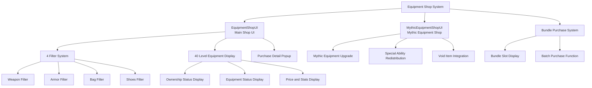

# Feature Guide - Shop System - Equipment Shop

## Overview
The Equipment Shop is a core shop system where players can purchase various weapons, armor, bags, and shoes. It provides 40 levels of equipment, and includes various features such as type-based filtering, bundle purchasing, and mythic equipment systems.

## Equipment Shop System Structure

### System Architecture


## Related File Paths

### Equipment Shop Core Components
```
RootDesk/MyDesk/Components/Town/EquipmentShop/
├── EquipmentShopUI.mlua              # Main equipment shop UI
├── EquipmentShopUI.codeblock         # Equipment shop visual scripting
├── EquipmentShopSlotButton.mlua      # Equipment slot button handling
├── EquipmentShopSlotButton.codeblock # Equipment slot button visual
├── EquipmentShopBundleSlotButton.mlua # Bundle slot button
├── EquipmentShopBundleSlotButton.codeblock # Bundle slot visual
├── MythicEquipmentShopUI.mlua        # Mythic equipment shop
├── MythicEquipmentShopUI.codeblock   # Mythic equipment visual
├── MythicEquipmentShopUI_RedistributionCheckPopup_CheckButton.mlua # Redistribution confirm button
└── MythicEquipmentShopUI_RedistributionCheckPopup_CheckButton.codeblock # Redistribution confirm visual
```

### Equipment Shop Related UI
```
ui/
└── EquipShopGroup.ui                 # Equipment shop UI group
```

### Equipment Data Tables
```
RootDesk/MyDesk/DataSets/
├── Equipment.csv                     # Equipment basic info and prices
├── Equipment.userdataset             # Equipment dataset
├── EquipmentAvatar.csv               # Equipment avatar/icon RUID
├── EquipmentAvatar.userdataset       # Equipment avatar dataset
├── MythicEquipment.csv               # Mythic equipment info (estimated)
└── VoidItems.csv                     # Void items (mythic equipment integration)
```

## EquipmentShopUI System Detailed Analysis

### Core Data Structure
```lua
@Component
script EquipmentShopUI extends Component

    property number filterIdx = 1                    -- Current filter (1:weapon, 2:armor, 3:bag, 4:shoes)
    property Entity EquipmentGuidePanel = "GUID"    -- Guide panel reference
    property number recentBuyIndex = 0               -- Recently purchased equipment index
    property number recentBuyType = 0                -- Recently purchased equipment type
    property number beforeAbility1 = 0               -- Ability 1 before purchase
    property number beforeAbility2 = 0               -- Ability 2 before purchase
    property SyncTable<boolean> oneshot_checked      -- Bundle purchase check state
    property boolean IsPlayingDirection = false      -- Purchase animation playing
```

### UI Initialization System
```lua
@ExecSpace("ClientOnly")
method void OnBeginPlay()
    -- 1. Set localization texts
    local EquipShopFilterList = _EntityService:GetEntityByPath("/ui/EquipShopGroup/EquipShop/Panel/FilterList")
    for i=1, 4 do
        EquipShopFilterList:GetChildByName("Filter_"..tostring(i)).TextComponent.Text = 
            _LocalizationService:GetText("EquipType_"..tostring(i))
    end
    
    -- Common UI text localization
    local itemSlot = _EntityService:GetEntityByPath("/ui/EquipShopGroup/EquipShop/Panel/ListPanel/Slot")
    itemSlot:GetChildByName("HavingItem"):GetChildByName("text").TextComponent.Text = 
        _LocalizationService:GetText("Possession")
    itemSlot:GetChildByName("EquipedItem").TextComponent.Text = 
        _LocalizationService:GetText("Equiped")
    
    -- Detail popup texts
    _EntityService:GetEntityByPath("/ui/EquipShopGroup/EquipShop/DetailInfoPopup/Panel/Ability/UIText")
        .TextComponent.Text = _LocalizationService:GetText("EquipedAbility_Title3")
    _EntityService:GetEntityByPath("/ui/EquipShopGroup/EquipShop/DetailInfoPopup/Panel/CostPanel/UIText")
        .TextComponent.Text = _LocalizationService:GetText("PurchasePrice")
    
    -- 2. Create equipment slots (40)
    local slotEntity = _EntityService:GetEntityByPath("/ui/EquipShopGroup/EquipShop/Panel/ListPanel/Slot")
    for i=1, 40 do
        slotEntity:Clone("Slot_"..tostring(i))
    end
    
    -- 3. Create bundle purchase slots
    local equipmentTable = _DataService:GetTable("Equipment")
    local bundleSlot = _EntityService:GetEntityByPath("/ui/EquipShopGroup/EquipShop/BundlePurchasePopup/Panel/ListPanel/Slot")
    
    for i=1, 40 do
        local clonedSlot = bundleSlot:Clone("Slot_"..tostring(i))
        
        -- Display bundle slot price
        clonedSlot:GetChildByName("MoneyPanel"):GetChildByName("Num").TextComponent.Text = 
            _ThousandsSeparator:ConvertToMetricPrefixString(tonumber(equipmentTable:GetCell(i, 1)))
        
        self.oneshot_checked[i] = false  -- Initialize bundle check state
    end
    
    -- 4. Basic settings
    self:ChangeFilter(1)  -- Start with weapon filter
    self:RefreshUI()
end
```

### Filter System
```lua
method void ChangeFilter(number newFilterIdx)
    self.filterIdx = newFilterIdx
    
    -- Update filter button UI
    local filterList = _EntityService:GetEntityByPath("/ui/EquipShopGroup/EquipShop/Panel/FilterList")
    for i=1, 4 do
        local filterButton = filterList:GetChildByName("Filter_"..tostring(i))
        if i == newFilterIdx then
            filterButton.SpriteGUIRendererComponent.Color = Color.yellow  -- Selected filter
        else
            filterButton.SpriteGUIRendererComponent.Color = Color.white   -- Default color
        end
    end
    
    -- Refresh UI
    self:RefreshUI()
end

-- Filter type classification
-- 1: Weapon
-- 2: Armor 
-- 3: Bag
-- 4: Shoes
```

### Equipment List Display System
```lua
@ExecSpace("Client") 
method void RefreshUI_Inner()
    local userData = _UserService.LocalPlayer.PlayerData
    
    -- 1. Display player gold
    local moneyNumUI = _EntityService:GetEntityByPath("/ui/EquipShopGroup/EquipShop/Panel/MoneyPanel/Num")
    moneyNumUI.TextComponent.Text = _ThousandsSeparator:ConvertToMetricPrefixString(userData.Money)
    
    -- 2. Update equipment list
    local itemListPanel = _EntityService:GetEntityByPath("/ui/EquipShopGroup/EquipShop/Panel/ListPanel")
    local equipmentTable = _DataService:GetTable("Equipment")
    local ruidTable = _DataService:GetTable("EquipmentAvatar")
    local equipedSlotIdx = userData.equiped[self.filterIdx]  -- Currently equipped equipment
    
    for i=1, 40 do
        local slot = itemListPanel:GetChildByName("Slot_"..tostring(i))
        
        -- 3. Set RUID and icon by filter
        local ruid = ""
        if self.filterIdx == 1 then      -- Weapon
            ruid = "thumbnail://"..ruidTable:GetCell(i+1, 1)
        elseif self.filterIdx == 2 then  -- Armor
            ruid = "thumbnail://"..ruidTable:GetCell(i+1, 5)
        elseif self.filterIdx == 3 then  -- Bag
            ruid = ruidTable:GetCell(i+1, 7)
        elseif self.filterIdx == 4 then  -- Shoes
            ruid = "thumbnail://"..ruidTable:GetCell(i+1, 6)
        end
        
        -- 4. Update slot UI
        slot:GetChildByName("Icon").SpriteGUIRendererComponent.ImageRUID = ruid
        
        -- Equipment name and level
        slot:GetChildByName("Name").TextComponent.Text = 
            _LocalizationService:GetText("EquipType_"..self.filterIdx).." Lv."..i
        
        -- Price display
        local cost = tonumber(equipmentTable:GetCell(i, 1))
        slot:GetChildByName("Price").TextComponent.Text = 
            _ThousandsSeparator:ConvertToMetricPrefixString(cost)
        
        -- 5. Display ownership/equipment status
        local haveEquipment = userData.haveEquipment
        local equipmentIdx = 40 * (self.filterIdx - 1) + i
        
        if haveEquipment[equipmentIdx] == true then
            -- Owned
            slot:GetChildByName("HavingItem").Enable = true
            slot:GetChildByName("Icon").SpriteGUIRendererComponent.Color = Color.white
            
            if equipedSlotIdx == i then
                -- Currently equipped
                slot:GetChildByName("EquipedItem").Enable = true
                slot:GetChildByName("EquipedItem").TextComponent.Text = 
                    _LocalizationService:GetText("Equiped")
            else
                slot:GetChildByName("EquipedItem").Enable = false
            end
        else
            -- Not owned
            slot:GetChildByName("HavingItem").Enable = false
            slot:GetChildByName("EquipedItem").Enable = false
            slot:GetChildByName("Icon").SpriteGUIRendererComponent.Color = Color(0.5, 0.5, 0.5, 1)
        end
        
        -- 6. Purchasability (red display when insufficient gold)
        if userData.Money < cost then
            slot:GetChildByName("Price").TextComponent.FontColor = Color.red
        else
            slot:GetChildByName("Price").TextComponent.FontColor = Color.white
        end
    end
end
```

### Equipment Detail Information Popup
```lua
method void ShowDetailPopup(number slotIdx)
    local equipmentTable = _DataService:GetTable("Equipment")
    local userData = _UserService.LocalPlayer.PlayerData
    
    -- Activate detail popup
    local detailPopup = _EntityService:GetEntityByPath("/ui/EquipShopGroup/EquipShop/DetailInfoPopup")
    detailPopup.Enable = true
    
    -- Display equipment information
    local equipmentIdx = 40 * (self.filterIdx - 1) + slotIdx
    local cost = tonumber(equipmentTable:GetCell(slotIdx, 1))
    
    -- Set icon
    local iconUI = detailPopup:GetChildByName("Panel/Icon")
    local ruidTable = _DataService:GetTable("EquipmentAvatar")
    local ruid = self:GetEquipmentRUID(slotIdx, self.filterIdx, ruidTable)
    iconUI.SpriteGUIRendererComponent.ImageRUID = ruid
    
    -- Name and level
    detailPopup:GetChildByName("Panel/Name").TextComponent.Text = 
        _LocalizationService:GetText("EquipType_"..self.filterIdx).." Lv."..slotIdx
    
    -- Ability information
    local ability1, ability2 = self:CalculateEquipmentAbility(slotIdx, self.filterIdx)
    detailPopup:GetChildByName("Panel/Ability/Ability1").TextComponent.Text = 
        string.format("+%s", _ThousandsSeparator:ConvertToMetricPrefixString(ability1))
    detailPopup:GetChildByName("Panel/Ability/Ability2").TextComponent.Text = 
        string.format("+%s", _ThousandsSeparator:ConvertToMetricPrefixString(ability2))
    
    -- Price
    detailPopup:GetChildByName("Panel/CostPanel/Cost").TextComponent.Text = 
        _ThousandsSeparator:ConvertToMetricPrefixString(cost)
    
    -- Purchase button state
    local buyButton = detailPopup:GetChildByName("Panel/Button_Buy")
    if userData.haveEquipment[equipmentIdx] == true then
        buyButton.ButtonComponent.Enable = false
        buyButton:GetChildByName("Title").TextComponent.Text = 
            _LocalizationService:GetText("Owned")
    elseif userData.Money < cost then
        buyButton.ButtonComponent.Enable = false  
        buyButton:GetChildByName("Title").TextComponent.Text = 
            _LocalizationService:GetText("InsufficientFunds")
    else
        buyButton.ButtonComponent.Enable = true
        buyButton:GetChildByName("Title").TextComponent.Text = 
            _LocalizationService:GetText("Purchase")
    end
end
```

### Equipment Ability Calculation
```lua
method number, number CalculateEquipmentAbility(number level, number type)
    -- Equipment type-specific ability calculation formula
    local baseAbility1, baseAbility2 = 0, 0
    
    if type == 1 then  -- Weapon
        -- Attack power, mining power
        baseAbility1 = level * 100 + math.pow(level, 1.5) * 50
        baseAbility2 = level * 80 + math.pow(level, 1.3) * 30
        
    elseif type == 2 then  -- Armor  
        -- Defense, health
        baseAbility1 = level * 80 + math.pow(level, 1.4) * 40
        baseAbility2 = level * 120 + math.pow(level, 1.6) * 60
        
    elseif type == 3 then  -- Bag
        -- Inventory capacity, luck
        baseAbility1 = level * 5  -- Slot count
        baseAbility2 = level * 2  -- Luck bonus
        
    elseif type == 4 then  -- Shoes
        -- Movement speed, jump power
        baseAbility1 = level * 3  -- Movement speed %
        baseAbility2 = level * 2  -- Jump power %
    end
    
    return baseAbility1, baseAbility2
end
```

### Equipment Purchase System
```lua
method void PurchaseEquipment(number slotIdx)
    local equipmentIdx = 40 * (self.filterIdx - 1) + slotIdx
    local cost = tonumber(_DataService:GetTable("Equipment"):GetCell(slotIdx, 1))
    local userData = _UserService.LocalPlayer.PlayerData
    
    -- Purchase validation
    if userData.haveEquipment[equipmentIdx] == true then
        _UIToast:ShowMessage(_LocalizationService:GetText("AlreadyOwned"))
        return
    end
    
    if userData.Money < cost then
        _UIToast:ShowMessage(_LocalizationService:GetText("InsufficientFunds"))
        return
    end
    
    -- Process purchase (request to server)
    userData:AddEquipment(self.filterIdx, slotIdx)
    
    -- Purchase success animation
    self:PlayPurchaseEffect(slotIdx, self.filterIdx)
    
    -- Refresh UI
    self:RefreshUI()
end
```

## Bundle Purchase System

### Bundle Purchase Popup
```lua
method void ShowBundlePurchasePopup()
    local bundlePopup = _EntityService:GetEntityByPath("/ui/EquipShopGroup/EquipShop/BundlePurchasePopup")
    bundlePopup.Enable = true
    
    -- Display all equipment of current filter as bundle
    local equipmentTable = _DataService:GetTable("Equipment")
    local userData = _UserService.LocalPlayer.PlayerData
    local totalCost = 0
    local purchasableCount = 0
    
    for i=1, 40 do
        local equipmentIdx = 40 * (self.filterIdx - 1) + i
        local cost = tonumber(equipmentTable:GetCell(i, 1))
        
        if userData.haveEquipment[equipmentIdx] ~= true then
            totalCost = totalCost + cost
            purchasableCount = purchasableCount + 1
        end
    end
    
    -- Display bundle information
    bundlePopup:GetChildByName("Panel/TotalCost").TextComponent.Text = 
        _ThousandsSeparator:ConvertToMetricPrefixString(totalCost)
    bundlePopup:GetChildByName("Panel/ItemCount").TextComponent.Text = 
        string.format("%d equipment pieces", purchasableCount)
end

method void PurchaseBundle()
    local userData = _UserService.LocalPlayer.PlayerData
    local equipmentTable = _DataService:GetTable("Equipment")
    local totalCost = 0
    local purchaseList = {}
    
    -- Create list of purchasable equipment
    for i=1, 40 do
        local equipmentIdx = 40 * (self.filterIdx - 1) + i
        if userData.haveEquipment[equipmentIdx] ~= true then
            local cost = tonumber(equipmentTable:GetCell(i, 1))
            totalCost = totalCost + cost
            table.insert(purchaseList, {idx = i, cost = cost})
        end
    end
    
    -- Check gold
    if userData.Money < totalCost then
        _UIToast:ShowMessage(_LocalizationService:GetText("InsufficientFunds"))
        return
    end
    
    -- Execute bundle purchase
    for _, item in ipairs(purchaseList) do
        userData:AddEquipment(self.filterIdx, item.idx)
    end
    
    -- Bundle purchase success message
    _UIToast:ShowMessage(string.format("Bundle purchase complete! Acquired %d equipment pieces", #purchaseList))
    
    self:RefreshUI()
end
```

## MythicEquipmentShopUI - Mythic Equipment System

### Mythic Equipment Structure
```lua
@Component
script MythicEquipmentShopUI extends Component

    property number filterIdx = 1                     -- Mythic equipment type
    property SyncTable<boolean> redistributionChecked -- Redistribution check state
    property number upgradeLevel = 0                  -- Upgrade level
    property boolean IsPlayingDirection = false       -- Upgrade animation playing
    property Entity beadsDetailInfoPanel = "GUID"    # Bead detail info panel
```

### Mythic Equipment Upgrade System
```lua
method void RefreshUI()
    local level = _UserService.LocalPlayer.PlayerMythicEquipment.EquipmentLevel[self.filterIdx]
    
    -- Mythic equipment icon and information
    local icon = {
        "thumbnail://a062c5e53c6f45b3994d1e688cd73ea3",  -- Mythic weapon
        "thumbnail://52a6839f290e431fbe29764bfbadae10",  -- Mythic armor
        "067d97e8224f4e49bdcebc3dbd0570a2",             -- Mythic bag
        "thumbnail://7967810b0e1a438ba6525116e537a0ba"   -- Mythic shoes
    }
    
    local abilityTitle = {"8001", "8002", "8003", "8005"}  -- Ability titles
    local abilityAmount = {30000000, 2500000, 3000000000, 30}  -- Base abilities
    
    -- Calculate level up cost (increases with level)
    local levelupCost = 150000000000 * (1 + 0.6 * level)
    
    -- Void item 20: Mythic equipment level up cost reduction
    local voidItemLv = _UserService.LocalPlayer.PlayerVoidItem.haveItems[20]
    if voidItemLv > 0 then
        local voidItemTable = _DataService:GetTable("VoidItems")
        local costReduction = tonumber(voidItemTable:GetCell(20, "InitAbility"))
        levelupCost = levelupCost * (1 - costReduction / 100)
    end
    
    -- Update mythic equipment UI
    self:UpdateMythicEquipmentUI(level, levelupCost)
end
```

### Ability Redistribution System
```lua
method void ShowRedistributionPopup()
    local redistributionPopup = _EntityService:GetEntityByPath(
        "/ui/EquipShopGroup/MythicEquipmentShop/RedistributionCheckPopup")
    redistributionPopup.Enable = true
    
    -- Display 8 ability options
    local abilityOptions = {
        "Attack Power", "Defense", "Health", "Mana", 
        "Mining Power", "Movement Speed", "Luck", "Experience"
    }
    
    for i=1, 8 do
        local optionSlot = redistributionPopup:GetChildByName("Panel/Option_"..i)
        optionSlot:GetChildByName("Name").TextComponent.Text = abilityOptions[i]
        optionSlot:GetChildByName("CheckBox").ButtonComponent.Enable = true
    end
end

method void ApplyRedistribution()
    local selectedAbilities = {}
    
    -- Collect selected abilities
    for i=1, 8 do
        if self.redistributionChecked[i] then
            table.insert(selectedAbilities, i)
        end
    end
    
    if #selectedAbilities == 0 then
        _UIToast:ShowMessage("Please select abilities to redistribute.")
        return
    end
    
    -- Calculate redistribution cost
    local redistributionCost = 1000000000 * #selectedAbilities
    local userData = _UserService.LocalPlayer.PlayerData
    
    if userData.Money < redistributionCost then
        _UIToast:ShowMessage("Insufficient gold.")
        return
    end
    
    -- Execute redistribution
    _UserService.LocalPlayer.PlayerMythicEquipment:RedistributeAbilities(
        self.filterIdx, selectedAbilities)
    
    userData:UseMoney(redistributionCost)
    
    _UIToast:ShowMessage("Ability redistribution completed.")
    self:RefreshUI()
end
```

## Equipment Purchase Animation System

### Purchase Effect Animation
```lua
method void PlayPurchaseEffect(number slotIdx, number equipType)
    self.IsPlayingDirection = true
    
    -- Compare abilities before and after purchase
    local beforeAbility1 = self.beforeAbility1
    local beforeAbility2 = self.beforeAbility2
    local afterAbility1, afterAbility2 = self:CalculateEquipmentAbility(slotIdx, equipType)
    
    -- Display ability increase
    local abilityIncreasePopup = _EntityService:GetEntityByPath("/ui/EquipShopGroup/EquipShop/AbilityIncreasePopup")
    abilityIncreasePopup.Enable = true
    
    -- Increase animation
    local increase1 = afterAbility1 - beforeAbility1
    local increase2 = afterAbility2 - beforeAbility2
    
    self:ShowAbilityIncreaseAnimation(increase1, increase2)
    
    -- Purchase success sound
    _SoundService:PlaySound("purchase_success_sound_ruid", 0.8)
    
    -- End animation after 3 seconds
    local endDirection = function()
        self.IsPlayingDirection = false
        abilityIncreasePopup.Enable = false
    end
    _TimerService:SetTimerOnce(endDirection, 3.0)
end

method void ShowAbilityIncreaseAnimation(number increase1, number increase2)
    local animationPanel = _EntityService:GetEntityByPath("/ui/EquipShopGroup/EquipShop/AbilityIncreasePopup")
    
    -- Set increase text
    animationPanel:GetChildByName("Ability1Increase").TextComponent.Text = 
        "+" .. _ThousandsSeparator:ConvertToMetricPrefixString(increase1)
    animationPanel:GetChildByName("Ability2Increase").TextComponent.Text = 
        "+" .. _ThousandsSeparator:ConvertToMetricPrefixString(increase2)
    
    -- Upward movement animation
    local startPos = animationPanel.UITransformComponent.LocalPosition
    local targetPos = Vector2(startPos.x, startPos.y + 100)
    
    local animationStep = function(frame)
        local progress = frame / 60.0  -- 1 second animation
        local currentPos = Vector2.Lerp(startPos, targetPos, progress)
        animationPanel.UITransformComponent.LocalPosition = currentPos
        
        -- Decrease alpha value
        local alpha = 1.0 - progress
        animationPanel.SpriteGUIRendererComponent.Color = Color(1, 1, 1, alpha)
    end
    
    for i=1, 60 do
        _TimerService:SetTimerOnce(function() animationStep(i) end, i/60)
    end
end
```

## Performance Optimization

### UI Update Optimization
```lua
-- Refresh UI only when necessary
@ExecSpace("ClientOnly")
method void OnUpdate(number delta)
    if self._T.refreshUI then
        self:RefreshUI_Inner()
        self._T.refreshUI = false
    end
end

-- Request refresh only when player data changes
method void OnPlayerDataChanged()
    self:RefreshUI()
end
```

### Memory Management
- Disable unused slots
- Cache equipment textures
- Prevent unnecessary updates during animations

## Expansion Possibilities

### Adding New Equipment Type
1. Add new equipment levels to **Equipment.csv**
2. Add icon RUID to **EquipmentAvatar.csv**
3. Add new type to filter system
4. Implement ability calculation formula

### Advanced Feature Extensions
```lua
-- Equipment comparison system
method void CompareEquipment(number currentEquip, number targetEquip)
    -- Display ability comparison between two equipment pieces
end

-- Equipment favorites system
method void AddToFavorites(number equipIdx)
    -- Manage favorite equipment
end

-- Equipment recommendation system
method table RecommendEquipment()
    -- Recommend equipment suitable for player level
end
```

## Common Problem Solving

### When Equipment Cannot Be Purchased
1. Check gold holdings
2. Check `PlayerData.AddEquipment` method execution permissions
3. Verify equipment index calculation formula

### When UI Doesn't Update
1. Check if `RefreshUI()` is called
2. Inspect player data synchronization state
3. Check UI entity reference paths

### When Abilities Aren't Calculated Correctly
1. Inspect `CalculateEquipmentAbility` formula
2. Check equipment type branching logic
3. Verify data table values

