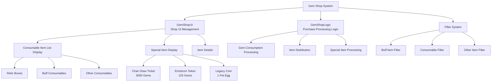

# Feature Guide - Shop System - Gem Shop

## Overview
The gem shop is a store system where players can purchase various consumables and special items using gems, the in-game premium currency. It offers a variety of convenience items and consumables that aid game progression, including relic boxes, buff items, chair draw tickets, emoticon tokens, and more.

## Gem Shop System Structure

### System Architecture


## Related File Paths

### Gem Shop Core Components
```
RootDesk/MyDesk/Components/Town/GemShop/
├── GemShopUI.mlua                    # Gem shop main UI management
├── GemShopUI.codeblock               # Gem shop UI visual scripting
├── GemShopLogic.mlua                 # Gem purchase processing logic
├── GemShopLogic.codeblock            # Gem logic visual scripting
├── GemShopUI_SlotButton.mlua         # Item slot button processing
└── GemShopUI_SlotButton.codeblock    # Item slot visual
```

### Gem Shop Related UI
```
ui/
└── GemShopGroup.ui                   # Gem shop UI group
```

### Gem Shop Data Tables
```
RootDesk/MyDesk/DataSets/
├── ConsumableItems.csv               # Consumable item information (gem shop products)
├── ConsumableItems.userdataset       # Consumable dataset
├── Chair.csv                         # Chair information (for chair draws)
└── Chair.userdataset                 # Chair dataset
```

## GemShopUI System Detailed Analysis

### Core Data Structure
```lua
@Component
script GemShopUI extends Component

    property number filterIdx = 1         -- Current filter (1:Buff, 2:Consumable, 3:Other)
    property number showingSlotIdx = 0     -- Selected slot index
```

### UI Initialization and Product List Creation
```lua
@ExecSpace("ClientOnly")
method void OnBeginPlay()
    local consumableItemsTable = _DataService:GetTable("ConsumableItems")
    
    -- Create consumable item list slots
    local listPanel = _EntityService:GetEntityByPath("/ui/GemShopGroup/GemShop/Panel/Img_ListPanel_bg/ListPanel")
    
    for i=1, consumableItemsTable:GetRowCount() do
        local slot = listPanel:GetChildByName("Slot_"..tostring(i))
        
        if slot == nil then
            -- Create new slot if none exists
            slot = listPanel:GetChildByName("Slot"):Clone("Slot_"..tostring(i))
            slot:GetChildByName("HavingItem").Enable = false  -- Disable owned item display
        end
        
        -- Load product data
        local data = consumableItemsTable:GetRow(i)
        local name = data:GetItem("Name")
        local iconBack = data:GetItem("iconbackRUID")
        local icon = data:GetItem("IconRUID") 
        local price = data:GetItem("Price")
        local filterType = data:GetItem("FilterType")
        
        -- Set slot UI
        slot:GetChildByName("ItemName").TextComponent.Text = _LocalizationService:GetText(name)
        slot:GetChildByName("MoneyPanel"):GetChildByName("Num").TextComponent.Text = price
        
        -- Set icon
        if iconBack ~= "" then
            slot:GetChildByName("Bg_Icon").SpriteGUIRendererComponent.ImageRUID = iconBack
        end
        slot:GetChildByName("Bg_Icon"):GetChildByName("Icon").SpriteGUIRendererComponent.ImageRUID = icon
        
        -- Hide items that don't match the filter
        if self.filterIdx ~= tonumber(filterType) then
            slot.Enable = false
        end
    end
end
```

### Filter System
```lua
@ExecSpace("Client")
method void RefreshUI()
    local consumableItemsTable = _DataService:GetTable("ConsumableItems")
    
    -- 1. Regular consumable filtering
    local listPanel = _EntityService:GetEntityByPath("/ui/GemShopGroup/GemShop/Panel/Img_ListPanel_bg/ListPanel")
    
    for i=1, consumableItemsTable:GetRowCount() do
        local slot = listPanel:GetChildByName("Slot_"..tostring(i))
        local type = consumableItemsTable:GetCell(i, "FilterType")
        
        -- Show only items matching the filter
        if tonumber(type) ~= self.filterIdx then
            slot.Enable = false
        else
            slot.Enable = true
        end
        
        -- Highlight selected slot
        if i == self.showingSlotIdx then
            slot.SpriteGUIRendererComponent.Color = Color.FromHexCode("#53EDFF")
        else
            slot.SpriteGUIRendererComponent.Color = Color.white
        end
    end
    
    -- 2. Special item filtering (only shown in Other filter)
    for i=1, 3 do
        local specialSlot = listPanel:GetChildByName("Slot_Special_"..tostring(i))
        
        if self.filterIdx == 3 then  -- Other filter
            specialSlot.Enable = true
            
            -- Highlight selected special slot
            if i == (-1 * self.showingSlotIdx) then
                specialSlot.SpriteGUIRendererComponent.Color = Color.FromHexCode("#53EDFF")
            else
                specialSlot.SpriteGUIRendererComponent.Color = Color.white
            end
        else
            specialSlot.Enable = false
        end
    end
end

-- Filter type definitions
-- 1: Buff items (EXP, Gold, Mining power boosters, etc.)
-- 2: Consumables (Recovery items, Special tools, etc.)
-- 3: Other (Chair draws, Emoticon tokens, Legacy coins, etc.)
```

### Product Detail Information Display
```lua
method void ShowDetailInfo(number idx)
    local detailPanel = _EntityService:GetEntityByPath("/ui/GemShopGroup/GemShop/DetailInfoPopup")
    detailPanel.Enable = true
    
    if idx > 0 then
        -- Regular consumables
        local consumableItemsTable = _DataService:GetTable("ConsumableItems")
        local data = consumableItemsTable:GetRow(idx)
        
        -- Display product information
        local name = data:GetItem("Name")
        local desc = data:GetItem("Desc")
        local price = data:GetItem("Price")
        local icon = data:GetItem("IconRUID")
        
        detailPanel:GetChildByName("Panel/ItemName").TextComponent.Text = 
            _LocalizationService:GetText(name)
        detailPanel:GetChildByName("Panel/Description").TextComponent.Text = 
            _LocalizationService:GetText(desc)
        detailPanel:GetChildByName("Panel/Price/Amount").TextComponent.Text = price
        detailPanel:GetChildByName("Panel/Icon").SpriteGUIRendererComponent.ImageRUID = icon
        
    else
        -- Special items
        self:ShowSpecialItemInfo(idx, detailPanel)
    end
    
    -- Display gem holdings
    local playerGems = _UserService.LocalPlayer.PlayerStorage.currencyItems[2]
    detailPanel:GetChildByName("Panel/PlayerGems/Amount").TextComponent.Text = 
        string.format("Owned Gems: %s", _ThousandsSeparator:ConvertToMetricPrefixString(playerGems))
    
    self.showingSlotIdx = idx
end

method void ShowSpecialItemInfo(number idx, Entity detailPanel)
    if idx == -1 then
        -- Chair draw ticket (3000 gems)
        detailPanel:GetChildByName("Panel/ItemName").TextComponent.Text = 
            _LocalizationService:GetText("DailyReward_NewChair")
        detailPanel:GetChildByName("Panel/Description").TextComponent.Text = 
            "Obtain a random new chair. If all chairs are owned, advanced relic box will be provided."
        detailPanel:GetChildByName("Panel/Price/Amount").TextComponent.Text = "3000"
        
    elseif idx == -2 then
        -- Emoticon token (125 gems)
        detailPanel:GetChildByName("Panel/ItemName").TextComponent.Text = 
            _LocalizationService:GetText("CurrencyItemName_4")
        detailPanel:GetChildByName("Panel/Description").TextComponent.Text = 
            "Obtain 1 token that can be used to purchase emoticons."
        detailPanel:GetChildByName("Panel/Price/Amount").TextComponent.Text = "125"
        
    elseif idx == -3 then
        -- Legacy coin (consumes 1 pet egg)
        detailPanel:GetChildByName("Panel/ItemName").TextComponent.Text = 
            _LocalizationService:GetText("CurrencyItemName_7")
        detailPanel:GetChildByName("Panel/Description").TextComponent.Text = 
            "Consume 1 pet egg to obtain 1500 legacy coins."
        detailPanel:GetChildByName("Panel/Price/Amount").TextComponent.Text = "1 Pet Egg"
    end
end
```

## GemShopLogic - Purchase Processing System

### Item Purchase Logic
```lua
@Logic
script GemShopLogic extends Logic

    @ExecSpace("Server")
    method void BuyItem(number idx, Entity player)
        if idx > 0 then
            -- Regular consumable purchase
            self:BuyConsumableItem(idx, player)
        else
            -- Special item purchase
            self:BuySpecialItem(idx, player)
        end
        
        -- Save data after purchase
        player.PlayerData:SaveData(1)
    end
```

### Regular Consumable Purchase
```lua
method void BuyConsumableItem(number idx, Entity player)
    local consumableItemTable = _DataService:GetTable("ConsumableItems")
    local cost = tonumber(consumableItemTable:GetCell(idx, "Price"))
    local name = consumableItemTable:GetCell(idx, "Name")
    
    -- Check gem holdings
    if player.PlayerStorage.currencyItems[2] < cost then
        log("Insufficient gems: Required=" .. cost .. ", Owned=" .. player.PlayerStorage.currencyItems[2])
        return
    end
    
    -- Deduct gems
    player.PlayerStorage:UseCurrencyItems(2, cost)
    
    -- Give items
    if idx < 3 then
        -- 1-2: Relic boxes
        player.PlayerRelic:GetRelicBox(idx)
    else
        -- 3+: Regular consumables
        player.PlayerStorage:AddConsumableItems(idx, 1)
    end
    
    -- Purchase completion message
    _CustomLocalizationLogic:SendLocalizedFormattedToastMessageFromServer(
        "Message_PurchasedItem", {name}, player.OwnerId)
end
```

### Special Item Purchase
```lua
method void BuySpecialItem(number idx, Entity player)
    if idx == -1 then
        -- Chair draw ticket (3000 gems)
        local cost = 3000
        if player.PlayerStorage.currencyItems[2] < cost then
            log("Insufficient gems!")
            return
        end
        
        player.PlayerStorage:UseCurrencyItems(2, cost)
        self:GetNewChair(player)
        _CustomLocalizationLogic:SendLocalizedFormattedToastMessageFromServer(
            "Message_PurchasedItem", {"DailyReward_NewChair"}, player.OwnerId)
            
    elseif idx == -2 then
        -- Emoticon token (125 gems)
        local cost = 125
        if player.PlayerStorage.currencyItems[2] < cost then
            log("Insufficient gems!")
            return
        end
        
        player.PlayerStorage:UseCurrencyItems(2, cost)
        player.PlayerEmoticon.EmotToken = player.PlayerEmoticon.EmotToken + 1
        _CustomLocalizationLogic:SendLocalizedFormattedToastMessageFromServer(
            "Message_PurchasedItem", {"CurrencyItemName_4"}, player.OwnerId)
            
    elseif idx == -3 then
        -- Legacy coin (1 pet egg → 1500 legacy coins)
        local cost = 1
        if player.PlayerData.PetEgg < cost then
            log("Insufficient pet eggs!")
            return
        end
        
        player.PlayerData.PetEgg = player.PlayerData.PetEgg - 1
        player.PlayerStorage:AddCurrencyItems(7, 1500, true)  -- Give 1500 legacy coins
        _CustomLocalizationLogic:SendLocalizedFormattedToastMessageFromServer(
            "Message_PurchasedItem", {"CurrencyItemName_7"}, player.OwnerId)
    end
end
```

### Chair Draw System
```lua
@ExecSpace("Server")
method void GetNewChair(Entity player)
    local chairData = _DataService:GetTable("Chair")
    local targetTable = {}
    
    -- Create list of unowned chairs
    for i=1, chairData:GetRowCount() do
        if player.PlayerChair.haveItem[i] == false then
            table.insert(targetTable, i)
        end
    end
    
    if #targetTable == 0 then
        -- Give advanced relic box if all chairs are owned
        _CustomLocalizationLogic:SendLocalizedToastMessageFromServer(
            "Message_Daily_ReceivedHRRBoxBecauseHaveAllChairs", player.OwnerId)
        player.PlayerRelic:GetRelicBox(2)  -- Advanced relic box
    else
        -- Give random new chair
        local randomIdx = _UtilLogic:RandomIntegerRange(1, #targetTable)
        local selectedChairIdx = targetTable[randomIdx]
        player.PlayerChair:GetChair(selectedChairIdx)
    end
end
```

## Gem Shop Product Classification

### Buff Items (FilterType: 1)
```csv
ID,Name,Desc,Price,FilterType,Duration,EffectType
1,Exp_Booster_30min,Exp_Booster_Desc,500,1,1800,ExpMultiplier
2,Gold_Booster_10min,Gold_Booster_Desc,300,1,600,GoldMultiplier
3,Mining_Booster_30min,Mining_Booster_Desc,400,1,1800,MiningSpeedBonus
```

### Relic Boxes (FilterType: 2)
```csv
ID,Name,Desc,Price,FilterType,BoxType
4,Basic_Relic_Box,Basic_Relic_Box_Desc,100,2,1
5,Advanced_Relic_Box,Advanced_Relic_Box_Desc,300,2,2
```

### Special Items (Negative Indices)
- **-1**: Chair draw ticket (3000 gems)
- **-2**: Emoticon token (125 gems)  
- **-3**: Legacy coin exchange (1 pet egg → 1500 legacy coins)

## Gem Acquisition Methods

### Gem Purchase System
```lua
-- Gem purchase through real currency (hypothetical implementation)
method void PurchaseGems(number gemPackage)
    local gemPackages = {
        {gems = 100, price = 0.99},    -- Small package
        {gems = 500, price = 4.99},    -- Regular package  
        {gems = 1200, price = 9.99},   -- Popular package
        {gems = 2500, price = 19.99},  -- Large package
        {gems = 6000, price = 49.99}   -- Extra large package
    }
    
    -- Actual payment processing logic
    self:ProcessPayment(gemPackages[gemPackage])
end
```

### Free Gem Acquisition
- **Daily Rewards**: Small amount of gems given on daily login
- **Achievement Completion**: Gem rewards for specific achievement completions
- **Events**: Gem distribution through special events
- **Ad Viewing**: Gem rewards after watching ads (implementable)

## UI Interaction System

### Slot Button Processing
```lua
@Component
script GemShopUI_SlotButton extends Component

    @EventSender("Self")
    handler HandleButtonClickEvent(ButtonClickEvent event)
        local idx = 0
        
        -- Parse slot index
        if string.sub(self.Entity.Name, 1, 12) == "Slot_Special" then
            -- Special item: Slot_Special_1 → idx = -1
            idx = (-1) * tonumber(string.sub(self.Entity.Name, 14, -1))
        else
            -- Regular item: Slot_1 → idx = 1
            idx = tonumber(string.sub(self.Entity.Name, 6, -1))
        end
        
        -- Show detailed information
        _EntityService:GetEntityByPath("/ui/GemShopGroup/GemShop").GemShopUI:ShowDetailInfo(idx)
    end
```

### Purchase Confirmation Popup
```lua
method void ShowPurchaseConfirmation(number idx)
    local confirmPopup = _EntityService:GetEntityByPath("/ui/GemShopGroup/GemShop/PurchaseConfirmPopup")
    confirmPopup.Enable = true
    
    -- Display purchase information
    local itemName, cost = self:GetItemInfo(idx)
    
    confirmPopup:GetChildByName("Panel/ItemName").TextComponent.Text = itemName
    confirmPopup:GetChildByName("Panel/Cost").TextComponent.Text = 
        string.format("%s Gems", _ThousandsSeparator:ConvertToMetricPrefixString(cost))
    
    -- Set purchase button event
    local buyButton = confirmPopup:GetChildByName("Panel/BuyButton")
    buyButton.ButtonComponent:ClearAllEvents()
    buyButton.ButtonComponent.OnClick:Connect(function()
        self:ConfirmPurchase(idx)
    end)
end

method void ConfirmPurchase(number idx)
    -- Send purchase request to server
    _GemShopLogic:BuyItem(idx, _UserService.LocalPlayer)
    
    -- Close confirmation popup
    local confirmPopup = _EntityService:GetEntityByPath("/ui/GemShopGroup/GemShop/PurchaseConfirmPopup")
    confirmPopup.Enable = false
    
    -- Refresh UI
    self:RefreshUI()
end
```

## Consumable Effect System

### Buff Item Usage
```lua
-- Consumable item usage implemented in PlayerStorage.mlua
method void UseConsumableItem(number itemIdx)
    if self.consumableItems[itemIdx] <= 0 then
        _UIToast:ShowMessage("No items owned.")
        return
    end
    
    -- Deduct item
    self.consumableItems[itemIdx] = self.consumableItems[itemIdx] - 1
    
    -- Apply buff effect
    local consumableTable = _DataService:GetTable("ConsumableItems")
    local effectType = consumableTable:GetCell(itemIdx, "EffectType")
    local duration = tonumber(consumableTable:GetCell(itemIdx, "Duration"))
    
    if effectType == "ExpMultiplier" then
        -- EXP booster
        self:ApplyExpBoost(2.0, duration)  -- 2x EXP, specified duration
    elseif effectType == "GoldMultiplier" then
        -- Gold booster
        self:ApplyGoldBoost(1.5, duration)  -- 1.5x Gold
    elseif effectType == "MiningSpeedBonus" then
        -- Mining speed booster
        self:ApplyMiningSpeedBoost(0.5, duration)  -- 50% mining time reduction
    end
end
```

### Buff UI Display
```lua
method void UpdateBuffUI()
    local buffPanel = _EntityService:GetEntityByPath("/ui/InGameGroup/BuffPanel")
    
    -- Display active buff list
    local activeBuffs = self:GetActiveBuffs()
    for i, buff in ipairs(activeBuffs) do
        local buffSlot = buffPanel:GetChildByName("BuffSlot_"..i)
        
        -- Display buff icon and remaining time
        buffSlot:GetChildByName("Icon").SpriteGUIRendererComponent.ImageRUID = buff.iconRUID
        buffSlot:GetChildByName("Timer").TextComponent.Text = 
            self:FormatTime(buff.remainingTime)
    end
end
```

## Performance Optimization

### Product List Caching
```lua
-- Consumable item data caching
local cachedConsumableItems = {}

method void CacheConsumableItems()
    local consumableItemsTable = _DataService:GetTable("ConsumableItems")
    
    for i=1, consumableItemsTable:GetRowCount() do
        cachedConsumableItems[i] = {
            name = consumableItemsTable:GetCell(i, "Name"),
            price = tonumber(consumableItemsTable:GetCell(i, "Price")),
            iconRUID = consumableItemsTable:GetCell(i, "IconRUID"),
            filterType = tonumber(consumableItemsTable:GetCell(i, "FilterType"))
        }
    end
end
```

### UI Update Optimization
- Refresh list only when filter changes
- Update highlight only for selected slots
- Update buff timer UI every second

## Extensibility

### New Product Categories
```lua
-- Seasonal limited items
method void ShowSeasonalItems()
    -- Display limited-time special products
end

-- Bundle packages
method void ShowBundlePackages()
    -- Package products combining multiple items
end

-- VIP exclusive items
method void ShowVIPItems()
    -- VIP grade exclusive items
end
```

### Discount System
```lua
method number ApplyDiscount(number originalPrice, number itemIdx)
    -- Daily discounts, seasonal discounts, first purchase discounts, etc.
    local discountRate = self:GetDiscountRate(itemIdx)
    return math.floor(originalPrice * (1 - discountRate))
end
```

## Common Troubleshooting

### When Purchases Are Not Processing
1. Check gem holdings
2. Verify `GemShopLogic.BuyItem` server execution permissions
3. Inspect item index parsing logic

### When UI Is Not Displaying Correctly
1. Check `ConsumableItems.csv` data
2. Verify filter system logic
3. Check UI entity reference paths

### When Buffs Are Not Applied
1. Check `UseConsumableItem` method calls
2. Inspect buff effect application logic
3. Verify buff duration management system
