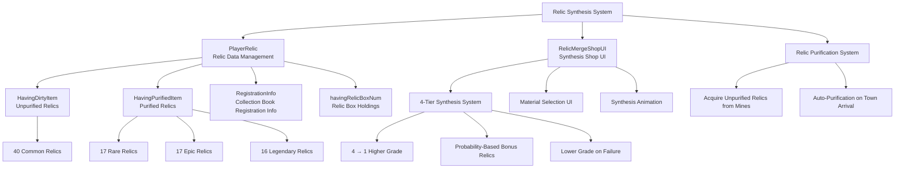

# Feature Guide - Shop System - Relic Synthesis

## Overview
The Relic Synthesis system is a core game mechanism that allows players to combine acquired relics to create higher-grade relics. It provides gradual growth through a 4-tier system (Common, Rare, Epic, Legendary) and includes various functions such as purification, synthesis, and collection book registration.

## Relic Synthesis System Structure

### System Architecture


## Related File Paths

### Relic Synthesis Core Components
```
RootDesk/MyDesk/Components/Player/Relic/
├── PlayerRelic.mlua                  # Relic data and synthesis logic
├── PlayerRelic.codeblock             # Relic system visual scripting
└── RelicBookUI.mlua                  # Relic collection book UI
```

### Relic Synthesis Shop
```
RootDesk/MyDesk/Components/Town/RelicMergeShop/
├── RelicMergeShopUI.mlua             # Relic synthesis shop main UI
├── RelicMergeShopUI.codeblock        # Relic synthesis shop visual
├── RelicMergeShopUI_MaterialButton.mlua # Material selection button
├── RelicMergeShopUI_MaterialButton.codeblock # Material selection visual
├── RelicMergeShopUI_MaterialSlotButton.mlua # Material slot button
└── RelicMergeShopUI_MaterialSlotButton.codeblock # Material slot visual
```

### Relic-Related UI
```
ui/
└── RelicMergeGroup.ui                # Relic synthesis shop UI group
```

### Relic Data Tables
```
RootDesk/MyDesk/DataSets/
├── Relic.csv                         # Basic relic information
├── Relic.userdataset                 # Relic dataset
├── RelicSet.csv                      # Relic set information (for collection book)
└── RelicSet.userdataset              # Relic set dataset
```

## PlayerRelic System Detailed Analysis

### Core Data Structure
```lua
@Component
script PlayerRelic extends Component

    property SyncTable<number> HavingDirtyItem        -- Unpurified relic holdings
    property SyncTable<number> HavingPurifiedItem     -- Purified relic holdings
    property SyncTable<boolean> RegistrationInfo      -- Collection book registration status
    property number ProbAcquiringBonusRelic = 0       -- Bonus relic acquisition probability
    
    @Sync
    property number relicBoxBuyingCount = 0           -- Relic box purchase count
    property SyncTable<number> havingRelicBoxNum      -- Relic box holdings
```

### Relic Grade System
```lua
-- Relic count definition by grade
local relicCount = {
    40,  -- Common relics (1-40)
    17,  -- Rare relics (41-57)
    17,  -- Epic relics (58-74)  
    16   -- Legendary relics (75-90)
}

-- Index range by grade
-- Common: 1 ~ 40
-- Rare: 41 ~ 57  
-- Epic: 58 ~ 74
-- Legendary: 75 ~ 90
```

### Relic Acquisition System
```lua
@ExecSpace("ServerOnly")
method void AddRelic(boolean isDirty, number idx)
    local amount = 1
    
    -- Apply bonus relic acquisition probability
    local randomValue = _UtilLogic:RandomDouble()
    if randomValue < self.ProbAcquiringBonusRelic then
        amount = 2
        _CustomLocalizationLogic:SendLocalizedToastMessageFromServer(
            "Message_Gain1MoreRelic", self.Entity.OwnerId)
    end
    
    if isDirty == true then
        -- Add unpurified relic (acquired from mines)
        self.HavingDirtyItem[idx] = self.HavingDirtyItem[idx] + amount
        self:SetTableElementClient("HavingDirtyItem", idx, 
            tostring(self.HavingDirtyItem[idx]), self.Entity.OwnerId)
    else
        -- Add purified relic (direct grant)
        self.HavingPurifiedItem[idx] = self.HavingPurifiedItem[idx] + amount
        self:SetTableElementClient("HavingPurifiedItem", idx, 
            tostring(self.HavingPurifiedItem[idx]), self.Entity.OwnerId)
    end
end
```

### Relic Purification System
```lua
@ExecSpace("Server")
method void Purifying()
    local count = 0
    
    -- Convert all unpurified relics to purified relics
    for i=1, _DataService:GetRowCount("Relic") do
        -- Initialization safety check
        if self.HavingDirtyItem[i] == nil then
            return
        end
        
        if self.HavingDirtyItem[i] > 0 then
            -- Transfer unpurified relics to purified relics
            self.HavingPurifiedItem[i] = self.HavingPurifiedItem[i] + self.HavingDirtyItem[i]
            count = count + self.HavingDirtyItem[i]
            self.HavingDirtyItem[i] = 0
            
            -- Client synchronization
            self:SetTableElementClient("HavingDirtyItem", i, 
                tostring(self.HavingDirtyItem[i]), self.Entity.OwnerId)
            self:SetTableElementClient("HavingPurifiedItem", i, 
                tostring(self.HavingPurifiedItem[i]), self.Entity.OwnerId)
        end
    end
    
    -- Purification completion message
    if count > 0 then
        _CustomLocalizationLogic:SendLocalizedFormattedToastMessageFromServer(
            "Message_PurifiedInTown", {count}, self.Entity.OwnerId)
        _TutorialGuide:AddCondition(8, self.Entity.OwnerId)
        _UIAlarmMarker:SetEnableMarker("relic", true, self.Entity.OwnerId)
    end
end
```

## Relic Synthesis Logic

### Manual Synthesis System
```lua
method number Merge(SyncTable<number> materials)
    local relicTable = _DataService:GetTable("Relic")
    local targetGrade = ""
    local targetRelicIdx = 0
    
    -- 1. Material validation
    for i=1, #materials do
        if materials[i] <= 0 then
            log("Invalid material index: " .. materials[i])
            return 0
        end
        
        -- Check material holdings
        if self.HavingPurifiedItem[materials[i]] <= 0 then
            log("Insufficient materials: " .. materials[i])
            return 0
        end
        
        -- Check material grade consistency
        local materialGrade = relicTable:GetCell(materials[i], "Grade")
        if i == 1 then
            targetGrade = materialGrade
        elseif targetGrade ~= materialGrade then
            log("Material grade mismatch")
            return 0
        end
    end
    
    -- 2. Consume materials
    for i=1, #materials do
        self.HavingPurifiedItem[materials[i]] = self.HavingPurifiedItem[materials[i]] - 1
        self:SetTableElementClient("HavingPurifiedItem", materials[i], 
            tostring(self.HavingPurifiedItem[materials[i]]), self.Entity.OwnerId)
    end
    
    -- 3. Calculate synthesis result
    local resultRelicIdx = self:CalculateMergeResult(targetGrade)
    
    -- 4. Grant result relic
    self.HavingPurifiedItem[resultRelicIdx] = self.HavingPurifiedItem[resultRelicIdx] + 1
    self:SetTableElementClient("HavingPurifiedItem", resultRelicIdx, 
        tostring(self.HavingPurifiedItem[resultRelicIdx]), self.Entity.OwnerId)
    
    return resultRelicIdx
end

method number CalculateMergeResult(string grade)
    local successRate = {
        ["Common"] = 0.7,     -- Common → Rare (70%)
        ["Rare"] = 0.5,       -- Rare → Epic (50%)  
        ["Epic"] = 0.3,       -- Epic → Legendary (30%)
        ["Legendary"] = 0.1   -- Legendary → ??? (10%)
    }
    
    local randomValue = _UtilLogic:RandomDouble()
    
    if grade == "Common" then
        if randomValue <= successRate["Common"] then
            -- Success: Rare relic (41-57)
            return _UtilLogic:RandomIntegerRange(41, 57)
        else
            -- Failure: Common relic (1-40) 
            return _UtilLogic:RandomIntegerRange(1, 40)
        end
    elseif grade == "Rare" then
        if randomValue <= successRate["Rare"] then
            -- Success: Epic relic (58-74)
            return _UtilLogic:RandomIntegerRange(58, 74)
        else
            -- Failure: Rare relic (41-57)
            return _UtilLogic:RandomIntegerRange(41, 57)
        end
    elseif grade == "Epic" then
        if randomValue <= successRate["Epic"] then
            -- Success: Legendary relic (75-90)
            return _UtilLogic:RandomIntegerRange(75, 90)
        else
            -- Failure: Epic relic (58-74)
            return _UtilLogic:RandomIntegerRange(58, 74)
        end
    elseif grade == "Legendary" then
        if randomValue <= successRate["Legendary"] then
            -- Success: Special legendary relic
            return _UtilLogic:RandomIntegerRange(87, 90)  -- Highest grade legendary
        else
            -- Failure: Normal legendary relic
            return _UtilLogic:RandomIntegerRange(75, 86)
        end
    end
    
    return 1  -- Default value
end
```

### Auto Synthesis System
```lua
@ExecSpace("Server")
method void AutoMerge(number grade)
    -- grade: 1=Common, 2=Rare, 3=Epic, 4=Legendary
    
    local relicTable = _DataService:GetTable("Relic")
    local havingRelic = self.HavingPurifiedItem
    local relicCount = {40, 17, 17, 16}
    local materialCount = {}
    local gradeMaterialCount = {0, 0, 0, 0}
    
    -- 1. Calculate material count by grade
    for i=1, relicTable:GetRowCount() do
        if self:IsPossibleRegistToBook(i) == false then  -- Exclude collection book registrable ones
            materialCount[i] = havingRelic[i]
            
            -- Classify by grade
            if i <= relicCount[1] then
                gradeMaterialCount[1] = gradeMaterialCount[1] + materialCount[i]
            elseif i <= relicCount[1] + relicCount[2] then
                gradeMaterialCount[2] = gradeMaterialCount[2] + materialCount[i]
            elseif i <= relicCount[1] + relicCount[2] + relicCount[3] then
                gradeMaterialCount[3] = gradeMaterialCount[3] + materialCount[i]
            else
                gradeMaterialCount[4] = gradeMaterialCount[4] + materialCount[i]
            end
        else
            materialCount[i] = 0
        end
    end
    
    -- 2. Calculate synthesis count in multiples of 4
    local mergeCount = math.floor(gradeMaterialCount[grade] / 4)
    if mergeCount <= 0 then
        log("Insufficient synthesis materials")
        return
    end
    
    -- 3. Consume materials and execute synthesis
    local materialUsed = 0
    local resultTable = {}
    
    for i=1, relicTable:GetRowCount() do
        if materialUsed >= mergeCount * 4 then break end
        
        if self:IsGradeMatch(i, grade) and materialCount[i] > 0 then
            local useAmount = math.min(materialCount[i], (mergeCount * 4) - materialUsed)
            
            self.HavingPurifiedItem[i] = self.HavingPurifiedItem[i] - useAmount
            materialUsed = materialUsed + useAmount
            
            self:SetTableElementClient("HavingPurifiedItem", i, 
                tostring(self.HavingPurifiedItem[i]), self.Entity.OwnerId)
        end
    end
    
    -- 4. Generate result relics
    for i=1, mergeCount do
        local resultRelicIdx = self:CalculateAutoMergeResult(grade)
        
        if resultTable[resultRelicIdx] == nil then
            resultTable[resultRelicIdx] = 0
        end
        resultTable[resultRelicIdx] = resultTable[resultRelicIdx] + 1
        
        self.HavingPurifiedItem[resultRelicIdx] = self.HavingPurifiedItem[resultRelicIdx] + 1
        self:SetTableElementClient("HavingPurifiedItem", resultRelicIdx, 
            tostring(self.HavingPurifiedItem[resultRelicIdx]), self.Entity.OwnerId)
    end
    
    -- 5. Display result UI
    self:SetAutoMergeResultUI(_UtilLogic:TableToString(resultTable))
end

method boolean IsGradeMatch(number relicIdx, number targetGrade)
    local relicCount = {40, 17, 17, 16}
    local gradeStart = 1
    
    for i=1, targetGrade-1 do
        gradeStart = gradeStart + relicCount[i]
    end
    
    local gradeEnd = gradeStart + relicCount[targetGrade] - 1
    return relicIdx >= gradeStart and relicIdx <= gradeEnd
end
```

## RelicMergeShopUI - Synthesis Shop System

### UI Initialization and Material Display
```lua
@Component
script RelicMergeShopUI extends Component

    property string targetGrade = ""            -- Selected grade
    property boolean IsPlayingDirection = false -- Synthesis animation playing
    property number autoMerge_SelectedGrade = 0 -- Auto synthesis selected grade
```

### Main Panel Refresh
```lua
@ExecSpace("Client")
method void RefreshMainPanel()
    local listEntity = _EntityService:GetEntityByPath("/ui/RelicMergeGroup/RelicMergeShop/Panel/img_paper/Scroll_Layout")
    local relicTable = _DataService:GetTable("Relic")
    
    -- 1. Calculate material count by grade
    local havingRelic = _UserService.LocalPlayer.PlayerRelic.HavingPurifiedItem
    local relicCount = {40, 17, 17, 16}
    local materialCount = {}
    local gradeMaterialCount = {0, 0, 0, 0}
    
    for i=1, relicTable:GetRowCount() do
        if self:IsPossibleRegistToBook(i) == false then
            materialCount[i] = havingRelic[i]
            
            -- Classify and aggregate by grade
            if i <= relicCount[1] then
                gradeMaterialCount[1] = gradeMaterialCount[1] + materialCount[i]
            elseif i <= relicCount[1] + relicCount[2] then
                gradeMaterialCount[2] = gradeMaterialCount[2] + materialCount[i]
            elseif i <= relicCount[1] + relicCount[2] + relicCount[3] then
                gradeMaterialCount[3] = gradeMaterialCount[3] + materialCount[i]
            else
                gradeMaterialCount[4] = gradeMaterialCount[4] + materialCount[i]
            end
        else
            materialCount[i] = 0  -- Exclude collection book registrable ones
        end
    end
    
    -- 2. Calculate synthesis-ready count in multiples of 4
    for i=1, 4 do
        gradeMaterialCount[i] = gradeMaterialCount[i] - (gradeMaterialCount[i] % 4)
    end
    
    -- 3. Update grade-specific UI
    for i=1, 4 do
        local slot = listEntity:GetChildByName("Slot_"..tostring(i))
        
        local materialAmountUI = _EntityService:GetEntityByPath(slot.Path.."/HavingAmount/text")
        local resultAmountUI = _EntityService:GetEntityByPath(slot.Path.."/result/text")
        local selectedSprite = _EntityService:GetEntityByPath(slot.Path.."/icon_check/on")
        local deselectedSprite = _EntityService:GetEntityByPath(slot.Path.."/icon_check/off")
        local unselectableCover = _EntityService:GetEntityByPath(slot.Path.."/cover_dark")
        
        -- Display unselectable when materials insufficient
        if gradeMaterialCount[i] < 4 then
            unselectableCover.Enable = true
            slot.ButtonComponent.Enable = false
        else
            unselectableCover.Enable = false
            slot.ButtonComponent.Enable = true
        end
        
        -- Display material and result quantities
        materialAmountUI.TextComponent.Text = _ThousandsSeparator:Separate(gradeMaterialCount[i])
        resultAmountUI.TextComponent.Text = _ThousandsSeparator:Separate(math.floor(gradeMaterialCount[i] / 4))
        
        -- Selection state UI
        if self.autoMerge_SelectedGrade == i then
            deselectedSprite.Enable = false
            selectedSprite.Enable = true
            slot.SpriteGUIRendererComponent:ChangeMaterial("material://57bd5075-8354-4c94-9b33-0f6fff7886a7")
            materialAmountUI.TextComponent.FontColor.a = 1
            resultAmountUI.TextComponent.FontColor.a = 1
        else
            deselectedSprite.Enable = true
            selectedSprite.Enable = false
            slot.SpriteGUIRendererComponent:ChangeMaterial("")
            materialAmountUI.TextComponent.FontColor.a = 0.4
            resultAmountUI.TextComponent.FontColor.a = 0.4
        end
    end
    
    -- 4. Synthesis button activation state
    local autoMergeButton = _EntityService:GetEntityByPath("/ui/RelicMergeGroup/RelicMergeShop/Panel/MergeButton")
    if self.autoMerge_SelectedGrade > 0 and gradeMaterialCount[self.autoMerge_SelectedGrade] >= 4 then
        autoMergeButton.ButtonComponent.Enable = true
    else
        autoMergeButton.ButtonComponent.Enable = false
    end
end
```

### Synthesis Animation System
```lua
@ExecSpace("Client")
method void PlayMergeDirection()
    self.IsPlayingDirection = true
    
    local paper = _EntityService:GetEntityByPath("/ui/RelicMergeGroup/RelicMergeShop/Panel/img_paper")
    
    -- 1. Temporarily disable buttons (prevent duplicate clicks during animation)
    local closeBtn = _EntityService:GetEntityByPath("/ui/RelicMergeGroup/RelicMergeShop/Panel/TitlePanel/ExitButton")
    local mergeBtn = _EntityService:GetEntityByPath("/ui/RelicMergeGroup/RelicMergeShop/Panel/MergeButton")
    closeBtn.Enable = false
    mergeBtn.Enable = false
    
    local btnEnable = function()
        closeBtn.Enable = true
        mergeBtn.Enable = true
    end
    _TimerService:SetTimerOnce(btnEnable, 3)
    
    -- 2. Material slot effect animation
    for i=1, 4 do
        local slot = paper:GetChildByName("Slot_"..tostring(i))
        local SlotEffect = slot:GetChildByName("Effect")
        local icon = slot:GetChildByName("Icon")
        local caution = slot:GetChildByName("CautionButton")
        
        caution.Enable = false
        
        local cloneSlotEffect = function()
            local clonedEffect = SlotEffect:Clone()
            icon.Enable = false  -- Hide material icon
            _SoundService:PlaySound("c0d7360d9e0c4a4aa06555b51975a8ab", 0.5)  -- Synthesis sound
            
            clonedEffect:Destroy(1)  -- Remove effect after 1 second
        end
        
        _TimerService:SetTimerOnce(cloneSlotEffect, 0.25 * i)  -- Sequential animation
    end
    
    -- 3. Result panel fade in
    local resultPanel = _EntityService:GetEntityByPath("/ui/RelicMergeGroup/RelicMergeShop/ResultPanel")
    local resultPanelEffect = resultPanel:GetChildByName("Effect")
    local resultPopup = resultPanel:GetChildByName("Popup")
    
    resultPanel.SpriteGUIRendererComponent.Color.a = 0
    resultPanel.Enable = true
    resultPopup.Enable = false
    
    -- Gradually increase background alpha value
    local alpha = 0
    local setPanelAlpha = function()
        alpha = alpha + 1/60
        resultPanel.SpriteGUIRendererComponent.Color.a = alpha
    end
    
    for i=1, 30 do
        _TimerService:SetTimerOnce(setPanelAlpha, i/30)
    end
    
    -- 4. Result effect animation
    local cloneResultEffect = function()
        local clonedEffect = resultPanelEffect:Clone()
        _SoundService:PlaySound("4feadbd22c8f46e6b5ecf6b1e980c774", 0.5)  -- Result sound
        
        clonedEffect:Destroy(2.5)
    end
    
    _TimerService:SetTimerOnce(cloneResultEffect, 1.5)
    
    -- 5. Display result popup
    local popupEnable = function()
        resultPopup.Enable = true
        self.IsPlayingDirection = false
    end
    _TimerService:SetTimerOnce(popupEnable, 2.5)
end
```

## Relic Box System

### Relic Box Purchase and Opening
```lua
@ExecSpace("Server")
method void GetRelicBox(number boxType)
    -- boxType: 1=Basic, 2=Advanced, 3=Special
    
    local boxTable = _DataService:GetTable("RelicBox")
    local cost = tonumber(boxTable:GetCell(boxType, "Cost"))
    
    -- Deduct cost (gems)
    if self.Entity.PlayerStorage.currencyItems[2] < cost then
        log("Insufficient gems")
        return
    end
    
    self.Entity.PlayerStorage:UseCurrencyItems(2, cost)
    
    -- Grant relic box
    self.havingRelicBoxNum[boxType] = self.havingRelicBoxNum[boxType] + 1
    self:SetTableElementClient("havingRelicBoxNum", boxType, 
        tostring(self.havingRelicBoxNum[boxType]), self.Entity.OwnerId)
end

@ExecSpace("Server")
method void OpenRelicBox(number boxType)
    if self.havingRelicBoxNum[boxType] <= 0 then
        log("No boxes available")
        return
    end
    
    -- Deduct box count
    self.havingRelicBoxNum[boxType] = self.havingRelicBoxNum[boxType] - 1
    self:SetTableElementClient("havingRelicBoxNum", boxType, 
        tostring(self.havingRelicBoxNum[boxType]), self.Entity.OwnerId)
    
    -- Probability table by grade
    local probTable = {
        [1] = {0.6, 0.3, 0.09, 0.01},  -- Basic: Common 60%, Rare 30%, Epic 9%, Legendary 1%
        [2] = {0.4, 0.4, 0.18, 0.02},  -- Advanced: Common 40%, Rare 40%, Epic 18%, Legendary 2%
        [3] = {0.2, 0.3, 0.4, 0.1}     -- Special: Common 20%, Rare 30%, Epic 40%, Legendary 10%
    }
    
    -- Generate random relic
    local grade = self:SelectRandomGrade(probTable[boxType])
    local relicIdx = self:GetRandomRelicByGrade(grade)
    
    -- Grant relic (in purified state)
    self:AddRelic(false, relicIdx)
    
    -- Display result
    self:ShowRelicBoxResult(relicIdx, boxType)
end

method number SelectRandomGrade(table probTable)
    local randomValue = _UtilLogic:RandomDouble()
    local cumulative = 0
    
    for i=1, #probTable do
        cumulative = cumulative + probTable[i]
        if randomValue <= cumulative then
            return i
        end
    end
    
    return 1  -- Default value
end
```

## Collection Book Integration System

### Check Collection Book Registration Eligibility
```lua
method boolean IsPossibleRegistToBook(number relicIdx)
    if relicIdx == nil or relicIdx < 1 or relicIdx > 90 then
        return false
    end
    
    -- Check if registrable in relic collection book
    local relicSetTable = _DataService:GetTable("RelicSet")
    local registInfo = self.RegistrationInfo
    
    -- Check all sets
    for i=1, relicSetTable:GetRowCount() do
        for j=1, 4 do  -- Check 4 materials per set
            local registMaterialIdx = tonumber(relicSetTable:GetCell(i, j*2))
            
            -- Check if current relic matches registration material
            if registMaterialIdx == relicIdx then
                local registedInfo = registInfo[(i-1)*4+j]
                if registedInfo == false then
                    return true  -- Registrable
                end
            end
        end
    end
    
    return false  -- Not registrable
end

@ExecSpace("Server")
method void RegisterToBook(number slotIdx, string message)
    local relicSetTable = _DataService:GetTable("RelicSet")
    
    -- Convert slot index to row/column coordinates
    local rowIdx = math.floor((slotIdx-1)/4) + 1
    local columnIdx = math.floor((slotIdx-1)%4)+1
    
    local targetIdx = tonumber(relicSetTable:GetCell(rowIdx, columnIdx*2))
    local upgradeNum = tonumber(relicSetTable:GetCell(rowIdx, columnIdx*2 + 1))
    
    -- Check required relic holdings
    if self.HavingPurifiedItem[targetIdx] < upgradeNum then
        _CustomLocalizationLogic:SendLocalizedToastMessageFromServer(
            "Message_ThereIsNoRelicTryingRegist", self.Entity.OwnerId)
        return
    end
    
    -- Process registration: consume relic and register in collection book
    self.HavingPurifiedItem[targetIdx] = self.HavingPurifiedItem[targetIdx] - upgradeNum
    self.RegistrationInfo[slotIdx] = true
    
    -- Client synchronization
    self:SetTableElementClient("HavingPurifiedItem", targetIdx, 
        tostring(self.HavingPurifiedItem[targetIdx]), self.Entity.OwnerId)
    self:SetTableElementClient("RegistrationInfo", slotIdx, 
        tostring(self.RegistrationInfo[slotIdx]), self.Entity.OwnerId)
    
    _UIToast:ShowMessage(message, self.Entity.OwnerId)
end
```

## Relic Recycling System

### Relic Decomposition and Legacy Coin Acquisition
```lua
@ExecSpace("Server")
method void RecycleRelics()
    local havingRelic = self.HavingPurifiedItem
    local totalAmount = 0
    
    -- Convert relics not registrable in collection book to legacy coins
    for i=1, _DataService:GetRowCount("Relic") do
        if self:IsPossibleRegistToBook(i) == false and havingRelic[i] > 0 then
            local recycleValue = self:GetRelicRecycleValue(i)
            totalAmount = totalAmount + (havingRelic[i] * recycleValue)
            
            -- Remove relic
            self.HavingPurifiedItem[i] = 0
            self:SetTableElementClient("HavingPurifiedItem", i, "0", self.Entity.OwnerId)
        end
    end
    
    -- Grant legacy coins
    if totalAmount > 0 then
        self.Entity.PlayerStorage:AddCurrencyItems(7, totalAmount, true)  -- Legacy coins
        self:SetRecycleResultUI(totalAmount, self.Entity.OwnerId)
    end
end

method number GetRelicRecycleValue(number relicIdx)
    -- Recycling value by grade
    if relicIdx <= 40 then
        return 10    -- Common relic: 10 coins
    elseif relicIdx <= 57 then
        return 50    -- Rare relic: 50 coins
    elseif relicIdx <= 74 then
        return 200   -- Epic relic: 200 coins
    else
        return 1000  -- Legendary relic: 1000 coins
    end
end
```

## Performance Optimization

### Large-Scale Synthesis Optimization
```lua
-- Batch processing for auto synthesis
method void BatchMerge(number grade, number count)
    -- Efficiently process large-scale synthesis
    local results = {}
    
    for i=1, count do
        local resultIdx = self:CalculateAutoMergeResult(grade)
        
        if results[resultIdx] == nil then
            results[resultIdx] = 0
        end
        results[resultIdx] = results[resultIdx] + 1
    end
    
    -- Apply all results at once
    for relicIdx, amount in pairs(results) do
        self.HavingPurifiedItem[relicIdx] = self.HavingPurifiedItem[relicIdx] + amount
        self:SetTableElementClient("HavingPurifiedItem", relicIdx, 
            tostring(self.HavingPurifiedItem[relicIdx]), self.Entity.OwnerId)
    end
end
```

### Memory Management
- Prevent unnecessary UI updates during synthesis animation
- Automatic cleanup of effect objects
- Split large data processing into batch units

## Expansion Possibilities

### Adding New Relic Grades
```lua
-- Mythic grade relic system
method void AddMythicGrade()
    -- Add mythic relics as 5th grade
    local relicCount = {40, 17, 17, 16, 10}  -- Add 10 mythic relics
    
    -- Adjust synthesis probability
    local mythicSuccessRate = 0.05  -- Legendary → Mythic 5%
end

-- Set effect system
method void ApplySetEffect(number setIdx)
    -- Special effects when completing specific relic combinations
end

-- Relic enhancement system
method void EnhanceRelic(number relicIdx, number enhanceLevel)
    -- Enhance existing relics using same relics as materials
end
```

## Common Problem Solving

### When Synthesis Doesn't Execute
1. Check relic material holdings
2. Check exclusion of collection book registrable relics
3. Inspect `Merge` method call permissions

### When UI Doesn't Update Correctly
1. Check `RefreshMainPanel` call
2. Inspect client-server synchronization state
3. Check UI entity reference paths

### When Synthesis Probability Differs from Intended
1. Verify `CalculateMergeResult` logic
2. Check random seed initialization
3. Inspect probability table values

