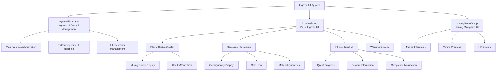

# UI System - In-Game UI - Ingame UI

## Overview
The Ingame UI manages all UI elements displayed on screen while players are playing in mines. Primarily composed of IngameGroup and MiningGameGroup, it displays core gameplay information such as player status, mining progress, resource status, and infinite quests in real-time.

## Ingame UI System Architecture

### System Architecture


## Related File Paths

### UI Group Files
```
ui/
├── IngameGroup.ui                      # Basic ingame UI group
├── MiningGameGroup.ui                  # Mining mini-game UI group
├── StatusGroup.ui                      # Player status UI group
└── ToastGroup.ui                       # Notification message UI group
```

### UI Management Components
```
RootDesk/MyDesk/Components/UI/
├── IngameUIManager.mlua                # Ingame UI overall manager
├── IngameUIManager.codeblock           # Ingame UI management visual
├── OutgameUIManager.mlua               # Outgame UI manager (for contrast)
├── OutgameUIManager.codeblock          # Outgame UI management visual
├── LoadingManager.mlua                 # Loading screen management
├── LoadingManager.codeblock            # Loading screen visual
├── UIButtonSound.mlua                  # UI button sound
├── UIButtonSound.codeblock             # UI button sound visual
├── UIFlickering.mlua                   # UI flickering effect
├── UIFlickering.codeblock              # UI flickering visual
└── WarningFlickeringUI.mlua            # Warning UI flickering
```

### Game Mechanism Integration Components
```
RootDesk/MyDesk/Components/
├── Mine/
│   └── MiningGame.mlua                 # Mining mini-game logic
└── Player/
    ├── InfiniteQuest/
    │   └── PlayerInfiniteQuest.mlua    # Infinite quest UI integration
    └── Inventory/
        └── PlayerStorage.mlua          # Resource UI updates
```

## IngameUIManager - Ingame UI Overall Management

### Core Functions and Data Structure
```lua
@Component
script IngameUIManager extends Component

    property boolean AutoEnableOnMine = false    -- Auto-enable on mine entry
```

### Map-based UI Activation Management
```lua
@EventSender("LocalPlayer")
handler HandleLocalPlayerMapEnterEvent(LocalPlayerMapEnterEvent event)
    local EnteredMapType = event.EnteredMapType
    
    if EnteredMapType == "Town" then
        -- Town entry: deactivate ingame UI
        self.Entity.Enable = false
        
    elseif EnteredMapType == "Mine" and self.AutoEnableOnMine == true then
        -- Mine entry: activate ingame UI
        self.Entity.Enable = true
        
        -- Platform-specific UI handling
        if (tostring(self.Entity.UITransformComponent.ActivePlatform) == "Mobile" and 
            Environment:IsMobilePlatform() == false) or
           (tostring(self.Entity.UITransformComponent.ActivePlatform) == "PC" and 
            Environment:IsPCPlatform() == false) then
            self.Entity.Enable = false
        else
            self.Entity.Enable = true
        end
    end
end
```

### UI Localization System
```lua
@ExecSpace("ClientOnly")
method void OnBeginPlay()
    -- Auto-localize all text elements under IngameGroup
    local localizingTable = _DataService:GetTable("LocalizationTable")
    local keys = localizingTable:GetColumn(1)
    
    for i=1, #keys do
        if string.sub(keys[i], 1, 16) == "/ui/IngameGroup/" then
            local path = keys[i]
            local TextCompo = _EntityService:GetEntityByPath(path).TextComponent
            if TextCompo ~= nil then
                TextCompo.Text = _LocalizationService:GetText(path)
            end
        end
    end
end
```

## IngameGroup - Basic Ingame UI

### UI Components

#### 1. Warning System
```json
{
  "path": "/ui/IngameGroup/Warning",
  "components": ["UITransform", "SpriteGUIRenderer"],
  "children": [
    {
      "path": "/ui/IngameGroup/Warning/Part",
      "components": ["WarningFlickeringUI"]
    },
    {
      "path": "/ui/IngameGroup/Warning/Desc",
      "components": ["TextComponent"]
    },
    {
      "path": "/ui/IngameGroup/Warning/Desc/icon_warning_1",
      "components": ["SpriteGUIRenderer"]
    }
  ]
}
```

#### 2. Mining Power Display
```json
{
  "path": "/ui/IngameGroup/MiningPower",
  "components": ["UITransform", "SpriteGUIRenderer"],
  "children": [
    {
      "path": "/ui/IngameGroup/MiningPower/Num",
      "components": ["TextComponent"],
      "description": "Player's current mining power value display"
    }
  ]
}
```

#### 3. Gem Quantity Display
```lua
-- Gem UI update in PlayerStorage.mlua
method void UpdateGemUI()
    local gemUI = _EntityService:GetEntityByPath("/ui/IngameGroup/Gem/Num")
    gemUI.TextComponent.Text = _ThousandsSeparator:ConvertToMetricPrefixString(
        self.currencyItems[2], nil)
end

-- Gem acquisition effect
method void ShowGemEffect()
    local gemIcon = _EntityService:GetEntityByPath("/ui/IngameGroup/direction_gem_icon")
    -- Gem icon animation effect
end
```

#### 4. Infinite Quest UI
```lua
-- Infinite quest UI management in PlayerInfiniteQuest.mlua
method void RefreshInfiniteQuestUI()
    -- Display quest progress
    local fillAmountTxt = _EntityService:GetEntityByPath("/ui/IngameGroup/InfiniteQuest/QuestGauge/Percent")
    local fillAmountSlider = _EntityService:GetEntityByPath("/ui/IngameGroup/InfiniteQuest/QuestGauge/Bg_QuestGauge/Fill")
    
    -- Display reward quantity
    local rewardAmountTxt = _EntityService:GetEntityByPath("/ui/IngameGroup/InfiniteQuest/QuestGauge/ClearButton/txt_pc")
    
    -- Update quest icon
    local questIcon = _EntityService:GetEntityByPath("/ui/IngameGroup/InfiniteQuest/QuestGauge/Icon_quest")
    
    -- Calculate progress and update UI
    local progressPercent = (currentProgress / maxProgress) * 100
    fillAmountTxt.TextComponent.Text = string.format("%.1f%%", progressPercent)
    
    -- Adjust slider bar size
    local fillWidth = 200 * (currentProgress / maxProgress)
    fillAmountSlider.UITransformComponent.RectSize = Vector2(fillWidth, fillAmountSlider.UITransformComponent.RectSize.y)
end

-- Show quest completion notification
method void ShowQuestCompleteAlert()
    local alertPaper = _EntityService:GetEntityByPath("/ui/IngameGroup/InfiniteQuest/AlertPaper")
    local alertEffect = _EntityService:GetEntityByPath("/ui/IngameGroup/InfiniteQuest/AlertEffect")
    
    alertPaper.Enable = true
    alertEffect.Enable = true
    
    -- Auto-hide after 3 seconds
    local hideAlert = function()
        alertPaper.Enable = false
        alertEffect.Enable = false
    end
    _TimerService:SetTimerOnce(hideAlert, 3.0)
end
```

#### 5. Resource Effect System
```lua
-- Gold acquisition effect
method void ShowGoldEffect()
    local goldIcon = _EntityService:GetEntityByPath("/ui/IngameGroup/direction_gold_icon")
    
    -- Animation of gold icon moving to UI
    local startPos = Vector2(goldIcon.UITransformComponent.LocalPosition.x, goldIcon.UITransformComponent.LocalPosition.y)
    local targetPos = Vector2(50, -50)  -- Gold UI position
    
    local animationStep = function(frame)
        local progress = frame / 30.0  -- 0.5 second animation
        local currentPos = Vector2.Lerp(startPos, targetPos, progress)
        goldIcon.UITransformComponent.LocalPosition = currentPos
        
        if frame >= 30 then
            goldIcon.Enable = false  -- Hide after animation completes
        end
    end
    
    for i=1, 30 do
        _TimerService:SetTimerOnce(function() animationStep(i) end, i/30)
    end
end

-- Relic box reward effect
method void ShowRelicBoxReward()
    local rewardSprite = _EntityService:GetEntityByPath("/ui/IngameGroup/InfiniteQuest/RelicBoxSprite")
    rewardSprite.Enable = true
    
    -- Sparkle effect
    local clearEffect = _EntityService:GetEntityByPath("/ui/IngameGroup/InfiniteQuest/ClearEffect")
    clearEffect.Enable = true
    
    -- End effect after 2 seconds
    local endEffect = function()
        rewardSprite.Enable = false
        clearEffect.Enable = false
    end
    _TimerService:SetTimerOnce(endEffect, 2.0)
end
```

## MiningGameGroup - Mining Mini-game UI

### UI Components

#### 1. Mining Interaction Button
```json
{
  "path": "/ui/MiningGameGroup/Mining/Button_Interaction",
  "components": ["ButtonComponent"],
  "children": [
    {
      "path": "/ui/MiningGameGroup/Mining/Button_Interaction/UIText",
      "components": ["TextComponent"],
      "description": "Interaction guide text"
    }
  ]
}
```

#### 2. Mining Status Message
```json
{
  "path": "/ui/MiningGameGroup/Mining/Message",
  "components": ["TextComponent"],
  "description": "Displays mining progress or result messages"
}
```

#### 3. HP System UI
```json
{
  "path": "/ui/MiningGameGroup/Mining/HPBar",
  "components": ["SpriteGUIRenderer"],
  "children": [
    {
      "path": "/ui/MiningGameGroup/Mining/HPBar/Fill_back",
      "components": ["SpriteGUIRenderer"],
      "description": "HP bar background"
    },
    {
      "path": "/ui/MiningGameGroup/Mining/HPBar/Fill",
      "components": ["SpriteGUIRenderer"],
      "description": "HP bar fill portion"
    }
  ]
}
```

### Mining Mini-game Logic Integration
```lua
-- UI updates in MiningGame.mlua
@Component
script MiningGame extends Component

    method void UpdateMiningUI()
        -- Update mining progress
        local progressMessage = _EntityService:GetEntityByPath("/ui/MiningGameGroup/Mining/Message")
        progressMessage.TextComponent.Text = "Mining..."
        
        -- Update interaction button text
        local interactionText = _EntityService:GetEntityByPath("/ui/MiningGameGroup/Mining/Button_Interaction/UIText")
        interactionText.TextComponent.Text = _LocalizationService:GetText("MiningAction_Dig")
        
        -- Update HP bar
        self:UpdateHPBar()
    end
    
    method void UpdateHPBar()
        local hpFill = _EntityService:GetEntityByPath("/ui/MiningGameGroup/Mining/HPBar/Fill")
        local hpRatio = currentHP / maxHP
        
        -- Adjust HP bar size
        hpFill.UITransformComponent.RectSize = Vector2(100 * hpRatio, hpFill.UITransformComponent.RectSize.y)
        
        -- Color change based on HP
        if hpRatio > 0.7 then
            hpFill.SpriteGUIRendererComponent.Color = Color.green
        elseif hpRatio > 0.3 then
            hpFill.SpriteGUIRendererComponent.Color = Color.yellow
        else
            hpFill.SpriteGUIRendererComponent.Color = Color.red
        end
    end
    
    method void OnMiningComplete()
        -- Mining completion message
        local progressMessage = _EntityService:GetEntityByPath("/ui/MiningGameGroup/Mining/Message")
        progressMessage.TextComponent.Text = "Mining Complete!"
        
        -- Disable interaction button
        local interactionButton = _EntityService:GetEntityByPath("/ui/MiningGameGroup/Mining/Button_Interaction")
        interactionButton.ButtonComponent.Enable = false
        
        -- Reset UI after 2 seconds
        local resetUI = function()
            self:ResetMiningUI()
        end
        _TimerService:SetTimerOnce(resetUI, 2.0)
    end
```

## Platform-Specific UI System

### PC/Mobile Compatibility
```lua
method void CheckPlatformCompatibility()
    local uiTransform = self.Entity.UITransformComponent
    local activePlatform = tostring(uiTransform.ActivePlatform)
    
    if activePlatform == "Mobile" and Environment:IsMobilePlatform() == false then
        -- Mobile UI but running on PC: deactivate
        self.Entity.Enable = false
    elseif activePlatform == "PC" and Environment:IsPCPlatform() == false then
        -- PC UI but running on mobile: deactivate
        self.Entity.Enable = false
    else
        -- Platform match: activate
        self.Entity.Enable = true
    end
end
```

### UI Adjustment by Resolution
```lua
method void AdjustUIForResolution()
    local screenWidth = Screen.width
    local screenHeight = Screen.height
    local aspectRatio = screenWidth / screenHeight
    
    -- UI scale adjustment
    local uiScale = 1.0
    if aspectRatio > 2.0 then
        uiScale = 0.8  -- Shrink UI on wide screens
    elseif aspectRatio < 1.5 then
        uiScale = 1.2  -- Enlarge UI on square-ish screens
    end
    
    self.Entity.UITransformComponent.LocalScale = Vector3(uiScale, uiScale, 1)
end
```

## UI Effect System

### Flickering Effect (UIFlickering)
```lua
@Component
script UIFlickering extends Component

    property number flickerSpeed = 1.0      -- Flicker speed
    property number minAlpha = 0.3           -- Minimum opacity
    property number maxAlpha = 1.0           -- Maximum opacity

    method void OnUpdate(number delta)
        local time = _TimeService:GetTime()
        local alpha = Mathf.Lerp(self.minAlpha, self.maxAlpha, 
            (Mathf.Sin(time * self.flickerSpeed) + 1) / 2)
        
        self.Entity.SpriteGUIRendererComponent.Color.a = alpha
    end
```

### Warning UI Flickering (WarningFlickeringUI)
```lua
@Component
script WarningFlickeringUI extends Component

    method void StartWarningFlicker()
        local warningIcon = self.Entity
        
        -- Fast flicker to get attention
        local flickerStep = function(frame)
            local alpha = (frame % 20 < 10) and 1.0 or 0.3
            warningIcon.SpriteGUIRendererComponent.Color.a = alpha
        end
        
        for i=1, 120 do  -- Flicker for 2 seconds
            _TimerService:SetTimerOnce(function() flickerStep(i) end, i/60)
        end
    end
```

### Rainbow Effect (RainbowText)
```lua
@Component
script RainbowText extends Component

    method void OnUpdate(number delta)
        local time = _TimeService:GetTime()
        local hue = (time * 0.5) % 1.0  -- Color cycle every 0.5 seconds
        
        local color = Color.HSVToRGB(hue, 1.0, 1.0)
        self.Entity.TextComponent.FontColor = color
    end
```

## Performance Optimization

### UI Update Cycle Management
```lua
-- Update UI only when needed
property boolean needsRefresh = false
property number lastUpdateTime = 0

method void OnUpdate(number delta)
    local currentTime = _TimeService:GetTime()
    
    if self.needsRefresh and (currentTime - self.lastUpdateTime) > 0.1 then  -- Limit to 10FPS
        self:RefreshUI()
        self.needsRefresh = false
        self.lastUpdateTime = currentTime
    end
end

method void RequestRefresh()
    self.needsRefresh = true
end
```

### UI Element Pooling
```lua
-- Pooling system for UI element reuse
local uiElementPool = {}

method Entity GetPooledUIElement(string elementType)
    if uiElementPool[elementType] == nil then
        uiElementPool[elementType] = {}
    end
    
    local pool = uiElementPool[elementType]
    if #pool > 0 then
        return table.remove(pool)
    else
        return self:CreateNewUIElement(elementType)
    end
end

method void ReturnToPool(Entity element, string elementType)
    element.Enable = false
    table.insert(uiElementPool[elementType], element)
end
```

## Extensibility

### Custom UI Component System
```lua
-- Create reusable UI components
@Component
script CustomProgressBar extends Component

    property number currentValue = 0
    property number maxValue = 100
    property Color fillColor = Color.blue

    method void SetValue(number value)
        self.currentValue = Mathf.Clamp(value, 0, self.maxValue)
        self:UpdateBar()
    end
    
    method void UpdateBar()
        local fillRatio = self.currentValue / self.maxValue
        local fillBar = self.Entity:GetChildByName("Fill")
        
        fillBar.UITransformComponent.RectSize = 
            Vector2(200 * fillRatio, fillBar.UITransformComponent.RectSize.y)
        fillBar.SpriteGUIRendererComponent.Color = self.fillColor
    end
```

### Dynamic UI Creation
```lua
-- Dynamically create UI elements at runtime
method Entity CreateDynamicUI(string uiType, Vector2 position)
    local newUI = _EntityService:CreateEntity(uiType)
    newUI.Parent = self.Entity
    newUI.UITransformComponent.LocalPosition = position
    
    return newUI
end
```

## Common Troubleshooting

### When UI Doesn't Display
1. Check `IngameUIManager` activation state
2. Verify map type-based UI activation logic
3. Check platform-specific UI compatibility

### When UI Updates Are Delayed
1. Check UI update call frequency
2. Verify `needsRefresh` flag status
3. Validate UI element reference paths

### Platform-Specific UI Issues
1. Check `UITransformComponent.ActivePlatform` setting
2. Apply resolution-based UI scaling
3. Verify input system compatibility
