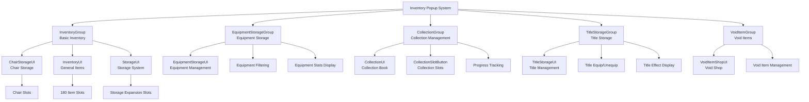

# UI System - Popup System - Inventory Popup

## Overview
The Inventory Popup System provides various popup UIs for managing player items, equipment, collection, titles, etc. Composed of InventoryGroup, EquipmentStorageGroup, CollectionGroup, TitleStorageGroup, and more, it supports efficient item management through specialized functions and interfaces for each category.

## Inventory Popup System Architecture

### System Architecture


## Related File Paths

### Inventory UI Group Files
```
ui/
├── InventoryGroup.ui                   # Basic inventory UI group
├── EquipmentStorageGroup.ui            # Equipment storage UI group
├── CollectionGroup.ui                  # Collection management UI group
├── TitleStorageGroup.ui                # Title storage UI group
├── VoidItemGroup.ui                    # Void item UI group
└── EmblemGroup.ui                      # Emblem UI group
```

### Inventory-related Components
```
RootDesk/MyDesk/Components/Player/Inventory/
├── InventoryUI.mlua                    # Inventory main UI
├── InventoryUI.codeblock               # Inventory UI visual
├── InventorySlotButton.mlua            # Inventory slot button
├── InventorySlotButton.codeblock       # Slot button visual
├── InventoryEquipedSlotButton.mlua     # Equipped slot button
├── InventoryEquipedSlotButton.codeblock # Equipped slot visual
├── StorageUI.mlua                      # Storage UI
├── StorageUI.codeblock                 # Storage UI visual
├── StorageUI_SlotButton.mlua           # Storage slot button
├── StorageUI_SlotButton.codeblock      # Storage slot visual
├── PlayerBackpack.mlua                 # Backpack system
├── PlayerBackpack.codeblock            # Backpack visual
├── PlayerStorage.mlua                  # Storage system
└── PlayerStorage.codeblock             # Storage visual
```

### Special Inventory Components
```
RootDesk/MyDesk/Components/Player/
├── Equipment/
│   ├── EquipmentStorageUI.mlua         # Equipment storage UI
│   ├── EquipmentStorageUI.codeblock    # Equipment storage visual
│   ├── EquipmentStorageUI_NormalSlotButton.mlua # Equipment slot button
│   └── EquipmentStorageUI_NormalSlotButton.codeblock # Equipment slot visual
├── Collection/
│   ├── CollectionUI.mlua               # Collection UI
│   ├── CollectionUI.codeblock          # Collection UI visual
│   ├── CollectionSlotButton.mlua       # Collection slot button
│   ├── CollectionSlotButton.codeblock  # Collection slot visual
│   ├── PlayerCollection.mlua           # Collection system
│   └── PlayerCollection.codeblock      # Collection system visual
├── Title/
│   ├── TitleStorageUI.mlua             # Title storage UI
│   ├── TitleStorageUI.codeblock        # Title storage visual
│   ├── PlayerTitle.mlua                # Title system
│   └── PlayerTitle.codeblock           # Title system visual
├── Chair/
│   ├── ChairStorageUI.mlua             # Chair storage UI
│   ├── ChairStorageUI.codeblock        # Chair storage visual
│   ├── PlayerChair.mlua                # Chair system
│   └── PlayerChair.codeblock           # Chair system visual
└── VoidItem/
    ├── VoidItemShopUI.mlua             # Void item shop UI
    ├── VoidItemShopUI.codeblock        # Void shop visual
    ├── PlayerVoidItem.mlua             # Void item system
    └── PlayerVoidItem.codeblock        # Void item visual
```

## InventoryGroup - Basic Inventory Popup

### UI Components

#### 1. Chair Storage (ChairStorageUI)
```json
{
  "path": "/ui/InventoryGroup/ChairStorage",
  "components": ["ChairStorageUI"],
  "mainFunctions": [
    "Display owned chair list",
    "Chair equip/unequip",
    "Chair preview"
  ]
}
```

```lua
-- Chair management in ChairStorageUI.mlua
@Component
script ChairStorageUI extends Component

    method void RefreshUI()
        local chairTable = _DataService:GetTable("Chair")
        local playerChair = _UserService.LocalPlayer.PlayerChair
        
        -- Display owned chairs
        for i=1, chairTable:GetRowCount() do
            if playerChair.haveChair[i] == true then
                local chairSlot = self:CreateChairSlot(i)
                
                -- Set chair icon
                local iconRUID = chairTable:GetCell(i, "IconRUID")
                chairSlot:GetChildByName("Icon").SpriteGUIRendererComponent.ImageRUID = iconRUID
                
                -- Display currently equipped chair
                if playerChair.equipedChair == i then
                    chairSlot:GetChildByName("EquipedMark").Enable = true
                end
            end
        end
    end
    
    method Entity CreateChairSlot(number chairIdx)
        local slotTemplate = _EntityService:GetEntityByPath("/ui/InventoryGroup/ChairStorage/Panel/SlotTemplate")
        local newSlot = slotTemplate:Clone("ChairSlot_"..chairIdx)
        
        -- Set click event
        newSlot.ButtonComponent:ClearAllEvents()
        newSlot.ButtonComponent.OnClick:Connect(function()
            self:EquipChair(chairIdx)
        end)
        
        return newSlot
    end
    
    method void EquipChair(number chairIdx)
        local playerChair = _UserService.LocalPlayer.PlayerChair
        playerChair:EquipChair(chairIdx)
        
        -- Refresh UI
        self:RefreshUI()
    end
```

#### 2. General Item Inventory
```lua
-- Item management in InventoryUI.mlua (separate popup)
method void OpenInventoryPopup()
    local inventoryPopup = _EntityService:GetEntityByPath("/ui/InventoryPopup")
    inventoryPopup.Enable = true
    
    -- Load inventory data
    self:RefreshInventorySlots()
end

method void RefreshInventorySlots()
    local playerBackpack = _UserService.LocalPlayer.PlayerBackpack
    local storageList = playerBackpack.storageList
    
    -- Update 180 slots
    for i=1, 180 do
        local slot = _EntityService:GetEntityByPath("/ui/InventoryPopup/SlotPanel/Slot_"..i)
        
        if storageList[i] > 0 then
            -- Display item
            self:DisplayItemInSlot(slot, storageList[i], i)
        else
            -- Empty slot
            self:ClearSlot(slot)
        end
    end
end
```

## EquipmentStorageGroup - Equipment Storage Popup

### UI Components
```json
{
  "path": "/ui/EquipmentStorageGroup/EquipmentStorage",
  "components": ["EquipmentStorageUI"],
  "mainFunctions": [
    "Display owned equipment list",
    "Equipment type filtering",
    "Equipment stat comparison",
    "Equipment equip/unequip"
  ]
}
```

### EquipmentStorageUI Detailed Implementation
```lua
@Component
script EquipmentStorageUI extends Component

    property number currentFilter = 1    -- Current filter (1:weapons, 2:armor, 3:bags, 4:boots)
    property table equipmentSlots = {}    -- Equipment slots
    
    method void RefreshEquipmentStorage()
        local playerData = _UserService.LocalPlayer.PlayerData
        local equipmentTable = _DataService:GetTable("Equipment")
        
        -- Display only equipment matching current filter
        self:ClearAllSlots()
        
        for i=1, equipmentTable:GetRowCount() do
            local equipType = tonumber(equipmentTable:GetCell(i, "Type"))
            
            if equipType == self.currentFilter then
                -- Check if player owns this equipment
                if playerData.haveEquipment[i] == true then
                    self:CreateEquipmentSlot(i)
                end
            end
        end
        
        -- Highlight currently equipped items
        self:HighlightEquippedItems()
    end
    
    method void CreateEquipmentSlot(number equipmentIdx)
        local slotTemplate = _EntityService:GetEntityByPath("/ui/EquipmentStorageGroup/EquipmentStorage/Panel/SlotTemplate")
        local newSlot = slotTemplate:Clone("EquipSlot_"..equipmentIdx)
        
        -- Display equipment information
        self:UpdateEquipmentSlotInfo(newSlot, equipmentIdx)
        
        -- Click event - equip/unequip
        newSlot.EquipmentStorageUI_NormalSlotButton.equipmentIdx = equipmentIdx
        
        -- Right-click event - detailed information
        newSlot.ButtonComponent.OnRightClick:Connect(function()
            self:ShowEquipmentDetailPopup(equipmentIdx)
        end)
        
        table.insert(self.equipmentSlots, newSlot)
    end
    
    method void UpdateEquipmentSlotInfo(Entity slot, number equipmentIdx)
        local equipmentTable = _DataService:GetTable("Equipment")
        local equipmentData = equipmentTable:GetRow(equipmentIdx)
        
        -- Icon setting
        local iconRUID = equipmentData:GetItem("IconRUID")
        slot:GetChildByName("Icon").SpriteGUIRendererComponent.ImageRUID = iconRUID
        
        -- Equipment name
        local equipmentName = equipmentData:GetItem("Name")
        slot:GetChildByName("Name").TextComponent.Text = _LocalizationService:GetText(equipmentName)
        
        -- Stat display
        local power = equipmentData:GetItem("Power")
        slot:GetChildByName("Power").TextComponent.Text = "Mining Power +"..power
        
        -- Grade display (distinguished by color)
        local grade = tonumber(equipmentData:GetItem("Grade"))
        local gradeColors = {Color.white, Color.green, Color.blue, Color.purple, Color.orange}
        slot:GetChildByName("GradeBorder").SpriteGUIRendererComponent.Color = gradeColors[grade] or Color.white
    end
    
    method void ShowEquipmentDetailPopup(number equipmentIdx)
        local detailPopup = _EntityService:GetEntityByPath("/ui/EquipmentStorageGroup/EquipmentStorage/DetailPopup")
        detailPopup.Enable = true
        
        -- Display detailed information
        self:UpdateEquipmentDetails(detailPopup, equipmentIdx)
        
        -- Comparison feature (compare with currently equipped)
        self:ShowEquipmentComparison(detailPopup, equipmentIdx)
    end
```

## CollectionGroup - Collection Management Popup

### UI Components
```json
{
  "path": "/ui/CollectionGroup/Collection",
  "components": ["CollectionUI", "OutgameUIManager"],
  "mainFunctions": [
    "Display collection book",
    "Track collection progress",
    "Show uncollected items",
    "Category-based filtering"
  ]
}
```

### CollectionUI Detailed Implementation
```lua
@Component
script CollectionUI extends Component

    property number currentCategory = 1  -- Current category (1:minerals, 2:gems, 3:fossils)
    property table collectionData = {}   -- Collection data
    
    method void RefreshCollectionUI()
        local playerCollection = _UserService.LocalPlayer.PlayerCollection
        local dropItemTable = _DataService:GetTable("DropItem")
        
        -- Display collection by category
        self:DisplayCollectionByCategory()
        
        -- Update progress
        self:UpdateProgressBar()
    end
    
    method void DisplayCollectionByCategory()
        local collectionPanel = _EntityService:GetEntityByPath("/ui/CollectionGroup/Collection/MainPanel/CollectionPanel")
        
        -- Clear existing slots
        self:ClearCollectionSlots()
        
        local dropItemTable = _DataService:GetTable("DropItem")
        local playerCollection = _UserService.LocalPlayer.PlayerCollection
        
        for i=1, dropItemTable:GetRowCount() do
            local itemCategory = tonumber(dropItemTable:GetCell(i, "Type"))
            
            if itemCategory == self.currentCategory then
                local collectionSlot = self:CreateCollectionSlot(i)
                
                -- Display based on collection status
                if playerCollection.collectionData[i] == true then
                    -- Collected
                    self:SetCollectedSlot(collectionSlot, i)
                else
                    -- Uncollected
                    self:SetUncollectedSlot(collectionSlot, i)
                end
            end
        end
    end
    
    method Entity CreateCollectionSlot(number itemIdx)
        local slotTemplate = _EntityService:GetEntityByPath("/ui/CollectionGroup/Collection/SlotTemplate")
        local newSlot = slotTemplate:Clone("CollectionSlot_"..itemIdx)
        
        -- Click event - show detailed information
        newSlot.CollectionSlotButton.itemIdx = itemIdx
        
        return newSlot
    end
    
    method void SetCollectedSlot(Entity slot, number itemIdx)
        local dropItemTable = _DataService:GetTable("DropItem")
        local itemData = dropItemTable:GetRow(itemIdx)
        
        -- Display item icon
        local iconRUID = itemData:GetItem("IconRUID")
        slot:GetChildByName("Icon").SpriteGUIRendererComponent.ImageRUID = iconRUID
        slot:GetChildByName("Icon").SpriteGUIRendererComponent.Color = Color.white
        
        -- Collected mark
        slot:GetChildByName("CollectedMark").Enable = true
        
        -- Display item name
        local itemName = itemData:GetItem("Name")
        slot:GetChildByName("Name").TextComponent.Text = _LocalizationService:GetText(itemName)
        slot:GetChildByName("Name").TextComponent.FontColor = Color.white
    end
    
    method void SetUncollectedSlot(Entity slot, number itemIdx)
        -- Display as silhouette
        slot:GetChildByName("Icon").SpriteGUIRendererComponent.ImageRUID = "silhouette_icon"
        slot:GetChildByName("Icon").SpriteGUIRendererComponent.Color = Color.gray
        
        -- Hide collected mark
        slot:GetChildByName("CollectedMark").Enable = false
        
        -- Show question marks
        slot:GetChildByName("Name").TextComponent.Text = "???"
        slot:GetChildByName("Name").TextComponent.FontColor = Color.gray
    end
    
    method void UpdateProgressBar()
        local playerCollection = _UserService.LocalPlayer.PlayerCollection
        local dropItemTable = _DataService:GetTable("DropItem")
        
        -- Calculate progress by category
        local totalItems = 0
        local collectedItems = 0
        
        for i=1, dropItemTable:GetRowCount() do
            local itemCategory = tonumber(dropItemTable:GetCell(i, "Type"))
            
            if itemCategory == self.currentCategory then
                totalItems = totalItems + 1
                if playerCollection.collectionData[i] == true then
                    collectedItems = collectedItems + 1
                end
            end
        end
        
        -- Update progress bar
        local progressBar = _EntityService:GetEntityByPath("/ui/CollectionGroup/Collection/ProgressBar/Fill")
        local progressRatio = collectedItems / totalItems
        progressBar.UITransformComponent.RectSize = Vector2(300 * progressRatio, progressBar.UITransformComponent.RectSize.y)
        
        -- Progress text
        local progressText = _EntityService:GetEntityByPath("/ui/CollectionGroup/Collection/ProgressText")
        progressText.TextComponent.Text = string.format("%d / %d (%.1f%%)", collectedItems, totalItems, progressRatio * 100)
    end
```

## TitleStorageGroup - Title Storage Popup

### UI Components
```json
{
  "path": "/ui/TitleStorageGroup/TitleStorage",
  "components": ["TitleStorageUI"],
  "mainFunctions": [
    "Display owned title list",
    "Title equip/unequip",
    "Display title effects",
    "Achievement integration"
  ]
}
```

### TitleStorageUI Detailed Implementation
```lua
@Component
script TitleStorageUI extends Component

    property table titleSlots = {}       -- Title slots
    property number selectedTitleIdx = 0 -- Selected title
    
    method void RefreshTitleStorage()
        local playerTitle = _UserService.LocalPlayer.PlayerTitle
        local titleTable = _DataService:GetTable("PlayerTitle")
        
        -- Display owned titles
        self:DisplayOwnedTitles()
        
        -- Highlight currently equipped title
        self:HighlightEquippedTitle()
    end
    
    method void DisplayOwnedTitles()
        local titlePanel = _EntityService:GetEntityByPath("/ui/TitleStorageGroup/TitleStorage/Panel/TitleList")
        local playerTitle = _UserService.LocalPlayer.PlayerTitle
        local titleTable = _DataService:GetTable("PlayerTitle")
        
        -- Clear existing slots
        self:ClearTitleSlots()
        
        for i=1, titleTable:GetRowCount() do
            if playerTitle.haveTitle[i] == true then
                local titleSlot = self:CreateTitleSlot(i)
                self:UpdateTitleSlotInfo(titleSlot, i)
            end
        end
    end
    
    method Entity CreateTitleSlot(number titleIdx)
        local slotTemplate = _EntityService:GetEntityByPath("/ui/TitleStorageGroup/TitleStorage/SlotTemplate")
        local newSlot = slotTemplate:Clone("TitleSlot_"..titleIdx)
        
        -- Click event - equip title
        newSlot.ButtonComponent.OnClick:Connect(function()
            self:EquipTitle(titleIdx)
        end)
        
        -- Right-click event - unequip title
        newSlot.ButtonComponent.OnRightClick:Connect(function()
            self:UnequipTitle()
        end)
        
        table.insert(self.titleSlots, newSlot)
        return newSlot
    end
    
    method void UpdateTitleSlotInfo(Entity slot, number titleIdx)
        local titleTable = _DataService:GetTable("PlayerTitle")
        local titleData = titleTable:GetRow(titleIdx)
        
        -- Title name
        local titleName = titleData:GetItem("Name")
        slot:GetChildByName("TitleName").TextComponent.Text = _LocalizationService:GetText(titleName)
        
        -- Title effect
        local titleEffect = titleData:GetItem("Effect")
        slot:GetChildByName("TitleEffect").TextComponent.Text = _LocalizationService:GetText(titleEffect)
        
        -- Title grade (displayed by color)
        local titleGrade = tonumber(titleData:GetItem("Grade"))
        local gradeColors = {Color.gray, Color.white, Color.green, Color.blue, Color.purple, Color.orange}
        slot:GetChildByName("GradeBorder").SpriteGUIRendererComponent.Color = gradeColors[titleGrade] or Color.white
        
        -- Display obtain method
        local obtainMethod = titleData:GetItem("ObtainMethod")
        slot:GetChildByName("ObtainInfo").TextComponent.Text = _LocalizationService:GetText(obtainMethod)
    end
    
    method void EquipTitle(number titleIdx)
        local playerTitle = _UserService.LocalPlayer.PlayerTitle
        playerTitle:EquipTitle(titleIdx)
        
        -- Refresh UI
        self:RefreshTitleStorage()
        
        -- Title equipped notification
        local titleTable = _DataService:GetTable("PlayerTitle")
        local titleName = titleTable:GetCell(titleIdx, "Name")
        _UIToast:ShowMessage(string.format("Title '%s' Equipped", _LocalizationService:GetText(titleName)))
    end
    
    method void UnequipTitle()
        local playerTitle = _UserService.LocalPlayer.PlayerTitle
        playerTitle:UnequipTitle()
        
        -- Refresh UI
        self:RefreshTitleStorage()
        
        _UIToast:ShowMessage("Title Unequipped")
    end
    
    method void HighlightEquippedTitle()
        local playerTitle = _UserService.LocalPlayer.PlayerTitle
        local equippedTitleIdx = playerTitle.equippedTitle
        
        for i, slot in ipairs(self.titleSlots) do
            local isEquipped = (slot.titleIdx == equippedTitleIdx)
            slot:GetChildByName("EquippedMark").Enable = isEquipped
            
            if isEquipped then
                slot.SpriteGUIRendererComponent.Color = Color.yellow
            else
                slot.SpriteGUIRendererComponent.Color = Color.white
            end
        end
    end
```

## VoidItemGroup - Void Item Popup

### UI Components
```json
{
  "path": "/ui/VoidItemGroup/VoidItemShop",
  "components": ["VoidItemShopUI"],
  "mainFunctions": [
    "Void item shop",
    "Legacy Coin trading",
    "Special effect items"
  ]
}
```

### VoidItemShopUI Detailed Implementation
```lua
@Component
script VoidItemShopUI extends Component

    method void RefreshVoidItemShop()
        local playerVoidItem = _UserService.LocalPlayer.PlayerVoidItem
        local playerStorage = _UserService.LocalPlayer.PlayerStorage
        
        -- Display Legacy Coins
        local legacyCoinUI = _EntityService:GetEntityByPath("/ui/VoidItemGroup/VoidItemShop/LegacyCoinAmount")
        legacyCoinUI.TextComponent.Text = _ThousandsSeparator:ConvertToMetricPrefixString(
            playerStorage.currencyItems[7])  -- Legacy Coins
        
        -- Display void item list
        self:DisplayVoidItems()
    end
    
    method void DisplayVoidItems()
        local voidItemTable = _DataService:GetTable("VoidItem")
        local playerVoidItem = _UserService.LocalPlayer.PlayerVoidItem
        
        for i=1, voidItemTable:GetRowCount() do
            local itemSlot = self:CreateVoidItemSlot(i)
            
            -- Display owned level
            local currentLevel = playerVoidItem.voidItemLevels[i] or 0
            itemSlot:GetChildByName("Level").TextComponent.Text = string.format("Lv.%d", currentLevel)
            
            -- Calculate upgrade cost
            local upgradeCost = self:CalculateUpgradeCost(i, currentLevel)
            itemSlot:GetChildByName("Cost").TextComponent.Text = _ThousandsSeparator:ConvertToMetricPrefixString(upgradeCost)
            
            -- Effect description
            local effectDesc = self:GetVoidItemEffect(i, currentLevel)
            itemSlot:GetChildByName("Effect").TextComponent.Text = effectDesc
        end
    end
```

## Common Popup Features

### Drag and Drop System
```lua
-- Item movement between inventories
@Component
script DragDropHandler extends Component

    property Entity draggedItem = nil
    property Vector2 originalPosition = Vector2.zero
    
    method void OnDragStart(Entity item)
        self.draggedItem = item
        self.originalPosition = item.UITransformComponent.LocalPosition
        
        -- Visual effect during drag
        item.CanvasGroupComponent.Alpha = 0.7
        item.UITransformComponent.SetAsLastSibling()  -- Move to top
    end
    
    method void OnDragEnd(Entity dropTarget)
        if self.draggedItem ~= nil then
            if dropTarget ~= nil and self:IsValidDropTarget(dropTarget) then
                -- Process item movement
                self:MoveItem(self.draggedItem, dropTarget)
            else
                -- Restore to original position
                self.draggedItem.UITransformComponent.LocalPosition = self.originalPosition
            end
            
            -- Restore visual effects
            self.draggedItem.CanvasGroupComponent.Alpha = 1.0
            self.draggedItem = nil
        end
    end
    
    method boolean IsValidDropTarget(Entity target)
        -- Validate drop target
        return target:HasComponent("InventorySlot") or target:HasComponent("EquipmentSlot")
    end
    
    method void MoveItem(Entity sourceItem, Entity targetSlot)
        -- Request item movement to server
        local sourceIdx = sourceItem.InventorySlotButton.slotIndex
        local targetIdx = targetSlot.InventorySlotButton.slotIndex
        
        _UserService.LocalPlayer.PlayerBackpack:MoveItem(sourceIdx, targetIdx)
    end
```

### Popup Switching System
```lua
-- Quick switching between inventory popups
method void SwitchInventoryPopup(string targetPopup)
    -- Find currently open inventory popup
    local currentPopup = self:GetCurrentInventoryPopup()
    
    if currentPopup then
        -- Smooth transition animation
        self:PlayTransitionAnimation(currentPopup, targetPopup)
    else
        -- Direct open
        local popup = _EntityService:GetEntityByPath("/ui/"..targetPopup)
        popup.Enable = true
    end
end

method void PlayTransitionAnimation(string fromPopup, string toPopup)
    local fromEntity = _EntityService:GetEntityByPath("/ui/"..fromPopup)
    local toEntity = _EntityService:GetEntityByPath("/ui/"..toPopup)
    
    -- Fade out -> Fade in animation
    local fadeOutStep = function(progress)
        fromEntity.CanvasGroupComponent.Alpha = 1.0 - progress
        if progress >= 1.0 then
            fromEntity.Enable = false
            toEntity.Enable = true
            
            -- Start fade in
            self:PlayFadeInAnimation(toEntity)
        end
    end
    
    for i=1, 15 do
        local progress = i / 15.0
        _TimerService:SetTimerOnce(function() fadeOutStep(progress) end, i/30)
    end
end
```

## Performance Optimization

### Virtualized Scrolling
```lua
-- Efficiently display large amounts of items
@Component
script VirtualizedScrollView extends Component

    property number visibleItemCount = 10   -- Number of items visible on screen
    property number totalItemCount = 0      -- Total number of items
    property number scrollPosition = 0      -- Current scroll position
    property table itemPool = {}            -- Item pool
    
    method void UpdateVirtualizedList()
        -- Calculate range of items that should be shown
        local startIndex = math.floor(self.scrollPosition / 60)  -- 60 is item height
        local endIndex = math.min(startIndex + self.visibleItemCount, self.totalItemCount)
        
        -- Activate only necessary item slots
        for i=1, self.visibleItemCount do
            local itemIndex = startIndex + i
            local itemSlot = self.itemPool[i]
            
            if itemIndex <= endIndex then
                itemSlot.Enable = true
                self:UpdateItemSlotData(itemSlot, itemIndex)
            else
                itemSlot.Enable = false
            end
        end
    end
```

### Memory Management
```lua
-- Release unused UI resources
method void CleanupInventoryResources()
    -- Release textures of inactive popups
    local inactivePopups = {"InventoryGroup", "EquipmentStorageGroup", "CollectionGroup"}
    
    for _, popupName in ipairs(inactivePopups) do
        local popup = _EntityService:GetEntityByPath("/ui/"..popupName)
        
        if not popup.Enable and popup.hasLoadedTextures then
            popup:UnloadTextures()
            popup.hasLoadedTextures = false
        end
    end
end
```

## Common Troubleshooting

### When Popup Doesn't Refresh Properly
1. Check data synchronization status
2. Verify UI refresh event binding
3. Check if player data loading is complete

### When Drag and Drop Doesn't Work
1. Check `DragDropHandler` component settings
2. Verify drop target validation logic
3. Check UI layer order and raycast blocking

### When Slot Items Don't Display
1. Check icon RUID path
2. Verify item data table loading status
3. Check if slot index matches data index
