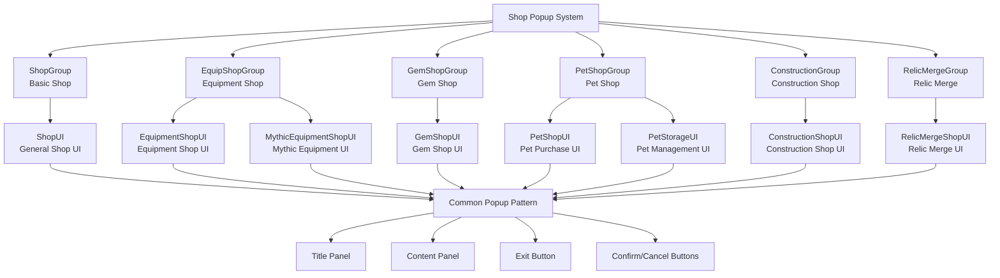

# UI System - Popup System - Shop Popup

## Overview
The Shop Popup System is a popup-based interface system that comprehensively manages various shop UIs. It provides specialized UI groups for each shop such as ShopGroup, EquipShopGroup, GemShopGroup, PetShopGroup, ConstructionGroup, and offers a consistent user experience through common popup patterns and interactions.

## Shop Popup System Architecture

### System Architecture


## Related File Paths

### Shop UI Group Files
```
ui/
├── ShopGroup.ui                        # Basic shop UI group
├── EquipShopGroup.ui                   # Equipment shop UI group  
├── GemShopGroup.ui                     # Gem shop UI group
├── PetShopGroup.ui                     # Pet shop UI group
├── ConstructionGroup.ui                # Construction shop UI group
├── RelicMergeGroup.ui                  # Relic merge UI group
├── PopupGroup.ui                       # Common popup UI group
└── ToastGroup.ui                       # Notification message UI group
```

### Shop-specific Component Structure
```
RootDesk/MyDesk/Components/Town/
├── EquipmentShop/                      # Equipment shop related components
│   ├── EquipmentShopUI.mlua           # Equipment shop main UI
│   ├── EquipmentShopSlotButton.mlua   # Equipment slot button
│   ├── EquipmentShopBundleSlotButton.mlua # Bundle purchase button
│   └── MythicEquipmentShopUI.mlua     # Mythic equipment shop
├── GemShop/                           # Gem shop related components
│   ├── GemShopUI.mlua                 # Gem shop main UI
│   ├── GemShopLogic.mlua              # Gem purchase logic
│   └── GemShopUI_SlotButton.mlua      # Gem shop slot button
├── RelicMergeShop/                    # Relic merge related components
│   ├── RelicMergeShopUI.mlua          # Relic merge UI
│   ├── RelicMergeShopUI_MaterialButton.mlua # Material selection button
│   └── RelicMergeShopUI_MaterialSlotButton.mlua # Material slot button
└── NPCInteraction.mlua                # NPC interaction (shop opening)
```

### Player-related Shop Components
```
RootDesk/MyDesk/Components/Player/
├── Pet/                               # Pet shop related
│   ├── PetShopUI.mlua                # Pet purchase UI
│   └── PetStorageUI.mlua             # Pet storage UI
├── Construction/                      # Construction shop related
│   ├── ConstructionShopUI.mlua       # Construction shop UI
│   ├── ConstructionShopUI_BuyButton.mlua # Purchase button
│   └── ConstructionShopUI_UnlockButton.mlua # Unlock button
└── VoidItem/                         # Void item shop
    └── VoidItemShopUI.mlua           # Void item shop UI
```

## Common Popup Pattern

### Standard Popup Structure
All shop popups follow this common structure:

```json
{
  "ShopGroup": {
    "path": "/ui/{ShopType}Group",
    "components": ["UIGroupComponent", "CanvasGroupComponent"],
    "children": {
      "ShopMain": {
        "path": "/ui/{ShopType}Group/{ShopName}",
        "components": ["SpriteGUIRenderer", "{ShopType}UI", "OutgameUIManager"],
        "children": {
          "Panel": {
            "path": "/ui/{ShopType}Group/{ShopName}/Panel",
            "children": {
              "TitlePanel": {
                "path": "/ui/{ShopType}Group/{ShopName}/Panel/TitlePanel",
                "children": {
                  "Title": "Shop name text",
                  "ExitButton": "ExitButton component"
                }
              },
              "ContentPanel": "Shop-specific unique content"
            }
          }
        }
      }
    }
  }
}
```

### Common UI Components

#### 1. ExitButton - Exit Button
```lua
@Component
script ExitButton extends Component

    @EventSender("Self")
    handler HandleButtonClickEvent(ButtonClickEvent event)
        -- Close current popup
        self.Entity.Parent.Parent.Parent.Enable = false
        
        -- Play sound
        _SoundService:PlaySound("ui_close_sound", 0.5)
    end
```

#### 2. UIButtonSound - Button Sound
```lua
@Component  
script UIButtonSound extends Component

    property string soundRUID = "ui_button_click"
    property number volume = 0.8

    @EventSender("Self")
    handler HandleButtonClickEvent(ButtonClickEvent event)
        _SoundService:PlaySound(self.soundRUID, self.volume)
    end
```

#### 3. OutgameUIManager - Outgame UI Management
All shop UIs include the `OutgameUIManager` component to activate only in Town.

## Detailed Analysis by Shop Popup

### 1. ShopGroup - Basic Shop
```json
{
  "path": "/ui/ShopGroup/Shop",
  "mainComponents": ["ShopUI", "OutgameUIManager"],
  "mainFunctions": [
    "Basic item purchase/sale",
    "Material item trading",
    "Consumable purchase"
  ]
}
```

#### ShopUI Basic Structure
```lua
@Component
script ShopUI extends Component

    property number currentCategory = 1  -- Current category
    property table itemList = {}         -- Item list

    method void RefreshShopUI()
        -- Refresh item list
        local itemTable = _DataService:GetTable("ShopItems")
        local playerMoney = _UserService.LocalPlayer.PlayerData.Money
        
        -- Display player's gold
        local moneyUI = _EntityService:GetEntityByPath("/ui/ShopGroup/Shop/Panel/MoneyPanel/Amount")
        moneyUI.TextComponent.Text = _ThousandsSeparator:ConvertToMetricPrefixString(playerMoney)
        
        -- Display items by category
        self:DisplayItemsByCategory(self.currentCategory)
    end

    method void DisplayItemsByCategory(number category)
        local listPanel = _EntityService:GetEntityByPath("/ui/ShopGroup/Shop/Panel/ItemList")
        
        -- Clear existing item slots
        self:ClearItemSlots()
        
        -- Display items in this category
        local itemTable = _DataService:GetTable("ShopItems")
        for i=1, itemTable:GetRowCount() do
            local itemCategory = tonumber(itemTable:GetCell(i, "Category"))
            if itemCategory == category then
                self:CreateItemSlot(i, itemTable:GetRow(i))
            end
        end
    end
```

### 2. EquipShopGroup - Equipment Shop
```json
{
  "path": "/ui/EquipShopGroup/EquipShop",
  "mainComponents": ["EquipmentShopUI", "OutgameUIManager"],
  "specialFunctions": [
    "40-level equipment system",
    "Type-based filtering (weapons/armor/bags/boots)",
    "Bundle purchase system",
    "Mythic equipment upgrade"
  ]
}
```

#### Equipment Shop Popup Specialized Functions
```lua
-- Popup management in EquipmentShopUI.mlua
method void ShowDetailPopup(number equipmentIdx)
    local detailPopup = _EntityService:GetEntityByPath("/ui/EquipShopGroup/EquipShop/DetailInfoPopup")
    detailPopup.Enable = true
    
    -- Display equipment information
    self:UpdateEquipmentDetails(equipmentIdx)
    
    -- Close when background is clicked
    local background = detailPopup:GetChildByName("Background")
    background.ButtonComponent.OnClick:Connect(function()
        detailPopup.Enable = false
    end)
end

method void ShowBundlePurchasePopup()
    local bundlePopup = _EntityService:GetEntityByPath("/ui/EquipShopGroup/EquipShop/BundlePurchasePopup")
    bundlePopup.Enable = true
    
    -- Calculate and display bundle purchase information
    self:CalculateBundleInfo()
end
```

### 3. GemShopGroup - Gem Shop
```json
{
  "path": "/ui/GemShopGroup/GemShop",
  "mainComponents": ["GemShopUI", "OutgameUIManager"],
  "specialFunctions": [
    "Gem payment system",
    "Consumable filtering",
    "Special items (chair gacha, emotion tokens)"
  ]
}
```

#### Gem Shop Popup Specialized Functions
```lua
-- Purchase confirmation popup in GemShopUI.mlua
method void ShowPurchaseConfirmPopup(number itemIdx)
    local confirmPopup = _EntityService:GetEntityByPath("/ui/GemShopGroup/GemShop/PurchaseConfirmPopup")
    confirmPopup.Enable = true
    
    -- Display purchase information
    local itemTable = _DataService:GetTable("ConsumableItems")
    local itemName = itemTable:GetCell(itemIdx, "Name")
    local itemCost = itemTable:GetCell(itemIdx, "Price")
    
    confirmPopup:GetChildByName("ItemName").TextComponent.Text = _LocalizationService:GetText(itemName)
    confirmPopup:GetChildByName("Cost").TextComponent.Text = string.format("%s Gems", itemCost)
    
    -- Confirm button event
    local confirmButton = confirmPopup:GetChildByName("ConfirmButton")
    confirmButton.ButtonComponent:ClearAllEvents()
    confirmButton.ButtonComponent.OnClick:Connect(function()
        self:ConfirmPurchase(itemIdx)
        confirmPopup.Enable = false
    end)
end
```

### 4. PetShopGroup - Pet Shop
```json
{
  "path": "/ui/PetShopGroup",
  "mainComponents": ["PetShopUI", "PetStorageUI"],
  "specialFunctions": [
    "Pet egg gacha system",  
    "Pet management and equipment",
    "Pet skill activation/deactivation"
  ]
}
```

#### Pet Shop Dual Popup Structure
```lua
-- PetShopUI and PetStorageUI configured as tabs
method void SwitchToShopTab()
    local petShop = _EntityService:GetEntityByPath("/ui/PetShopGroup/PetShop")
    local petStorage = _EntityService:GetEntityByPath("/ui/PetShopGroup/PetStorage")
    
    petShop.Enable = true
    petStorage.Enable = false
    
    -- Update tab button state
    self:UpdateTabButtons("shop")
end

method void SwitchToStorageTab()
    local petShop = _EntityService:GetEntityByPath("/ui/PetShopGroup/PetShop")
    local petStorage = _EntityService:GetEntityByPath("/ui/PetShopGroup/PetStorage")
    
    petShop.Enable = false
    petStorage.Enable = true
    
    -- Update tab button state
    self:UpdateTabButtons("storage")
end
```

### 5. ConstructionGroup - Construction Shop
```json
{
  "path": "/ui/ConstructionGroup/ConstructionShop",
  "mainComponents": ["ConstructionShopUI", "OutgameUIManager"],
  "specialFunctions": [
    "Building unlock system",
    "Level up function",
    "Rebirth Coin/Golden Key payment"
  ]
}
```

#### Construction Shop Confirmation Popup
```lua
-- Purchase confirmation in ConstructionShopUI.mlua
method void SetBuyCheckPopup(number buildingIdx)
    local checkPopup = _EntityService:GetEntityByPath("/ui/ConstructionGroup/ConstructionShop/BuyCheckPopup")
    checkPopup.Enable = true
    
    -- Display building information
    local constructionTable = _DataService:GetTable("Construction")
    local buildingName = constructionTable:GetCell(buildingIdx, "Name")
    local buildingCost = constructionTable:GetCell(buildingIdx, "ConstructionCost")
    
    checkPopup:GetChildByName("BuildingName").TextComponent.Text = _LocalizationService:GetText(buildingName)
    checkPopup:GetChildByName("Cost").TextComponent.Text = 
        string.format("%s Rebirth Coins", _ThousandsSeparator:ConvertToMetricPrefixString(buildingCost))
    
    -- Set index for buy button
    local buyButton = checkPopup:GetChildByName("BuyButton")
    buyButton.ConstructionShopUI_BuyButton.buildingIdx = buildingIdx
end
```

## Popup Animation System

### Popup Open/Close Animations
```lua
-- Common popup animation component
@Component
script PopupAnimation extends Component

    property number animationDuration = 0.3
    property AnimationCurve scaleCurve = AnimationCurve.EaseOutBack

    method void ShowPopup()
        self.Entity.Enable = true
        self.Entity.UITransformComponent.LocalScale = Vector3.zero
        
        -- Scale animation
        local animationStep = function(progress)
            local scale = self.scaleCurve:Evaluate(progress)
            self.Entity.UITransformComponent.LocalScale = Vector3(scale, scale, 1)
        end
        
        -- Execute animation over 30 frames
        for i=1, 30 do
            local progress = i / 30.0
            _TimerService:SetTimerOnce(function() animationStep(progress) end, 
                (i / 30.0) * self.animationDuration)
        end
    end
    
    method void HidePopup()
        -- Fade out animation
        local fadeStep = function(progress)
            local alpha = 1.0 - progress
            self.Entity.CanvasGroupComponent.Alpha = alpha
            
            if progress >= 1.0 then
                self.Entity.Enable = false
                self.Entity.CanvasGroupComponent.Alpha = 1.0  -- Restore
            end
        end
        
        for i=1, 20 do  -- Quick fade out
            local progress = i / 20.0
            _TimerService:SetTimerOnce(function() fadeStep(progress) end, 
                (i / 20.0) * 0.2)
        end
    end
```

### Popup Background Blur Effect
```lua
-- Popup background blur handling
method void EnableBackgroundBlur()
    local blurBackground = _EntityService:GetEntityByPath("/ui/PopupGroup/BlurBackground")
    blurBackground.Enable = true
    
    -- Gradually increase blur intensity
    local blurStep = function(progress)
        local blurStrength = progress * 5.0  -- Max blur intensity
        blurBackground.MaterialComponent:SetFloat("_BlurStrength", blurStrength)
    end
    
    for i=1, 15 do
        local progress = i / 15.0
        _TimerService:SetTimerOnce(function() blurStep(progress) end, i/30)
    end
end

method void DisableBackgroundBlur()
    local blurBackground = _EntityService:GetEntityByPath("/ui/PopupGroup/BlurBackground")
    
    -- Gradually remove blur then deactivate
    local fadeBlur = function(progress)
        local blurStrength = (1.0 - progress) * 5.0
        blurBackground.MaterialComponent:SetFloat("_BlurStrength", blurStrength)
        
        if progress >= 1.0 then
            blurBackground.Enable = false
        end
    end
    
    for i=1, 10 do
        local progress = i / 10.0
        _TimerService:SetTimerOnce(function() fadeBlur(progress) end, i/20)
    end
end
```

## Popup State Management

### Popup Stack System
```lua
-- Management system when multiple popups overlap
local popupStack = {}

method void PushPopup(string popupName)
    table.insert(popupStack, popupName)
    
    -- Set Z-Order (later opened popup on top)
    local popup = _EntityService:GetEntityByPath("/ui/" .. popupName)
    popup.UITransformComponent.SetAsLastSibling()
end

method void PopPopup()
    if #popupStack > 0 then
        local topPopup = table.remove(popupStack)
        local popup = _EntityService:GetEntityByPath("/ui/" .. topPopup)
        popup.Enable = false
        
        -- Focus on previous popup
        if #popupStack > 0 then
            local previousPopup = popupStack[#popupStack]
            local prevPopupEntity = _EntityService:GetEntityByPath("/ui/" .. previousPopup)
            prevPopupEntity.UITransformComponent.SetAsLastSibling()
        end
    end
end

-- Close popup with ESC key
method void OnEscapeKeyPressed()
    if #popupStack > 0 then
        self:PopPopup()
    end
end
```

### Popup Mutual Exclusivity
```lua
-- Manage certain popups to not open simultaneously
local exclusiveGroups = {
    ["shops"] = {"ShopGroup", "EquipShopGroup", "GemShopGroup", "PetShopGroup", "ConstructionGroup"},
    ["inventories"] = {"InventoryGroup", "CollectionGroup", "EquipmentStorageGroup"},
    ["systems"] = {"AchievementGroup", "TitleStorageGroup", "HelpGuideGroup"}
}

method void OpenPopup(string popupName)
    -- Close other popups in same group
    for groupName, popupList in pairs(exclusiveGroups) do
        if table.contains(popupList, popupName) then
            for _, otherPopup in ipairs(popupList) do
                if otherPopup ~= popupName then
                    local popup = _EntityService:GetEntityByPath("/ui/" .. otherPopup)
                    popup.Enable = false
                end
            end
            break
        end
    end
    
    -- Open target popup
    local targetPopup = _EntityService:GetEntityByPath("/ui/" .. popupName)
    targetPopup.Enable = true
    self:PushPopup(popupName)
end
```

## Performance Optimization

### Popup Lazy Loading
```lua
-- Load content only when popup is actually opened
method void LazyLoadPopupContent(string popupName)
    local popup = _EntityService:GetEntityByPath("/ui/" .. popupName)
    
    if not popup.hasLoadedContent then
        -- Load content per popup
        if popupName == "EquipShopGroup" then
            popup.EquipmentShopUI:LoadEquipmentData()
        elseif popupName == "GemShopGroup" then  
            popup.GemShopUI:LoadConsumableItems()
        elseif popupName == "PetShopGroup" then
            popup.PetShopUI:LoadPetData()
        end
        
        popup.hasLoadedContent = true
    end
end
```

### Popup Memory Management
```lua
-- Release unused popup resources
method void CleanupInactivePopups()
    local inactiveTime = 300  -- 5 minutes
    local currentTime = _TimeService:GetTime()
    
    for popupName, lastActiveTime in pairs(popupUsageTracker) do
        if (currentTime - lastActiveTime) > inactiveTime then
            local popup = _EntityService:GetEntityByPath("/ui/" .. popupName)
            popup:UnloadNonEssentialResources()
        end
    end
end
```

## Common Troubleshooting

### When Popup Doesn't Display
1. Check `OutgameUIManager` activation state
2. Check UI group's Enable state
3. Check for exclusive conflicts with other popups

### When Popup Won't Close  
1. Check `ExitButton` event binding
2. Check popup stack state
3. Check animation completion status

### Popup Animation Issues
1. Check `PopupAnimation` component settings
2. Check for animation timer conflicts
3. Check UI scale and alpha value initialization
