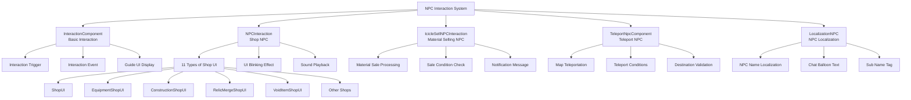

# Game Mechanics - Interaction System - NPC Interaction

## Overview
The NPC interaction system is a core game mechanism that enables players to interact with various NPCs in towns. It provides diverse functionalities including shop operations, material sales, teleport services, and tutorial guides, delivering an immersive game experience through intuitive interaction UI and localization systems.

## NPC Interaction System Structure

### System Architecture


## Related File Paths

### Core NPC Interaction Components
```
RootDesk/MyDesk/Components/Town/
├── NPCInteraction.mlua                 # Shop NPC interaction
└── NPCInteraction.codeblock           # Shop NPC visual

RootDesk/MyDesk/Components/
├── IcicleSellNPCInteraction.mlua      # Material selling NPC
├── IcicleSellNPCInteraction.codeblock # Material selling NPC visual
└── Localization/
    ├── LocalizationNPC.mlua           # NPC localization
    ├── LocalizationNPC.codeblock      # NPC localization visual
    ├── LocalizationUIModel.mlua       # UI model localization
    └── LocalizationUIModel.codeblock  # UI model visual
```

### Portal and Teleport NPCs
```
RootDesk/MyDesk/Components/Portals/
├── TeleportNpcComponent.mlua          # Teleport NPC component
├── TeleportNpcComponent.codeblock     # Teleport NPC visual
├── Portal_TownToTownInteraction.mlua  # Town-to-town movement
├── Portal_TownToTownInteraction.codeblock # Town-to-town visual
├── PortalToMineInteraction.mlua       # Town→mine movement
├── PortalToMineInteraction.codeblock  # Town→mine visual
├── PortalToTownInteraction.mlua       # →town movement
└── PortalToTownInteraction.codeblock  # →town visual
```

### NPC Models and Assets
```
RootDesk/MyDesk/Models/NPCs/
├── Model_NPC_Standard.model           # Standard NPC model
├── Model_NPC_Adventure.model          # Adventure NPC model
├── Model_NPC_Merchant.model           # Merchant NPC model
├── Model_NPC_Blacksmith.model         # Blacksmith NPC model
├── Model_NPC_MagicShop.model          # Magic shop NPC model
├── Model_NPC_TeleportMaster.model     # Teleport master NPC
├── Model_NPC_IcicleSeller.model       # Icicle seller NPC
├── Model_NPC_ConstructionMaster.model # Construction master NPC
├── Model_NPC_RelicMaster.model        # Relic master NPC
├── Model_NPC_VoidMerchant.model       # Void merchant NPC
└── Model_NPC_TimeKeeper.model         # Time keeper NPC
```

### Tutorial and Dialog System
```
RootDesk/MyDesk/Logic/
├── TutorialGuide.mlua                 # Tutorial guide system
└── TutorialGuide.codeblock           # Tutorial guide visual

RootDesk/MyDesk/DataSets/
├── NPCTable.csv                       # NPC basic information
├── NPCTable.userdataset              # NPC dataset
├── TutorialDialog.csv                 # Tutorial dialog
└── TutorialDialog.userdataset        # Tutorial dialog dataset
```

## NPCInteraction - Shop NPC System

### Core Data Structure
```lua
@Component
script NPCInteraction extends InteractionComponent

    property Entity TargetUI = nil              -- Target UI to open
    property string UIOpenSound = ""            -- Interaction sound
    property boolean SetSortingLayerAutomately = true  -- Auto set sorting layer
```

### Shop-specific UI Refresh
```lua
@ExecSpace("Client")
method void RefreshTargetUI()
    -- ShopUI (general shop)
    if self.TargetUI == _EntityService:GetEntity("c22b0f71-6a6d-40bb-a02e-47e4b03b906f") then
        self.TargetUI.ShopUI:RefreshUI()
        
    -- EquipmentShopUI (equipment shop)
    elseif self.TargetUI == _EntityService:GetEntityByPath("/ui/EquipShopGroup/EquipShop") then
        -- Equipment ability guide panel blinking effect
        local equipmentAbiltiyGuidePanel = _EntityService:GetEntityByPath("/ui/EquipShopGroup/EquipShop/Panel/DescPanel")
        local guideText = equipmentAbiltiyGuidePanel:GetChildByName("Desc")
        equipmentAbiltiyGuidePanel.Enable = true
        
        local alpha = 1
        local flickeringUp = function()
            alpha = alpha + 1/20
            equipmentAbiltiyGuidePanel.SpriteGUIRendererComponent.Color.a = alpha
            guideText.TextComponent.FontColor.a = alpha
        end
        
        local flickeringDown = function()
            alpha = alpha - 1/20
            equipmentAbiltiyGuidePanel.SpriteGUIRendererComponent.Color.a = alpha
            guideText.TextComponent.FontColor.a = alpha
        end
        
        -- 60-frame blinking animation
        for i=1, 60 do
            if (i >= 1 and i <= 10) or (i >= 21 and i <= 30) or (i >= 41 and i <= 50) then
                _TimerService:SetTimerOnce(flickeringDown, 0.04 * i)
            else
                _TimerService:SetTimerOnce(flickeringUp, 0.04 * i)
            end
        end
        
        self.TargetUI.EquipmentShopUI:RefreshUI()
        
    -- Specialized handling for each shop
    elseif self.TargetUI == _EntityService:GetEntityByPath("/ui/RelicGachaShopGroup/RelicGachaShop") then
        self.TargetUI.RelicGachaShopUI:RefreshUI()
    elseif self.TargetUI == _EntityService:GetEntityByPath("/ui/ConstructionGroup/ConstructionShop") then
        self.TargetUI.ConstructionShopUI:RefreshUI()
    elseif self.TargetUI == _EntityService:GetEntityByPath("/ui/RelicMergeGroup/RelicMergeShop") then
        self.TargetUI.RelicMergeShopUI:SelectGrade(0)
        self.TargetUI.RelicMergeShopUI:RefreshMainPanel()
    elseif self.TargetUI == _EntityService:GetEntityByPath("/ui/VoidItemGroup/VoidItemShop") then
        self.TargetUI.VoidItemShopUI:RefreshUI()
    -- ... other shops
    end
end
```

### Interaction Event Handling
```lua
@ExecSpace("Client")
method void OnInteractionEvent()
    if self.TargetUI and self.TargetUI.Enable == false then
        
        -- Play UI open sound
        if self.UIOpenSound ~= nil and self.UIOpenSound ~= "" then
            _SoundService:PlaySound(self.UIOpenSound, 0.7)
        end
        
        -- Auto set sorting layer
        if self.SetSortingLayerAutomately then
            self.TargetUI.SortingLayer = 30
        end
        
        -- Refresh and activate target UI
        self:RefreshTargetUI()
        self.TargetUI.Enable = true
        
        -- UI open log
        log("NPC interaction: " .. self.TargetUI.Path .. " opened")
    end
end
```

### Supported Shop UI List
```lua
-- All shop UIs supported by NPCInteraction
local supportedShops = {
    "ShopUI",                    -- General shop
    "EquipmentShopUI",           -- Equipment shop  
    "MythicEquipmentShopUI",     -- Mythic equipment shop
    "RelicGachaShopUI",          -- Relic gacha shop
    "ConstructionShopUI",        -- Construction shop
    "AccessoryMergeShopUI",      -- Accessory merge shop
    "RebornUI",                  -- Reborn system
    "VoidItemShopUI",            -- Void item shop
    "KronosClockTowerUI",        -- Kronos clock tower
    "RelicMergeShopUI",          -- Relic merge shop
    "GemShopUI"                  -- Gem shop (expandable)
}
```

## IcicleSellNPCInteraction - Material Selling NPC

### Core Features and Data Structure
```lua
@Component
script IcicleSellNPCInteraction extends InteractionComponent

    property number Price = 10           -- Material selling price
    property boolean EnableSell = true   -- Sale activation status

    @ExecSpace("ClientOnly")
    method void OnBeginPlay()
        self.ShowActionInfo = false  -- Hide default action info
    end
```

### Material Selling Logic
```lua
@ExecSpace("Client")
method void OnInteractionEvent()
    local player = _UserService.LocalPlayer
    
    if player.PlayerStateAtStage.HavingMaterialNum > 0 then
        -- Sell all materials if player has any
        player.PlayerStateAtStage:SellAllMaterial()
        
        -- Display sale completion message
        local soldAmount = player.PlayerStateAtStage.HavingMaterialNum
        local totalPrice = soldAmount * self.Price
        
        _UIToast:ShowMessage(string.format("Sold %d materials for %d gold", 
            soldAmount, totalPrice))
    else
        -- Display no materials message
        _UIToast:ShowMessage(_LocalizationService:GetText("Message_NoIcicleMaterial"))
    end
end
```

### Interaction Guide UI System
```lua
@ExecSpace("ClientOnly")
handler HandleInteractionEnterEvent(InteractionEnterEvent event)
    local InteractionEntity = event.InteractionEntity
    
    -- Create guide key UI
    local guideKeyWorldUI = self.Entity:GetChildByName("Guide_Key")
    if guideKeyWorldUI == nil then
        local spawnPos = Vector3(0, 1.25, 0)  -- 1.25m above NPC
        local guideUI = _SpawnService:SpawnByModelId(
            "model://85ad2718-739a-4bf9-aee4-f439cda53303", 
            "Guide_Key", spawnPos, self.Entity)
            
        -- Set guide text
        guideUI:GetChildByName("UIText").TextComponent.Text = 
            _LocalizationService:GetText("InteractionGuide_SellIcicle")
        
        -- Show only to local player
        if InteractionEntity ~= _UserService.LocalPlayer then
            guideUI.Enable = false
        else
            guideUI.Enable = true
        end
    else
        guideKeyWorldUI.Enable = true
    end
end

@ExecSpace("ClientOnly")
handler HandleInteractionExitEvent(InteractionExitEvent event)
    -- Hide guide UI when leaving interaction area
    local guideKeyWorldUI = self.Entity:GetChildByName("Guide_Key")
    if guideKeyWorldUI ~= nil then
        guideKeyWorldUI.Enable = false
    end
end
```

## LocalizationNPC - NPC Localization System

### NPC Text Localization
```lua
@Component
script LocalizationNPC extends Component

    property string key = ""    -- Localization key

    method void OnBeginPlay()
        if self:IsClient() then
            self.key = self.Entity.Path  -- Use entity path as key
            self:Localize()
        end
    end
```

### NPCTable-based Localization
```lua
@ExecSpace("ClientOnly")
method void Localize()
    local data = _DataService:GetTable("NPCTable")
    local keys = data:GetColumn(1)  -- Get key list from first column
    
    for i=1, #keys do
        if self.key == keys[i] then
            -- NPC name localization
            if data:GetCell(i, "Key_Name") ~= "none" then
                self.Entity.NameTagComponent.Name = 
                    _LocalizationService:GetText(data:GetCell(i, "Key_Name"))
            end
            
            -- Chat balloon localization
            if data:GetCell(i, "Key_ChatBalloon") ~= "none" then
                self.Entity.ChatBalloonComponent.Message = 
                    _LocalizationService:GetText(data:GetCell(i, "Key_ChatBalloon"))
            end
            
            -- Sub name tag localization
            if data:GetCell(i, "Tag") ~= "" then
                local subNameTag = self.Entity:GetChildByName("SubNameTag")
                if subNameTag then
                    subNameTag.NameTagComponent.Name = 
                        _LocalizationService:GetText(data:GetCell(i, "Tag"))
                end
            end
            
            return
        end
    end
end
```

### Manual Localization Method (Backup)
```lua
@ExecSpace("ClientOnly")
method void SetLocalization()
    -- Path-based key generation
    local nameKey = self.key .. "_Type_Name"
    local chatBalloonKey = self.key .. "_Type_Chatballoon"
    
    -- Apply localization per component
    if isvalid(self.Entity.NameTagComponent) then
        local localizedName = _LocalizationService:GetText(nameKey)
        self.Entity.NameTagComponent.Name = localizedName
    end
    
    if isvalid(self.Entity.ChatBalloonComponent) then
        local localizedMessage = _LocalizationService:GetText(chatBalloonKey)
        self.Entity.ChatBalloonComponent.Message = localizedMessage
    end
    
    -- Sub name tag localization
    local subNameTag = self.Entity:GetChildByName("SubNameTag")
    if isvalid(subNameTag) then
        local subNameKey = subNameTag.Path .. "_Type_NameTag"
        local localizedSubName = _LocalizationService:GetText(subNameKey)
        subNameTag.NameTagComponent.Name = localizedSubName
    end
end
```

## TutorialGuide - Dialog and Tutorial System

### Dialog Queue System
```lua
-- Dialog management in TutorialGuide.mlua
local SpeakerQueue = {}      -- Speaker queue
local MessageQueue = {}      -- Message queue

method void AddTutorialDialog(string speaker, string message)
    table.insert(SpeakerQueue, speaker)
    table.insert(MessageQueue, message)
end

method void ShowNextMessage()
    if SpeakerQueue[1] ~= nil then
        local fromField = _EntityService:GetEntity("f65d7ce8-7ef4-424b-ab92-2ff6f0f3ccf2")
        local messageField = _EntityService:GetEntity("a38d3a6d-dd4c-465a-9882-a829dcb1bd99")
        local npcImageField = _EntityService:GetEntity("3d6d2ca0-329b-4756-84ff-0ecf6c595c58")
        
        -- Replace NPC image
        if SpeakerQueue[1] == "TutorialNPC_1" then
            npcImageField.SpriteGUIRendererComponent.ImageRUID = "05b924095af34482bd582448ad2ccc65"
        elseif SpeakerQueue[1] == "TutorialNPC_2" then
            npcImageField.SpriteGUIRendererComponent.ImageRUID = "2193e3721cd3441e93a67bac90b5537d"
        elseif SpeakerQueue[1] == "TutorialNPC_3" then
            npcImageField.SpriteGUIRendererComponent.ImageRUID = "bc8fb37b35a7400ba3f539ad46155cec"
        end
        
        -- Display speaker name
        fromField.TextComponent.Text = "From: " .. _LocalizationService:GetText(SpeakerQueue[1])
        
        -- Activate tutorial group
        local tutorialGroup = _EntityService:GetEntity("44202060-27a8-4974-8ff8-3f5dd0dc47b2")
        tutorialGroup:SetEnable(true)
        
        -- Message typing effect
        self:PlayTypingAnimation(MessageQueue[1])
    end
end
```

### Typing Animation
```lua
method void PlayTypingAnimation(string message)
    local messageField = _EntityService:GetEntity("a38d3a6d-dd4c-465a-9882-a829dcb1bd99")
    local playNextButton = _EntityService:GetEntityByPath("/ui/TutorialGroup/PopupType/PlayNextButton")
    local clickIcon = _EntityService:GetEntityByPath("/ui/TutorialGroup/PopupType/ChatBallonImage")
    local exitButton = _EntityService:GetEntityByPath("/ui/TutorialGroup/PopupType/ExitButton")
    
    -- Disable buttons
    playNextButton.Enable = false
    clickIcon.Enable = false  
    exitButton.Enable = false
    
    -- Initialize message field
    messageField.Enable = true
    messageField.TextComponent.Text = ""
    
    -- Character-by-character typing effect
    local localizedMessage = _LocalizationService:GetText(message)
    for i=1, utf8.len(localizedMessage) do
        local setDialogFragment = function()
            local fragment = utf8.sub(localizedMessage, 1, i)
            messageField.TextComponent.Text = fragment
            
            -- Play typing sound
            if i % 3 == 0 then  -- Every 3 characters
                _SoundService:PlaySound("typing_sound", 0.3)
            end
        end
        
        _TimerService:SetTimerOnce(setDialogFragment, i * 0.05)  -- 50ms interval
    end
    
    -- Enable buttons after typing completes
    local enableButtons = function()
        playNextButton.Enable = true
        clickIcon.Enable = true
        exitButton.Enable = true
    end
    
    _TimerService:SetTimerOnce(enableButtons, utf8.len(localizedMessage) * 0.05 + 0.5)
end
```

## TeleportNpcComponent - Teleport NPC

### Teleport Service
```lua
@Component
script TeleportNpcComponent extends Component

    property string destinationMap = ""     -- Destination map name
    property Vector3 teleportPosition = Vector3.zero  -- Teleport position
    property number teleportCost = 0        -- Teleport cost

    method void OnInteractionEvent()
        local player = _UserService.LocalPlayer
        
        -- Check teleport cost
        if self.teleportCost > 0 then
            if player.PlayerData.Money < self.teleportCost then
                _UIToast:ShowMessage(string.format("Insufficient gold. (%d gold required)", self.teleportCost))
                return
            end
            
            -- Deduct cost
            player.PlayerData:UseMoney(self.teleportCost)
        end
        
        -- Execute teleportation
        if self.destinationMap ~= "" then
            _TeleportService:TeleportToMap(self.destinationMap, self.teleportPosition)
            
            -- Teleport sound and effects
            _SoundService:PlaySound("teleport_sound", 1.0)
            self:PlayTeleportEffect()
        end
    end
    
    method void PlayTeleportEffect()
        -- Play teleport effect particle
        local teleportEffect = _EntityService:GetEntityByPath("/Effects/TeleportEffect")
        if teleportEffect then
            teleportEffect.ParticleSystemComponent:Play()
            
            -- Clean up effect after 3 seconds
            local cleanupEffect = function()
                teleportEffect.ParticleSystemComponent:Stop()
            end
            _TimerService:SetTimerOnce(cleanupEffect, 3.0)
        end
    end
```

## Interaction Trigger System

### Trigger Area Management
```lua
-- Basic trigger system from InteractionComponent
method void OnTriggerEnter(Entity triggerEntity)
    if triggerEntity.TagComponent and triggerEntity.TagComponent.Tags[1] == "player" then
        -- Player enters interaction area
        local interactionEnterEvent = InteractionEnterEvent()
        interactionEnterEvent.InteractionEntity = triggerEntity
        self.Entity:SendEvent(interactionEnterEvent)
        
        -- Show guide UI
        self:ShowInteractionGuide(true)
    end
end

method void OnTriggerExit(Entity triggerEntity)
    if triggerEntity.TagComponent and triggerEntity.TagComponent.Tags[1] == "player" then
        -- Player leaves interaction area
        local interactionExitEvent = InteractionExitEvent()
        interactionExitEvent.InteractionEntity = triggerEntity
        self.Entity:SendEvent(interactionExitEvent)
        
        -- Hide guide UI
        self:ShowInteractionGuide(false)
    end
end

method void ShowInteractionGuide(boolean show)
    local guideUI = self.Entity:GetChildByName("InteractionGuide")
    if guideUI then
        guideUI.Enable = show
        
        if show then
            -- Set guide text
            local guideText = guideUI:GetChildByName("GuideText")
            if guideText then
                guideText.TextComponent.Text = _LocalizationService:GetText("Interaction_Guide_PressF")
            end
            
            -- Blinking effect
            self:PlayGuideFlickeringEffect(guideUI)
        end
    end
end

method void PlayGuideFlickeringEffect(Entity guideUI)
    local flickerStep = function(frame)
        local alpha = (math.sin(frame * 0.3) + 1) / 2  -- Value between 0.0 ~ 1.0
        guideUI.SpriteGUIRendererComponent.Color.a = alpha
    end
    
    -- Continuous blinking effect (while in interaction area)
    for i=1, 60 do  -- 1 second blink
        _TimerService:SetTimerOnce(function() flickerStep(i) end, i/60)
    end
end
```

### Key Input Handling
```lua
-- Player input handling system
method void HandleInteractionInput()
    if Input:GetKeyDown(KeyCode.F) then
        local nearbyNPCs = self:GetNearbyInteractableNPCs()
        
        if #nearbyNPCs > 0 then
            -- Interact with closest NPC
            local closestNPC = self:GetClosestNPC(nearbyNPCs)
            
            local interactionEvent = InteractionEvent()
            interactionEvent.InteractionEntity = _UserService.LocalPlayer
            closestNPC:SendEvent(interactionEvent)
        end
    end
end

method table GetNearbyInteractableNPCs()
    local playerPosition = _UserService.LocalPlayer.Transform.Position
    local interactionRange = 3.0  -- NPCs within 3 meters
    local nearbyNPCs = {}
    
    -- Search all NPC entities
    local allNPCs = _EntityService:GetEntitiesByTag("NPC")
    for _, npc in ipairs(allNPCs) do
        local distance = Vector3.Distance(playerPosition, npc.Transform.Position)
        if distance <= interactionRange and npc:HasComponent("InteractionComponent") then
            table.insert(nearbyNPCs, {npc = npc, distance = distance})
        end
    end
    
    return nearbyNPCs
end
```

## NPC Placement and Management

### NPC Configuration by Town
```lua
-- NPC placement information by town
local townNPCConfigs = {
    ["Town"] = {
        {type = "ShopNPC", position = Vector3(10, 0, 5), targetUI = "ShopGroup"},
        {type = "TeleportNPC", position = Vector3(15, 0, 0), destination = "Town2"}
    },
    ["Town2"] = {
        {type = "EquipmentNPC", position = Vector3(8, 0, 3), targetUI = "EquipShopGroup"},
        {type = "ConstructionNPC", position = Vector3(12, 0, 7), targetUI = "ConstructionGroup"}
    },
    ["Town5"] = {
        {type = "IcicleSellNPC", position = Vector3(6, 0, 4), sellPrice = 10},
        {type = "EmoticonNPC", position = Vector3(14, 0, 8), targetUI = "EmoticonGroup"}
    }
    -- ... other towns
}

method void SpawnTownNPCs(string townName)
    local npcConfigs = townNPCConfigs[townName]
    if not npcConfigs then return end
    
    for _, config in ipairs(npcConfigs) do
        local npc = self:SpawnNPC(config.type, config.position)
        
        -- Apply NPC configuration
        if config.targetUI then
            npc.NPCInteraction.TargetUI = _EntityService:GetEntityByPath("/ui/"..config.targetUI)
        end
        
        if config.sellPrice then
            npc.IcicleSellNPCInteraction.Price = config.sellPrice
        end
        
        if config.destination then
            npc.TeleportNpcComponent.destinationMap = config.destination
        end
    end
end
```

### Dynamic NPC Management
```lua
-- Conditional NPC activation/deactivation
method void UpdateNPCAvailability()
    local player = _UserService.LocalPlayer
    
    -- Unlock NPCs based on player level
    local playerLevel = player.PlayerData.Level
    
    if playerLevel >= 5 then
        self:EnableNPC("EquipmentShopNPC")
    end
    
    if playerLevel >= 10 then
        self:EnableNPC("ConstructionNPC")
    end
    
    if playerLevel >= 20 then
        self:EnableNPC("VoidMerchantNPC")
    end
    
    -- Change NPCs based on quest progress
    local questProgress = player.PlayerQuest.currentQuestProgress
    
    if questProgress >= 50 then
        self:UpdateNPCDialog("TutorialNPC", "Quest_Progress_50_Dialog")
    end
end

method void EnableNPC(string npcName)
    local npc = _EntityService:GetEntityByName(npcName)
    if npc then
        npc.Enable = true
        
        -- NPC appearance effect
        self:PlayNPCAppearanceEffect(npc)
    end
end

method void PlayNPCAppearanceEffect(Entity npc)
    -- Sparkling effect when NPC appears
    local appearanceEffect = _SpawnService:SpawnByModelId(
        "model://appearance_effect", "AppearanceEffect", 
        npc.Transform.Position, npc)
        
    appearanceEffect.ParticleSystemComponent:Play()
    
    -- Remove effect after 3 seconds
    local cleanupEffect = function()
        appearanceEffect:Destroy()
    end
    _TimerService:SetTimerOnce(cleanupEffect, 3.0)
end
```

## Performance Optimization

### NPC Visibility Management
```lua
-- Reduce update frequency for off-screen NPCs
method void OptimizeNPCUpdates()
    local playerPosition = _UserService.LocalPlayer.Transform.Position
    local allNPCs = _EntityService:GetEntitiesByTag("NPC")
    
    for _, npc in ipairs(allNPCs) do
        local distance = Vector3.Distance(playerPosition, npc.Transform.Position)
        
        if distance > 50 then
            -- Reduce update frequency for distant NPCs
            npc.UpdateInterval = 2.0  -- Update every 2 seconds
        elseif distance > 20 then
            npc.UpdateInterval = 0.5  -- Update every 0.5 seconds
        else
            npc.UpdateInterval = 0.0  -- Default update
        end
    end
end
```

### Memory Management
```lua
-- Release unused NPC dialog resources
method void CleanupNPCResources()
    local inactiveNPCs = self:GetInactiveNPCs()
    
    for _, npc in ipairs(inactiveNPCs) do
        -- Release dialog text cache
        if npc:HasComponent("LocalizationNPC") then
            npc.LocalizationNPC:UnloadCachedText()
        end
        
        -- Release unused UI references
        if npc:HasComponent("NPCInteraction") then
            npc.NPCInteraction:ClearUIReferences()
        end
    end
end
```

## Common Troubleshooting

### When NPC interaction doesn't work
1. Check `InteractionComponent` configuration
2. Verify trigger collider size and position
3. Confirm NPC tag settings (requires `"NPC"` tag)

### When UI doesn't open
1. Verify `TargetUI` path configuration
2. Check target UI activation status
3. Confirm UI refresh method is called

### When localized text doesn't display
1. Check `NPCTable.csv` data
2. Verify localization key mapping
3. Confirm `LocalizationNPC` component configuration

