# Game Mechanics - Interaction System - Portal System

## Overview
The portal system is a core game mechanism that enables players to travel between various maps. It provides diverse movement paths including town-to-town travel, mine entrances, temple exploration, and ruins visits. Each portal features unique travel conditions, recommended levels, and tutorial guides to help guide players through their game progression.

## Portal System Structure

### System Architecture

```mermaid
graph TD
    A[Portal System] --> B[InteractionComponent<br/>Basic Interaction]
    A --> C[Portal_TownToTownInteraction<br/>Town-to-Town Travel]
    A --> D[PortalToMineInteraction<br/>Town→Mine]
    A --> E[PortalToTownInteraction<br/>Mine→Town]
    A --> F[PortalFromMineToMineInteraction<br/>Mine-to-Mine Travel]
    A --> G[TeleportNpcComponent<br/>NPC Teleportation]
    
    B --> H[Interaction Trigger]
    B --> I[Guide UI Display]
    B --> J[Travel Condition Check]
    
    C --> K[TownProgress Condition]
    C --> L[Map Name Display]
    C --> M[Teleport Service]
    
    D --> N[Mining Power Recommendation]
    D --> O[Difficulty Display]
    D --> P[Mine Map Info]
    
    E --> Q[Tutorial Guide]
    E --> R[Inventory Check]
    E --> S[Material Purification]
    
    F --> T[Mine Floor Movement]
    F --> U[Progress-based Restrictions]
    F --> V[Depth-based Difficulty]
    
    G --> W[Destination Setting]
    G --> X[Travel Cost]
    G --> Y[Teleportation Effects]
```


## Related File Paths

### Portal Interaction Components
```
RootDesk/MyDesk/Components/Portals/
├── Portal_TownToTownInteraction.mlua      # Town-to-town portal
├── Portal_TownToTownInteraction.codeblock # Town-to-town visual
├── PortalToMineInteraction.mlua           # Town→mine portal
├── PortalToMineInteraction.codeblock      # Town→mine visual
├── PortalToTownInteraction.mlua           # Mine→town portal
├── PortalToTownInteraction.codeblock      # Mine→town visual
├── PortalFromMineToMineInteraction.mlua   # Mine-to-mine portal
├── PortalFromMineToMineInteraction.codeblock # Mine-to-mine visual
├── PortalToHistoricSiteInteraction.mlua   # Historic site portal
├── PortalToHistoricSiteInteraction.codeblock # Historic site visual
├── PortalToNextHistoricSiteInteraction.mlua # Next historic site portal
├── PortalToNextHistoricSiteInteraction.codeblock # Next historic site visual
├── TeleportNpcComponent.mlua              # NPC teleport service
├── TeleportNpcComponent.codeblock         # NPC teleport visual
├── TeleportTownController.mlua            # Town teleport controller
└── TeleportTownController.codeblock       # Town teleport visual
```

### Portal-related Data Tables
```
RootDesk/MyDesk/DataSets/
├── Map_Town.csv                           # Town map information
├── Map_Town.userdataset                   # Town map dataset
├── Map_Mine.csv                           # Mine map information
├── Map_Mine.userdataset                   # Mine map dataset
├── Map_Temple.csv                         # Temple map information
└── Map_Temple.userdataset                 # Temple map dataset
```

### Portal Guide Models
```
RootDesk/MyDesk/Models/Guide_Key/
├── Model_Guide_Key_F.model                # F key guide
├── Model_Guide_Key_E.model                # E key guide
├── Model_MinePortalGuide.model            # Mine portal guide
├── Model_TownPortalGuide.model            # Town portal guide
└── Model_TeleportGuide.model              # Teleport guide
```

## Portal_TownToTownInteraction - Town-to-Town Travel

### Core Data Structure
```lua
@Component
script Portal_TownToTownInteraction extends InteractionComponent

    @Sync
    property number TownCategory = 0    -- Destination town number (1~10)
```

### Town Entry Condition Check
```lua
@ExecSpace("Server")
method void OnInteractionEvent(Entity player)
    -- TownCategory 1 (main town) is always available
    if self.TownCategory ~= 1 and player.PlayerData.TownProgress[self.TownCategory] == false then
        if self.TownCategory == 10 then
            -- Temple entry condition not met
            _CustomLocalizationLogic:SendLocalizedToastMessageFromServer(
                "Message_CannotEnterTemple", player.OwnerId)
        else
            -- General town entry condition not met (key required)
            _CustomLocalizationLogic:SendLocalizedToastMessageFromServer(
                "Message_CannotEnterBecauseOfKey", player.OwnerId)
        end
        log("Town " .. self.TownCategory .. " condition not met")
        return
    end
    
    -- Execute teleportation if conditions are met
    self:OnInteractionEventOnClient(player.OwnerId)
end
```

### Teleportation Execution
```lua
@ExecSpace("Client")
method void OnInteractionEventOnClient()
    local currentTownIdx = string.sub(self.Entity.Parent.Name, 5, -1)
    if tonumber(currentTownIdx) == nil then
        currentTownIdx = "1"  -- Default value
    end
    
    local Player = _UserService.LocalPlayer
    
    if self.TownCategory == 1 then
        -- Move to main town
        _TeleportService:TeleportToEntityPath(Player, 
            "/maps/Town/Portal_TownToTown_" .. currentTownIdx)
    else
        -- Move to specific town
        local destinationPath = string.format("/maps/Town%d/Portal_TownToTown_%s", 
            math.floor(self.TownCategory), currentTownIdx)
        _TeleportService:TeleportToEntityPath(Player, destinationPath)
        
        log("Teleport path: " .. destinationPath)
    end
end
```

### Portal Guide UI Creation
```lua
@ExecSpace("ClientOnly")
method void OnBeginPlay()
    local portalGuideUI = self.Entity:GetChildByName("MinePortalGuide")
    
    if portalGuideUI == nil then
        local spawnPos = Vector3(0, 1.7, 0)  -- 1.7m above portal
        local guideUI = _SpawnService:SpawnByModelId(
            "model://a3e04974-9f26-4033-a3a7-cffe3b0c0cf9", 
            "MinePortalGuide", spawnPos, self.Entity)
        
        -- Display destination town name
        local mapTable = _DataService:GetTable("Map_Town")
        local mapName = _LocalizationService:GetText(string.format("%d", 7200 + self.TownCategory))
        guideUI.TextComponent.Text = mapName
    else
        portalGuideUI.Enable = true
    end
end
```

## PortalToMineInteraction - Town→Mine Movement

### Core Data Structure
```lua
@Component
script PortalToMineInteraction extends InteractionComponent

    property string Tag = ""    -- Mine map identifier (e.g. "Mine1", "Mine2")
```

### Recommended Mining Power System
```lua
@ExecSpace("ClientOnly")
method void OnBeginPlay()
    local portalGuideUI = self.Entity:GetChildByName("TownToMinePortalGuide")
    local mapTable = _DataService:GetTable("Map_Mine")
    
    if portalGuideUI == nil then
        local spawnPos = Vector3(0, 2.15, 0)  -- 2.15m above portal
        local guideUI = _SpawnService:SpawnByModelId(
            "model://588a8382-990c-4d45-8cfc-6b00b646b02b", 
            "TownToMinePortalGuide", spawnPos, self.Entity)
        
        -- Display mine name
        local mineIndex = tonumber(string.sub(self.Tag, 5, -1)) * 4 - 3  -- Mine1 → 1, Mine2 → 5
        local mapName = mapTable:GetCell(mineIndex, 2)
        guideUI:GetChildByName("ModelEntrancePanelMine").TextComponent.Text = 
            _LocalizationService:GetText(mapName)
        
        -- Calculate and display recommended mining power
        self:UpdateRecommendedPower(guideUI, mineIndex)
    else
        portalGuideUI.Enable = true
        -- Update recommended mining power for existing UI
        local mineIndex = tonumber(string.sub(self.Tag, 5, 5)) * 4 - 3
        self:UpdateRecommendedPower(portalGuideUI, mineIndex)
    end
end

method void UpdateRecommendedPower(Entity guideUI, number mineIndex)
    local mapTable = _DataService:GetTable("Map_Mine")
    local minPower = tonumber(mapTable:GetCell(mineIndex, 5))
    local maxPower = tonumber(mapTable:GetCell(mineIndex, 6))
    local userPower = _UserService.LocalPlayer.PlayerIngameData.MiningPower
    
    -- Difficulty assessment
    local recommendInfo = ""
    if minPower <= userPower and userPower < maxPower then
        recommendInfo = "[" .. _LocalizationService:GetText("Recommend") .. "]"  -- Recommended
    elseif minPower > userPower then
        recommendInfo = "[" .. _LocalizationService:GetText("Hard") .. "]"       -- Hard
    else
        recommendInfo = "[" .. _LocalizationService:GetText("Easy") .. "]"       -- Easy
    end
    
    -- Set recommended mining power text
    local powerRangeText = string.format("%s~%s", 
        _ThousandsSeparator:ConvertToMetricPrefixString(minPower),
        _ThousandsSeparator:ConvertToMetricPrefixString(maxPower))
    
    guideUI:GetChildByName("WarningText").TextComponent.Text = 
        _LocalizationService:GetText("RecommendedPower") .. "\n" ..
        powerRangeText .. "\n" .. recommendInfo
end
```

### Mine Entry Processing
```lua
@ExecSpace("Client")
method void OnInteractionEvent()
    local Player = _UserService.LocalPlayer
    
    -- Teleport to mine map
    local destinationPath = "/maps/" .. self.Tag .. "_1/Portal_MineToTown"
    _TeleportService:TeleportToEntityPath(Player, destinationPath)
    
    -- Mine entry sound
    _SoundService:PlaySound("portal_enter_sound", 0.8)
    
    log("Mine entry: " .. self.Tag)
end
```

## PortalToTownInteraction - Mine→Town Movement

### Core Data Structure
```lua
@Component
script PortalToTownInteraction extends InteractionComponent

    property number TownCategory = 0        -- Destination town number
    property boolean canInteraction = false -- Interaction availability

    @ExecSpace("ClientOnly")
    method void OnBeginPlay()
        self.ShowActionInfo = false  -- Hide default action info
    end
```

### Tutorial Guide Integration
```lua
@ExecSpace("Client")
method void OnInteractionEvent()
    -- Cannot interact when dead
    if _UserService.LocalPlayer.PlayerIngameData.isIngame == false then
        return
    end
    
    -- Tutorial guide 1: Approach return robot empty-handed
    if self.Entity.Path == "/maps/Mine1_1/Model_NPC_ReturnRobo" and 
       _TutorialGuide.IsPlayed[1] == false then
        
        local playerInvenStorage = _UserService.LocalPlayer.PlayerBackpack.storageList
        local haveItem = false
        
        -- Check if there are items in inventory
        for i=1, #playerInvenStorage do
            if playerInvenStorage[i] > 0 then
                haveItem = true
                break
            end
        end
        
        -- Play tutorial if no items
        if haveItem == false then
            _TutorialGuide:PlayGuide(1)
            return
        end
    end
    
    -- Tutorial guide 2: Return with items
    if self.Entity.Path == "/maps/Mine1_1/Model_NPC_ReturnRobo" and 
       _TutorialGuide.IsPlayed[2] == false then
        _TutorialGuide:AddCondition(2)
    end
    
    -- Execute actual town teleportation
    self:ExecuteTownTeleport()
end
```

### Material Purification and Town Movement
```lua
method void ExecuteTownTeleport()
    local Player = _UserService.LocalPlayer
    
    -- Purify unpurified materials
    if Player.PlayerRelic.HavingDirtyItem then
        Player.PlayerRelic:Purifying()  -- Purify relics
    end
    
    if Player.PlayerStateAtStage.HavingMaterialNum > 0 then
        -- Convert mine materials to gold for storage
        Player.PlayerStateAtStage:ConvertMaterialToGold()
    end
    
    -- Determine destination town
    local destinationTown = "Town"
    if self.TownCategory > 1 then
        destinationTown = "Town" .. tostring(self.TownCategory)
    end
    
    -- Teleport to town
    local destinationPath = "/maps/" .. destinationTown .. "/Portal_MineToTown"
    _TeleportService:TeleportToEntityPath(Player, destinationPath)
    
    -- Town return sound
    _SoundService:PlaySound("town_return_sound", 0.8)
    
    log("Town return: " .. destinationTown)
end
```

## PortalFromMineToMineInteraction - Mine-to-Mine Movement

### Floor Movement System
```lua
@Component
script PortalFromMineToMineInteraction extends InteractionComponent

    property number targetFloor = 0      -- Target floor
    property number currentFloor = 0     -- Current floor
    property boolean isDownward = true   -- Downward movement flag

    method void OnInteractionEvent()
        local Player = _UserService.LocalPlayer
        
        -- Check movement conditions
        if not self:CanMoveToFloor(self.targetFloor) then
            self:ShowMovementRestrictionMessage()
            return
        end
        
        -- Execute floor movement
        self:ExecuteFloorMovement(Player)
    end
    
    method boolean CanMoveToFloor(number floor)
        local Player = _UserService.LocalPlayer
        
        -- Downward movement: check mining power
        if self.isDownward then
            local requiredPower = self:GetRequiredMiningPower(floor)
            if Player.PlayerIngameData.MiningPower < requiredPower then
                return false
            end
        end
        
        -- Upward movement: always allowed
        return true
    end
    
    method void ExecuteFloorMovement(Entity player)
        local mineType = string.sub(self.Entity.Parent.Name, 1, 5)  -- "Mine1", "Mine2", etc.
        local destinationPath = string.format("/maps/%s_%d/Portal_FloorEntrance", 
            mineType, self.targetFloor)
        
        _TeleportService:TeleportToEntityPath(player, destinationPath)
        
        -- Floor movement effect
        self:PlayFloorMovementEffect()
        
        log(string.format("Mine floor movement: Floor %d → Floor %d", self.currentFloor, self.targetFloor))
    end
```

## TeleportNpcComponent - NPC Teleportation Service

### Basic Teleportation Service Structure
```lua
@Component
script TeleportNpcComponent extends Component

    property string destinationMap = ""        -- Destination map
    property Vector3 teleportPosition = Vector3.zero  -- Teleport coordinates
    property number teleportCost = 100         -- Teleport cost (gold)
    property boolean requiresUnlock = false    -- Unlock requirement flag

    method void OnInteractionEvent()
        local Player = _UserService.LocalPlayer
        
        -- Check unlock conditions
        if self.requiresUnlock and not self:IsDestinationUnlocked() then
            _UIToast:ShowMessage(_LocalizationService:GetText("Message_DestinationLocked"))
            return
        end
        
        -- Check cost and deduct payment
        if not self:ProcessTeleportPayment(Player) then
            return
        end
        
        -- Execute teleportation
        self:ExecuteTeleport(Player)
    end
    
    method boolean ProcessTeleportPayment(Entity player)
        if self.teleportCost > 0 then
            if player.PlayerData.Money < self.teleportCost then
                local message = string.format("Insufficient gold. (%s gold required)", 
                    _ThousandsSeparator:ConvertToMetricPrefixString(self.teleportCost))
                _UIToast:ShowMessage(message)
                return false
            end
            
            -- Deduct cost
            player.PlayerData:UseMoney(self.teleportCost)
            
            local paymentMessage = string.format("Paid %s gold", 
                _ThousandsSeparator:ConvertToMetricPrefixString(self.teleportCost))
            _UIToast:ShowMessage(paymentMessage)
        end
        
        return true
    end
    
    method void ExecuteTeleport(Entity player)
        if self.destinationMap ~= "" then
            if self.teleportPosition ~= Vector3.zero then
                -- Teleport to specific coordinates
                _TeleportService:TeleportToPosition(player, self.destinationMap, self.teleportPosition)
            else
                -- Teleport to default spawn point
                _TeleportService:TeleportToMap(player, self.destinationMap)
            end
            
            -- Teleportation effects and sound
            self:PlayTeleportEffects()
            
            log("NPC teleportation: " .. self.destinationMap)
        end
    end
    
    method void PlayTeleportEffects()
        -- Teleportation sound
        _SoundService:PlaySound("npc_teleport_sound", 1.0)
        
        -- Teleportation particle effect
        local teleportEffect = _EntityService:GetChildByName("TeleportEffect")
        if teleportEffect and teleportEffect.ParticleSystemComponent then
            teleportEffect.ParticleSystemComponent:Play()
            
            -- Clean up effect after 3 seconds
            local cleanupEffect = function()
                teleportEffect.ParticleSystemComponent:Stop()
            end
            _TimerService:SetTimerOnce(cleanupEffect, 3.0)
        end
    end
```

## TeleportTownController - Town Teleportation Controller

### Quick Town Travel System
```lua
@Component
script TeleportTownController extends Component

    property table townDestinations = {}     -- Available town list
    property number currentTown = 1          -- Current town

    method void InitializeTownDestinations()
        local Player = _UserService.LocalPlayer
        self.townDestinations = {}
        
        -- Add only unlocked towns to list
        for i=1, 10 do
            if i == 1 or Player.PlayerData.TownProgress[i] == true then
                local townInfo = {
                    index = i,
                    name = self:GetTownName(i),
                    cost = self:GetTeleportCost(i),
                    isSpecial = (i == 10)  -- Temple
                }
                table.insert(self.townDestinations, townInfo)
            end
        end
    end
    
    method string GetTownName(number townIndex)
        local mapTable = _DataService:GetTable("Map_Town")
        local localizationKey = string.format("%d", 7200 + townIndex)
        return _LocalizationService:GetText(localizationKey)
    end
    
    method number GetTeleportCost(number townIndex)
        -- Distance-based cost calculation
        local baseCost = 50
        local distance = math.abs(townIndex - self.currentTown)
        return baseCost * distance
    end
    
    method void OpenTeleportMenu()
        self:InitializeTownDestinations()
        
        -- Create teleport menu UI
        local teleportMenu = _EntityService:GetEntityByPath("/ui/TeleportMenu")
        if teleportMenu then
            teleportMenu.Enable = true
            self:PopulateTeleportMenu(teleportMenu)
        end
    end
    
    method void PopulateTeleportMenu(Entity menuUI)
        local listPanel = menuUI:GetChildByName("DestinationList")
        
        -- Clear existing list
        listPanel:ClearChildren()
        
        -- Display available destinations
        for i, destination in ipairs(self.townDestinations) do
            local destSlot = self:CreateDestinationSlot(destination, i)
            destSlot.Parent = listPanel
        end
    end
    
    method Entity CreateDestinationSlot(table destination, number index)
        local slotTemplate = _EntityService:GetEntityByPath("/ui/TeleportMenu/DestinationSlotTemplate")
        local newSlot = slotTemplate:Clone("DestSlot_" .. index)
        
        -- Set destination information
        newSlot:GetChildByName("TownName").TextComponent.Text = destination.name
        newSlot:GetChildByName("Cost").TextComponent.Text = 
            string.format("Cost: %s gold", _ThousandsSeparator:ConvertToMetricPrefixString(destination.cost))
        
        -- Display special town (temple) marker
        if destination.isSpecial then
            newSlot:GetChildByName("SpecialMark").Enable = true
        end
        
        -- Set click event
        newSlot.ButtonComponent.OnClick:Connect(function()
            self:TeleportToTown(destination.index, destination.cost)
        end)
        
        return newSlot
    end
    
    method void TeleportToTown(number townIndex, number cost)
        local Player = _UserService.LocalPlayer
        
        -- Check cost and deduct payment
        if Player.PlayerData.Money < cost then
            _UIToast:ShowMessage("Insufficient gold")
            return
        end
        
        Player.PlayerData:UseMoney(cost)
        
        -- Determine destination
        local destinationMap = "Town"
        if townIndex > 1 then
            destinationMap = "Town" .. tostring(townIndex)
        end
        
        -- Execute teleportation
        _TeleportService:TeleportToMap(Player, destinationMap)
        
        -- Close teleport menu
        local teleportMenu = _EntityService:GetEntityByPath("/ui/TeleportMenu")
        teleportMenu.Enable = false
        
        log("Town teleportation: " .. destinationMap)
    end
```

## Portal Guide UI System

### Dynamic Guide Creation
```lua
-- Portal-specific guide UI creation and management
method Entity CreatePortalGuide(Vector3 position, string modelId, string guideName)
    local existingGuide = self.Entity:GetChildByName(guideName)
    
    if existingGuide == nil then
        -- Create new guide UI
        local guideUI = _SpawnService:SpawnByModelId(modelId, guideName, position, self.Entity)
        
        -- Basic settings
        guideUI.Enable = true
        
        return guideUI
    else
        -- Activate existing guide UI
        existingGuide.Enable = true
        return existingGuide
    end
end

method void UpdateGuideText(Entity guideUI, string mainText, string subText)
    -- Set main text
    local mainTextComponent = guideUI:GetChildByName("MainText")
    if mainTextComponent then
        mainTextComponent.TextComponent.Text = mainText
    end
    
    -- Set sub text (recommendation info, etc.)
    local subTextComponent = guideUI:GetChildByName("SubText")
    if subTextComponent and subText ~= "" then
        subTextComponent.TextComponent.Text = subText
        subTextComponent.Enable = true
    end
end

method void PlayGuideAnimation(Entity guideUI)
    -- Guide UI blinking animation
    local flickerStep = function(frame)
        local alpha = (math.sin(frame * 0.2) + 1) / 2  -- Smooth blinking
        
        if guideUI.SpriteGUIRendererComponent then
            guideUI.SpriteGUIRendererComponent.Color.a = alpha
        end
        
        -- Text components blink together
        local textComponents = guideUI:GetComponentsInChildren("TextComponent")
        for _, textComp in ipairs(textComponents) do
            textComp.FontColor.a = alpha
        end
    end
    
    -- Continuous blinking effect
    for i=1, 120 do  -- 2 seconds of blinking
        _TimerService:SetTimerOnce(function() flickerStep(i) end, i/60)
    end
end
```

## Portal Condition System

### Town Progress Management
```lua
-- Town progress management in PlayerData
method void UnlockTown(number townIndex)
    local Player = _UserService.LocalPlayer
    
    if townIndex >= 1 and townIndex <= 10 then
        Player.PlayerData.TownProgress[townIndex] = true
        
        -- Client synchronization
        Player.PlayerData:SaveData()
        
        -- Unlock notification
        local townName = self:GetTownName(townIndex)
        local unlockMessage = string.format("'%s' has been unlocked!", townName)
        _UIToast:ShowMessage(unlockMessage)
        
        log("Town unlocked: " .. townName)
    end
end

method boolean CheckTownRequirement(number townIndex)
    local Player = _UserService.LocalPlayer
    
    -- Main town is always available
    if townIndex == 1 then
        return true
    end
    
    -- Temple (townIndex 10) special conditions
    if townIndex == 10 then
        return self:CheckTempleRequirement()
    end
    
    -- General town conditions (key item or quest completion)
    return Player.PlayerData.TownProgress[townIndex] == true
end

method boolean CheckTempleRequirement()
    local Player = _UserService.LocalPlayer
    
    -- Temple entry conditions (e.g. specific level, quest completion, special item possession)
    local requiredLevel = 30
    local requiredQuest = "MainQuest_Temple"
    
    if Player.PlayerData.Level < requiredLevel then
        return false
    end
    
    -- Other temple entry conditions...
    return Player.PlayerData.TownProgress[10] == true
end
```

### Mine Entry Conditions
```lua
method boolean CheckMineRequirement(string mineTag)
    local Player = _UserService.LocalPlayer
    local mineLevel = tonumber(string.sub(mineTag, 5, -1))  -- "Mine3" → 3
    
    -- Mine1 is always available
    if mineLevel == 1 then
        return true
    end
    
    -- Check if previous mine is cleared
    local previousMine = "Mine" .. (mineLevel - 1)
    if not Player.PlayerData.MineProgress[previousMine] then
        return false
    end
    
    -- Check recommended mining power (warning only, not forced restriction)
    local mapTable = _DataService:GetTable("Map_Mine")
    local mineIndex = mineLevel * 4 - 3
    local minPower = tonumber(mapTable:GetCell(mineIndex, 5))
    
    if Player.PlayerIngameData.MiningPower < minPower then
        -- Show warning message only, entry is still allowed
        _UIToast:ShowMessage("Insufficient mining power. Proceed with caution!")
    end
    
    return true
end
```

## Teleportation Effect System

### Portal Usage Effects
```lua
method void PlayPortalEffect(Entity portal, Entity player)
    -- Portal entry effect
    local enterEffect = portal:GetChildByName("PortalEnterEffect")
    if enterEffect and enterEffect.ParticleSystemComponent then
        enterEffect.ParticleSystemComponent:Play()
    end
    
    -- Player surrounding effect
    local playerEffect = _SpawnService:SpawnByModelId(
        "model://teleport_player_effect", "PlayerTeleportEffect", 
        player.Transform.Position, player)
    
    -- Screen transition effect
    self:PlayScreenTransition()
    
    -- Sound effect
    _SoundService:PlaySound("portal_travel_sound", 1.0)
    
    -- Effect cleanup (after 3 seconds)
    local cleanupEffect = function()
        if playerEffect then
            playerEffect:Destroy()
        end
        if enterEffect then
            enterEffect.ParticleSystemComponent:Stop()
        end
    end
    _TimerService:SetTimerOnce(cleanupEffect, 3.0)
end

method void PlayScreenTransition()
    -- Screen fade out/in effect
    local fadeOverlay = _EntityService:GetEntityByPath("/ui/FadeOverlay")
    if fadeOverlay then
        fadeOverlay.Enable = true
        fadeOverlay.SpriteGUIRendererComponent.Color.a = 0
        
        -- Fade out
        local fadeOutStep = function(progress)
            fadeOverlay.SpriteGUIRendererComponent.Color.a = progress
        end
        
        for i=1, 30 do
            local progress = i / 30.0
            _TimerService:SetTimerOnce(function() fadeOutStep(progress) end, i/60)
        end
        
        -- Start fade in after 1 second
        local startFadeIn = function()
            for i=1, 30 do
                local progress = 1.0 - (i / 30.0)
                _TimerService:SetTimerOnce(function() fadeOutStep(progress) end, 1.0 + i/60)
            end
            
            -- Disable overlay after fade completion
            _TimerService:SetTimerOnce(function() fadeOverlay.Enable = false end, 2.0)
        end
        _TimerService:SetTimerOnce(startFadeIn, 1.0)
    end
end
```

## Performance Optimization

### Portal Visibility Management
```lua
-- Disable guide UI for off-screen portals
method void OptimizePortalGuides()
    local playerPosition = _UserService.LocalPlayer.Transform.Position
    local allPortals = _EntityService:GetEntitiesByTag("Portal")
    
    for _, portal in ipairs(allPortals) do
        local distance = Vector3.Distance(playerPosition, portal.Transform.Position)
        local guideUI = portal:GetChildByName("Guide")
        
        if guideUI then
            if distance > 15 then
                -- Disable guide UI for distant portals
                guideUI.Enable = false
            elseif distance > 5 then
                -- Switch to low-quality guide for medium distance portals
                guideUI:SetQualityLevel(1)  -- Low quality
            else
                -- High-quality guide for nearby portals
                guideUI.Enable = true
                guideUI:SetQualityLevel(3)  -- High quality
            end
        end
    end
end
```

## Common Troubleshooting

### When portals don't work
1. Check `InteractionComponent` configuration
2. Verify trigger collider size and layer settings
3. Confirm destination map path and entity existence

### When teleportation conditions don't work properly
1. Check `TownProgress` data synchronization status
2. Verify condition check logic for errors
3. Confirm server-client data consistency

### When guide UI doesn't display
1. Verify model ID and path settings
2. Check spawn position coordinates
3. Verify UI component activation status

