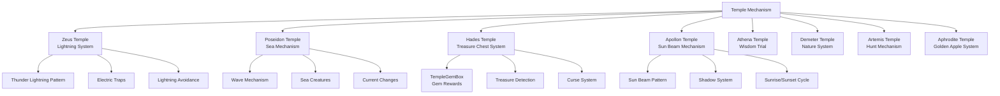

# Game Mechanics - Special Systems - Temple Mechanism

## Overview
The temple mechanism is a unique system operating in special game areas themed around Greek mythology. Each temple provides distinctive mechanisms and interactions reflecting the characteristics of its respective god, offering players challenging yet rewarding experiences.

## Temple Mechanism System Structure

### System Architecture


## Related File Paths

### Temple-specific Components
```
RootDesk/MyDesk/ModelForTemple/RelatedComponents/
├── TemplePegasus.mlua                  # Pegasus interaction (Zeus temple)
├── TemplePegasus.codeblock             # Pegasus visual
├── TempleGemBox.mlua                   # Gem box (Hades temple)
├── TempleGemBox.codeblock              # Gem box visual
├── TempleGoldstatus.mlua               # Golden staff (Plutus)
├── TempleGoldstatus.codeblock          # Golden staff visual
├── TempleFountain.mlua                 # Temple fountain
├── TempleFountain.codeblock            # Temple fountain visual
├── TempleExplorerBox.mlua              # Explorer box
├── TempleExplorerBox.codeblock         # Explorer box visual
└── Other temple-specific objects
```

### Temple-specific Level Design
```
RootDesk/MyDesk/LevelDesign0109~/
├── Zeus/                               # Zeus temple mechanism
│   ├── Model_Zeus_ThunderCloud.model   # Thunder cloud
│   ├── Model_Zeus_Lightning.model      # Lightning
│   └── ZeusThunderManager.mlua         # Lightning manager
├── Poseidon/                           # Poseidon temple mechanism
│   ├── Model_Poseidon_Wave.model       # Wave
│   ├── Model_Poseidon_Trident.model    # Trident
│   └── PoseidonWaveController.mlua     # Wave controller
├── Hades/                              # Hades temple mechanism
│   ├── Model_Hades_TreasureChest.model # Treasure chest
│   ├── Model_Hades_Soul.model          # Soul
│   └── HadesTreasureManager.mlua       # Treasure manager
├── Apollon/                            # Apollon temple mechanism
│   ├── Model_Apollon_SunChariot.model  # Sun chariot
│   ├── Model_Apollon_SunBeam.model     # Sun beam
│   └── ApollonSunController.mlua       # Sun controller
└── Other temples/
```

### Temple Maps and Data
```
map/
├── Temple_Zeus_1.map                   # Zeus temple floor 1
├── Temple_Poseidon_1.map               # Poseidon temple floor 1
├── Temple_Hades_8.map                  # Hades temple floor 8
└── Other temple maps

RootDesk/MyDesk/DataSets/
├── TempleReward.csv                    # Temple reward data
├── TempleReward.userdataset            # Temple reward dataset
├── TempleMechanism.csv                 # Temple mechanism settings
└── TempleMechanism.userdataset         # Temple mechanism dataset
```

## Zeus Temple - Lightning Mechanism

### TemplePegasus - Pegasus Interaction
```lua
@Component
script TemplePegasus extends InteractionComponent

    @ExecSpace("Server")
    method void OnInteractionEvent(Entity player)
        -- Clear inventory (Pegasus's purification ability)
        local backpack = player.PlayerBackpack
        local totalCleared = 0
        
        for i=1, #backpack.storageList do
            if backpack.storageList[i] > 0 then
                totalCleared = totalCleared + backpack.storageList[i]
                backpack.storageList[i] = 0
            end
        end
        
        -- Synchronize inventory
        backpack:SetTableClient("storageList", 
            _UtilLogic:TableToString(backpack.storageList), player.OwnerId)
        
        -- Gold reward (based on construction level)
        local constructionLevel = player.PlayerConstruction.haveItems[3] or 1
        local goldReward = 50000 * constructionLevel * totalCleared
        
        if goldReward > 0 then
            player.PlayerData:AddMoney(goldReward)
            
            -- Reward message
            _CustomLocalizationLogic:SendLocalizedFormattedToastMessageFromServer(
                "Message_PegasusReward", {_ThousandsSeparator:ConvertToMetricPrefixString(goldReward)}, 
                player.OwnerId)
        end
        
        log(string.format("Pegasus interaction: %d items purified, %d gold reward", totalCleared, goldReward))
    end
```

### Zeus Lightning System
```lua
-- ZeusThunderManager.mlua (temple-specific system)
@Component
script ZeusThunderManager extends Component

    property number lightningInterval = 5.0    -- Lightning interval
    property table lightningZones = {}          -- Lightning zones
    property boolean isStormActive = false     -- Storm activation status

    method void OnBeginPlay()
        -- Initialize lightning zones
        self:InitializeLightningZones()
        
        -- Start lightning pattern
        self:StartLightningSequence()
    end
    
    method void InitializeLightningZones()
        local zonePositions = {
            Vector3(10, 15, 5), Vector3(-5, 15, 8), Vector3(0, 15, -10),
            Vector3(12, 15, -3), Vector3(-8, 15, 6)
        }
        
        for i, pos in ipairs(zonePositions) do
            local zone = {
                position = pos,
                radius = 3.0,
                isActive = false,
                warningTime = 2.0
            }
            table.insert(self.lightningZones, zone)
        end
    end
    
    method void StartLightningSequence()
        local lightningTimer = function()
            if self.isStormActive then
                self:TriggerRandomLightning()
            end
            
            _TimerService:SetTimerOnce(lightningTimer, self.lightningInterval)
        end
        
        self.isStormActive = true
        lightningTimer()
    end
    
    method void TriggerRandomLightning()
        local zoneIndex = _UtilLogic:RandomIntegerRange(1, #self.lightningZones)
        local zone = self.lightningZones[zoneIndex]
        
        -- Show warning
        self:ShowLightningWarning(zone)
        
        -- Strike lightning
        _TimerService:SetTimerOnce(function()
            self:StrikeLightning(zone)
        end, zone.warningTime)
    end
    
    method void StrikeLightning(table zone)
        -- Create lightning effect
        local lightning = _SpawnService:SpawnByModelId(
            "model://lightning_effect", "Lightning", zone.position)
        
        -- Damage players within range
        local players = _EntityService:GetEntitiesByTag("Player")
        for _, player in ipairs(players) do
            local distance = Vector3.Distance(player.Transform.Position, zone.position)
            if distance <= zone.radius then
                player.PlayerIngameData:TakeDamage(30, "lightning")
                self:ApplyLightningEffect(player)
            end
        end
        
        -- Lightning sound
        _SoundService:PlaySound("zeus_lightning_strike", 1.0)
        
        -- Effect cleanup
        _TimerService:SetTimerOnce(function()
            lightning:Destroy()
        end, 2.0)
    end
```

## Hades Temple - Treasure Chest System

### TempleGemBox - Gem Box Mechanism
```lua
@Component
script TempleGemBox extends InteractionComponent

    @ExecSpace("Server")
    method void OnInteractionEvent(Entity player)
        -- Gem reward based on construction level
        local constructionLevel = player.PlayerConstruction.haveItems[8] or 1
        local baseGemReward = 100
        local gemReward = baseGemReward * constructionLevel
        
        -- Give gems
        player.PlayerStorage:AddCurrencyItems(2, gemReward, true)  -- Gems = type 2
        
        -- Reward message
        _CustomLocalizationLogic:SendLocalizedFormattedToastMessageFromServer(
            "Message_HadesTreasure", 
            {_ThousandsSeparator:ConvertToMetricPrefixString(gemReward)}, 
            player.OwnerId)
        
        -- Treasure chest effect
        self:PlayTreasureEffect()
        
        -- Deactivate chest (reactivate after certain time)
        self:DeactivateTemporarily(300)  -- 5-minute cooldown
        
        log(string.format("Hades treasure chest: %d gems obtained", gemReward))
    end
    
    method void PlayTreasureEffect()
        local treasureEffect = _SpawnService:SpawnByModelId(
            "model://hades_treasure_effect", "TreasureEffect", 
            self.Entity.Transform.Position)
        
        _SoundService:PlaySound("hades_treasure_open", 0.8)
        
        _TimerService:SetTimerOnce(function()
            treasureEffect:Destroy()
        end, 3.0)
    end
    
    method void DeactivateTemporarily(number cooldownSeconds)
        self.Entity.Enable = false
        
        _TimerService:SetTimerOnce(function()
            self.Entity.Enable = true
            self:PlayReactivationEffect()
        end, cooldownSeconds)
    end
```

### Hades Soul System
```lua
-- HadesSoulManager.mlua
@Component
script HadesSoulManager extends Component

    property table wanderingSouls = {}      -- Wandering souls
    property number soulSpawnRate = 10.0    -- Soul spawn cycle

    method void SpawnWanderingSoul()
        local spawnPosition = self:GetRandomSpawnPosition()
        local soul = _SpawnService:SpawnByModelId(
            "model://hades_wandering_soul", "WanderingSoul", spawnPosition)
        
        -- Set soul AI
        soul.SoulAI:SetWanderPattern("random")
        soul.SoulAI:SetInteractionReward("currency", 2, 10)  -- 10 gems
        
        table.insert(self.wanderingSouls, soul)
        
        -- Soul lifespan (natural disappearance after 60 seconds)
        _TimerService:SetTimerOnce(function()
            self:RemoveSoul(soul)
        end, 60.0)
    end
    
    method void OnSoulInteraction(Entity soul, Entity player)
        -- Special reward for soul interaction
        local rewardType = _UtilLogic:RandomIntegerRange(1, 3)
        
        if rewardType == 1 then
            -- Gem reward
            player.PlayerStorage:AddCurrencyItems(2, 15, true)
        elseif rewardType == 2 then
            -- Relic fragment
            player.PlayerRelic:AddRelic(false, _UtilLogic:RandomIntegerRange(1, 20))
        else
            -- Special buff
            self:ApplySoulBuff(player)
        end
        
        self:RemoveSoul(soul)
    end
```

## Plutus (God of Wealth) - Golden Staff System

### TempleGoldstatus - Golden Staff Mechanism
```lua
@Component
script TempleGoldstatus extends InteractionComponent

    @ExecSpace("Server")
    method void OnInteractionEvent(Entity player)
        -- Gold reward based on construction level and temple floor
        local constructionLevel = player.PlayerConstruction.haveItems[4] or 1
        local templeFloor = player.PlayerIngameData.TempleFloor or 1
        
        -- Basic reward calculation
        local baseGoldReward = 10000
        local floorMultiplier = math.max(1, templeFloor / 10)  -- Multiplier increases every 10 floors
        local constructionMultiplier = constructionLevel
        
        local goldReward = baseGoldReward * floorMultiplier * constructionMultiplier
        
        -- Give gold
        player.PlayerData:AddMoney(goldReward)
        
        -- Special effect
        self:PlayGoldenEffect()
        
        -- Reward message
        _CustomLocalizationLogic:SendLocalizedFormattedToastMessageFromServer(
            "Message_PlutusBlessing", 
            {_ThousandsSeparator:ConvertToMetricPrefixString(goldReward)}, 
            player.OwnerId)
        
        log(string.format("Plutus blessing: %d gold obtained (floor:%d, construction level:%d)", 
            goldReward, templeFloor, constructionLevel))
    end
    
    method void PlayGoldenEffect()
        -- Golden particle effect
        local goldenEffect = _SpawnService:SpawnByModelId(
            "model://plutus_golden_effect", "GoldenBlessing", 
            self.Entity.Transform.Position)
        
        -- Golden sound
        _SoundService:PlaySound("plutus_golden_blessing", 1.0)
        
        -- Golden aura expansion effect
        local expandEffect = function(frame)
            local scale = 1.0 + (frame / 60.0) * 2.0  -- Expand 3x over 2 seconds
            goldenEffect.Transform.LocalScale = Vector3(scale, scale, scale)
            
            local alpha = 1.0 - (frame / 120.0)  -- Fade out over 2 seconds
            goldenEffect.ParticleSystemComponent.Color.a = alpha
        end
        
        for i=1, 120 do
            _TimerService:SetTimerOnce(function() expandEffect(i) end, i/60)
        end
        
        -- Effect cleanup
        _TimerService:SetTimerOnce(function()
            goldenEffect:Destroy()
        end, 3.0)
    end
```

## Apollon Temple - Sun Beam Mechanism

### Sun Chariot System
```lua
-- ApollonSunController.mlua
@Component
script ApollonSunController extends Component

    property Entity sunChariot = nil        -- Sun chariot
    property table sunBeamZones = {}        -- Sun beam zones
    property number dayNightCycle = 60.0    -- Day cycle (60 seconds)

    method void OnBeginPlay()
        self:InitializeSunChariot()
        self:StartDayNightCycle()
    end
    
    method void InitializeSunChariot()
        local chariotPath = self.Entity.Transform.Position + Vector3(0, 20, 0)
        self.sunChariot = _SpawnService:SpawnByModelId(
            "model://apollon_sun_chariot", "SunChariot", chariotPath)
        
        -- Set sun chariot movement pattern
        self.sunChariot.SunChariotMovement:SetOrbitPattern("ellipse", 30.0, 15.0)
    end
    
    method void StartDayNightCycle()
        local cycleTimer = function(elapsedTime)
            local cycleProgress = (elapsedTime % self.dayNightCycle) / self.dayNightCycle
            
            -- Update sun chariot position
            self:UpdateSunChariotPosition(cycleProgress)
            
            -- Cast sun beams
            if cycleProgress > 0.2 and cycleProgress < 0.8 then  -- Daytime
                self:CastSunBeams()
            end
            
            -- Update temple lighting
            self:UpdateTempleLighting(cycleProgress)
        end
        
        -- Execute continuous cycle
        for i=1, math.huge do
            _TimerService:SetTimerOnce(function() cycleTimer(i/60) end, i/60)
            if i > 3600 then break end  -- 1-hour limit
        end
    end
    
    method void CastSunBeams()
        local beamTargets = self:GetRandomBeamTargets(3)  -- Sun beams at 3 points
        
        for _, target in ipairs(beamTargets) do
            -- Sun beam warning
            self:ShowSunBeamWarning(target, 2.0)
            
            -- Fire sun beam after 2 seconds
            _TimerService:SetTimerOnce(function()
                self:FireSunBeam(target)
            end, 2.0)
        end
    end
    
    method void FireSunBeam(Vector3 targetPosition)
        local sunBeam = _SpawnService:SpawnByModelId(
            "model://apollon_sun_beam", "SunBeam", targetPosition)
        
        -- Apply effects to players within range
        local players = _EntityService:GetEntitiesByTag("Player")
        for _, player in ipairs(players) do
            local distance = Vector3.Distance(player.Transform.Position, targetPosition)
            if distance <= 2.0 then
                -- Sun beam's dual effect: damage or healing
                if self:IsPlayerPure(player) then
                    -- Pure players are healed
                    player.PlayerIngameData:Heal(20)
                else
                    -- Others take damage
                    player.PlayerIngameData:TakeDamage(25, "sunbeam")
                end
            end
        end
        
        -- Sun beam sound
        _SoundService:PlaySound("apollon_sun_beam", 0.9)
        
        -- Effect cleanup
        _TimerService:SetTimerOnce(function()
            sunBeam:Destroy()
        end, 5.0)
    end
```

## Demeter Temple - Natural Growth System

### Seasonal Change Mechanism
```lua
-- DemeterSeasonManager.mlua
@Component
script DemeterSeasonManager extends Component

    property table seasons = {"Spring", "Summer", "Autumn", "Winter"}
    property number currentSeason = 1
    property number seasonDuration = 120.0  -- Each season 2 minutes

    method void OnBeginPlay()
        self:StartSeasonCycle()
    end
    
    method void StartSeasonCycle()
        local seasonTimer = function()
            self:ChangeSeason()
            _TimerService:SetTimerOnce(seasonTimer, self.seasonDuration)
        end
        
        seasonTimer()
    end
    
    method void ChangeSeason()
        self.currentSeason = (self.currentSeason % 4) + 1
        local seasonName = self.seasons[self.currentSeason]
        
        -- Environmental changes per season
        self:UpdateEnvironmentForSeason(seasonName)
        
        -- Seasonal special effects
        self:ApplySeasonalEffects(seasonName)
        
        log("Demeter temple season change: " .. seasonName)
    end
    
    method void UpdateEnvironmentForSeason(string season)
        if season == "Spring" then
            -- Spring: health recovery, growth acceleration
            self:SpawnFlowers()
            self:BoostGrowthRate(2.0)
        elseif season == "Summer" then
            -- Summer: abundant harvest, energy amplification
            self:ActivateHarvestBonus()
            self:IncreaseEnergyGeneration(1.5)
        elseif season == "Autumn" then
            -- Autumn: harvest season, reward increase
            self:TriggerHarvestSeason()
            self:IncreaseRewardDrops(2.0)
        else -- Winter
            -- Winter: dormant period, defense increase but speed decrease
            self:ApplyWinterEffects()
            self:ReduceMovementSpeed(0.7)
        end
    end
```

## Common Temple Mechanisms

### Temple Floor System
```lua
-- TempleFloorManager.mlua (common to all temples)
@Component
script TempleFloorManager extends Component

    method void OnPlayerEnterTemple(Entity player)
        -- Set initial floor when first entering temple
        if player.PlayerIngameData.TempleFloor == 0 then
            player.PlayerIngameData.TempleFloor = 1
        end
        
        -- Check temple-specific entry conditions
        if not self:CheckTempleEntry(player) then
            self:EjectPlayer(player, "Conditions not met")
            return
        end
        
        -- Successful temple entry
        self:ApplyTempleEntryEffects(player)
        log(string.format("Player %s entered temple floor %d", player.Name, player.PlayerIngameData.TempleFloor))
    end
    
    method boolean CheckTempleEntry(Entity player)
        local requiredLevel = 25
        local requiredQuest = "TempleAccess"
        
        -- Level requirement
        if player.PlayerData.Level < requiredLevel then
            return false
        end
        
        -- Quest progress requirement
        -- if not player.PlayerQuest:IsQuestCompleted(requiredQuest) then
        --     return false
        -- end
        
        return true
    end
    
    method void ApplyTempleEntryEffects(Entity player)
        -- Special effects upon temple entry
        player.PlayerIngameData:ApplyBuff("TempleBlessing", 300)  -- Blessing for 5 minutes
        
        -- Activate temple-specific item effects
        self:ActivateTempleItems(player)
        
        -- Temple entry message
        _CustomLocalizationLogic:SendLocalizedToastMessageFromServer(
            "Message_TempleEntry", player.OwnerId)
    end
```

### Temple Reward System
```lua
method void CalculateTempleReward(Entity player, string templeType)
    local baseReward = {
        gold = 1000,
        gems = 10,
        experience = 100
    }
    
    -- Reward multipliers by temple type
    local templeMultipliers = {
        ["Zeus"] = {gold = 1.5, gems = 1.0, experience = 1.2},
        ["Poseidon"] = {gold = 1.2, gems = 1.5, experience = 1.0},
        ["Hades"] = {gold = 1.8, gems = 2.0, experience = 0.8},
        ["Apollon"] = {gold = 1.0, gems = 1.0, experience = 2.0}
    }
    
    local multiplier = templeMultipliers[templeType] or {gold = 1.0, gems = 1.0, experience = 1.0}
    local templeFloor = player.PlayerIngameData.TempleFloor
    
    -- Calculate final reward
    local finalReward = {
        gold = math.floor(baseReward.gold * multiplier.gold * (1 + templeFloor * 0.1)),
        gems = math.floor(baseReward.gems * multiplier.gems * (1 + templeFloor * 0.05)),
        experience = math.floor(baseReward.experience * multiplier.experience * (1 + templeFloor * 0.15))
    }
    
    -- Give rewards
    player.PlayerData:AddMoney(finalReward.gold)
    player.PlayerStorage:AddCurrencyItems(2, finalReward.gems, true)
    player.PlayerData:AddExperience(finalReward.experience)
    
    return finalReward
end
```

## Performance Optimization

### Temple Mechanism Optimization
```lua
-- Execute only mechanisms near active players
method void OptimizeTempleMechanisms()
    local activeRange = 50.0  -- Activate mechanisms within 50 meters only
    local allPlayers = _EntityService:GetEntitiesByTag("Player")
    
    for _, mechanism in ipairs(self.templeMechanisms) do
        local nearPlayer = false
        
        for _, player in ipairs(allPlayers) do
            local distance = Vector3.Distance(mechanism.Transform.Position, player.Transform.Position)
            if distance <= activeRange then
                nearPlayer = true
                break
            end
        end
        
        mechanism:SetActive(nearPlayer)
    end
end
```

## Common Troubleshooting

### When temple mechanisms don't work
1. Check player entry conditions
2. Verify temple-specific component settings
3. Confirm temple floor data synchronization status

### When rewards aren't given
1. Check construction level data
2. Verify reward calculation logic
3. Confirm player data save status

