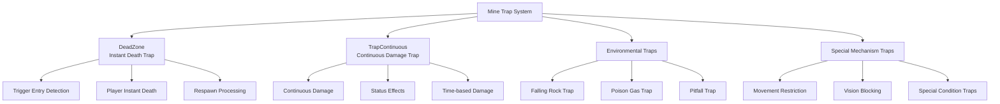

# Game Mechanics - Trap System - Mine Traps

## Overview
The mine trap system is a game mechanism that adds challenge and danger elements to mine exploration. Various types of traps are placed on each mine floor, hindering player progress or providing special challenges. They consist of different forms including DeadZone, continuous damage traps, and environmental traps.

## Trap System Structure

### System Architecture


## Related File Paths

### Core Trap Components
```
RootDesk/MyDesk/Components/Traps/
├── Various trap components
└── Trap-specific visual scripting

RootDesk/MyDesk/Components/Mine/
├── DeadZone.mlua                       # Instant death trap
├── DeadZone.codeblock                  # Instant death trap visual
└── Other mine special traps

RootDesk/MyDesk/Models/Traps/
├── Various trap models
└── Trap assets
```

## DeadZone - Instant Death Trap

### Core Functionality
```lua
@Component
script DeadZone extends Component

    @EventSender("Self")
    handler HandleTriggerEnterEvent(TriggerEnterEvent event)
        local TriggerBodyEntity = event.TriggerBodyEntity
        
        -- Check player tag and execute only on client
        if TriggerBodyEntity.TagComponent and
           TriggerBodyEntity.TagComponent.Tags[1] == "player" and
           self:IsClient() then
           
            log("DeadZone contact detected")
            TriggerBodyEntity.PlayerIngameData:Die()
        end
    end
```

### DeadZone Characteristics
- **Instant Death**: Player dies immediately upon contact
- **Client Processing**: Immediate response without delay
- **Log Recording**: Contact log for debugging
- **Tag-based Filtering**: Only affects players

## Continuous Damage Traps

### TrapContinuous - Continuous Damage Trap
```lua
@Component
script TrapContinuous extends Component

    property number damageAmount = 10     -- Damage per second
    property number damageInterval = 1.0  -- Damage interval
    property string trapType = "poison"   -- Trap type
    property table affectedPlayers = {}   -- Affected players

    @EventSender("Self")
    handler HandleTriggerEnterEvent(TriggerEnterEvent event)
        local player = event.TriggerBodyEntity
        
        if self:IsValidPlayer(player) then
            -- Start continuous damage
            self:StartContinuousDamage(player)
            table.insert(self.affectedPlayers, player)
        end
    end

    @EventSender("Self")  
    handler HandleTriggerExitEvent(TriggerExitEvent event)
        local player = event.TriggerBodyEntity
        
        if self:IsValidPlayer(player) then
            -- Stop continuous damage
            self:StopContinuousDamage(player)
            self:RemovePlayerFromList(player)
        end
    end

    method void StartContinuousDamage(Entity player)
        local damageTimer = function()
            if self:IsPlayerInTrap(player) then
                self:ApplyDamage(player)
                -- Schedule next damage
                _TimerService:SetTimerOnce(damageTimer, self.damageInterval)
            end
        end
        
        _TimerService:SetTimerOnce(damageTimer, self.damageInterval)
    end

    method void ApplyDamage(Entity player)
        if player.PlayerIngameData then
            player.PlayerIngameData:TakeDamage(self.damageAmount, self.trapType)
            
            -- Show damage effect
            self:ShowDamageEffect(player)
        end
    end
```

## Special Trap Mechanisms

### Falling Rock Trap
```lua
@Component
script FallingRockTrap extends Component

    property number triggerDelay = 2.0    -- Trigger delay time
    property number rockCount = 5         -- Number of falling rocks
    property Entity rockPrefab = nil      -- Rock prefab

    handler HandleTriggerEnterEvent(TriggerEnterEvent event)
        local player = event.TriggerBodyEntity
        
        if self:IsValidPlayer(player) then
            -- Show warning
            self:ShowWarningEffect()
            
            -- Start rockfall after delay
            _TimerService:SetTimerOnce(function()
                self:StartRockFall()
            end, self.triggerDelay)
        end
    end

    method void StartRockFall()
        for i=1, self.rockCount do
            local delay = i * 0.2  -- Sequential fall at 0.2-second intervals
            
            _TimerService:SetTimerOnce(function()
                self:SpawnFallingRock()
            end, delay)
        end
    end

    method void SpawnFallingRock()
        local spawnPos = self:GetRandomSpawnPosition()
        local rock = _SpawnService:SpawnByModelId(self.rockPrefab, "FallingRock", spawnPos)
        
        -- Apply physics effect
        rock.RigidbodyComponent.Velocity = Vector3(0, -10, 0)
        
        -- Auto cleanup after 5 seconds
        _TimerService:SetTimerOnce(function()
            rock:Destroy()
        end, 5.0)
    end
```

### Poison Gas Trap
```lua
@Component
script PoisonGasTrap extends Component

    property number gasLifetime = 10.0    -- Gas duration
    property number poisonDamage = 5      -- Poison damage
    property Entity gasPrefab = nil       -- Gas particle prefab

    method void ActivateTrap()
        -- Create poison gas
        local gasEffect = _SpawnService:SpawnByModelId(self.gasPrefab, "PoisonGas", 
            self.Entity.Transform.Position)
        
        -- Apply continuous damage to players within gas range
        self:StartGasDamage()
        
        -- Remove gas
        _TimerService:SetTimerOnce(function()
            gasEffect:Destroy()
            self:StopGasDamage()
        end, self.gasLifetime)
    end

    method void StartGasDamage()
        local damageTimer = function()
            local playersInGas = self:GetPlayersInGasRange()
            
            for _, player in ipairs(playersInGas) do
                player.PlayerIngameData:TakeDamage(self.poisonDamage, "poison")
                self:ApplyPoisonEffect(player)
            end
            
            -- Next damage cycle
            _TimerService:SetTimerOnce(damageTimer, 1.0)
        end
        
        self.gasDamageTimer = damageTimer
        damageTimer()
    end
```

## Trap Placement by Mine

### Trap Difficulty by Mine Level
```lua
-- Trap configuration by mine
local mineTrapConfigs = {
    ["Mine1"] = {
        deadZones = 2,
        continuousTraps = 1,
        specialTraps = 0,
        difficulty = 1
    },
    ["Mine5"] = {
        deadZones = 5,
        continuousTraps = 3,
        specialTraps = 1,
        difficulty = 3
    },
    ["Mine9"] = {
        deadZones = 8,
        continuousTraps = 5,
        specialTraps = 3,
        difficulty = 5
    }
}

method void SetupMineTraps(string mineName)
    local config = mineTrapConfigs[mineName]
    if not config then return end
    
    -- Place DeadZones
    for i=1, config.deadZones do
        self:SpawnDeadZone(self:GetRandomTrapPosition())
    end
    
    -- Place continuous traps
    for i=1, config.continuousTraps do
        self:SpawnContinuousTrap(self:GetRandomTrapPosition())
    end
    
    -- Place special traps
    for i=1, config.specialTraps do
        self:SpawnSpecialTrap(self:GetRandomTrapPosition())
    end
end
```

### Trap Activation Conditions
```lua
method boolean ShouldActivateTrap(Entity player, table trapConfig)
    -- Check player level
    if player.PlayerData.Level < trapConfig.minLevel then
        return false
    end
    
    -- Check trap cooldown
    if trapConfig.lastActivated and 
       (_TimeService:GetTime() - trapConfig.lastActivated) < trapConfig.cooldown then
        return false
    end
    
    -- Probability-based activation
    local random = _UtilLogic:RandomDouble()
    return random < trapConfig.activationChance
end
```

## Trap Warning System

### Visual Warnings
```lua
method void ShowTrapWarning(Vector3 position, number warningTime)
    -- Create warning UI
    local warningUI = _SpawnService:SpawnByModelId(
        "model://trap_warning_ui", "TrapWarning", position)
    
    -- Blinking effect
    local blinkStep = function(frame)
        local alpha = (frame % 20 < 10) and 1.0 or 0.3
        warningUI.SpriteGUIRendererComponent.Color.a = alpha
    end
    
    for i=1, math.floor(warningTime * 60) do
        _TimerService:SetTimerOnce(function() blinkStep(i) end, i/60)
    end
    
    -- Remove warning
    _TimerService:SetTimerOnce(function()
        warningUI:Destroy()
    end, warningTime)
end
```

### Sound Warnings
```lua
method void PlayTrapWarningSound(string trapType)
    local soundMap = {
        ["falling_rock"] = "warning_rockfall",
        ["poison_gas"] = "warning_gas",
        ["spike_trap"] = "warning_spike",
        ["fire_trap"] = "warning_fire"
    }
    
    local soundId = soundMap[trapType] or "warning_generic"
    _SoundService:PlaySound(soundId, 0.8)
end
```

## Trap Avoidance System

### Player Avoidance Mechanism
```lua
method boolean CanPlayerAvoidTrap(Entity player, string trapType)
    local avoidanceSkills = {
        ["agility"] = player.PlayerData.Agility,
        ["perception"] = player.PlayerData.Perception,
        ["luck"] = player.PlayerData.Luck
    }
    
    local requiredSkill = self:GetRequiredAvoidanceSkill(trapType)
    local skillValue = avoidanceSkills[requiredSkill] or 0
    
    -- Calculate avoidance chance
    local avoidChance = math.min(skillValue / 100.0, 0.8)  -- Maximum 80%
    local random = _UtilLogic:RandomDouble()
    
    return random < avoidChance
end

method void HandleTrapAvoidance(Entity player, string trapType)
    if self:CanPlayerAvoidTrap(player, trapType) then
        -- Avoidance successful
        _UIToast:ShowMessage("Successfully avoided the trap!", player.OwnerId)
        _SoundService:PlaySound("trap_avoid_success", 0.6)
        
        -- Experience reward
        player.PlayerData:AddExperience(10)
    else
        -- Avoidance failed, apply trap effect
        self:ApplyTrapEffect(player, trapType)
    end
end
```

## Trap Disarmament System

### Tool-based Disarmament
```lua
method boolean DisableTrapWithTool(Entity player, string toolType)
    local disarmTools = {
        ["wire_cutter"] = {"spike_trap", "electric_trap"},
        ["shovel"] = {"pit_trap", "buried_mine"},
        ["neutralizer"] = {"poison_gas", "acid_trap"}
    }
    
    local compatibleTraps = disarmTools[toolType]
    if not compatibleTraps or not table.contains(compatibleTraps, self.trapType) then
        return false
    end
    
    -- Disarmament successful
    self:DeactivateTrap()
    
    -- Reduce tool durability
    player.PlayerInventory:ReduceToolDurability(toolType, 1)
    
    return true
end

method void DeactivateTrap()
    self.isActive = false
    
    -- Trap deactivation effect
    local deactivateEffect = _SpawnService:SpawnByModelId(
        "model://trap_deactivate_effect", "DeactivateEffect", 
        self.Entity.Transform.Position)
    
    _SoundService:PlaySound("trap_deactivated", 0.7)
    
    -- Change trap model (deactivated appearance)
    self:UpdateTrapVisual("deactivated")
    
    -- Effect cleanup
    _TimerService:SetTimerOnce(function()
        deactivateEffect:Destroy()
    end, 2.0)
end
```

## Performance Optimization

### Trap Activation Management
```lua
-- Activate only traps near players
method void OptimizeTrapActivation()
    local playerPositions = self:GetAllPlayerPositions()
    local allTraps = _EntityService:GetEntitiesByTag("Trap")
    
    for _, trap in ipairs(allTraps) do
        local nearPlayer = false
        
        for _, playerPos in ipairs(playerPositions) do
            local distance = Vector3.Distance(trap.Transform.Position, playerPos)
            if distance < 20 then  -- Activate only traps within 20 meters
                nearPlayer = true
                break
            end
        end
        
        trap:SetActive(nearPlayer)
    end
end
```

## Common Troubleshooting

### When traps don't work
1. Check trigger collider settings
2. Verify player tag configuration
3. Inspect trap activation conditions

### Performance degradation issues
1. Confirm trap optimization system activation
2. Clean up unnecessary traps
3. Set particle effect limitations

