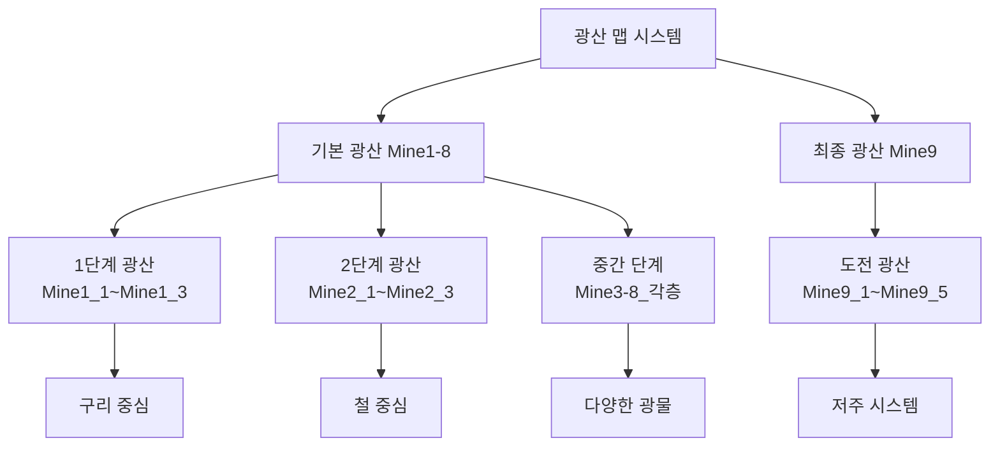
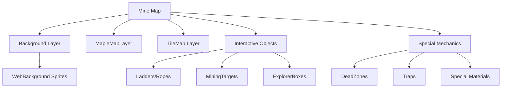

# 핵심 아키텍처 - 맵 시스템 - 광산 맵

## 개요
광산 맵은 광부 시뮬레이터의 핵심 콘텐츠로, 플레이어가 자원을 채굴하고 경험치를 획득하는 주요 게임플레이 공간입니다. Mine1_1부터 Mine9_5까지 총 25개의 광산 맵이 있으며, 각각 고유한 난이도와 특별한 메커니즘을 가지고 있습니다.

## 광산 맵 구조

### 맵 분류 체계


### 광산별 특징

#### **1-2단계 광산 (Mine1-2)**
- **난이도**: 초급
- **주요 광물**: 구리(Mine1), 철(Mine2)
- **특징**: 기본 채굴 시스템 학습

#### **3-8단계 광산 (Mine3-8)**
- **Mine3**: 고드름 특수 재료 25% 확률 획득
- **Mine6**: 별먼지 획득 (MP 사용 시), "신난다!" 모드 (재료 10개 소모)
- **Mine7**: 구름조각 획득, 보호막 효과 (재료 10개 소모)
- **Mine8**: 고급 광물과 트랩 시스템

#### **9단계 광산 (Mine9_1-9_5)**
- **특징**: 저주 스택 시스템
- **메커니즘**: 30초마다 저주 스택 누적
- **위험도**: 최고 난이도 구역

## 관련 파일 경로

### 맵 파일들
```
map/
├── Mine1_1.map ~ Mine1_3.map          # 1단계 광산 (구리)
├── Mine2_1.map ~ Mine2_3.map          # 2단계 광산 (철)
├── Mine3_1.map ~ Mine3_3.map          # 3단계 광산 (고드름)
├── Mine4_1.map ~ Mine4_3.map          # 4단계 광산
├── Mine5_1.map ~ Mine5_3.map          # 5단계 광산
├── Mine6_1.map ~ Mine6_2.map          # 6단계 광산 (별먼지)
├── Mine7_1.map ~ Mine7_2.map          # 7단계 광산 (구름조각)
├── Mine8_1.map ~ Mine8_2.map          # 8단계 광산
└── Mine9_1.map ~ Mine9_5.map          # 9단계 광산 (저주)
```

### 광산 관련 컴포넌트 스크립트
```
RootDesk/MyDesk/Components/Mine/
├── MiningGame.mlua                     # 채굴 게임 핵심 로직
├── MiningTargetManager.mlua            # 광맥 생성 및 관리
├── MiningTargetObject.mlua             # 개별 광맥 오브젝트
├── ExplorerBoxInteraction.mlua         # 탐험가 상자 상호작용
├── DeadZone.mlua                       # 위험 구역 (즉사)
├── DroppedItem.mlua                    # 아이템 드롭 처리
├── DroppedGoldBox.mlua                 # 골드상자 드롭
├── DroppedRelicBox.mlua               # 유물상자 드롭
├── DroppedMaterial.mlua               # 특수재료 드롭
└── Lights/                            # 조명 시스템
    ├── LightComponent.mlua            # 조명 컴포넌트
    └── LightInteraction.mlua          # 조명 상호작용
```

### 이미지 리소스
```
RootDesk/MyDesk/Images/광맥/
├── 광맥_가넷, 자수정.sprite           # 보석 광맥 이미지
├── 광맥_강철.sprite                   # 강철 광맥 이미지
├── 광맥_구리.sprite                   # 구리 광맥 이미지
├── 광맥_다이아몬드.sprite             # 다이아몬드 광맥 이미지
├── 광맥_루비, 사파이어.sprite         # 루비/사파이어 광맥 이미지
├── 광맥_에메랄드.sprite               # 에메랄드 광맥 이미지
├── 광맥_은.sprite                     # 은 광맥 이미지
├── 광맥_철.sprite                     # 철 광맥 이미지
└── 광맥_황금.sprite                   # 황금 광맥 이미지
```

## 채굴 시스템 상세 분석

### 광맥 레벨 시스템
```lua
-- MiningTargetObject.mlua에서 구현된 채굴 보상 시스템

method void HandleMiningReward(Entity player)
    local miningTargetTable = _DataService:GetTable("MiningTarget")
    
    -- 기본 광물 3종류 획득
    for i=1, 3 do
        local amount = tonumber(miningTargetTable:GetCell(self.level, 2))
        
        -- 신전에서는 층당 60% 증가
        if self.level >= 27 then
            amount = amount * (1 + 0.6 * (currentTempleFloor - 1))
        end
        
        local trifectaAmount = math.floor(amount/3)
        player.PlayerBackpack:AddItem(i, trifectaAmount)
    end
end
```

### 특수 재료 시스템

#### Mine3: 고드름 시스템
```lua
-- 25% 확률로 고드름 획득
if currentMine == 3 then
    local randomValue = _UtilLogic:RandomDouble()
    if randomValue < 0.25 then
        self:DropMaterial(player, 3)
        player.PlayerStateAtStage:GetMaterial(1)
        -- UI 로그 표시: "Icicle" 획득
    end
end
```

#### Mine6: 별먼지 및 "신난다!" 모드
```lua
-- MP 사용률이 0이 아닐 때만 별먼지 획득
if currentMine == 6 then
    if player.PlayerIngameData.MPUseRate ~= 0 then
        self:DropMaterial(player, 6)
        player.PlayerStateAtStage:GetMaterial(1)
    end
end

-- PlayerStateAtStage.mlua: 별먼지 10개 보유 시 효과
if stageNum == 6 and self.HavingMaterialNum >= 10 then
    self:StartExitedMode(self.Entity.OwnerId)  -- "신난다!" 모드 발동
    self:LoseMaterial(10, false)
end
```

#### Mine7: 구름조각 및 보호막
```lua
-- 구름조각은 항상 획득
if currentMine == 7 then
    self:DropMaterial(player, 7, player.OwnerId)
    player.PlayerStateAtStage:GetMaterial(1)
end

-- 구름조각 10개 보유 시 보호막 획득
if stageNum == 7 and self.HavingMaterialNum >= 10 then
    self.Entity.PlayerIngameData:GetProtector()
    self:LoseMaterial(10, false)
end
```

### 보석/화석 시스템

#### 보석 획득 확률
```lua
-- 레벨별 보석 확률 및 타입 결정
local jewerlyProb = 보석확률테이블[self.level]

if randomValue < jewerlyProb then
    local dropIdx = self.level * 2 + 1  -- 기본은 원석
    
    if self.level >= 2 and self.level <= 19 then
        -- 2-19레벨: 90% 원석, 10% 보석
        if _UtilLogic:RandomDouble() >= 0.9 then
            dropIdx = self.level * 2 + 2  -- 보석으로 변경
        end
    elseif self.level == 27 then
        -- 신전: 랜덤 보석 (4-42번 인덱스)
        dropIdx = _UtilLogic:RandomIntegerRange(4, 42)
    end
    
    player.PlayerBackpack:AddItem(dropIdx, 1)
end
```

#### 화석 시스템
```lua
-- 화석 획득 (43-49번 인덱스)
if randomValue < fossilProb then
    local dropIdx = _UtilLogic:RandomIntegerRange(43, 49)
    player.PlayerBackpack:AddItem(dropIdx, 1)
    self:DropFossilBox(player, dropIdx, player.OwnerId)
end
```

## Mine9 저주 시스템

### 저주 스택 메커니즘
```lua
-- PlayerStateAtStage.mlua: Mine9 전용 저주 시스템
method void UpdateCurseSystem(number delta)
    if self.StageNum == 9 then
        self.CurseCoolTime = self.CurseCoolTime + delta
        
        -- 30초마다 저주 스택 증가
        if self.CurseCoolTime >= 30 then
            self.CurseCoolTime = 0
            self:GetCurseStack()
            -- UI에 저주 스택 표시
        end
    end
end
```

### 위험 구역 (DeadZone)
```lua
-- DeadZone.mlua: 플레이어가 닿으면 즉사
method void HandleTriggerEnterEvent(TriggerEnterEvent event)
    local TriggerBodyEntity = event.TriggerBodyEntity
    
    if TriggerBodyEntity.TagComponent and
       TriggerBodyEntity.TagComponent.Tags[1] == "player" then
        TriggerBodyEntity.PlayerIngameData:Die()
    end
end
```

## 맵별 기본 구조

### 공통 맵 구성 요소
1. **MapComponent**: 맵 기본 정보
2. **FootholdComponent**: 발판 시스템
3. **SoundComponent**: 배경음악
4. **LoadingManager**: 맵 로딩 관리
5. **MapOptimizeComponent**: 성능 최적화

### 맵 레이어 구조


### 광맥 배치 시스템
```lua
-- MiningTargetManager.mlua: 광맥 동적 생성 시스템
method void SpawnMiningTargets()
    -- 맵별 광맥 개수와 위치 결정
    local targetCount = self:GetTargetCountForLevel()
    local spawnPositions = self:GetValidSpawnPositions()
    
    for i = 1, targetCount do
        local position = spawnPositions[i]
        local miningTarget = self:CreateMiningTarget(position)
        miningTarget.level = self:CalculateMiningLevel()
    end
end
```

## 게임플레이 흐름

### 채굴 과정
1. **광맥 발견**: 맵 내 광맥 오브젝트와 상호작용
2. **채굴 시작**: MiningGame 컴포넌트 활성화
3. **채굴 진행**: 플레이어 입력에 따른 진행도 증가
4. **보상 획득**: 확률에 따른 다양한 아이템 드롭
5. **특수 효과**: 재료별 특별한 효과 발동

### 난이도 곡선
- **Mine1-3**: 튜토리얼 및 기본 학습
- **Mine4-6**: 중급 난이도, 특수 재료 도입
- **Mine7-8**: 고급 난이도, 복잡한 메커니즘
- **Mine9**: 엔드게임 콘텐츠, 최고 난이도

## 확장 및 개발 가이드

### 새로운 광산 추가 방법
1. **맵 파일 생성**: `.map` 형식으로 맵 레이아웃 정의
2. **광맥 데이터 추가**: MiningTarget CSV에 새 레벨 데이터 추가
3. **특수 메커니즘 구현**: 필요 시 새로운 컴포넌트 개발
4. **보상 테이블 설정**: 확률 및 아이템 테이블 구성

### 성능 최적화
- **MapOptimizeComponent**: 화면 밖 오브젝트 비활성화
- **동적 로딩**: 필요한 섹션만 로드
- **오브젝트 풀링**: 드롭 아이템 재사용

## 일반적인 문제 해결

### 채굴이 안되는 경우
1. MiningTargetObject의 level 설정 확인
2. PlayerBackpack의 여유 공간 확인
3. 광맥 상호작용 트리거 범위 확인

### 특수 재료가 드롭되지 않는 경우
1. 해당 광산 번호(currentMine) 확인
2. 확률 계산 로직 디버깅
3. PlayerStateAtStage 컴포넌트 상태 확인

