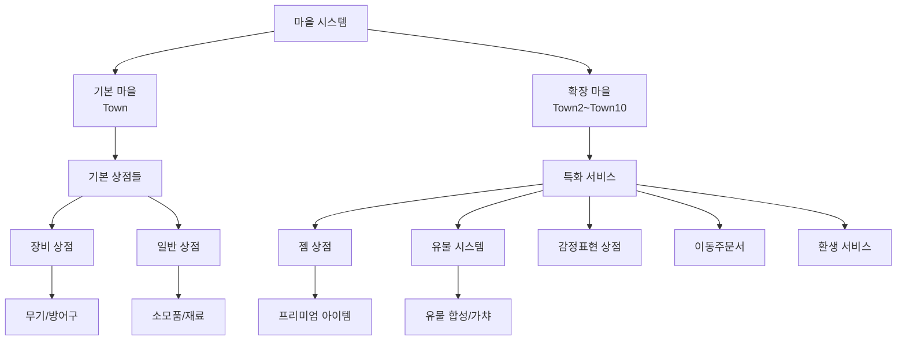
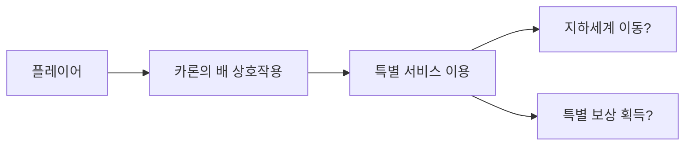

# 핵심 아키텍처 - 맵 시스템 - 마을 맵

## 개요
마을 맵은 광부 시뮬레이터의 중심 허브 역할을 하는 안전한 공간으로, 플레이어들이 상점에서 거래하고, NPC와 상호작용하며, 다른 지역으로 이동할 수 있는 기능을 제공합니다. Town부터 Town10까지 총 11개의 마을이 있으며, 각 마을은 고유한 상점과 서비스를 제공합니다.

## 마을 맵 구조

### 마을 체계


### 마을별 특징

#### **Town (기본 마을)**
- **역할**: 게임 시작 지점, 기본 서비스 제공
- **주요 NPC**: 장비상인, 일반상인
- **특징**: 모든 기본 기능 집약

#### **Town2~Town5 (초중급 마을)**
- **특화 서비스**: 각 마을별 고유 NPC와 서비스
- **Town5 예시**: 광물상인, 감정표현상인 등

#### **Town6~Town10 (고급 마을)**
- **Town8**: 이동주문서상인, 일반상인
- **Town9**: 다양한 상인 (NEW/OLD 버전 구분)
- **특징**: 고급 플레이어를 위한 특화 서비스

## 관련 파일 경로

### 마을 맵 파일들
```
map/
├── Town.map                           # 기본 마을
├── Town2.map                          # 2번째 마을
├── Town3.map                          # 3번째 마을
├── Town4.map                          # 4번째 마을
├── Town5.map                          # 5번째 마을
├── Town6.map                          # 6번째 마을
├── Town7.map                          # 7번째 마을
├── Town8.map                          # 8번째 마을
├── Town9.map                          # 9번째 마을
└── Town10.map                         # 10번째 마을
```

### 마을 관련 컴포넌트 스크립트
```
RootDesk/MyDesk/Components/Town/
├── NPCInteraction.mlua                # NPC 상호작용 기본 시스템
├── EquipmentShop/                     # 장비 상점 시스템
│   ├── EquipmentShopUI.mlua           # 장비 상점 UI
│   ├── EquipmentShopSlotButton.mlua   # 상점 슬롯 버튼
│   └── MythicEquipmentShopUI.mlua     # 신화 장비 상점
├── GemShop/                           # 젬 상점 시스템  
│   ├── GemShopUI.mlua                 # 젬 상점 UI
│   ├── GemShopLogic.mlua              # 젬 상점 로직
│   └── GemShopUI_SlotButton.mlua      # 젬 상점 슬롯
├── RelicMergeShop/                    # 유물 합성 상점
│   ├── RelicMergeShopUI.mlua          # 유물 합성 UI
│   ├── RelicMergeShopUI_MaterialButton.mlua    # 재료 버튼
│   └── RelicMergeShopUI_MaterialSlotButton.mlua # 재료 슬롯
├── RebornShop/                        # 환생 상점
│   └── RebornShopUI.mlua              # 환생 UI
├── ShopUI.mlua                        # 일반 상점 UI
├── LeaderBoardUI.mlua                 # 리더보드 UI
├── RelicGachaShopUI.mlua              # 유물 가챠 상점
├── RelicBinUI.mlua                    # 유물 휴지통
└── CharonBoatUI_UseButton.mlua        # 카론의 배 UI (그리스 신화)
```

### 포털 및 이동 시스템
```
RootDesk/MyDesk/Components/Portals/
├── Portal_TownToTownInteraction.mlua  # 마을 간 이동 포털
├── PortalToMineInteraction.mlua       # 마을→광산 이동
├── PortalToTownInteraction.mlua       # →마을 이동
├── TeleportNpcComponent.mlua          # NPC 텔레포트 기능
└── TeleportTownController.mlua        # 마을 텔레포트 컨트롤러
```

## NPC 시스템 상세 분석

### NPCInteraction 컴포넌트
```lua
-- NPCInteraction.mlua: 모든 NPC 상호작용의 기본 클래스
@Component
script NPCInteraction extends InteractionComponent

    property Entity TargetUI = nil        -- 열릴 UI 지정
    property string UIOpenSound = ""      -- 상호작용 사운드
    property boolean SetSortingLayerAutomately = true

    method void OnInteractionEvent()
        -- UI 깜빡임 애니메이션 효과
        local flickeringAnimation = function()
            -- 알파값을 조절한 깜빡임 효과
            for i=1, 60 do
                if (i >=1 and i <= 10) or (i>=21 and i<=30) or (i>=41 and i<=50) then
                    _TimerService:SetTimerOnce(flickeringDown, 0.04*i)
                else 
                    _TimerService:SetTimerOnce(flickeringUp, 0.04*i)
                end
            end
        end
        
        -- 소팅 레이어 자동 설정
        if self.SetSortingLayerAutomately then
            self.TargetUI.SortingLayer = 30
        end
        
        -- UI 활성화 및 사운드 재생
        self.TargetUI.Enable = true
        if self.UIOpenSound ~= "" then
            _SoundService:PlaySound(self.UIOpenSound, 0.7)
        end
    end
end
```

### 마을별 NPC 배치

#### Town5 NPC 구성
- **NPC_광물상인**: 채굴한 광물 판매 및 구매
- **NPC_감정표현상인**: 이모티콘 구매 및 관리

#### Town8 NPC 구성  
- **NPC_상인**: 기본 아이템 거래
- **NPC_이동주문서상인**: 빠른 이동 아이템 판매
- **NPC_장비상인**: 장비 구매/판매

#### Town9 NPC 구성 (가장 복합적)
- **NPC_이동주문서상인**: 이동 관련 서비스
- **NPC_유물상자상인**: 유물 상자 판매
- **NPC_장비상인(NEW/OLD)**: 신구 장비 상인 구분
- **NPC_상인(NEW/OLD)**: 신구 일반 상인 구분

## 상점 시스템 상세 분석

### 장비 상점 (EquipmentShop)
```lua
-- EquipmentShopUI.mlua: 장비 상점의 핵심 로직
@Component
script EquipmentShopUI extends Component

    property number filterIdx = 1         -- 필터 인덱스 (장비 타입)
    property number recentBuyIndex = 0    -- 최근 구매 아이템
    
    method void OnBeginPlay()
        -- 4가지 장비 타입 필터 설정
        local EquipShopFilterList = _EntityService:GetEntityByPath("/ui/EquipShopGroup/EquipShop/Panel/FilterList")
        for i=1, 4 do
            EquipShopFilterList:GetChildByName("Filter_"..tostring(i)).TextComponent.Text = 
                _LocalizationService:GetText("EquipType_"..tostring(i))
        end
        
        -- 40개 장비 슬롯 생성
        for i=1, 40 do
            local slotButton = self:CreateEquipmentSlot(i)
            slotButton:SetupSlotData(i)
        end
    end
    
    method void RefreshShop()
        -- 필터에 따른 장비 목록 업데이트
        -- 플레이어 보유 상태 표시
        -- 가격 정보 업데이트
    end
end
```

### 젬 상점 (GemShop)
```lua
-- GemShopUI.mlua: 프리미엄 화폐 상점
method void HandleGemPurchase(number itemId, number cost)
    local player = _UserService.LocalPlayer
    
    -- 젬 보유량 확인
    if player.PlayerStorage:GetCurrency(GEM_CURRENCY_ID) >= cost then
        -- 젬 차감 및 아이템 지급
        player.PlayerStorage:SpendCurrency(GEM_CURRENCY_ID, cost)
        player.PlayerBackpack:AddItem(itemId, 1)
    else
        -- 젬 부족 메시지 표시
        _UIToast:ShowMessage(_LocalizationService:GetText("InsufficientGems"))
    end
end
```

### 유물 합성 상점 (RelicMergeShop)
```lua
-- RelicMergeShopUI.mlua: 유물 합성 시스템
method void AttemptRelicMerge()
    local materialSlots = self:GetSelectedMaterials()  -- 4개 재료 선택
    
    -- 재료 검증
    if #materialSlots ~= 4 then
        _UIToast:ShowMessage("4개의 재료가 필요합니다.")
        return
    end
    
    -- 등급 일치 확인
    local baseGrade = materialSlots[1].grade
    for i=2, 4 do
        if materialSlots[i].grade ~= baseGrade then
            _UIToast:ShowMessage("모든 재료의 등급이 일치해야 합니다.")
            return
        end
    end
    
    -- 합성 실행
    local result = player.PlayerRelic:Merge(materialSlots)
    self:ShowMergeResult(result)
end
```

## 포털 및 이동 시스템

### 마을 간 이동 시스템
```lua
-- Portal_TownToTownInteraction.mlua: 마을 간 포털
method void OnInteractionEventOnClient()
    local currentTownIdx = string.sub(self.Entity.Parent.Name, 5, -1)
    if tonumber(currentTownIdx) == nil then
        currentTownIdx = "1"
    end
    
    local Player = _UserService.LocalPlayer
    local destination = ""
    
    -- 목적지 마을 결정
    if self.TownCategory == 1 then
        destination = "/maps/Town/Portal_TownToTown_"..currentTownIdx
    else
        destination = "/maps/Town"..tostring(math.floor(self.TownCategory)).."/Portal_TownToTown_"..currentTownIdx
    end
    
    -- 텔레포트 실행
    _TeleportService:TeleportToEntityPath(Player, destination)
end
```

### 광산 진입 시스템
```lua
-- PortalToMineInteraction.mlua: 마을에서 광산으로
method void OnBeginPlay()
    -- 권장 채굴력 계산 및 표시
    local mapTable = _DataService:GetTable("Map_Mine")
    local minPower = tonumber(mapTable:GetCell(mineLevel * 4 - 3, 5))
    local maxPower = tonumber(mapTable:GetCell(mineLevel * 4 - 3, 6))
    local userPower = _UserService.LocalPlayer.PlayerIngameData.MiningPower
    
    local recommendInfo = ""
    if minPower <= userPower and userPower < maxPower then
        recommendInfo = "[권장]"
    elseif minPower > userPower then
        recommendInfo = "[어려움]"
    else
        recommendInfo = "[쉬움]"
    end
    
    -- UI에 정보 표시
    self:DisplayMineInfo(minPower, maxPower, recommendInfo)
end
```

## 특별 시스템

### 카론의 배 (CharonBoat) - 그리스 신화 요소


### 리더보드 시스템
- 플레이어 순위 표시
- 다양한 카테고리별 랭킹
- 실시간 업데이트

### 환생 시스템 (Reborn)
- 캐릭터 재시작 시스템
- 특별 보너스 제공
- 진행도 유지 옵션

## 마을 레이아웃 및 디자인

### 공통 구조 요소
1. **배경 레이어**: MapleMapLayer, Background
2. **지형**: TileMap으로 구성된 바닥과 구조물
3. **NPC 배치**: 각 마을별 특화된 NPC 위치
4. **포털**: 다른 지역으로의 이동 포인트

### 마을별 특색
- **Town**: 기본적이고 균형잡힌 레이아웃
- **Town5**: 광물 거래에 특화된 배치
- **Town9**: 다양한 서비스가 집약된 복합 마을

## 데이터 관리 시스템

### 마을 데이터 테이블
```
RootDesk/MyDesk/DataSets/
├── Map_Town.csv                       # 마을 기본 정보
├── Map_Town.userdataset              # 마을 데이터셋
├── ShopData.csv                       # 상점 아이템 정보
└── NPCData.csv                        # NPC 정보
```

### 지역화 시스템
```lua
-- 다국어 지원 NPC 이름 표시
local mapName = _LocalizationService:GetText(string.format("%d", 7200+self.TownCategory))
npcNameTag.TextComponent.Text = _LocalizationService:GetText("NPC_Name_"..npcId)
```

## 성능 최적화

### 맵 최적화
```lua
-- 일부 마을에서 MapOptimizeComponent 사용
-- 화면 밖 오브젝트 자동 비활성화
-- NPC 애니메이션 LOD 시스템
```

### UI 최적화
- 상점 UI는 필요 시에만 로드
- 슬롯 버튼 풀링 시스템
- 대용량 아이템 목록 페이징

## 확장 가이드

### 새로운 마을 추가
1. **맵 파일 생성**: TownX.map 형식으로 생성
2. **NPC 배치**: 해당 마을의 테마에 맞는 NPC 선정
3. **포털 연결**: 기존 마을들과의 연결성 고려
4. **데이터 테이블 업데이트**: Map_Town.csv에 정보 추가

### 새로운 상점 타입 추가
1. **UI 컴포넌트 개발**: 기존 상점 UI 구조 참고
2. **로직 스크립트 작성**: 상점별 특화 기능 구현
3. **NPC 연동**: NPCInteraction에서 새 상점 UI 연결
4. **데이터 구조 설계**: 상점 전용 CSV 테이블 생성

## 일반적인 문제 해결

### NPC 상호작용이 안되는 경우
1. NPCInteraction 컴포넌트 확인
2. TargetUI 참조 설정 확인
3. InteractionComponent 기본 설정 점검

### 포털 이동이 안되는 경우
1. 목적지 맵 경로 확인
2. SpawnLocation 엔티티 존재 확인
3. TeleportService 권한 점검

### 상점 UI가 표시되지 않는 경우
1. UI 엔티티 경로 확인
2. SortingLayer 설정 점검
3. Enable 상태 확인

