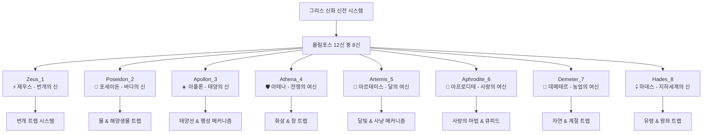
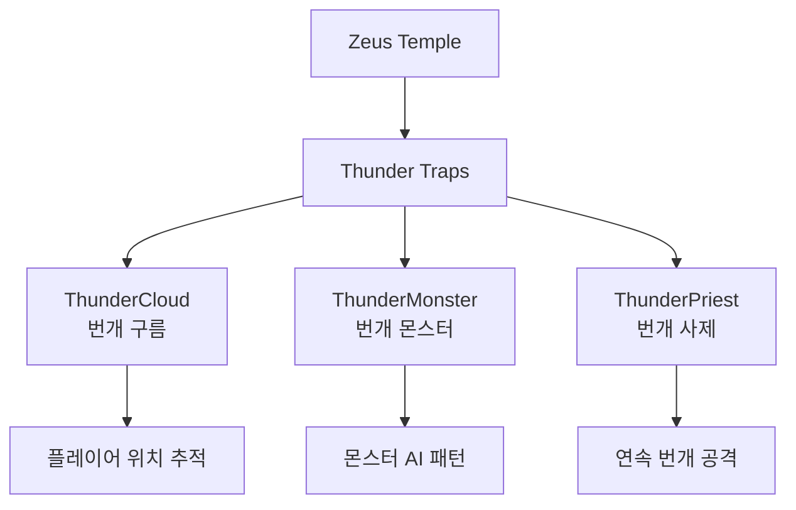

# 핵심 아키텍처 - 맵 시스템 - 신전 맵

## 개요
신전 맵은 광부 시뮬레이터의 고급 콘텐츠로, 그리스 신화를 테마로 한 8개의 특별한 맵으로 구성되어 있습니다. 각 신전은 해당 신의 특성에 맞는 독특한 메커니즘과 트랩, 보상 시스템을 가지고 있으며, 플레이어에게 도전적이면서도 풍부한 보상을 제공합니다.

## 신전 맵 체계

### 8개 신전 구조


## 신전별 상세 분석

### 1. Temple_Zeus_1 (제우스 신전)
**테마**: 번개와 천둥의 지배자
- **핵심 메커니즘**: 번개 트랩 시스템
- **주요 트랩들**:
  - `Trap_ThunderCloud`: 번개 구름 소환
  - `Trap_ThunderMonster`: 번개 몬스터 소환
  - `Trap_ThunderPriest`: 번개 사제 공격

### 2. Temple_Poseidon_2 (포세이돈 신전)  
**테마**: 바다와 해양생물
- **핵심 메커니즘**: 물 트랩과 해양 생물 공격
- **주요 트랩들**:
  - `Trap_SeaOfPoseidon`: 포세이돈의 바다 소환
  - `Trap_Torpedo`: 어뢰 공격
  - `Trap_Squid`: 거대 오징어 공격
  - `Trap_InkBullet`: 먹물 투사체

### 3. Temple_Apollon_3 (아폴론 신전)
**테마**: 태양과 행성의 움직임
- **핵심 메커니즘**: 태양선과 행성 궤도 시스템
- **주요 요소들**:
  - `Model_SunShip`: 태양선 모델
  - `Model_Planet`: 행성 오브젝트
  - `PlanetMovement`: 행성 궤도 움직임

### 4. Temple_Athena_4 (아테나 신전)
**테마**: 전쟁과 지혜의 전략
- **핵심 메커니즘**: 정교한 화살과 창 트랩
- **주요 트랩들**:
  - `Trap_Arrow`: 화살 발사 트랩
  - `Trap_ArrowShooter`: 화살 발사기
  - `Model_StaticSpear`: 고정 창 트랩

### 5. Temple_Artemis_5 (아르테미스 신전)
**테마**: 달빛과 사냥
- **핵심 메커니즘**: 달 조각 수집과 가이드 시스템
- **특별 아이템들**:
  - `Model_MoonPiece`: 달 조각
  - `Model_Guide_Key`: 가이드 열쇠

### 6. Temple_Aphrodite_6 (아프로디테 신전)
**테마**: 사랑의 마법과 큐피드
- **핵심 메커니즘**: 사랑의 상태이상과 감정 조작
- **주요 트랩들**:
  - `Trap_Cupid`: 큐피드 소환
  - `Trap_CupidArrow`: 큐피드의 화살
  - `Trap_LovePoison`: 사랑의 독
  - `Trap_HeartBullet`: 하트 투사체
  - `Trap_LittleDevil`: 작은 악마 소환

### 7. Temple_Demeter_7 (데메테르 신전)
**테마**: 농업과 계절의 변화
- **핵심 메커니즘**: 계절 변화와 자연 트랩
- **환경적 요소**: 농업 테마의 트랩과 계절별 효과

### 8. Temple_Hades_8 (하데스 신전)
**테마**: 죽음과 지하세계
- **핵심 메커니즘**: 유령 소환과 왕좌 트랩
- **주요 트랩들**:
  - `Trap_Hades_Throne`: 하데스의 왕좌
  - `SpawnThroneManager`: 왕좌 스폰 매니저
  - 각종 유령 트랩들

## 관련 파일 경로

### 신전 맵 파일들
```
map/
├── Temple_Zeus_1.map                   # 제우스 신전 (번개)
├── Temple_Poseidon_2.map              # 포세이돈 신전 (바다)
├── Temple_Apollon_3.map               # 아폴론 신전 (태양)
├── Temple_Athena_4.map                # 아테나 신전 (전쟁)
├── Temple_Artemis_5.map               # 아르테미스 신전 (달)
├── Temple_Aphrodite_6.map             # 아프로디테 신전 (사랑)
├── Temple_Demeter_7.map               # 데메테르 신전 (농업)
└── Temple_Hades_8.map                 # 하데스 신전 (지하세계)
```

### 신전별 레벨 디자인 컴포넌트
```
RootDesk/MyDesk/LevelDesign0109~/
├── Zeus/                               # 제우스 신전 전용 컴포넌트
│   ├── Trap_ThunderCloud.mlua         # 번개 구름 트랩
│   ├── Trap_ThunderMonster.mlua       # 번개 몬스터
│   ├── Trap_ThunderPriest.mlua        # 번개 사제
│   └── ... (16개 파일)
├── Poseidon/                          # 포세이돈 신전 전용
│   ├── Trap_SeaOfPoseidon.mlua        # 바다 소환 트랩
│   ├── Trap_Torpedo.mlua              # 어뢰 트랩
│   ├── Trap_Squid.mlua                # 오징어 트랩
│   └── ... (11개 파일)
├── Apollon/                           # 아폴론 신전 전용
│   ├── Model_SunShip_1.model          # 태양선 모델
│   ├── PlanetMovement.mlua            # 행성 움직임
│   └── ... (11개 파일)
├── Athena/                            # 아테나 신전 전용
│   ├── Trap_Arrow.mlua                # 화살 트랩
│   ├── Trap_ArrowShooter.mlua         # 화살 발사기
│   └── ... (9개 파일)
├── Artemis/                           # 아르테미스 신전 전용
│   ├── Model_MoonPiece.model          # 달 조각 모델
│   └── Model_Guide_Key.model          # 가이드 키 모델
├── Aphrodite_Love/                    # 아프로디테 신전 전용
│   ├── Trap_Cupid.mlua                # 큐피드 트랩
│   ├── Trap_LovePoison.mlua           # 사랑의 독
│   ├── GoldApple.mlua                 # 황금 사과
│   └── ... (32개 파일)
├── Demeter/                           # 데메테르 신전 전용
│   └── ... (10개 파일)
└── Hades/                             # 하데스 신전 전용
    ├── Trap_Hades_Throne.mlua         # 하데스 왕좌 트랩
    ├── SpawnThroneManager.mlua         # 왕좌 스폰 매니저
    └── ... (13개 파일)
```

### 공통 신전 시스템
```
RootDesk/MyDesk/
├── InteractionTemplePortal.mlua        # 신전 포털 상호작용
├── ModelForTemple/                     # 신전 전용 모델들
│   ├── RelatedComponents/              # 신전 상호작용 컴포넌트들
│   │   ├── TemplePegasus.mlua          # 페가수스 상호작용
│   │   ├── TempleGemBox.mlua           # 젬 상자 (하데스 보물)
│   │   ├── TempleGoldstatus.mlua       # 골드 지팡이 (플루투스)
│   │   └── TempleExplorerBox.mlua      # 신전 탐험가 상자
│   └── Model_TempleFountain.model      # 신전 분수 모델
└── Components/Player/PlayerIngameData.mlua  # 신전 입장 관리
```

## 신전 시스템 메커니즘

### 신전 입장 및 포털 시스템
```lua
-- InteractionTemplePortal.mlua: 신전 포털 시스템
method void UsePortal()
    local player = _UserService.LocalPlayer
    local destination = ""
    
    -- 하데스 신전에서 나가는 경우
    if isvalid(player.CurrentMap.TempleHadesManager) then
        destination = player.PlayerIngameData.latestTempleName
        -- HP/MP 절반 회복
        player.PlayerIngameData:RecoverHP(player.PlayerIngameData.HPMax/2)
        player.PlayerIngameData.MP = player.PlayerIngameData.MPMax/2
    else
        -- 신전 테이블에서 다음 신전 결정
        if #player.PlayerIngameData.EntranceTempleTable >= 1 then 
            destination = player.PlayerIngameData:GetTempleTable()
        else 
            destination = player.PlayerIngameData:InitTempleTable()
        end
    end
    
    -- 텔레포트 실행
    _TeleportService:TeleportToEntityPath(player, "/maps/Temple_"..destination.."/SpawnLocation")
end
```

### 신전 층 시스템
```lua
-- PlayerIngameData.mlua: 신전 진행 시스템
method void HandleTempleProgression()
    if string.sub(enteredMap.Name, 1, 4) == "Temp" then
        if self.entered then 
            -- 이미 입장했으면 한 층씩 올라감
            if not isvalid(self.Entity.CurrentMap.TempleHadesManager) then 
                self:AddCurrentTempleFloor(1, false, self.Entity.PlayerComponent.UserId)
            end 
        else 
            -- 최초 입장 시 시작층만큼 올라감 (건설 레벨에 따라)
            local floorCount = self.Entity.PlayerConstruction.TempleStartingFloor
            self:AddCurrentTempleFloor(floorCount, false, self.Entity.PlayerComponent.UserId)
        end
        self.entered = true
    end
end
```

### 특별 상호작용 오브젝트

#### 페가수스 (TemplePegasus)
```lua
-- 인벤토리의 모든 아이템을 골드로 변환 (건설 9레벨 필요)
method void OnInteractionEvent()
    local havingItemCount = 0
    for i=1, #_UserService.LocalPlayer.PlayerBackpack.storageList do
        havingItemCount = havingItemCount + _UserService.LocalPlayer.PlayerBackpack.storageList[i]
    end
    
    if havingItemCount < 1 then
        _UIToast:ShowMessage("보유한 아이템이 없습니다.")
        return
    end
    
    local constuctionLv = _UserService.LocalPlayer.PlayerConstruction.haveItems[8] 
    if constuctionLv > 1 then
        self:OnInteractionEventOnServer(_UserService.LocalPlayer)
    end
end
```

#### 하데스의 보물상자 (TempleGemBox)
```lua
-- 젬 획득 (건설 8레벨 필요)
method void OnInteractionEventOnServer(Entity player)
    local constuctionLv = player.PlayerConstruction.haveItems[8] 
    local amount = _UtilLogic:RandomIntegerRange(10, 15) * constuctionLv
    player.PlayerStorage:AddCurrencyItems(2, amount, true) -- 젬 지급
end
```

#### 플루투스의 황금지팡이 (TempleGoldstatus)
```lua
-- 거대한 골드 획득 (건설 7레벨 필요)
method void OnInteractionEventOnServer(Entity player)
    local currentFloor = player.PlayerIngameData.TempleFloor_Current
    local goldAmount = 50000000000 * (1+ 0.6*(currentFloor-1)) * _UtilLogic:RandomIntegerRange(100, 300)/100
    player.PlayerData:GetMoney(goldAmount)
end
```

## 신전별 트랩 시스템 상세

### 제우스 신전 - 번개 시스템


### 아프로디테 신전 - 사랑 마법 시스템
```lua
-- Trap_LovePoison.mlua: 사랑의 독 트랩
method void ApplyLoveEffect(Entity target)
    -- 사랑 상태이상 적용
    target.StatusEffectComponent:AddEffect("LovePoison", 10.0)
    
    -- 플레이어 조작 방향 반전 등의 효과
    target.PlayerController.IsReversed = true
end
```

### 하데스 신전 - 죽음의 왕좌 시스템
```lua
-- SpawnThroneManager.mlua: 왕좌 스폰 관리
method void ManageThroneSpawning()
    -- 특정 조건에서 하데스의 왕좌 소환
    -- 왕좌에 닿으면 즉사하지만 특별한 보상도 존재
end
```

## 신전 보상 시스템

### 기본 채굴 보상
- **신전 광맥**: 레벨 27로 고정
- **보상 배율**: 층수에 따라 60%씩 증가
- **특별 보석**: 4-42번 인덱스 범위에서 랜덤

### 건설 연동 보상
1. **건설 7레벨**: 플루투스의 황금지팡이 발견 가능
2. **건설 8레벨**: 하데스의 보물상자 발견 가능  
3. **건설 9레벨**: 페가수스와 상호작용 가능

## 게임플레이 전략

### 신전 선택 전략
1. **초급자**: Zeus, Poseidon (상대적으로 단순한 패턴)
2. **중급자**: Apollon, Athena (중간 난이도)
3. **고급자**: Aphrodite, Hades (복잡한 메커니즘)

### 진행 팁
- 각 신전의 트랩 패턴 학습 필요
- 건설 레벨 업그레이드로 특별 보상 해금
- 신전별 최적 장비 조합 연구

## 확장 및 개발 가이드

### 새로운 신전 추가
1. **신화 연구**: 그리스 신화의 다른 신들 조사
2. **트랩 설계**: 해당 신의 특성에 맞는 독특한 메커니즘
3. **보상 밸런스**: 기존 신전과의 균형 고려

### 트랩 시스템 확장
```lua
-- 새로운 트랩 컴포넌트 템플릿
@Component
script Trap_NewGod extends Component
    method void OnTrapActivated(Entity target)
        -- 신의 특성에 맞는 고유한 효과 구현
    end
end
```

## 성능 최적화

### 대용량 트랩 관리
- 화면 밖 트랩 비활성화
- 트랩 오브젝트 풀링 시스템
- LOD (Level of Detail) 시스템 활용

