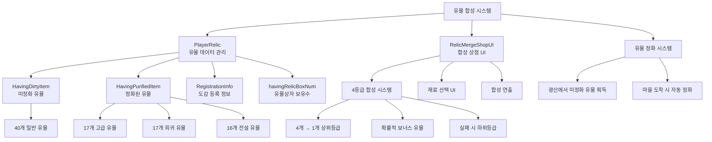

# 기능별 가이드 - 상점 시스템 - 유물 합성

## 개요
유물 합성 시스템은 플레이어가 획득한 유물들을 조합하여 더 높은 등급의 유물을 만들 수 있는 핵심 게임 메커니즘입니다. 4등급 시스템(일반, 고급, 희귀, 전설)을 통해 점진적인 성장을 제공하며, 정화, 합성, 도감 등록 등 다양한 기능을 포함하고 있습니다.

## 유물 합성 시스템 구조

### 시스템 아키텍처


## 관련 파일 경로

### 유물 합성 핵심 컴포넌트
```
RootDesk/MyDesk/Components/Player/Relic/
├── PlayerRelic.mlua                  # 유물 데이터 및 합성 로직
├── PlayerRelic.codeblock             # 유물 시스템 비주얼 스크립팅
└── RelicBookUI.mlua                  # 유물 도감 UI
```

### 유물 합성 상점
```
RootDesk/MyDesk/Components/Town/RelicMergeShop/
├── RelicMergeShopUI.mlua             # 유물 합성 상점 메인 UI
├── RelicMergeShopUI.codeblock        # 유물 합성 상점 비주얼
├── RelicMergeShopUI_MaterialButton.mlua # 재료 선택 버튼
├── RelicMergeShopUI_MaterialButton.codeblock # 재료 선택 비주얼
├── RelicMergeShopUI_MaterialSlotButton.mlua # 재료 슬롯 버튼
└── RelicMergeShopUI_MaterialSlotButton.codeblock # 재료 슬롯 비주얼
```

### 유물 관련 UI
```
ui/
└── RelicMergeGroup.ui                # 유물 합성 상점 UI 그룹
```

### 유물 데이터 테이블
```
RootDesk/MyDesk/DataSets/
├── Relic.csv                         # 유물 기본 정보
├── Relic.userdataset                 # 유물 데이터셋
├── RelicSet.csv                      # 유물 세트 정보 (도감용)
└── RelicSet.userdataset              # 유물 세트 데이터셋
```

## PlayerRelic 시스템 상세 분석

### 핵심 데이터 구조
```lua
@Component
script PlayerRelic extends Component

    property SyncTable<number> HavingDirtyItem        -- 미정화 유물 보유량
    property SyncTable<number> HavingPurifiedItem     -- 정화된 유물 보유량
    property SyncTable<boolean> RegistrationInfo      -- 도감 등록 상태
    property number ProbAcquiringBonusRelic = 0       -- 보너스 유물 획득 확률
    
    @Sync
    property number relicBoxBuyingCount = 0           -- 유물상자 구매 횟수
    property SyncTable<number> havingRelicBoxNum      -- 유물상자 보유 개수
```

### 유물 등급 시스템
```lua
-- 유물 등급별 개수 정의
local relicCount = {
    40,  -- 일반 유물 (1~40번)
    17,  -- 고급 유물 (41~57번)
    17,  -- 희귀 유물 (58~74번)  
    16   -- 전설 유물 (75~90번)
}

-- 등급별 인덱스 범위
-- 일반: 1 ~ 40
-- 고급: 41 ~ 57  
-- 희귀: 58 ~ 74
-- 전설: 75 ~ 90
```

### 유물 획득 시스템
```lua
@ExecSpace("ServerOnly")
method void AddRelic(boolean isDirty, number idx)
    local amount = 1
    
    -- 보너스 유물 획득 확률 적용
    local randomValue = _UtilLogic:RandomDouble()
    if randomValue < self.ProbAcquiringBonusRelic then
        amount = 2
        _CustomLocalizationLogic:SendLocalizedToastMessageFromServer(
            "Message_Gain1MoreRelic", self.Entity.OwnerId)
    end
    
    if isDirty == true then
        -- 미정화 유물 추가 (광산에서 획득)
        self.HavingDirtyItem[idx] = self.HavingDirtyItem[idx] + amount
        self:SetTableElementClient("HavingDirtyItem", idx, 
            tostring(self.HavingDirtyItem[idx]), self.Entity.OwnerId)
    else
        -- 정화된 유물 추가 (직접 지급)
        self.HavingPurifiedItem[idx] = self.HavingPurifiedItem[idx] + amount
        self:SetTableElementClient("HavingPurifiedItem", idx, 
            tostring(self.HavingPurifiedItem[idx]), self.Entity.OwnerId)
    end
end
```

### 유물 정화 시스템
```lua
@ExecSpace("Server")
method void Purifying()
    local count = 0
    
    -- 모든 미정화 유물을 정화된 유물로 변환
    for i=1, _DataService:GetRowCount("Relic") do
        -- 초기화 안전성 검사
        if self.HavingDirtyItem[i] == nil then
            return
        end
        
        if self.HavingDirtyItem[i] > 0 then
            -- 미정화 유물을 정화된 유물로 이전
            self.HavingPurifiedItem[i] = self.HavingPurifiedItem[i] + self.HavingDirtyItem[i]
            count = count + self.HavingDirtyItem[i]
            self.HavingDirtyItem[i] = 0
            
            -- 클라이언트 동기화
            self:SetTableElementClient("HavingDirtyItem", i, 
                tostring(self.HavingDirtyItem[i]), self.Entity.OwnerId)
            self:SetTableElementClient("HavingPurifiedItem", i, 
                tostring(self.HavingPurifiedItem[i]), self.Entity.OwnerId)
        end
    end
    
    -- 정화 완료 메시지
    if count > 0 then
        _CustomLocalizationLogic:SendLocalizedFormattedToastMessageFromServer(
            "Message_PurifiedInTown", {count}, self.Entity.OwnerId)
        _TutorialGuide:AddCondition(8, self.Entity.OwnerId)
        _UIAlarmMarker:SetEnableMarker("relic", true, self.Entity.OwnerId)
    end
end
```

## 유물 합성 로직

### 수동 합성 시스템
```lua
method number Merge(SyncTable<number> materials)
    local relicTable = _DataService:GetTable("Relic")
    local targetGrade = ""
    local targetRelicIdx = 0
    
    -- 1. 재료 유효성 검증
    for i=1, #materials do
        if materials[i] <= 0 then
            log("잘못된 재료 인덱스: " .. materials[i])
            return 0
        end
        
        -- 재료 보유량 확인
        if self.HavingPurifiedItem[materials[i]] <= 0 then
            log("재료 부족: " .. materials[i])
            return 0
        end
        
        -- 재료 등급 일관성 검사
        local materialGrade = relicTable:GetCell(materials[i], "Grade")
        if i == 1 then
            targetGrade = materialGrade
        elseif targetGrade ~= materialGrade then
            log("재료 등급 불일치")
            return 0
        end
    end
    
    -- 2. 재료 소모
    for i=1, #materials do
        self.HavingPurifiedItem[materials[i]] = self.HavingPurifiedItem[materials[i]] - 1
        self:SetTableElementClient("HavingPurifiedItem", materials[i], 
            tostring(self.HavingPurifiedItem[materials[i]]), self.Entity.OwnerId)
    end
    
    -- 3. 합성 결과 계산
    local resultRelicIdx = self:CalculateMergeResult(targetGrade)
    
    -- 4. 결과 유물 지급
    self.HavingPurifiedItem[resultRelicIdx] = self.HavingPurifiedItem[resultRelicIdx] + 1
    self:SetTableElementClient("HavingPurifiedItem", resultRelicIdx, 
        tostring(self.HavingPurifiedItem[resultRelicIdx]), self.Entity.OwnerId)
    
    return resultRelicIdx
end

method number CalculateMergeResult(string grade)
    local successRate = {
        ["Common"] = 0.7,     -- 일반 → 고급 (70%)
        ["Rare"] = 0.5,       -- 고급 → 희귀 (50%)  
        ["Epic"] = 0.3,       -- 희귀 → 전설 (30%)
        ["Legendary"] = 0.1   -- 전설 → ??? (10%)
    }
    
    local randomValue = _UtilLogic:RandomDouble()
    
    if grade == "Common" then
        if randomValue <= successRate["Common"] then
            -- 성공: 고급 유물 (41~57)
            return _UtilLogic:RandomIntegerRange(41, 57)
        else
            -- 실패: 일반 유물 (1~40) 
            return _UtilLogic:RandomIntegerRange(1, 40)
        end
    elseif grade == "Rare" then
        if randomValue <= successRate["Rare"] then
            -- 성공: 희귀 유물 (58~74)
            return _UtilLogic:RandomIntegerRange(58, 74)
        else
            -- 실패: 고급 유물 (41~57)
            return _UtilLogic:RandomIntegerRange(41, 57)
        end
    elseif grade == "Epic" then
        if randomValue <= successRate["Epic"] then
            -- 성공: 전설 유물 (75~90)
            return _UtilLogic:RandomIntegerRange(75, 90)
        else
            -- 실패: 희귀 유물 (58~74)
            return _UtilLogic:RandomIntegerRange(58, 74)
        end
    elseif grade == "Legendary" then
        if randomValue <= successRate["Legendary"] then
            -- 성공: 특별 전설 유물
            return _UtilLogic:RandomIntegerRange(87, 90)  -- 최고 등급 전설
        else
            -- 실패: 일반 전설 유물
            return _UtilLogic:RandomIntegerRange(75, 86)
        end
    end
    
    return 1  -- 기본값
end
```

### 자동 합성 시스템
```lua
@ExecSpace("Server")
method void AutoMerge(number grade)
    -- grade: 1=일반, 2=고급, 3=희귀, 4=전설
    
    local relicTable = _DataService:GetTable("Relic")
    local havingRelic = self.HavingPurifiedItem
    local relicCount = {40, 17, 17, 16}
    local materialCount = {}
    local gradeMaterialCount = {0, 0, 0, 0}
    
    -- 1. 등급별 재료 개수 계산
    for i=1, relicTable:GetRowCount() do
        if self:IsPossibleRegistToBook(i) == false then  -- 도감 등록 가능한 것 제외
            materialCount[i] = havingRelic[i]
            
            -- 등급별 분류
            if i <= relicCount[1] then
                gradeMaterialCount[1] = gradeMaterialCount[1] + materialCount[i]
            elseif i <= relicCount[1] + relicCount[2] then
                gradeMaterialCount[2] = gradeMaterialCount[2] + materialCount[i]
            elseif i <= relicCount[1] + relicCount[2] + relicCount[3] then
                gradeMaterialCount[3] = gradeMaterialCount[3] + materialCount[i]
            else
                gradeMaterialCount[4] = gradeMaterialCount[4] + materialCount[i]
            end
        else
            materialCount[i] = 0
        end
    end
    
    -- 2. 4배수 단위로 합성 개수 계산
    local mergeCount = math.floor(gradeMaterialCount[grade] / 4)
    if mergeCount <= 0 then
        log("합성 재료 부족")
        return
    end
    
    -- 3. 재료 소모 및 합성 실행
    local materialUsed = 0
    local resultTable = {}
    
    for i=1, relicTable:GetRowCount() do
        if materialUsed >= mergeCount * 4 then break end
        
        if self:IsGradeMatch(i, grade) and materialCount[i] > 0 then
            local useAmount = math.min(materialCount[i], (mergeCount * 4) - materialUsed)
            
            self.HavingPurifiedItem[i] = self.HavingPurifiedItem[i] - useAmount
            materialUsed = materialUsed + useAmount
            
            self:SetTableElementClient("HavingPurifiedItem", i, 
                tostring(self.HavingPurifiedItem[i]), self.Entity.OwnerId)
        end
    end
    
    -- 4. 결과 유물 생성
    for i=1, mergeCount do
        local resultRelicIdx = self:CalculateAutoMergeResult(grade)
        
        if resultTable[resultRelicIdx] == nil then
            resultTable[resultRelicIdx] = 0
        end
        resultTable[resultRelicIdx] = resultTable[resultRelicIdx] + 1
        
        self.HavingPurifiedItem[resultRelicIdx] = self.HavingPurifiedItem[resultRelicIdx] + 1
        self:SetTableElementClient("HavingPurifiedItem", resultRelicIdx, 
            tostring(self.HavingPurifiedItem[resultRelicIdx]), self.Entity.OwnerId)
    end
    
    -- 5. 결과 UI 표시
    self:SetAutoMergeResultUI(_UtilLogic:TableToString(resultTable))
end

method boolean IsGradeMatch(number relicIdx, number targetGrade)
    local relicCount = {40, 17, 17, 16}
    local gradeStart = 1
    
    for i=1, targetGrade-1 do
        gradeStart = gradeStart + relicCount[i]
    end
    
    local gradeEnd = gradeStart + relicCount[targetGrade] - 1
    return relicIdx >= gradeStart and relicIdx <= gradeEnd
end
```

## RelicMergeShopUI - 합성 상점 시스템

### UI 초기화 및 재료 표시
```lua
@Component
script RelicMergeShopUI extends Component

    property string targetGrade = ""            -- 선택된 등급
    property boolean IsPlayingDirection = false -- 합성 연출 중 여부
    property number autoMerge_SelectedGrade = 0 -- 자동 합성 선택 등급
```

### 메인 패널 새로고침
```lua
@ExecSpace("Client")
method void RefreshMainPanel()
    local listEntity = _EntityService:GetEntityByPath("/ui/RelicMergeGroup/RelicMergeShop/Panel/img_paper/Scroll_Layout")
    local relicTable = _DataService:GetTable("Relic")
    
    -- 1. 등급별 재료 개수 계산
    local havingRelic = _UserService.LocalPlayer.PlayerRelic.HavingPurifiedItem
    local relicCount = {40, 17, 17, 16}
    local materialCount = {}
    local gradeMaterialCount = {0, 0, 0, 0}
    
    for i=1, relicTable:GetRowCount() do
        if self:IsPossibleRegistToBook(i) == false then
            materialCount[i] = havingRelic[i]
            
            -- 등급별 분류 및 집계
            if i <= relicCount[1] then
                gradeMaterialCount[1] = gradeMaterialCount[1] + materialCount[i]
            elseif i <= relicCount[1] + relicCount[2] then
                gradeMaterialCount[2] = gradeMaterialCount[2] + materialCount[i]
            elseif i <= relicCount[1] + relicCount[2] + relicCount[3] then
                gradeMaterialCount[3] = gradeMaterialCount[3] + materialCount[i]
            else
                gradeMaterialCount[4] = gradeMaterialCount[4] + materialCount[i]
            end
        else
            materialCount[i] = 0  -- 도감 등록 가능한 것은 제외
        end
    end
    
    -- 2. 4배수 단위로 합성 가능한 개수 계산
    for i=1, 4 do
        gradeMaterialCount[i] = gradeMaterialCount[i] - (gradeMaterialCount[i] % 4)
    end
    
    -- 3. 등급별 UI 업데이트
    for i=1, 4 do
        local slot = listEntity:GetChildByName("Slot_"..tostring(i))
        
        local materialAmountUI = _EntityService:GetEntityByPath(slot.Path.."/HavingAmount/text")
        local resultAmountUI = _EntityService:GetEntityByPath(slot.Path.."/result/text")
        local selectedSprite = _EntityService:GetEntityByPath(slot.Path.."/icon_check/on")
        local deselectedSprite = _EntityService:GetEntityByPath(slot.Path.."/icon_check/off")
        local unselectableCover = _EntityService:GetEntityByPath(slot.Path.."/cover_dark")
        
        -- 재료 부족 시 선택 불가 표시
        if gradeMaterialCount[i] < 4 then
            unselectableCover.Enable = true
            slot.ButtonComponent.Enable = false
        else
            unselectableCover.Enable = false
            slot.ButtonComponent.Enable = true
        end
        
        -- 재료 및 결과 수량 표시
        materialAmountUI.TextComponent.Text = _ThousandsSeparator:Separate(gradeMaterialCount[i])
        resultAmountUI.TextComponent.Text = _ThousandsSeparator:Separate(math.floor(gradeMaterialCount[i] / 4))
        
        -- 선택 상태 UI
        if self.autoMerge_SelectedGrade == i then
            deselectedSprite.Enable = false
            selectedSprite.Enable = true
            slot.SpriteGUIRendererComponent:ChangeMaterial("material://57bd5075-8354-4c94-9b33-0f6fff7886a7")
            materialAmountUI.TextComponent.FontColor.a = 1
            resultAmountUI.TextComponent.FontColor.a = 1
        else
            deselectedSprite.Enable = true
            selectedSprite.Enable = false
            slot.SpriteGUIRendererComponent:ChangeMaterial("")
            materialAmountUI.TextComponent.FontColor.a = 0.4
            resultAmountUI.TextComponent.FontColor.a = 0.4
        end
    end
    
    -- 4. 합성 버튼 활성화 상태
    local autoMergeButton = _EntityService:GetEntityByPath("/ui/RelicMergeGroup/RelicMergeShop/Panel/MergeButton")
    if self.autoMerge_SelectedGrade > 0 and gradeMaterialCount[self.autoMerge_SelectedGrade] >= 4 then
        autoMergeButton.ButtonComponent.Enable = true
    else
        autoMergeButton.ButtonComponent.Enable = false
    end
end
```

### 합성 연출 시스템
```lua
@ExecSpace("Client")
method void PlayMergeDirection()
    self.IsPlayingDirection = true
    
    local paper = _EntityService:GetEntityByPath("/ui/RelicMergeGroup/RelicMergeShop/Panel/img_paper")
    
    -- 1. 버튼 임시 비활성화 (연출 중 중복 클릭 방지)
    local closeBtn = _EntityService:GetEntityByPath("/ui/RelicMergeGroup/RelicMergeShop/Panel/TitlePanel/ExitButton")
    local mergeBtn = _EntityService:GetEntityByPath("/ui/RelicMergeGroup/RelicMergeShop/Panel/MergeButton")
    closeBtn.Enable = false
    mergeBtn.Enable = false
    
    local btnEnable = function()
        closeBtn.Enable = true
        mergeBtn.Enable = true
    end
    _TimerService:SetTimerOnce(btnEnable, 3)
    
    -- 2. 재료 슬롯 효과 연출
    for i=1, 4 do
        local slot = paper:GetChildByName("Slot_"..tostring(i))
        local SlotEffect = slot:GetChildByName("Effect")
        local icon = slot:GetChildByName("Icon")
        local caution = slot:GetChildByName("CautionButton")
        
        caution.Enable = false
        
        local cloneSlotEffect = function()
            local clonedEffect = SlotEffect:Clone()
            icon.Enable = false  -- 재료 아이콘 숨김
            _SoundService:PlaySound("c0d7360d9e0c4a4aa06555b51975a8ab", 0.5)  -- 합성 사운드
            
            clonedEffect:Destroy(1)  -- 1초 후 효과 제거
        end
        
        _TimerService:SetTimerOnce(cloneSlotEffect, 0.25 * i)  -- 순차적 연출
    end
    
    -- 3. 결과 패널 페이드 인
    local resultPanel = _EntityService:GetEntityByPath("/ui/RelicMergeGroup/RelicMergeShop/ResultPanel")
    local resultPanelEffect = resultPanel:GetChildByName("Effect")
    local resultPopup = resultPanel:GetChildByName("Popup")
    
    resultPanel.SpriteGUIRendererComponent.Color.a = 0
    resultPanel.Enable = true
    resultPopup.Enable = false
    
    -- 배경 알파값 서서히 증가
    local alpha = 0
    local setPanelAlpha = function()
        alpha = alpha + 1/60
        resultPanel.SpriteGUIRendererComponent.Color.a = alpha
    end
    
    for i=1, 30 do
        _TimerService:SetTimerOnce(setPanelAlpha, i/30)
    end
    
    -- 4. 결과 효과 연출
    local cloneResultEffect = function()
        local clonedEffect = resultPanelEffect:Clone()
        _SoundService:PlaySound("4feadbd22c8f46e6b5ecf6b1e980c774", 0.5)  -- 결과 사운드
        
        clonedEffect:Destroy(2.5)
    end
    
    _TimerService:SetTimerOnce(cloneResultEffect, 1.5)
    
    -- 5. 결과 팝업 표시
    local popupEnable = function()
        resultPopup.Enable = true
        self.IsPlayingDirection = false
    end
    _TimerService:SetTimerOnce(popupEnable, 2.5)
end
```

## 유물 상자 시스템

### 유물상자 구매 및 열기
```lua
@ExecSpace("Server")
method void GetRelicBox(number boxType)
    -- boxType: 1=기본, 2=고급, 3=특별
    
    local boxTable = _DataService:GetTable("RelicBox")
    local cost = tonumber(boxTable:GetCell(boxType, "Cost"))
    
    -- 비용 차감 (젬)
    if self.Entity.PlayerStorage.currencyItems[2] < cost then
        log("젬 부족")
        return
    end
    
    self.Entity.PlayerStorage:UseCurrencyItems(2, cost)
    
    -- 유물상자 지급
    self.havingRelicBoxNum[boxType] = self.havingRelicBoxNum[boxType] + 1
    self:SetTableElementClient("havingRelicBoxNum", boxType, 
        tostring(self.havingRelicBoxNum[boxType]), self.Entity.OwnerId)
end

@ExecSpace("Server")
method void OpenRelicBox(number boxType)
    if self.havingRelicBoxNum[boxType] <= 0 then
        log("보유한 상자가 없음")
        return
    end
    
    -- 상자 개수 차감
    self.havingRelicBoxNum[boxType] = self.havingRelicBoxNum[boxType] - 1
    self:SetTableElementClient("havingRelicBoxNum", boxType, 
        tostring(self.havingRelicBoxNum[boxType]), self.Entity.OwnerId)
    
    -- 등급별 확률 테이블
    local probTable = {
        [1] = {0.6, 0.3, 0.09, 0.01},  -- 기본: 일반 60%, 고급 30%, 희귀 9%, 전설 1%
        [2] = {0.4, 0.4, 0.18, 0.02},  -- 고급: 일반 40%, 고급 40%, 희귀 18%, 전설 2%
        [3] = {0.2, 0.3, 0.4, 0.1}     -- 특별: 일반 20%, 고급 30%, 희귀 40%, 전설 10%
    }
    
    -- 랜덤 유물 생성
    local grade = self:SelectRandomGrade(probTable[boxType])
    local relicIdx = self:GetRandomRelicByGrade(grade)
    
    -- 유물 지급 (정화된 상태로)
    self:AddRelic(false, relicIdx)
    
    -- 결과 표시
    self:ShowRelicBoxResult(relicIdx, boxType)
end

method number SelectRandomGrade(table probTable)
    local randomValue = _UtilLogic:RandomDouble()
    local cumulative = 0
    
    for i=1, #probTable do
        cumulative = cumulative + probTable[i]
        if randomValue <= cumulative then
            return i
        end
    end
    
    return 1  -- 기본값
end
```

## 유물 도감 연동 시스템

### 도감 등록 가능 여부 확인
```lua
method boolean IsPossibleRegistToBook(number relicIdx)
    if relicIdx == nil or relicIdx < 1 or relicIdx > 90 then
        return false
    end
    
    -- 유물 도감에 등록 가능한지 확인
    local relicSetTable = _DataService:GetTable("RelicSet")
    local registInfo = self.RegistrationInfo
    
    -- 모든 세트를 순회하면서 검사
    for i=1, relicSetTable:GetRowCount() do
        for j=1, 4 do  -- 각 세트의 4개 재료 확인
            local registMaterialIdx = tonumber(relicSetTable:GetCell(i, j*2))
            
            -- 현재 유물이 등록 재료와 일치하는지 확인
            if registMaterialIdx == relicIdx then
                local registedInfo = registInfo[(i-1)*4+j]
                if registedInfo == false then
                    return true  -- 등록 가능
                end
            end
        end
    end
    
    return false  -- 등록 불가능
end

@ExecSpace("Server")
method void RegisterToBook(number slotIdx, string message)
    local relicSetTable = _DataService:GetTable("RelicSet")
    
    -- 슬롯 인덱스를 행/열 좌표로 변환
    local rowIdx = math.floor((slotIdx-1)/4) + 1
    local columnIdx = math.floor((slotIdx-1)%4)+1
    
    local targetIdx = tonumber(relicSetTable:GetCell(rowIdx, columnIdx*2))
    local upgradeNum = tonumber(relicSetTable:GetCell(rowIdx, columnIdx*2 + 1))
    
    -- 필요한 유물 보유량 확인
    if self.HavingPurifiedItem[targetIdx] < upgradeNum then
        _CustomLocalizationLogic:SendLocalizedToastMessageFromServer(
            "Message_ThereIsNoRelicTryingRegist", self.Entity.OwnerId)
        return
    end
    
    -- 등록 처리: 유물 소모 및 도감 등록
    self.HavingPurifiedItem[targetIdx] = self.HavingPurifiedItem[targetIdx] - upgradeNum
    self.RegistrationInfo[slotIdx] = true
    
    -- 클라이언트 동기화
    self:SetTableElementClient("HavingPurifiedItem", targetIdx, 
        tostring(self.HavingPurifiedItem[targetIdx]), self.Entity.OwnerId)
    self:SetTableElementClient("RegistrationInfo", slotIdx, 
        tostring(self.RegistrationInfo[slotIdx]), self.Entity.OwnerId)
    
    _UIToast:ShowMessage(message, self.Entity.OwnerId)
end
```

## 유물 재활용 시스템

### 유물 분해 및 레거시 코인 획득
```lua
@ExecSpace("Server")
method void RecycleRelics()
    local havingRelic = self.HavingPurifiedItem
    local totalAmount = 0
    
    -- 도감 등록 불가능한 유물들을 레거시 코인으로 변환
    for i=1, _DataService:GetRowCount("Relic") do
        if self:IsPossibleRegistToBook(i) == false and havingRelic[i] > 0 then
            local recycleValue = self:GetRelicRecycleValue(i)
            totalAmount = totalAmount + (havingRelic[i] * recycleValue)
            
            -- 유물 제거
            self.HavingPurifiedItem[i] = 0
            self:SetTableElementClient("HavingPurifiedItem", i, "0", self.Entity.OwnerId)
        end
    end
    
    -- 레거시 코인 지급
    if totalAmount > 0 then
        self.Entity.PlayerStorage:AddCurrencyItems(7, totalAmount, true)  -- 레거시 코인
        self:SetRecycleResultUI(totalAmount, self.Entity.OwnerId)
    end
end

method number GetRelicRecycleValue(number relicIdx)
    -- 등급별 재활용 가치
    if relicIdx <= 40 then
        return 10    -- 일반 유물: 10 코인
    elseif relicIdx <= 57 then
        return 50    -- 고급 유물: 50 코인
    elseif relicIdx <= 74 then
        return 200   -- 희귀 유물: 200 코인
    else
        return 1000  -- 전설 유물: 1000 코인
    end
end
```

## 성능 최적화

### 대량 합성 최적화
```lua
-- 자동 합성 시 배치 처리
method void BatchMerge(number grade, number count)
    -- 대량 합성을 효율적으로 처리
    local results = {}
    
    for i=1, count do
        local resultIdx = self:CalculateAutoMergeResult(grade)
        
        if results[resultIdx] == nil then
            results[resultIdx] = 0
        end
        results[resultIdx] = results[resultIdx] + 1
    end
    
    -- 한번에 모든 결과 적용
    for relicIdx, amount in pairs(results) do
        self.HavingPurifiedItem[relicIdx] = self.HavingPurifiedItem[relicIdx] + amount
        self:SetTableElementClient("HavingPurifiedItem", relicIdx, 
            tostring(self.HavingPurifiedItem[relicIdx]), self.Entity.OwnerId)
    end
end
```

### 메모리 관리
- 합성 연출 중 불필요한 UI 업데이트 방지
- 효과 오브젝트 자동 정리
- 대량 데이터 처리 시 배치 단위로 분할

## 확장 가능성

### 새로운 유물 등급 추가
```lua
-- 신화 등급 유물 시스템
method void AddMythicGrade()
    -- 5번째 등급으로 신화 유물 추가
    local relicCount = {40, 17, 17, 16, 10}  -- 신화 10개 추가
    
    -- 합성 확률 조정
    local mythicSuccessRate = 0.05  -- 전설 → 신화 5%
end

-- 세트 효과 시스템
method void ApplySetEffect(number setIdx)
    -- 특정 유물 조합 완성 시 특별 효과
end

-- 유물 강화 시스템
method void EnhanceRelic(number relicIdx, number enhanceLevel)
    -- 기존 유물을 재료로 같은 유물 강화
end
```

## 일반적인 문제 해결

### 합성이 실행되지 않는 경우
1. 재료 유물 보유량 확인
2. 도감 등록 가능한 유물 제외 여부 확인
3. `Merge` 메서드 호출 권한 점검

### UI가 올바르게 업데이트되지 않는 경우
1. `RefreshMainPanel` 호출 여부 확인
2. 클라이언트-서버 동기화 상태 점검
3. UI 엔티티 참조 경로 확인

### 합성 확률이 의도와 다른 경우
1. `CalculateMergeResult` 로직 검증
2. 랜덤 시드 초기화 확인
3. 확률 테이블 값 점검

