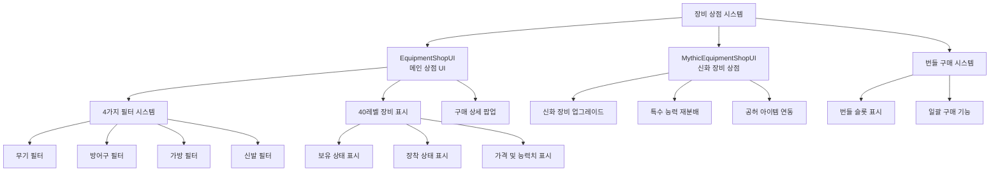

# 기능별 가이드 - 상점 시스템 - 장비 상점

## 개요
장비 상점은 플레이어가 다양한 무기, 방어구, 가방, 신발을 구매할 수 있는 핵심 상점 시스템입니다. 40단계의 장비 레벨을 제공하며, 타입별 필터링, 번들 구매, 신화 장비 시스템 등 다양한 기능을 포함하고 있습니다.

## 장비 상점 시스템 구조

### 시스템 아키텍처


## 관련 파일 경로

### 장비 상점 핵심 컴포넌트
```
RootDesk/MyDesk/Components/Town/EquipmentShop/
├── EquipmentShopUI.mlua              # 메인 장비 상점 UI
├── EquipmentShopUI.codeblock         # 장비 상점 비주얼 스크립팅
├── EquipmentShopSlotButton.mlua      # 장비 슬롯 버튼 처리
├── EquipmentShopSlotButton.codeblock # 장비 슬롯 버튼 비주얼
├── EquipmentShopBundleSlotButton.mlua # 번들 슬롯 버튼
├── EquipmentShopBundleSlotButton.codeblock # 번들 슬롯 비주얼
├── MythicEquipmentShopUI.mlua        # 신화 장비 상점
├── MythicEquipmentShopUI.codeblock   # 신화 장비 비주얼
├── MythicEquipmentShopUI_RedistributionCheckPopup_CheckButton.mlua # 재분배 확인 버튼
└── MythicEquipmentShopUI_RedistributionCheckPopup_CheckButton.codeblock # 재분배 확인 비주얼
```

### 장비 상점 관련 UI
```
ui/
└── EquipShopGroup.ui                 # 장비 상점 UI 그룹
```

### 장비 데이터 테이블
```
RootDesk/MyDesk/DataSets/
├── Equipment.csv                     # 장비 기본 정보 및 가격
├── Equipment.userdataset             # 장비 데이터셋
├── EquipmentAvatar.csv               # 장비 아바타/아이콘 RUID
├── EquipmentAvatar.userdataset       # 장비 아바타 데이터셋
├── MythicEquipment.csv               # 신화 장비 정보 (추정)
└── VoidItems.csv                     # 공허 아이템 (신화 장비 연동)
```

## EquipmentShopUI 시스템 상세 분석

### 핵심 데이터 구조
```lua
@Component
script EquipmentShopUI extends Component

    property number filterIdx = 1                    -- 현재 필터 (1:무기, 2:방어구, 3:가방, 4:신발)
    property Entity EquipmentGuidePanel = "GUID"    -- 가이드 패널 참조
    property number recentBuyIndex = 0               -- 최근 구매한 장비 인덱스
    property number recentBuyType = 0                -- 최근 구매한 장비 타입
    property number beforeAbility1 = 0               -- 구매 전 능력치 1
    property number beforeAbility2 = 0               -- 구매 전 능력치 2
    property SyncTable<boolean> oneshot_checked      -- 번들 구매 체크 상태
    property boolean IsPlayingDirection = false      -- 구매 연출 재생 중
```

### UI 초기화 시스템
```lua
@ExecSpace("ClientOnly")
method void OnBeginPlay()
    -- 1. 지역화 텍스트 설정
    local EquipShopFilterList = _EntityService:GetEntityByPath("/ui/EquipShopGroup/EquipShop/Panel/FilterList")
    for i=1, 4 do
        EquipShopFilterList:GetChildByName("Filter_"..tostring(i)).TextComponent.Text = 
            _LocalizationService:GetText("EquipType_"..tostring(i))
    end
    
    -- 공통 UI 텍스트 지역화
    local itemSlot = _EntityService:GetEntityByPath("/ui/EquipShopGroup/EquipShop/Panel/ListPanel/Slot")
    itemSlot:GetChildByName("HavingItem"):GetChildByName("text").TextComponent.Text = 
        _LocalizationService:GetText("Possession")
    itemSlot:GetChildByName("EquipedItem").TextComponent.Text = 
        _LocalizationService:GetText("Equiped")
    
    -- 상세 팝업 텍스트
    _EntityService:GetEntityByPath("/ui/EquipShopGroup/EquipShop/DetailInfoPopup/Panel/Ability/UIText")
        .TextComponent.Text = _LocalizationService:GetText("EquipedAbility_Title3")
    _EntityService:GetEntityByPath("/ui/EquipShopGroup/EquipShop/DetailInfoPopup/Panel/CostPanel/UIText")
        .TextComponent.Text = _LocalizationService:GetText("PurchasePrice")
    
    -- 2. 장비 슬롯 생성 (40개)
    local slotEntity = _EntityService:GetEntityByPath("/ui/EquipShopGroup/EquipShop/Panel/ListPanel/Slot")
    for i=1, 40 do
        slotEntity:Clone("Slot_"..tostring(i))
    end
    
    -- 3. 번들 구매 슬롯 생성
    local equipmentTable = _DataService:GetTable("Equipment")
    local bundleSlot = _EntityService:GetEntityByPath("/ui/EquipShopGroup/EquipShop/BundlePurchasePopup/Panel/ListPanel/Slot")
    
    for i=1, 40 do
        local clonedSlot = bundleSlot:Clone("Slot_"..tostring(i))
        
        -- 번들 슬롯 가격 표시
        clonedSlot:GetChildByName("MoneyPanel"):GetChildByName("Num").TextComponent.Text = 
            _ThousandsSeparator:ConvertToMetricPrefixString(tonumber(equipmentTable:GetCell(i, 1)))
        
        self.oneshot_checked[i] = false  -- 번들 체크 상태 초기화
    end
    
    -- 4. 기본 설정
    self:ChangeFilter(1)  -- 무기 필터로 시작
    self:RefreshUI()
end
```

### 필터 시스템
```lua
method void ChangeFilter(number newFilterIdx)
    self.filterIdx = newFilterIdx
    
    -- 필터 버튼 UI 업데이트
    local filterList = _EntityService:GetEntityByPath("/ui/EquipShopGroup/EquipShop/Panel/FilterList")
    for i=1, 4 do
        local filterButton = filterList:GetChildByName("Filter_"..tostring(i))
        if i == newFilterIdx then
            filterButton.SpriteGUIRendererComponent.Color = Color.yellow  -- 선택된 필터
        else
            filterButton.SpriteGUIRendererComponent.Color = Color.white   -- 기본 색상
        end
    end
    
    -- UI 새로고침
    self:RefreshUI()
end

-- 필터 타입별 분류
-- 1: 무기 (Weapon)
-- 2: 방어구 (Armor) 
-- 3: 가방 (Bag)
-- 4: 신발 (Shoes)
```

### 장비 목록 표시 시스템
```lua
@ExecSpace("Client") 
method void RefreshUI_Inner()
    local userData = _UserService.LocalPlayer.PlayerData
    
    -- 1. 플레이어 골드 표시
    local moneyNumUI = _EntityService:GetEntityByPath("/ui/EquipShopGroup/EquipShop/Panel/MoneyPanel/Num")
    moneyNumUI.TextComponent.Text = _ThousandsSeparator:ConvertToMetricPrefixString(userData.Money)
    
    -- 2. 장비 목록 갱신
    local itemListPanel = _EntityService:GetEntityByPath("/ui/EquipShopGroup/EquipShop/Panel/ListPanel")
    local equipmentTable = _DataService:GetTable("Equipment")
    local ruidTable = _DataService:GetTable("EquipmentAvatar")
    local equipedSlotIdx = userData.equiped[self.filterIdx]  -- 현재 장착 중인 장비
    
    for i=1, 40 do
        local slot = itemListPanel:GetChildByName("Slot_"..tostring(i))
        
        -- 3. 필터별 RUID 및 아이콘 설정
        local ruid = ""
        if self.filterIdx == 1 then      -- 무기
            ruid = "thumbnail://"..ruidTable:GetCell(i+1, 1)
        elseif self.filterIdx == 2 then  -- 방어구
            ruid = "thumbnail://"..ruidTable:GetCell(i+1, 5)
        elseif self.filterIdx == 3 then  -- 가방
            ruid = ruidTable:GetCell(i+1, 7)
        elseif self.filterIdx == 4 then  -- 신발
            ruid = "thumbnail://"..ruidTable:GetCell(i+1, 6)
        end
        
        -- 4. 슬롯 UI 업데이트
        slot:GetChildByName("Icon").SpriteGUIRendererComponent.ImageRUID = ruid
        
        -- 장비 이름 및 레벨
        slot:GetChildByName("Name").TextComponent.Text = 
            _LocalizationService:GetText("EquipType_"..self.filterIdx).." Lv."..i
        
        -- 가격 표시
        local cost = tonumber(equipmentTable:GetCell(i, 1))
        slot:GetChildByName("Price").TextComponent.Text = 
            _ThousandsSeparator:ConvertToMetricPrefixString(cost)
        
        -- 5. 보유/장착 상태 표시
        local haveEquipment = userData.haveEquipment
        local equipmentIdx = 40 * (self.filterIdx - 1) + i
        
        if haveEquipment[equipmentIdx] == true then
            -- 보유 중
            slot:GetChildByName("HavingItem").Enable = true
            slot:GetChildByName("Icon").SpriteGUIRendererComponent.Color = Color.white
            
            if equipedSlotIdx == i then
                -- 현재 장착 중
                slot:GetChildByName("EquipedItem").Enable = true
                slot:GetChildByName("EquipedItem").TextComponent.Text = 
                    _LocalizationService:GetText("Equiped")
            else
                slot:GetChildByName("EquipedItem").Enable = false
            end
        else
            -- 미보유
            slot:GetChildByName("HavingItem").Enable = false
            slot:GetChildByName("EquipedItem").Enable = false
            slot:GetChildByName("Icon").SpriteGUIRendererComponent.Color = Color(0.5, 0.5, 0.5, 1)
        end
        
        -- 6. 구매 가능 여부 (골드 부족 시 빨간색 표시)
        if userData.Money < cost then
            slot:GetChildByName("Price").TextComponent.FontColor = Color.red
        else
            slot:GetChildByName("Price").TextComponent.FontColor = Color.white
        end
    end
end
```

### 장비 상세 정보 팝업
```lua
method void ShowDetailPopup(number slotIdx)
    local equipmentTable = _DataService:GetTable("Equipment")
    local userData = _UserService.LocalPlayer.PlayerData
    
    -- 상세 팝업 활성화
    local detailPopup = _EntityService:GetEntityByPath("/ui/EquipShopGroup/EquipShop/DetailInfoPopup")
    detailPopup.Enable = true
    
    -- 장비 정보 표시
    local equipmentIdx = 40 * (self.filterIdx - 1) + slotIdx
    local cost = tonumber(equipmentTable:GetCell(slotIdx, 1))
    
    -- 아이콘 설정
    local iconUI = detailPopup:GetChildByName("Panel/Icon")
    local ruidTable = _DataService:GetTable("EquipmentAvatar")
    local ruid = self:GetEquipmentRUID(slotIdx, self.filterIdx, ruidTable)
    iconUI.SpriteGUIRendererComponent.ImageRUID = ruid
    
    -- 이름 및 레벨
    detailPopup:GetChildByName("Panel/Name").TextComponent.Text = 
        _LocalizationService:GetText("EquipType_"..self.filterIdx).." Lv."..slotIdx
    
    -- 능력치 정보
    local ability1, ability2 = self:CalculateEquipmentAbility(slotIdx, self.filterIdx)
    detailPopup:GetChildByName("Panel/Ability/Ability1").TextComponent.Text = 
        string.format("+%s", _ThousandsSeparator:ConvertToMetricPrefixString(ability1))
    detailPopup:GetChildByName("Panel/Ability/Ability2").TextComponent.Text = 
        string.format("+%s", _ThousandsSeparator:ConvertToMetricPrefixString(ability2))
    
    -- 가격
    detailPopup:GetChildByName("Panel/CostPanel/Cost").TextComponent.Text = 
        _ThousandsSeparator:ConvertToMetricPrefixString(cost)
    
    -- 구매 버튼 상태
    local buyButton = detailPopup:GetChildByName("Panel/Button_Buy")
    if userData.haveEquipment[equipmentIdx] == true then
        buyButton.ButtonComponent.Enable = false
        buyButton:GetChildByName("Title").TextComponent.Text = 
            _LocalizationService:GetText("Owned")
    elseif userData.Money < cost then
        buyButton.ButtonComponent.Enable = false  
        buyButton:GetChildByName("Title").TextComponent.Text = 
            _LocalizationService:GetText("InsufficientFunds")
    else
        buyButton.ButtonComponent.Enable = true
        buyButton:GetChildByName("Title").TextComponent.Text = 
            _LocalizationService:GetText("Purchase")
    end
end
```

### 장비 능력치 계산
```lua
method number, number CalculateEquipmentAbility(number level, number type)
    -- 장비 타입별 능력치 계산 공식
    local baseAbility1, baseAbility2 = 0, 0
    
    if type == 1 then  -- 무기
        -- 공격력, 채굴력
        baseAbility1 = level * 100 + math.pow(level, 1.5) * 50
        baseAbility2 = level * 80 + math.pow(level, 1.3) * 30
        
    elseif type == 2 then  -- 방어구  
        -- 방어력, 체력
        baseAbility1 = level * 80 + math.pow(level, 1.4) * 40
        baseAbility2 = level * 120 + math.pow(level, 1.6) * 60
        
    elseif type == 3 then  -- 가방
        -- 인벤토리 용량, 행운
        baseAbility1 = level * 5  -- 슬롯 수
        baseAbility2 = level * 2  -- 행운 보너스
        
    elseif type == 4 then  -- 신발
        -- 이동속도, 점프력
        baseAbility1 = level * 3  -- 이동속도 %
        baseAbility2 = level * 2  -- 점프력 %
    end
    
    return baseAbility1, baseAbility2
end
```

### 장비 구매 시스템
```lua
method void PurchaseEquipment(number slotIdx)
    local equipmentIdx = 40 * (self.filterIdx - 1) + slotIdx
    local cost = tonumber(_DataService:GetTable("Equipment"):GetCell(slotIdx, 1))
    local userData = _UserService.LocalPlayer.PlayerData
    
    -- 구매 검증
    if userData.haveEquipment[equipmentIdx] == true then
        _UIToast:ShowMessage(_LocalizationService:GetText("AlreadyOwned"))
        return
    end
    
    if userData.Money < cost then
        _UIToast:ShowMessage(_LocalizationService:GetText("InsufficientFunds"))
        return
    end
    
    -- 구매 처리 (서버에 요청)
    userData:AddEquipment(self.filterIdx, slotIdx)
    
    -- 구매 성공 연출
    self:PlayPurchaseEffect(slotIdx, self.filterIdx)
    
    -- UI 새로고침
    self:RefreshUI()
end
```

## 번들 구매 시스템

### 번들 구매 팝업
```lua
method void ShowBundlePurchasePopup()
    local bundlePopup = _EntityService:GetEntityByPath("/ui/EquipShopGroup/EquipShop/BundlePurchasePopup")
    bundlePopup.Enable = true
    
    -- 현재 필터의 모든 장비를 번들로 표시
    local equipmentTable = _DataService:GetTable("Equipment")
    local userData = _UserService.LocalPlayer.PlayerData
    local totalCost = 0
    local purchasableCount = 0
    
    for i=1, 40 do
        local equipmentIdx = 40 * (self.filterIdx - 1) + i
        local cost = tonumber(equipmentTable:GetCell(i, 1))
        
        if userData.haveEquipment[equipmentIdx] ~= true then
            totalCost = totalCost + cost
            purchasableCount = purchasableCount + 1
        end
    end
    
    -- 번들 정보 표시
    bundlePopup:GetChildByName("Panel/TotalCost").TextComponent.Text = 
        _ThousandsSeparator:ConvertToMetricPrefixString(totalCost)
    bundlePopup:GetChildByName("Panel/ItemCount").TextComponent.Text = 
        string.format("%d개 장비", purchasableCount)
end

method void PurchaseBundle()
    local userData = _UserService.LocalPlayer.PlayerData
    local equipmentTable = _DataService:GetTable("Equipment")
    local totalCost = 0
    local purchaseList = {}
    
    -- 구매 가능한 장비 목록 생성
    for i=1, 40 do
        local equipmentIdx = 40 * (self.filterIdx - 1) + i
        if userData.haveEquipment[equipmentIdx] ~= true then
            local cost = tonumber(equipmentTable:GetCell(i, 1))
            totalCost = totalCost + cost
            table.insert(purchaseList, {idx = i, cost = cost})
        end
    end
    
    -- 골드 확인
    if userData.Money < totalCost then
        _UIToast:ShowMessage(_LocalizationService:GetText("InsufficientFunds"))
        return
    end
    
    -- 번들 구매 실행
    for _, item in ipairs(purchaseList) do
        userData:AddEquipment(self.filterIdx, item.idx)
    end
    
    -- 번들 구매 성공 메시지
    _UIToast:ShowMessage(string.format("번들 구매 완료! %d개 장비 획득", #purchaseList))
    
    self:RefreshUI()
end
```

## MythicEquipmentShopUI - 신화 장비 시스템

### 신화 장비 구조
```lua
@Component
script MythicEquipmentShopUI extends Component

    property number filterIdx = 1                     -- 신화 장비 타입
    property SyncTable<boolean> redistributionChecked -- 재분배 체크 상태
    property number upgradeLevel = 0                  -- 업그레이드 레벨
    property boolean IsPlayingDirection = false       -- 업그레이드 연출 중
    property Entity beadsDetailInfoPanel = "GUID"    # 염주 상세 정보 패널
```

### 신화 장비 업그레이드 시스템
```lua
method void RefreshUI()
    local level = _UserService.LocalPlayer.PlayerMythicEquipment.EquipmentLevel[self.filterIdx]
    
    -- 신화 장비 아이콘 및 정보
    local icon = {
        "thumbnail://a062c5e53c6f45b3994d1e688cd73ea3",  -- 신화 무기
        "thumbnail://52a6839f290e431fbe29764bfbadae10",  -- 신화 방어구
        "067d97e8224f4e49bdcebc3dbd0570a2",             -- 신화 가방
        "thumbnail://7967810b0e1a438ba6525116e537a0ba"   -- 신화 신발
    }
    
    local abilityTitle = {"8001", "8002", "8003", "8005"}  -- 능력치 제목
    local abilityAmount = {30000000, 2500000, 3000000000, 30}  -- 기본 능력치
    
    -- 레벨업 비용 계산 (레벨에 따라 증가)
    local levelupCost = 150000000000 * (1 + 0.6 * level)
    
    -- 공허 아이템 20: 신화 장비 레벨업 비용 감소
    local voidItemLv = _UserService.LocalPlayer.PlayerVoidItem.haveItems[20]
    if voidItemLv > 0 then
        local voidItemTable = _DataService:GetTable("VoidItems")
        local costReduction = tonumber(voidItemTable:GetCell(20, "InitAbility"))
        levelupCost = levelupCost * (1 - costReduction / 100)
    end
    
    -- 신화 장비 UI 업데이트
    self:UpdateMythicEquipmentUI(level, levelupCost)
end
```

### 능력 재분배 시스템
```lua
method void ShowRedistributionPopup()
    local redistributionPopup = _EntityService:GetEntityByPath(
        "/ui/EquipShopGroup/MythicEquipmentShop/RedistributionCheckPopup")
    redistributionPopup.Enable = true
    
    -- 8가지 능력치 옵션 표시
    local abilityOptions = {
        "공격력", "방어력", "체력", "마나", 
        "채굴력", "이동속도", "행운", "경험치"
    }
    
    for i=1, 8 do
        local optionSlot = redistributionPopup:GetChildByName("Panel/Option_"..i)
        optionSlot:GetChildByName("Name").TextComponent.Text = abilityOptions[i]
        optionSlot:GetChildByName("CheckBox").ButtonComponent.Enable = true
    end
end

method void ApplyRedistribution()
    local selectedAbilities = {}
    
    -- 선택된 능력치 수집
    for i=1, 8 do
        if self.redistributionChecked[i] then
            table.insert(selectedAbilities, i)
        end
    end
    
    if #selectedAbilities == 0 then
        _UIToast:ShowMessage("재분배할 능력치를 선택해주세요.")
        return
    end
    
    -- 재분배 비용 계산
    local redistributionCost = 1000000000 * #selectedAbilities
    local userData = _UserService.LocalPlayer.PlayerData
    
    if userData.Money < redistributionCost then
        _UIToast:ShowMessage("골드가 부족합니다.")
        return
    end
    
    -- 재분배 실행
    _UserService.LocalPlayer.PlayerMythicEquipment:RedistributeAbilities(
        self.filterIdx, selectedAbilities)
    
    userData:UseMoney(redistributionCost)
    
    _UIToast:ShowMessage("능력치 재분배가 완료되었습니다.")
    self:RefreshUI()
end
```

## 장비 구매 연출 시스템

### 구매 효과 연출
```lua
method void PlayPurchaseEffect(number slotIdx, number equipType)
    self.IsPlayingDirection = true
    
    -- 구매 전후 능력치 비교
    local beforeAbility1 = self.beforeAbility1
    local beforeAbility2 = self.beforeAbility2
    local afterAbility1, afterAbility2 = self:CalculateEquipmentAbility(slotIdx, equipType)
    
    -- 능력치 증가량 표시
    local abilityIncreasePopup = _EntityService:GetEntityByPath("/ui/EquipShopGroup/EquipShop/AbilityIncreasePopup")
    abilityIncreasePopup.Enable = true
    
    -- 증가량 애니메이션
    local increase1 = afterAbility1 - beforeAbility1
    local increase2 = afterAbility2 - beforeAbility2
    
    self:ShowAbilityIncreaseAnimation(increase1, increase2)
    
    -- 구매 성공 사운드
    _SoundService:PlaySound("purchase_success_sound_ruid", 0.8)
    
    -- 3초 후 연출 종료
    local endDirection = function()
        self.IsPlayingDirection = false
        abilityIncreasePopup.Enable = false
    end
    _TimerService:SetTimerOnce(endDirection, 3.0)
end

method void ShowAbilityIncreaseAnimation(number increase1, number increase2)
    local animationPanel = _EntityService:GetEntityByPath("/ui/EquipShopGroup/EquipShop/AbilityIncreasePopup")
    
    -- 증가량 텍스트 설정
    animationPanel:GetChildByName("Ability1Increase").TextComponent.Text = 
        "+" .. _ThousandsSeparator:ConvertToMetricPrefixString(increase1)
    animationPanel:GetChildByName("Ability2Increase").TextComponent.Text = 
        "+" .. _ThousandsSeparator:ConvertToMetricPrefixString(increase2)
    
    -- 위로 올라가는 애니메이션
    local startPos = animationPanel.UITransformComponent.LocalPosition
    local targetPos = Vector2(startPos.x, startPos.y + 100)
    
    local animationStep = function(frame)
        local progress = frame / 60.0  -- 1초간 애니메이션
        local currentPos = Vector2.Lerp(startPos, targetPos, progress)
        animationPanel.UITransformComponent.LocalPosition = currentPos
        
        -- 알파값 감소
        local alpha = 1.0 - progress
        animationPanel.SpriteGUIRendererComponent.Color = Color(1, 1, 1, alpha)
    end
    
    for i=1, 60 do
        _TimerService:SetTimerOnce(function() animationStep(i) end, i/60)
    end
end
```

## 성능 최적화

### UI 업데이트 최적화
```lua
-- 필요 시에만 UI 갱신
@ExecSpace("ClientOnly")
method void OnUpdate(number delta)
    if self._T.refreshUI then
        self:RefreshUI_Inner()
        self._T.refreshUI = false
    end
end

-- 플레이어 데이터 변경 시에만 새로고침 요청
method void OnPlayerDataChanged()
    self:RefreshUI()
end
```

### 메모리 관리
- 미사용 슬롯 비활성화
- 장비 텍스처 캐싱
- 연출 중 불필요한 업데이트 방지

## 확장 가능성

### 새로운 장비 타입 추가
1. **Equipment.csv**에 새 장비 레벨 추가
2. **EquipmentAvatar.csv**에 아이콘 RUID 추가
3. 필터 시스템에 새 타입 추가
4. 능력치 계산 공식 구현

### 고급 기능 확장
```lua
-- 장비 비교 시스템
method void CompareEquipment(number currentEquip, number targetEquip)
    -- 두 장비의 능력치 비교 표시
end

-- 장비 즐겨찾기 시스템
method void AddToFavorites(number equipIdx)
    -- 즐겨찾는 장비 관리
end

-- 장비 추천 시스템
method table RecommendEquipment()
    -- 플레이어 레벨에 맞는 장비 추천
end
```

## 일반적인 문제 해결

### 장비가 구매되지 않는 경우
1. 골드 보유량 확인
2. `PlayerData.AddEquipment` 메서드 실행 권한 확인
3. 장비 인덱스 계산 공식 검증

### UI가 업데이트되지 않는 경우
1. `RefreshUI()` 호출 여부 확인
2. 플레이어 데이터 동기화 상태 점검
3. UI 엔티티 참조 경로 확인

### 능력치가 올바르게 계산되지 않는 경우
1. `CalculateEquipmentAbility` 공식 점검
2. 장비 타입별 분기 로직 확인
3. 데이터 테이블 값 검증

