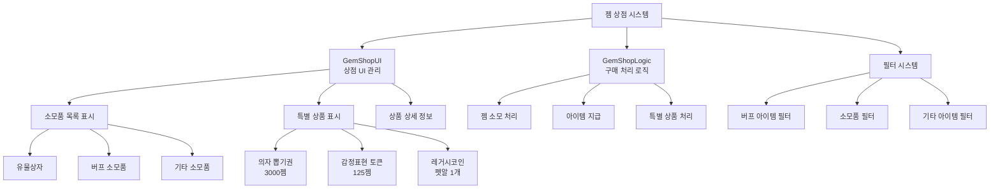

# 기능별 가이드 - 상점 시스템 - 젬 상점

## 개요
젬 상점은 게임 내 프리미엄 화폐인 젬을 사용하여 다양한 소모품과 특별한 아이템을 구매할 수 있는 상점 시스템입니다. 유물상자, 버프 아이템, 의자 뽑기권, 감정표현 토큰 등 다양한 편의성 아이템과 게임 진행에 도움이 되는 소모품들을 제공합니다.

## 젬 상점 시스템 구조

### 시스템 아키텍처


## 관련 파일 경로

### 젬 상점 핵심 컴포넌트
```
RootDesk/MyDesk/Components/Town/GemShop/
├── GemShopUI.mlua                    # 젬 상점 메인 UI 관리
├── GemShopUI.codeblock               # 젬 상점 UI 비주얼 스크립팅
├── GemShopLogic.mlua                 # 젬 구매 처리 로직
├── GemShopLogic.codeblock            # 젬 로직 비주얼 스크립팅
├── GemShopUI_SlotButton.mlua         # 상품 슬롯 버튼 처리
└── GemShopUI_SlotButton.codeblock    # 상품 슬롯 비주얼
```

### 젬 상점 관련 UI
```
ui/
└── GemShopGroup.ui                   # 젬 상점 UI 그룹
```

### 젬 상점 데이터 테이블
```
RootDesk/MyDesk/DataSets/
├── ConsumableItems.csv               # 소모품 정보 (젬 상점 상품)
├── ConsumableItems.userdataset       # 소모품 데이터셋
├── Chair.csv                         # 의자 정보 (의자 뽑기용)
└── Chair.userdataset                 # 의자 데이터셋
```

## GemShopUI 시스템 상세 분석

### 핵심 데이터 구조
```lua
@Component
script GemShopUI extends Component

    property number filterIdx = 1         -- 현재 필터 (1:버프, 2:소모품, 3:기타)
    property number showingSlotIdx = 0     -- 선택된 슬롯 인덱스
```

### UI 초기화 및 상품 목록 생성
```lua
@ExecSpace("ClientOnly")
method void OnBeginPlay()
    local consumableItemsTable = _DataService:GetTable("ConsumableItems")
    
    -- 소모품 목록 슬롯 생성
    local listPanel = _EntityService:GetEntityByPath("/ui/GemShopGroup/GemShop/Panel/Img_ListPanel_bg/ListPanel")
    
    for i=1, consumableItemsTable:GetRowCount() do
        local slot = listPanel:GetChildByName("Slot_"..tostring(i))
        
        if slot == nil then
            -- 슬롯이 없으면 새로 생성
            slot = listPanel:GetChildByName("Slot"):Clone("Slot_"..tostring(i))
            slot:GetChildByName("HavingItem").Enable = false  -- 보유 표시 비활성화
        end
        
        -- 상품 데이터 로드
        local data = consumableItemsTable:GetRow(i)
        local name = data:GetItem("Name")
        local iconBack = data:GetItem("iconbackRUID")
        local icon = data:GetItem("IconRUID") 
        local price = data:GetItem("Price")
        local filterType = data:GetItem("FilterType")
        
        -- 슬롯 UI 설정
        slot:GetChildByName("ItemName").TextComponent.Text = _LocalizationService:GetText(name)
        slot:GetChildByName("MoneyPanel"):GetChildByName("Num").TextComponent.Text = price
        
        -- 아이콘 설정
        if iconBack ~= "" then
            slot:GetChildByName("Bg_Icon").SpriteGUIRendererComponent.ImageRUID = iconBack
        end
        slot:GetChildByName("Bg_Icon"):GetChildByName("Icon").SpriteGUIRendererComponent.ImageRUID = icon
        
        -- 필터에 맞지 않는 아이템은 숨김
        if self.filterIdx ~= tonumber(filterType) then
            slot.Enable = false
        end
    end
end
```

### 필터 시스템
```lua
@ExecSpace("Client")
method void RefreshUI()
    local consumableItemsTable = _DataService:GetTable("ConsumableItems")
    
    -- 1. 일반 소모품 필터링
    local listPanel = _EntityService:GetEntityByPath("/ui/GemShopGroup/GemShop/Panel/Img_ListPanel_bg/ListPanel")
    
    for i=1, consumableItemsTable:GetRowCount() do
        local slot = listPanel:GetChildByName("Slot_"..tostring(i))
        local type = consumableItemsTable:GetCell(i, "FilterType")
        
        -- 필터에 맞는 아이템만 표시
        if tonumber(type) ~= self.filterIdx then
            slot.Enable = false
        else
            slot.Enable = true
        end
        
        -- 선택된 슬롯 하이라이트
        if i == self.showingSlotIdx then
            slot.SpriteGUIRendererComponent.Color = Color.FromHexCode("#53EDFF")
        else
            slot.SpriteGUIRendererComponent.Color = Color.white
        end
    end
    
    -- 2. 특별 상품 필터링 (기타 필터에서만 표시)
    for i=1, 3 do
        local specialSlot = listPanel:GetChildByName("Slot_Special_"..tostring(i))
        
        if self.filterIdx == 3 then  -- 기타 필터
            specialSlot.Enable = true
            
            -- 선택된 특별 슬롯 하이라이트
            if i == (-1 * self.showingSlotIdx) then
                specialSlot.SpriteGUIRendererComponent.Color = Color.FromHexCode("#53EDFF")
            else
                specialSlot.SpriteGUIRendererComponent.Color = Color.white
            end
        else
            specialSlot.Enable = false
        end
    end
end

-- 필터 타입 정의
-- 1: 버프 아이템 (경험치, 골드, 채굴력 부스터 등)
-- 2: 소모품 (회복 아이템, 특수 도구 등)
-- 3: 기타 (의자 뽑기, 감정표현 토큰, 레거시코인 등)
```

### 상품 상세 정보 표시
```lua
method void ShowDetailInfo(number idx)
    local detailPanel = _EntityService:GetEntityByPath("/ui/GemShopGroup/GemShop/DetailInfoPopup")
    detailPanel.Enable = true
    
    if idx > 0 then
        -- 일반 소모품
        local consumableItemsTable = _DataService:GetTable("ConsumableItems")
        local data = consumableItemsTable:GetRow(idx)
        
        -- 상품 정보 표시
        local name = data:GetItem("Name")
        local desc = data:GetItem("Desc")
        local price = data:GetItem("Price")
        local icon = data:GetItem("IconRUID")
        
        detailPanel:GetChildByName("Panel/ItemName").TextComponent.Text = 
            _LocalizationService:GetText(name)
        detailPanel:GetChildByName("Panel/Description").TextComponent.Text = 
            _LocalizationService:GetText(desc)
        detailPanel:GetChildByName("Panel/Price/Amount").TextComponent.Text = price
        detailPanel:GetChildByName("Panel/Icon").SpriteGUIRendererComponent.ImageRUID = icon
        
    else
        -- 특별 상품
        self:ShowSpecialItemInfo(idx, detailPanel)
    end
    
    -- 젬 보유량 표시
    local playerGems = _UserService.LocalPlayer.PlayerStorage.currencyItems[2]
    detailPanel:GetChildByName("Panel/PlayerGems/Amount").TextComponent.Text = 
        string.format("보유 젬: %s", _ThousandsSeparator:ConvertToMetricPrefixString(playerGems))
    
    self.showingSlotIdx = idx
end

method void ShowSpecialItemInfo(number idx, Entity detailPanel)
    if idx == -1 then
        -- 의자 뽑기권 (3000젬)
        detailPanel:GetChildByName("Panel/ItemName").TextComponent.Text = 
            _LocalizationService:GetText("DailyReward_NewChair")
        detailPanel:GetChildByName("Panel/Description").TextComponent.Text = 
            "랜덤한 새로운 의자를 획득합니다. 모든 의자를 보유한 경우 고급 유물상자를 지급합니다."
        detailPanel:GetChildByName("Panel/Price/Amount").TextComponent.Text = "3000"
        
    elseif idx == -2 then
        -- 감정표현 토큰 (125젬)
        detailPanel:GetChildByName("Panel/ItemName").TextComponent.Text = 
            _LocalizationService:GetText("CurrencyItemName_4")
        detailPanel:GetChildByName("Panel/Description").TextComponent.Text = 
            "감정표현을 구매할 수 있는 토큰 1개를 획득합니다."
        detailPanel:GetChildByName("Panel/Price/Amount").TextComponent.Text = "125"
        
    elseif idx == -3 then
        -- 레거시코인 (펫알 1개 소모)
        detailPanel:GetChildByName("Panel/ItemName").TextComponent.Text = 
            _LocalizationService:GetText("CurrencyItemName_7")
        detailPanel:GetChildByName("Panel/Description").TextComponent.Text = 
            "펫알 1개를 소모하여 레거시코인 1500개를 획득합니다."
        detailPanel:GetChildByName("Panel/Price/Amount").TextComponent.Text = "펫알 1개"
    end
end
```

## GemShopLogic - 구매 처리 시스템

### 아이템 구매 로직
```lua
@Logic
script GemShopLogic extends Logic

    @ExecSpace("Server")
    method void BuyItem(number idx, Entity player)
        if idx > 0 then
            -- 일반 소모품 구매
            self:BuyConsumableItem(idx, player)
        else
            -- 특별 상품 구매
            self:BuySpecialItem(idx, player)
        end
        
        -- 구매 후 데이터 저장
        player.PlayerData:SaveData(1)
    end
```

### 일반 소모품 구매
```lua
method void BuyConsumableItem(number idx, Entity player)
    local consumableItemTable = _DataService:GetTable("ConsumableItems")
    local cost = tonumber(consumableItemTable:GetCell(idx, "Price"))
    local name = consumableItemTable:GetCell(idx, "Name")
    
    -- 젬 보유량 확인
    if player.PlayerStorage.currencyItems[2] < cost then
        log("젬 부족: 필요=" .. cost .. ", 보유=" .. player.PlayerStorage.currencyItems[2])
        return
    end
    
    -- 젬 차감
    player.PlayerStorage:UseCurrencyItems(2, cost)
    
    -- 아이템 지급
    if idx < 3 then
        -- 1-2번: 유물상자
        player.PlayerRelic:GetRelicBox(idx)
    else
        -- 3번 이상: 일반 소모품
        player.PlayerStorage:AddConsumableItems(idx, 1)
    end
    
    -- 구매 완료 메시지
    _CustomLocalizationLogic:SendLocalizedFormattedToastMessageFromServer(
        "Message_PurchasedItem", {name}, player.OwnerId)
end
```

### 특별 상품 구매
```lua
method void BuySpecialItem(number idx, Entity player)
    if idx == -1 then
        -- 의자 뽑기권 (3000젬)
        local cost = 3000
        if player.PlayerStorage.currencyItems[2] < cost then
            log("젬 부족!")
            return
        end
        
        player.PlayerStorage:UseCurrencyItems(2, cost)
        self:GetNewChair(player)
        _CustomLocalizationLogic:SendLocalizedFormattedToastMessageFromServer(
            "Message_PurchasedItem", {"DailyReward_NewChair"}, player.OwnerId)
            
    elseif idx == -2 then
        -- 감정표현 토큰 (125젬)
        local cost = 125
        if player.PlayerStorage.currencyItems[2] < cost then
            log("젬 부족!")
            return
        end
        
        player.PlayerStorage:UseCurrencyItems(2, cost)
        player.PlayerEmoticon.EmotToken = player.PlayerEmoticon.EmotToken + 1
        _CustomLocalizationLogic:SendLocalizedFormattedToastMessageFromServer(
            "Message_PurchasedItem", {"CurrencyItemName_4"}, player.OwnerId)
            
    elseif idx == -3 then
        -- 레거시코인 (펫알 1개 → 레거시코인 1500개)
        local cost = 1
        if player.PlayerData.PetEgg < cost then
            log("펫알 부족!")
            return
        end
        
        player.PlayerData.PetEgg = player.PlayerData.PetEgg - 1
        player.PlayerStorage:AddCurrencyItems(7, 1500, true)  -- 레거시코인 1500개 지급
        _CustomLocalizationLogic:SendLocalizedFormattedToastMessageFromServer(
            "Message_PurchasedItem", {"CurrencyItemName_7"}, player.OwnerId)
    end
end
```

### 의자 뽑기 시스템
```lua
@ExecSpace("Server")
method void GetNewChair(Entity player)
    local chairData = _DataService:GetTable("Chair")
    local targetTable = {}
    
    -- 보유하지 않은 의자 목록 생성
    for i=1, chairData:GetRowCount() do
        if player.PlayerChair.haveItem[i] == false then
            table.insert(targetTable, i)
        end
    end
    
    if #targetTable == 0 then
        -- 모든 의자를 보유한 경우 고급 유물상자 지급
        _CustomLocalizationLogic:SendLocalizedToastMessageFromServer(
            "Message_Daily_ReceivedHRRBoxBecauseHaveAllChairs", player.OwnerId)
        player.PlayerRelic:GetRelicBox(2)  -- 고급 유물상자
    else
        -- 랜덤한 새 의자 지급
        local randomIdx = _UtilLogic:RandomIntegerRange(1, #targetTable)
        local selectedChairIdx = targetTable[randomIdx]
        player.PlayerChair:GetChair(selectedChairIdx)
    end
end
```

## 젬 상점 상품 분류

### 버프 아이템 (FilterType: 1)
```csv
ID,Name,Desc,Price,FilterType,Duration,EffectType
1,Exp_Booster_30min,Exp_Booster_Desc,500,1,1800,ExpMultiplier
2,Gold_Booster_10min,Gold_Booster_Desc,300,1,600,GoldMultiplier
3,Mining_Booster_30min,Mining_Booster_Desc,400,1,1800,MiningSpeedBonus
```

### 유물상자 (FilterType: 2)
```csv
ID,Name,Desc,Price,FilterType,BoxType
4,Basic_Relic_Box,Basic_Relic_Box_Desc,100,2,1
5,Advanced_Relic_Box,Advanced_Relic_Box_Desc,300,2,2
```

### 특별 상품 (음수 인덱스)
- **-1**: 의자 뽑기권 (3000젬)
- **-2**: 감정표현 토큰 (125젬)  
- **-3**: 레거시코인 교환 (펫알 1개 → 레거시코인 1500개)

## 젬 획득 방법

### 젬 충전 시스템
```lua
-- 실제 화폐를 통한 젬 구매 (가상의 구현)
method void PurchaseGems(number gemPackage)
    local gemPackages = {
        {gems = 100, price = 0.99},    -- 소량 패키지
        {gems = 500, price = 4.99},    -- 일반 패키지  
        {gems = 1200, price = 9.99},   -- 인기 패키지
        {gems = 2500, price = 19.99},  -- 대용량 패키지
        {gems = 6000, price = 49.99}   -- 특대 패키지
    }
    
    -- 실제 결제 처리 로직
    self:ProcessPayment(gemPackages[gemPackage])
end
```

### 무료 젬 획득
- **일일 보상**: 매일 로그인 시 소량의 젬 지급
- **업적 달성**: 특정 업적 완료 시 젬 보상
- **이벤트**: 특별 이벤트를 통한 젠 지급
- **광고 시청**: 광고 시청 후 젬 보상 (구현 가능)

## UI 상호작용 시스템

### 슬롯 버튼 처리
```lua
@Component
script GemShopUI_SlotButton extends Component

    @EventSender("Self")
    handler HandleButtonClickEvent(ButtonClickEvent event)
        local idx = 0
        
        -- 슬롯 인덱스 파싱
        if string.sub(self.Entity.Name, 1, 12) == "Slot_Special" then
            -- 특별 상품: Slot_Special_1 → idx = -1
            idx = (-1) * tonumber(string.sub(self.Entity.Name, 14, -1))
        else
            -- 일반 상품: Slot_1 → idx = 1
            idx = tonumber(string.sub(self.Entity.Name, 6, -1))
        end
        
        -- 상세 정보 표시
        _EntityService:GetEntityByPath("/ui/GemShopGroup/GemShop").GemShopUI:ShowDetailInfo(idx)
    end
```

### 구매 확인 팝업
```lua
method void ShowPurchaseConfirmation(number idx)
    local confirmPopup = _EntityService:GetEntityByPath("/ui/GemShopGroup/GemShop/PurchaseConfirmPopup")
    confirmPopup.Enable = true
    
    -- 구매 정보 표시
    local itemName, cost = self:GetItemInfo(idx)
    
    confirmPopup:GetChildByName("Panel/ItemName").TextComponent.Text = itemName
    confirmPopup:GetChildByName("Panel/Cost").TextComponent.Text = 
        string.format("젬 %s개", _ThousandsSeparator:ConvertToMetricPrefixString(cost))
    
    -- 구매 버튼 이벤트 설정
    local buyButton = confirmPopup:GetChildByName("Panel/BuyButton")
    buyButton.ButtonComponent:ClearAllEvents()
    buyButton.ButtonComponent.OnClick:Connect(function()
        self:ConfirmPurchase(idx)
    end)
end

method void ConfirmPurchase(number idx)
    -- 서버에 구매 요청
    _GemShopLogic:BuyItem(idx, _UserService.LocalPlayer)
    
    -- 확인 팝업 닫기
    local confirmPopup = _EntityService:GetEntityByPath("/ui/GemShopGroup/GemShop/PurchaseConfirmPopup")
    confirmPopup.Enable = false
    
    -- UI 새로고침
    self:RefreshUI()
end
```

## 소모품 효과 시스템

### 버프 아이템 사용
```lua
-- PlayerStorage.mlua에서 구현된 소모품 사용
method void UseConsumableItem(number itemIdx)
    if self.consumableItems[itemIdx] <= 0 then
        _UIToast:ShowMessage("보유한 아이템이 없습니다.")
        return
    end
    
    -- 아이템 차감
    self.consumableItems[itemIdx] = self.consumableItems[itemIdx] - 1
    
    -- 버프 효과 적용
    local consumableTable = _DataService:GetTable("ConsumableItems")
    local effectType = consumableTable:GetCell(itemIdx, "EffectType")
    local duration = tonumber(consumableTable:GetCell(itemIdx, "Duration"))
    
    if effectType == "ExpMultiplier" then
        -- 경험치 부스터
        self:ApplyExpBoost(2.0, duration)  -- 2배 경험치, 지정 시간
    elseif effectType == "GoldMultiplier" then
        -- 골드 부스터
        self:ApplyGoldBoost(1.5, duration)  -- 1.5배 골드
    elseif effectType == "MiningSpeedBonus" then
        -- 채굴 속도 부스터
        self:ApplyMiningSpeedBoost(0.5, duration)  -- 채굴 시간 50% 단축
    end
end
```

### 버프 UI 표시
```lua
method void UpdateBuffUI()
    local buffPanel = _EntityService:GetEntityByPath("/ui/InGameGroup/BuffPanel")
    
    -- 활성 버프 목록 표시
    local activeBuffs = self:GetActiveBuffs()
    for i, buff in ipairs(activeBuffs) do
        local buffSlot = buffPanel:GetChildByName("BuffSlot_"..i)
        
        -- 버프 아이콘 및 남은 시간 표시
        buffSlot:GetChildByName("Icon").SpriteGUIRendererComponent.ImageRUID = buff.iconRUID
        buffSlot:GetChildByName("Timer").TextComponent.Text = 
            self:FormatTime(buff.remainingTime)
    end
end
```

## 성능 최적화

### 상품 목록 캐싱
```lua
-- 소모품 데이터 캐싱
local cachedConsumableItems = {}

method void CacheConsumableItems()
    local consumableItemsTable = _DataService:GetTable("ConsumableItems")
    
    for i=1, consumableItemsTable:GetRowCount() do
        cachedConsumableItems[i] = {
            name = consumableItemsTable:GetCell(i, "Name"),
            price = tonumber(consumableItemsTable:GetCell(i, "Price")),
            iconRUID = consumableItemsTable:GetCell(i, "IconRUID"),
            filterType = tonumber(consumableItemsTable:GetCell(i, "FilterType"))
        }
    end
end
```

### UI 업데이트 최적화
- 필터 변경 시에만 목록 새로고침
- 선택된 슬롯만 하이라이트 업데이트
- 버프 타이머 UI 1초마다 업데이트

## 확장 가능성

### 새로운 상품 카테고리
```lua
-- 시즌 한정 아이템
method void ShowSeasonalItems()
    -- 기간 한정 특별 상품 표시
end

-- 번들 패키지
method void ShowBundlePackages()
    -- 여러 아이템을 묶은 패키지 상품
end

-- VIP 전용 상품
method void ShowVIPItems()
    -- VIP 등급별 전용 아이템
end
```

### 할인 시스템
```lua
method number ApplyDiscount(number originalPrice, number itemIdx)
    -- 일일 할인, 시즌 할인, 첫 구매 할인 등
    local discountRate = self:GetDiscountRate(itemIdx)
    return math.floor(originalPrice * (1 - discountRate))
end
```

## 일반적인 문제 해결

### 구매가 처리되지 않는 경우
1. 젬 보유량 확인
2. `GemShopLogic.BuyItem` 서버 실행 권한 확인
3. 아이템 인덱스 파싱 로직 점검

### UI가 올바르게 표시되지 않는 경우
1. `ConsumableItems.csv` 데이터 확인
2. 필터 시스템 로직 검증
3. UI 엔티티 참조 경로 확인

### 버프가 적용되지 않는 경우
1. `UseConsumableItem` 메서드 호출 확인
2. 버프 효과 적용 로직 점검
3. 버프 지속시간 관리 시스템 확인
