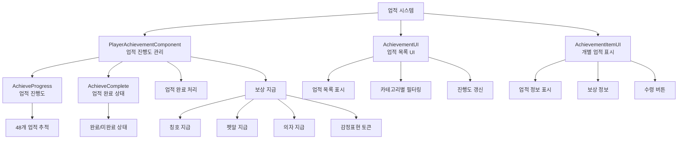

# 기능별 가이드 - 업적 시스템 - 업적 관리

## 개요
업적 시스템은 플레이어의 게임 진행 상황을 추적하고, 특정 목표 달성 시 보상을 지급하는 시스템입니다. 모험, 광석 수집, 보석 수집, 화석 발굴, 건설, 신전 탐험 등 다양한 카테고리의 업적을 제공하며, 진행도 추적, 완료 알림, 보상 지급 등을 자동으로 관리합니다.

## 업적 시스템 구조

### 시스템 아키텍처


## 관련 파일 경로

### 업적 시스템 핵심 컴포넌트
```
RootDesk/MyDesk/Achievement/Component/
├── PlayerAchievementComponent.mlua   # 업적 진행도 및 완료 관리
├── PlayerAchievementComponent.codeblock # 업적 시스템 비주얼
├── AchievementUI.mlua                # 업적 목록 UI
├── AchievementUI.codeblock           # 업적 목록 비주얼
├── AchievementItemUI.mlua            # 개별 업적 아이템 UI
├── AchievementItemUI.codeblock       # 업적 아이템 비주얼
├── AchievementRewardClaimButtonUI.mlua # 보상 수령 버튼
└── AchievementRewardClaimButtonUI.codeblock # 보상 버튼 비주얼
```

### 업적 관련 UI
```
ui/
└── AchievementGroup.ui               # 업적 UI 그룹
```

### 업적 데이터 테이블
```
RootDesk/MyDesk/Achievement/DataSet/
├── AchievementDataSet.csv            # 업적 정보 (목표, 조건, 보상)
├── AchievementDataSet.userdataset    # 업적 데이터셋
├── AchievementRewardItemDataSet.csv  # 업적 보상 아이템 정보
├── AchievementRewardItemDataSet.userdataset # 보상 아이템 데이터셋
├── AchievementTypeDataSet.csv        # 업적 타입 분류
├── AchievementTypeDataSet.userdataset # 업적 타입 데이터셋
├── BadgeDataSet.csv                  # 뱃지/칭호 정보
└── BadgeDataSet.userdataset          # 뱃지 데이터셋
```

## PlayerAchievementComponent - 업적 관리 시스템

### 핵심 데이터 구조
```lua
@Component
script PlayerAchievementComponent extends Component

    property SyncTable<number> AchieveProgress    -- 업적별 진행도
    property SyncTable<boolean> AchieveComplete   -- 업적 완료 상태
    property AchievementUI achievementPopupUI     -- 업적 UI 참조
```

### 업적 진행도 처리
```lua
@ExecSpace("Server")
method void GetProgress(number idx, number amount)
    local achievementTable = _DataService:GetTable("AchievementDataSet")
    local completeCondition = tonumber(achievementTable:GetCell(idx, 4))  -- 완료 조건
    
    -- 초기화 안전성 검사
    if self.AchieveProgress[idx] == nil then
        self.AchieveProgress[idx] = 0
    end
    
    -- 완료 조건을 초과하지 않도록 진행도 조정
    local recordedAmount = amount
    if (self.AchieveProgress[idx] + amount) >= completeCondition then
        recordedAmount = completeCondition - self.AchieveProgress[idx]
    end
    
    -- 진행도 업데이트
    self.AchieveProgress[idx] = self.AchieveProgress[idx] + recordedAmount
    self:SetTableElementClient("AchieveProgress", idx, 
        tostring(self.AchieveProgress[idx]), self.Entity.OwnerId)
    
    -- 업적 완료 처리
    if recordedAmount > 0 and (self.AchieveProgress[idx] >= completeCondition) then
        self:PopupCompleteUI(idx, self.Entity.OwnerId)
        _UIAlarmMarker:SetEnableMarker("quest", true, self.Entity.OwnerId)
    end
end
```

### 업적 완료 알림 시스템
```lua
@ExecSpace("Client")
method void PopupCompleteUI(number idx)
    local completeUI = _EntityService:GetEntity("cc20d638-3fda-4feb-8292-4c312d2f7a84")
    local alphaColor = 0
    
    -- 페이드 인 효과
    local SetAlphaColorUp = function()
        alphaColor = alphaColor + 1/30
        
        local panel = completeUI:GetChildByName("Panel")
        panel.SpriteGUIRendererComponent.Color.a = alphaColor
        panel:GetChildByName("Effect").SpriteGUIRendererComponent.Color.a = alphaColor
        panel:GetChildByName("Effect_1").SpriteGUIRendererComponent.Color.a = alphaColor
        panel:GetChildByName("QuestName").TextComponent.FontColor.a = alphaColor
        panel:GetChildByName("Title").TextComponent.FontColor.a = alphaColor
    end
    
    -- 페이드 아웃 효과
    local SetAlphaColorDown = function()
        alphaColor = alphaColor - 1/30
        
        local panel = completeUI:GetChildByName("Panel")
        panel.SpriteGUIRendererComponent.Color.a = alphaColor
        panel:GetChildByName("Effect").SpriteGUIRendererComponent.Color.a = alphaColor
        panel:GetChildByName("Effect_1").SpriteGUIRendererComponent.Color.a = alphaColor
        panel:GetChildByName("QuestName").TextComponent.FontColor.a = alphaColor
        panel:GetChildByName("Title").TextComponent.FontColor.a = alphaColor
    end
    
    -- 1초간 페이드 인, 2초 유지, 1초간 페이드 아웃
    for i=1, 30 do
        _TimerService:SetTimerOnce(SetAlphaColorUp, i/30)
        _TimerService:SetTimerOnce(SetAlphaColorDown, 2+i/30)
    end
    
    -- 업적 이름 표시
    local nameUI = _EntityService:GetEntity("abc09666-5ff2-4270-8a92-ea98067c8f37")
    local name = _DataService:GetCell("AchievementDataSet", idx, 2)
    nameUI.TextComponent.Text = _LocalizationService:GetText(name)
    
    -- UI 활성화 및 3.5초 후 비활성화
    completeUI.Enable = true
    local disable = function()
        completeUI.Enable = false
    end
    _TimerService:SetTimerOnce(disable, 3.5)
end
```

### 보상 지급 시스템
```lua
@ExecSpace("Server")
method void GiveReward(number idx)
    local achievementTable = _DataService:GetTable("AchievementDataSet")
    
    -- 업적 완료 상태 확인
    if self.AchieveComplete[idx] == true then
        log("이미 보상을 받은 업적: " .. idx)
        return
    end
    
    -- 업적 완료 조건 확인
    local completeCondition = tonumber(achievementTable:GetCell(idx, 4))
    if self.AchieveProgress[idx] < completeCondition then
        log("업적 미완료: " .. idx)
        return
    end
    
    -- 보상 지급 처리 (최대 3개 보상)
    for i=1, 3 do
        local rewardName = achievementTable:GetCell(idx, "RewardName"..i)
        local rewardQuantity = achievementTable:GetCell(idx, "RewardQuantity"..i)
        
        if rewardName ~= "" and rewardQuantity ~= "" then
            self:GiveSpecificReward(rewardName, tonumber(rewardQuantity))
        end
    end
    
    -- 업적 완료 상태로 변경
    self.AchieveComplete[idx] = true
    self:SetTableElementClient("AchieveComplete", idx, "true", self.Entity.OwnerId)
    
    -- UI 새로고침
    _UIAlarmMarker:SetEnableMarker("quest", false, self.Entity.OwnerId)
end

method void GiveSpecificReward(string rewardName, number quantity)
    if string.sub(rewardName, 1, 11) == "PlayerTitle" then
        -- 플레이어 칭호 지급
        self.Entity.PlayerTitle:GetTitle(rewardName)
        
    elseif rewardName == "AchiReward_PetEgg" then
        -- 펫알 지급
        self.Entity.PlayerData.PetEgg = self.Entity.PlayerData.PetEgg + quantity
        
    elseif rewardName == "AchiReward_EmotToken" then
        -- 감정표현 토큰 지급
        self.Entity.PlayerEmoticon.EmotToken = self.Entity.PlayerEmoticon.EmotToken + quantity
        
    elseif string.sub(rewardName, 1, 9) == "ChairName" then
        -- 의자 지급
        local chairIdx = tonumber(string.sub(rewardName, 11, -1))
        self.Entity.PlayerChair:GetChair(chairIdx)
        
    elseif rewardName == "AchiReward_Gem" then
        -- 젬 지급
        self.Entity.PlayerStorage:AddCurrencyItems(2, quantity, true)
        
    elseif rewardName == "AchiReward_Gold" then
        -- 골드 지급
        self.Entity.PlayerData:AddMoney(quantity)
    end
    
    -- 보상 획득 메시지
    _CustomLocalizationLogic:SendLocalizedFormattedToastMessageFromServer(
        "Message_ReceivedAchievementReward", {_LocalizationService:GetText(rewardName), quantity}, 
        self.Entity.OwnerId)
end
```

## AchievementUI - 업적 목록 시스템

### UI 초기화 및 데이터 로드
```lua
@Component
script AchievementUI extends Component

    property table itemTable = {}                    -- 업적 데이터 테이블
    property GridViewComponent achiList = "GUID"     -- 업적 목록 그리드
    property Entity achiSlot = "GUID"                 -- 업적 슬롯 템플릿
    property table ruidFromType = {}                  -- 타입별 아이콘 RUID
    property table ruidFromReward = {}                -- 보상별 아이콘 RUID
    property boolean needRefresh = false              -- 새로고침 필요 여부

    @ExecSpace("ClientOnly")
    method void OnBeginPlay()
        self.achiList.ItemEntity = self.achiSlot
        self.achiList.OnRefresh = self.OnRefresh
        self.achiList.OnClear = self.OnClear
        
        self:InitAchievementDataTable()
        self:LoadAchievementRUIDDataTable()
        
        self.achiList.TotalCount = #self.itemTable
        self.achiList:Refresh()
    end
```

### 업적 데이터 초기화
```lua
method void InitAchievementDataTable()
    local dataSet = _DataService:GetTable("AchievementDataSet")
    
    for i=1, dataSet:GetRowCount() do
        local itemData = {
            ["idx"] = i,
            ["type"] = dataSet:GetCell(i, "Type"),
            ["objective"] = dataSet:GetCell(i, "Objective"),
            ["description"] = dataSet:GetCell(i, "Description"),
            ["condition"] = tonumber(dataSet:GetCell(i, "Condition")),
            ["rewardName1"] = dataSet:GetCell(i, "RewardName1"),
            ["rewardQuantity1"] = dataSet:GetCell(i, "RewardQuantity1"),
            ["rewardName2"] = dataSet:GetCell(i, "RewardName2"),
            ["rewardQuantity2"] = dataSet:GetCell(i, "RewardQuantity2"),
            ["rewardName3"] = dataSet:GetCell(i, "RewardName3"),
            ["rewardQuantity3"] = dataSet:GetCell(i, "RewardQuantity3"),
            ["progress"] = _UserService.LocalPlayer.PlayerAchievementComponent.AchieveProgress[i],
            ["isComplete"] = _UserService.LocalPlayer.PlayerAchievementComponent.AchieveComplete[i]
        }
        
        self.itemTable[i] = itemData
    end
end

method void LoadAchievementRUIDDataTable()
    -- 업적 타입별 아이콘 RUID 로드
    local typeDataSet = _DataService:GetTable("AchievementTypeDataSet")
    for i=1, typeDataSet:GetRowCount() do
        local typeName = typeDataSet:GetCell(i, "Type")
        local iconRUID = typeDataSet:GetCell(i, "IconRUID")
        self.ruidFromType[typeName] = iconRUID
    end
    
    -- 보상 아이템별 아이콘 RUID 로드
    local rewardDataSet = _DataService:GetTable("AchievementRewardItemDataSet")
    for i=1, rewardDataSet:GetRowCount() do
        local itemName = rewardDataSet:GetCell(i, "아이템이름")
        local iconRUID = rewardDataSet:GetCell(i, "아이콘RUID")
        self.ruidFromReward[itemName] = iconRUID
    end
end
```

### 업적 슬롯 새로고침
```lua
method void OnRefresh(number index, Entity entity)
    local slot = entity.AchievementItemUI
    
    slot.data = self.itemTable[index+1]
    slot.index = index
    slot:Refresh()
end

method void OnClear(number index, Entity entity)
    local slot = entity.AchievementItemUI
    slot:Clear()
end
```

## AchievementItemUI - 개별 업적 표시

### 업적 아이템 표시 시스템
```lua
@Component
script AchievementItemUI extends Component

    method void Refresh()
        if self.data == nil then return end
        
        -- 1. 업적 타입 아이콘 설정
        local typeIcon = self.Entity:GetChildByName("TypeIcon")
        local typeRUID = self:GetTypeIconRUID(self.data.type)
        typeIcon.SpriteGUIRendererComponent.ImageRUID = typeRUID
        
        -- 2. 업적 제목 및 설명
        local titleUI = self.Entity:GetChildByName("Title")
        local descUI = self.Entity:GetChildByName("Description")
        
        titleUI.TextComponent.Text = _LocalizationService:GetText(self.data.objective)
        descUI.TextComponent.Text = _LocalizationService:GetText(self.data.description)
        
        -- 3. 진행도 표시
        local progressUI = self.Entity:GetChildByName("Progress")
        local progressText = string.format("%d / %d", 
            self.data.progress or 0, self.data.condition)
        progressUI.TextComponent.Text = progressText
        
        -- 4. 진행도 바
        local progressBar = self.Entity:GetChildByName("ProgressBar/Fill")
        local progressRatio = (self.data.progress or 0) / self.data.condition
        progressBar.UITransformComponent.RectSize = 
            Vector2(300 * progressRatio, progressBar.UITransformComponent.RectSize.y)
        
        -- 5. 보상 정보 표시
        self:DisplayRewards()
        
        -- 6. 완료 상태에 따른 UI 설정
        self:UpdateCompletionStatus()
    end
```

### 보상 정보 표시
```lua
method void DisplayRewards()
    for i=1, 3 do
        local rewardName = self.data["rewardName"..i]
        local rewardQuantity = self.data["rewardQuantity"..i]
        local rewardSlot = self.Entity:GetChildByName("RewardSlot"..i)
        
        if rewardName ~= "" and rewardQuantity ~= "" then
            -- 보상 슬롯 활성화
            rewardSlot.Enable = true
            
            -- 보상 아이콘
            local rewardIcon = rewardSlot:GetChildByName("Icon")
            local iconRUID = self:GetRewardIconRUID(rewardName)
            rewardIcon.SpriteGUIRendererComponent.ImageRUID = iconRUID
            
            -- 보상 수량
            local quantityUI = rewardSlot:GetChildByName("Quantity")
            quantityUI.TextComponent.Text = "x" .. rewardQuantity
            
            -- 보상 이름
            local nameUI = rewardSlot:GetChildByName("Name")
            nameUI.TextComponent.Text = _LocalizationService:GetText(rewardName)
        else
            -- 보상 슬롯 비활성화
            rewardSlot.Enable = false
        end
    end
end

method void UpdateCompletionStatus()
    local progressValue = self.data.progress or 0
    local isCompleted = progressValue >= self.data.condition
    local isRewardClaimed = self.data.isComplete or false
    
    local claimButton = self.Entity:GetChildByName("ClaimButton")
    local completeBadge = self.Entity:GetChildByName("CompleteBadge")
    
    if isRewardClaimed then
        -- 보상 수령 완료
        claimButton.Enable = false
        completeBadge.Enable = true
        completeBadge:GetChildByName("Text").TextComponent.Text = 
            _LocalizationService:GetText("Achievement_Completed")
            
    elseif isCompleted then
        -- 완료되었지만 보상 미수령
        claimButton.Enable = true
        claimButton.AchievementRewardClaimButtonUI.idx = self.data.idx
        claimButton:GetChildByName("Text").TextComponent.Text = 
            _LocalizationService:GetText("Achievement_ClaimReward")
        completeBadge.Enable = false
        
    else
        -- 미완료
        claimButton.Enable = false
        completeBadge.Enable = false
    end
end
```

## 업적 카테고리별 분류

### 업적 타입 (AchievementDataSet.csv 기준)

#### 1. 모험 업적 (9개)
- **내용**: 각 지역 방문, 특별한 오브젝트 발견
- **보상**: 칭호, 펫알, 의자, 감정표현 토큰
```csv
모험,Achi_Objective_1,Achi_Desc_VisitMine,1,PlayerTitle_Name_1,1
모험,Achi_Objective_2,Achi_Desc_BreakKeyBox,1,AchiReward_PetEgg,1
모험,Achi_Objective_3,Achi_Desc_VisitTown2,1,ChairName_1,1
```

#### 2. 광석 수집 업적 (7개)
- **내용**: 광석 수집 단계별 달성 (100 → 100,000,000)
- **보상**: 플레이어 칭호 (Name_2 ~ Name_8)
```csv
광석 수집,Achi_Objective_10,Achi_Desc_Ore,100,PlayerTitle_Name_2,1
광석 수집,Achi_Objective_11,Achi_Desc_Ore,1000,PlayerTitle_Name_3,1
광석 수집,Achi_Objective_16,Achi_Desc_Ore,100000000,PlayerTitle_Name_8,1
```

#### 3. 보석 수집 업적 (10개)
- **내용**: 보석 발견 및 수집 (1 → 10,000)
- **보상**: 플레이어 칭호 (Name_9 ~ Name_18)
```csv
보석 수집,Achi_Objective_17,Achi_Desc_Jewerly,1,PlayerTitle_Name_9,1
보석 수집,Achi_Objective_26,Achi_Desc_Jewerly,10000,PlayerTitle_Name_18,1
```

#### 4. 화석 발굴 업적 (10개)
- **내용**: 화석 발굴 및 수집 (1 → 10,000)
- **보상**: 플레이어 칭호 (Name_19 ~ Name_28)
```csv
화석,Achi_Objective_27,Achi_Desc_Fossil,1,PlayerTitle_Name_19,1
화석,Achi_Objective_36,Achi_Desc_Fossil,10000,PlayerTitle_Name_28,1
```

#### 5. 건설 업적 (4개)
- **내용**: 특정 건물 건설
- **보상**: 플레이어 칭호 (Name_29 ~ Name_30)
```csv
건설,Achi_Objective_31,Achi_Desc_Build1,1,PlayerTitle_Name_29,1
건설,Achi_Objective_32,Achi_Desc_Build2,1,PlayerTitle_Name_30,1
```

#### 6. 신전 탐험 업적 (8개)
- **내용**: 신전 층수 도달 (10 → 300)
- **보상**: 플레이어 칭호 (Name_31 ~ Name_38)
```csv
신전,Achi_Objective_41,Achi_Desc_Temple,10,PlayerTitle_Name_31,1
신전,Achi_Objective_48,Achi_Desc_Temple,300,PlayerTitle_Name_38,1
```

## AchievementRewardClaimButtonUI - 보상 수령

### 보상 수령 버튼
```lua
@Component
script AchievementRewardClaimButtonUI extends Component

    property number idx = 0    -- 업적 인덱스

    @EventSender("Self")
    handler HandleButtonClickEvent(ButtonClickEvent event)
        local Entity = event.Entity
        
        -- 보상 수령 처리
        _UserService.LocalPlayer.PlayerAchievementComponent:GiveReward(self.idx)
        
        -- 버튼 비활성화 (중복 수령 방지)
        Entity.ButtonComponent.Enable = false
    end
```

## 업적 연동 시스템

### 게임 시스템과의 연동
```lua
-- 광석 채굴 시
method void OnMinedOre(number oreType, number amount)
    self.Entity.PlayerAchievementComponent:GetProgress(10, amount)  -- 광석 수집 업적
end

-- 보석 발견 시
method void OnFoundJewelry(number jewelryType)
    self.Entity.PlayerAchievementComponent:GetProgress(17, 1)  -- 보석 수집 업적
end

-- 화석 발굴 시
method void OnFoundFossil(number fossilType)
    self.Entity.PlayerAchievementComponent:GetProgress(27, 1)  -- 화석 발굴 업적
end

-- 맵 방문 시
method void OnVisitMap(string mapName)
    if mapName == "Mine1_1" then
        self.Entity.PlayerAchievementComponent:GetProgress(1, 1)  -- 첫 광산 방문
    elseif mapName == "Town2" then
        self.Entity.PlayerAchievementComponent:GetProgress(3, 1)  -- Town2 방문
    end
end

-- 건설 완료 시
method void OnConstructionCompleted(number buildingType)
    if buildingType == 1 then
        self.Entity.PlayerAchievementComponent:GetProgress(31, 1)  -- 첫 건물 건설
    elseif buildingType == 2 then
        self.Entity.PlayerAchievementComponent:GetProgress(32, 1)  -- 두 번째 건물 건설
    end
end

-- 신전 층수 도달 시
method void OnReachTempleFloor(number floor)
    self.Entity.PlayerAchievementComponent:GetProgress(41, floor)  -- 신전 10층 업적
    self.Entity.PlayerAchievementComponent:GetProgress(42, floor)  -- 신전 20층 업적
    -- ... (층수별로 체크)
end
```

## 업적 알림 시스템

### UI 알림 마커
```lua
-- 업적 완료 시 알림 활성화
_UIAlarmMarker:SetEnableMarker("quest", true, playerId)

-- 보상 수령 후 알림 비활성화
_UIAlarmMarker:SetEnableMarker("quest", false, playerId)
```

### 토스트 메시지
```lua
-- 보상 획득 메시지
_CustomLocalizationLogic:SendLocalizedFormattedToastMessageFromServer(
    "Message_ReceivedAchievementReward", 
    {rewardName, quantity}, 
    playerId)

-- 업적 완료 메시지 (팝업 UI와 별도)
_CustomLocalizationLogic:SendLocalizedToastMessageFromServer(
    "Message_AchievementCompleted", playerId)
```

## 데이터 관리 시스템

### 진행도 저장 및 로드
```lua
@ExecSpace("Server")
method void SaveAchievementData()
    -- 업적 진행도를 플레이어 데이터에 저장
    local progressData = _UtilLogic:TableToString(self.AchieveProgress)
    local completeData = _UtilLogic:TableToString(self.AchieveComplete)
    
    self.Entity.PlayerData:SetCustomData("AchievementProgress", progressData)
    self.Entity.PlayerData:SetCustomData("AchievementComplete", completeData)
end

@ExecSpace("Server")
method void LoadAchievementData()
    -- 플레이어 데이터에서 업적 진행도 복원
    local progressData = self.Entity.PlayerData:GetCustomData("AchievementProgress")
    local completeData = self.Entity.PlayerData:GetCustomData("AchievementComplete")
    
    if progressData ~= "" then
        self.AchieveProgress = _UtilLogic:StringToTable(progressData)
    end
    
    if completeData ~= "" then
        self.AchieveComplete = _UtilLogic:StringToTable(completeData)
    end
    
    -- 초기화되지 않은 업적 기본값 설정
    local achievementCount = _DataService:GetRowCount("AchievementDataSet")
    for i=1, achievementCount do
        if self.AchieveProgress[i] == nil then
            self.AchieveProgress[i] = 0
        end
        if self.AchieveComplete[i] == nil then
            self.AchieveComplete[i] = false
        end
    end
end
```

## 성능 최적화

### 업적 검사 최적화
```lua
-- 필요한 업적만 체크하는 최적화된 함수
method void CheckSpecificAchievements(table achievementIds)
    for _, achievementId in ipairs(achievementIds) do
        if not self.AchieveComplete[achievementId] then
            -- 미완료 업적만 체크
            self:CheckAchievementCondition(achievementId)
        end
    end
end

-- 배치 업데이트 (한 번에 여러 업적 갱신)
method void BatchUpdateAchievements(table updates)
    for achievementId, progress in pairs(updates) do
        self:GetProgress(achievementId, progress)
    end
    
    -- 한 번에 모든 변경사항 클라이언트 동기화
    self:SyncAllChangesToClient()
end
```

### 메모리 관리
- 완료된 업적의 진행도 추적 중단
- UI 새로고침 주기 최적화
- 불필요한 업적 체크 방지

## 확장 가능성

### 새로운 업적 추가
```lua
-- 동적 업적 추가 시스템
method void AddDynamicAchievement(table achievementData)
    local newIdx = #self.itemTable + 1
    
    -- 업적 데이터 추가
    self.itemTable[newIdx] = achievementData
    
    -- 진행도 초기화
    self.AchieveProgress[newIdx] = 0
    self.AchieveComplete[newIdx] = false
    
    -- UI 새로고침
    self.achiList.TotalCount = #self.itemTable
    self.achiList:Refresh()
end

-- 시즌 업적 시스템
method void ActivateSeasonalAchievements(number season)
    local seasonAchievements = _DataService:GetTable("SeasonalAchievements")
    
    for i=1, seasonAchievements:GetRowCount() do
        local seasonType = tonumber(seasonAchievements:GetCell(i, "Season"))
        if seasonType == season then
            self:AddDynamicAchievement(seasonAchievements:GetRow(i))
        end
    end
end
```

### 고급 업적 기능
```lua
-- 연쇄 업적 시스템
method void CheckChainAchievements(number completedAchievement)
    local chainTable = _DataService:GetTable("AchievementChain")
    
    for i=1, chainTable:GetRowCount() do
        local prerequisite = tonumber(chainTable:GetCell(i, "Prerequisite"))
        local nextAchievement = tonumber(chainTable:GetCell(i, "NextAchievement"))
        
        if prerequisite == completedAchievement then
            self:UnlockAchievement(nextAchievement)
        end
    end
end

-- 숨겨진 업적 시스템
method void CheckHiddenAchievements()
    -- 특별한 조건에서만 공개되는 숨겨진 업적들
end

-- 업적 점수 시스템
method number CalculateAchievementScore()
    local totalScore = 0
    local scoreTable = _DataService:GetTable("AchievementScore")
    
    for i=1, #self.AchieveComplete do
        if self.AchieveComplete[i] then
            local score = tonumber(scoreTable:GetCell(i, "Score"))
            totalScore = totalScore + score
        end
    end
    
    return totalScore
end
```

## 일반적인 문제 해결

### 업적 진행도가 업데이트되지 않는 경우
1. `GetProgress` 메서드 호출 여부 확인
2. 업적 인덱스가 올바른지 검증
3. 완료 조건 값이 정확한지 확인

### 보상이 지급되지 않는 경우
1. `GiveReward` 메서드 실행 권한 확인
2. 보상 타입별 지급 로직 점검
3. 플레이어 데이터 저장 상태 확인

### UI가 올바르게 표시되지 않는 경우
1. `RefreshUI` 호출 여부 확인
2. 업적 데이터와 UI 동기화 상태 점검
3. RUID 테이블 로드 상태 확인

