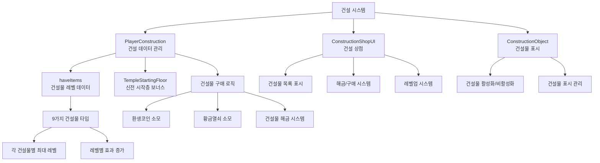

# 기능별 가이드 - 플레이어 관리 - 건설 시스템

## 개요
건설 시스템은 플레이어가 환생코인과 황금열쇠를 사용하여 다양한 구조물을 건설하고, 이를 통해 게임플레이에 도움이 되는 특별한 효과를 얻는 시스템입니다. 건설된 구조물들은 레벨업이 가능하며, 각각 고유한 기능과 보너스를 제공합니다.

## 건설 시스템 구조

### 시스템 아키텍처


## 관련 파일 경로

### 건설 시스템 핵심 컴포넌트
```
RootDesk/MyDesk/Components/Player/
├── PlayerConstruction.mlua           # 건설 데이터 및 구매 로직 관리
├── PlayerConstruction.codeblock      # 건설 데이터 비주얼 스크립팅
└── Construction/                     # 건설 관련 UI 컴포넌트들
    ├── ConstructionShopUI.mlua       # 건설 상점 메인 UI
    ├── ConstructionShopUI.codeblock  # 건설 상점 비주얼
    ├── ConstructionObject.mlua       # 건설물 오브젝트 관리
    ├── ConstructionObject.codeblock  # 건설물 오브젝트 비주얼
    ├── ConstructionShopUI_BuyButton.mlua # 구매 버튼
    ├── ConstructionShopUI_BuyButton.codeblock # 구매 버튼 비주얼
    ├── ConstructionShopUI_UnlockButton.mlua # 해금 버튼
    └── ConstructionShopUI_UnlockButton.codeblock # 해금 버튼 비주얼
```

### 건설 관련 UI
```
ui/
└── ConstructionGroup.ui              # 건설 상점 UI 그룹
```

### 건설 데이터 테이블
```
RootDesk/MyDesk/DataSets/
├── Construction.csv                  # 건설물 정보 및 효과
└── Construction.userdataset          # 건설 데이터셋
```

### 건설물 모델 리소스
```
RootDesk/MyDesk/Models/
└── (건설물 관련 모델들 - 위치 확인 필요)
```

## PlayerConstruction 시스템 상세 분석

### 핵심 데이터 구조
```lua
@Component
script PlayerConstruction extends Component

    property SyncTable<number> haveItems        -- 건설물별 레벨 데이터
    property number TempleStartingFloor = 1     -- 신전 시작층 (특별 효과)
```

### 건설 시스템 초기화
```lua
method void OnBeginPlay()
    -- 테이블 동기화 설정
    self._T.tableList = { haveItems = self.haveItems }
    self._T.tableType = { haveItems = "number" }
    
    if self:IsClient() then
        self.TempleStartingFloor = 1  -- 기본 신전 시작층
    end
end
```

### 건설 데이터 로드
```lua
@ExecSpace("Server")
method void LoadedData(string haveItemsStr)
    local itemTable = _DataService:GetTable("Construction")
    
    if haveItemsStr == nil then
        -- 데이터가 없으면 모든 건설물을 0레벨로 초기화
        for i=1, itemTable:GetRowCount() do
            self.haveItems[i] = 0  -- 0=미해금, 1=해금+0레벨, 2=1레벨, ...
        end
    else
        -- 기존 데이터 복원
        local haveItemsTable = _UtilLogic:StringToTable(haveItemsStr)
        for i=1, #haveItemsTable do
            self.haveItems[i] = haveItemsTable[i]
        end
    end
    
    -- 신전 시작층 계산 (크로노스 시계탑 레벨 기반)
    self:CalculateTempleStartingFloor()
end
```

### 건설물 구매 시스템
```lua
@ExecSpace("Server")
method void BuyConstruction(number idx)
    local itemTable = _DataService:GetTable("Construction")
    
    -- 1. 검증 단계
    
    -- 해금 여부 확인
    if self.haveItems[idx] < 1 then
        log("해금 안됨")
        return
    end
    
    -- 최대 레벨 확인 (0=미해금, 1=해금+0레벨, 2=1레벨, ..., N=(N-1)레벨)
    local maxLevel = tonumber(itemTable:GetCell(idx, "MaxLevel")) + 1
    if self.haveItems[idx] >= maxLevel then
        log("최대레벨 초과")
        return
    end
    
    -- 비용 계산 및 확인
    local cost = tonumber(itemTable:GetCell(idx, "ConstructionCost"))
    if cost == nil then
        -- 크로노스 시계탑의 경우 동적 비용 계산
        cost = 4 * self.haveItems[idx]
    end
    
    if self.Entity.PlayerStorage.currencyItems[5] < cost then  -- 환생코인 부족
        log("비용 부족: 보유=", self.Entity.PlayerStorage.currencyItems[5], ", 필요=", cost)
        return
    end
    
    -- 2. 실행 단계
    
    -- 건설물 레벨 증가
    self.haveItems[idx] = self.haveItems[idx] + 1
    
    -- 비용 차감 (환생코인)
    self.Entity.PlayerStorage:UseCurrencyItems(5, cost)
    
    -- 클라이언트 동기화
    self:SetTableElementClient("haveItems", idx, tostring(self.haveItems[idx]), self.Entity.OwnerId)
    
    -- 구매 효과 연출
    self:PlayPurchaseDirection("buy", idx, self.haveItems[idx], self.Entity.OwnerId)
    
    -- 업적 진행도 업데이트
    self:CheckConstructionAchievements(idx)
    
    -- 특별 효과 적용
    self:ApplyConstructionEffects(idx)
end
```

### 건설물 해금 시스템
```lua
@ExecSpace("Server")
method void UnlockConstruction(number idx)
    local itemTable = _DataService:GetTable("Construction")
    local unlockCost = tonumber(itemTable:GetCell(idx, "UnlockCost"))
    
    -- 이미 해금되었는지 확인
    if self.haveItems[idx] >= 1 then
        log("이미 해금됨")
        return
    end
    
    -- 황금열쇠 보유량 확인
    if self.Entity.PlayerStorage.currencyItems[6] < unlockCost then  -- 황금열쇠 부족
        log("해금 비용 부족")
        return
    end
    
    -- 해금 실행
    self.haveItems[idx] = 1  -- 해금 상태로 변경
    self.Entity.PlayerStorage:UseCurrencyItems(6, unlockCost)  -- 황금열쇠 차감
    
    -- 동기화 및 연출
    self:SetTableElementClient("haveItems", idx, tostring(self.haveItems[idx]), self.Entity.OwnerId)
    self:PlayPurchaseDirection("unlock", idx, 1, self.Entity.OwnerId)
end
```

### 신전 시작층 계산
```lua
method void CalculateTempleStartingFloor()
    -- 크로노스 시계탑 레벨에 따른 신전 시작층 보너스
    local clockTowerLevel = self.haveItems[10] or 0  -- 크로노스 시계탑 인덱스
    
    if clockTowerLevel <= 1 then
        self.TempleStartingFloor = 1  -- 기본
    else
        -- 레벨에 따른 시작층 증가
        self.TempleStartingFloor = clockTowerLevel - 1
    end
end
```

## ConstructionShopUI - 건설 상점 시스템

### UI 초기화 및 데이터 표시
```lua
@Component
script ConstructionShopUI extends Component

    property number showingBuyIdx = 0    -- 현재 표시 중인 구매 팝업 인덱스

    @ExecSpace("Client")
    method void RefreshUI()
        local itemTable = _DataService:GetTable("Construction")
        
        -- 1. 재화 정보 표시 (환생코인, 황금열쇠)
        local rebirthCoin = _UserService.LocalPlayer.PlayerStorage.currencyItems[5]
        local goldKey = _UserService.LocalPlayer.PlayerStorage.currencyItems[6]
        
        _EntityService:GetEntityByPath("/ui/ConstructionGroup/ConstructionShop/Bg_Panel_List/RebirthCoin/Amount")
            .TextComponent.Text = _ThousandsSeparator:ConvertToMetricPrefixString(rebirthCoin)
        _EntityService:GetEntityByPath("/ui/ConstructionGroup/ConstructionShop/Bg_Panel_List/GoldKey/Amount")
            .TextComponent.Text = _ThousandsSeparator:ConvertToMetricPrefixString(goldKey)
        
        -- 2. 건설물 목록 생성 및 갱신
        local listEntity = _EntityService:GetEntityByPath("/ui/ConstructionGroup/ConstructionShop/ListPanel")
        
        for i=1, itemTable:GetRowCount() do
            local slot = listEntity:GetChildByName("Slot_"..tostring(i))
            
            if slot == nil then
                -- 슬롯이 없으면 새로 생성
                slot = listEntity:GetChildByName("Slot"):Clone("Slot_"..tostring(i))
                
                -- 기본 정보 설정
                slot:GetChildByName("Icon").SpriteGUIRendererComponent.ImageRUID = 
                    itemTable:GetCell(i, "IconRUID")
                slot:GetChildByName("Name").TextComponent.Text = 
                    _LocalizationService:GetText(itemTable:GetCell(i, "Name"))
                slot:GetChildByName("Desc").TextComponent.Text = 
                    _LocalizationService:GetText(itemTable:GetCell(i, "Desc"))
                
                -- 해금 버튼 비용 표시
                _EntityService:GetEntityByPath(slot.Path.."/LockedPanel/UnlockButton/CostAmount")
                    .TextComponent.Text = _ThousandsSeparator:ConvertToMetricPrefixString(
                    tonumber(itemTable:GetCell(i, "UnlockCost")))
            end
            
            -- 3. 건설물 상태에 따른 UI 업데이트
            self:UpdateConstructionSlotUI(slot, i, itemTable)
        end
    end
```

### 건설물 슬롯 UI 업데이트
```lua
method void UpdateConstructionSlotUI(Entity slot, number idx, table itemTable)
    local level = _UserService.LocalPlayer.PlayerConstruction.haveItems[idx]
    local maxLevel = tonumber(itemTable:GetCell(idx, "MaxLevel")) + 1
    
    -- UI 요소 참조
    local nameUI = slot:GetChildByName("Name")
    local descUI = slot:GetChildByName("Desc")
    local levelNumUI = _EntityService:GetEntityByPath(slot.Path.."/Level/Fill_frame/RatioNum")
    local levelSliderUI = _EntityService:GetEntityByPath(slot.Path.."/Level/Fill_frame/Fill")
    local levelupBtnText = _EntityService:GetEntityByPath(slot.Path.."/Button_Buy/txt_levelup")
    local costUI = _EntityService:GetEntityByPath(slot.Path.."/Button_Buy/CostAmount")
    
    if level == nil then return end
    
    if level == 0 then
        -- 미해금 상태
        slot:GetChildByName("LockedPanel").Enable = true
        slot:GetChildByName("UnlockedPanel").Enable = false
        nameUI.TextComponent.FontColor = Color.gray
        descUI.TextComponent.FontColor = Color.gray
        
    elseif level >= maxLevel then
        -- 최대 레벨 달성
        slot:GetChildByName("LockedPanel").Enable = false  
        slot:GetChildByName("UnlockedPanel").Enable = true
        levelNumUI.TextComponent.Text = "MAX"
        levelSliderUI.UITransformComponent.RectSize = Vector2(270, 23)  -- 100% 채움
        levelupBtnText.TextComponent.Text = _LocalizationService:GetText("Complete")
        
        -- 버튼 비활성화
        _EntityService:GetEntityByPath(slot.Path.."/Button_Buy").ButtonComponent.Enable = false
        
    else
        -- 해금됨 + 업그레이드 가능
        slot:GetChildByName("LockedPanel").Enable = false
        slot:GetChildByName("UnlockedPanel").Enable = true
        
        -- 레벨 표시
        levelNumUI.TextComponent.Text = string.format("Lv.%d", level - 1)
        local levelProgress = (level - 1) / (maxLevel - 1)
        levelSliderUI.UITransformComponent.RectSize = Vector2(270 * levelProgress, 23)
        
        -- 버튼 텍스트
        if level < 2 then
            levelupBtnText.TextComponent.Text = _LocalizationService:GetText("Construct")
        else
            levelupBtnText.TextComponent.Text = _LocalizationService:GetText("LevelUp")
        end
        
        -- 비용 표시
        local cost = tonumber(itemTable:GetCell(idx, "ConstructionCost"))
        if cost == nil then
            -- 동적 비용 계산 (크로노스 시계탑)
            cost = 4 * level
        end
        costUI.TextComponent.Text = _ThousandsSeparator:ConvertToMetricPrefixString(cost)
    end
end
```

## ConstructionObject - 건설물 오브젝트 관리

### 건설물 표시 시스템
```lua
@Component
script ConstructionObject extends Component

    @Sync
    property number Idx = 0    -- 건설물 인덱스

    @ExecSpace("ClientOnly")
    method void OnBeginPlay()
        if self.Idx == 0 then
            log("건설물 인덱스가 0입니다")
            return
        end
        
        self:SetNametagLocalization()
        self:RefreshEntityEnable()
    end

    @ExecSpace("Client")
    method void RefreshEntityEnable()
        -- PlayerConstruction 데이터 로드 대기
        local waitCount = 0
        while true do
            if _UserService.LocalPlayer.PlayerConstruction.haveItems[self.Idx] == nil then
                waitCount = waitCount + 1
                wait(1)
                
                if waitCount > 8 then
                    log("건설물 데이터를 불러올 수 없습니다")
                    return
                end
            else
                break
            end
        end
        
        -- 건설물 레벨에 따른 표시/숨김
        if _UserService.LocalPlayer.PlayerConstruction.haveItems[self.Idx] > 1 then
            self.Entity.Enable = true   -- 건설됨: 표시
        else
            self.Entity.Enable = false  -- 미건설: 숨김
        end
    end

    @ExecSpace("Client")
    method void SetNametagLocalization()
        local constructionTable = _DataService:GetTable("Construction")
        local nameTagText = _LocalizationService:GetText(constructionTable:GetCell(self.Idx, "Name"))
        
        -- 네임태그가 있으면 지역화된 이름으로 설정
        if self.Entity.NameTagComponent then
            self.Entity.NameTagComponent.Name = nameTagText
        end
    end
```

## 건설물 타입 및 효과

### 건설 가능한 구조물 (Construction.csv 기반)
```csv
ID,Name,Desc,IconRUID,UnlockCost,ConstructionCost,MaxLevel,EffectType,EffectValue
1,Building_Warehouse,Desc_Warehouse,icon_warehouse,100,50,10,InventoryExpansion,20
2,Building_Forge,Desc_Forge,icon_forge,200,75,8,CraftingSpeed,15
3,Building_Mine,Desc_Mine,icon_mine,150,60,12,MiningEfficiency,10
4,Building_Library,Desc_Library,icon_library,300,100,6,ExpBonus,25
5,Building_Temple,Desc_Temple,icon_temple,500,150,5,PrayerBonus,30
6,Building_Market,Desc_Market,icon_market,250,80,9,TradingBonus,20
7,Building_GoldStatue,Desc_GoldStatue,icon_goldstatue,400,120,7,GoldFind,35
8,Building_GemBox,Desc_GemBox,icon_gembox,600,200,4,GemFind,40
9,Building_Pegasus,Desc_Pegasus,icon_pegasus,800,250,3,FastTravel,50
10,Building_ChronosClockTower,Desc_ClockTower,icon_clocktower,1000,,∞,TempleFloorBonus,1
```

### 건설물별 상세 효과

#### 1. 창고 (Warehouse)
- **효과**: 인벤토리 용량 확장
- **레벨당**: +20 슬롯
- **최대 레벨**: 10
- **총 효과**: 최대 +200 슬롯

#### 2. 대장간 (Forge)  
- **효과**: 제작 속도 증가
- **레벨당**: +15% 속도
- **최대 레벨**: 8
- **총 효과**: 최대 +120% 속도

#### 3. 광산 시설 (Mine)
- **효과**: 채굴 효율성 증가  
- **레벨당**: +10% 채굴량
- **최대 레벨**: 12
- **총 효과**: 최대 +120% 채굴량

#### 4. 도서관 (Library)
- **효과**: 경험치 보너스
- **레벨당**: +25% 경험치
- **최대 레벨**: 6
- **총 효과**: 최대 +150% 경험치

#### 5. 신전 (Temple) 
- **효과**: 기도 보너스 (특수 효과)
- **레벨당**: +30% 기도 효과
- **최대 레벨**: 5

#### 6. 시장 (Market)
- **효과**: 거래 보너스 (판매가격 증가)
- **레벨당**: +20% 판매가격
- **최대 레벨**: 9

#### 7. 황금 지팡이 (Gold Statue)
- **효과**: 플루투스의 황금지팡이 발견 가능
- **조건**: 레벨 2 이상 (지하신전에서 발견)
- **보상**: 층수에 따라 증가하는 거대한 골드

#### 8. 젬 상자 (Gem Box)
- **효과**: 하데스의 보물상자 발견 가능
- **조건**: 레벨 2 이상 (지하신전에서 발견) 
- **보상**: 건설 레벨에 따른 젬 획득

#### 9. 페가수스 (Pegasus)
- **효과**: 신전에서 페가수스 만남 가능
- **조건**: 레벨 2 이상
- **기능**: 인벤토리를 비우고 가치만큼 골드 획득

#### 10. 크로노스 시계탑 (Chronos Clock Tower)
- **효과**: 신전 시작층 증가
- **레벨당**: +1 시작층
- **최대 레벨**: 무제한
- **특징**: 동적 비용 계산 (레벨 × 4 환생코인)

## 건설 효과 적용 시스템

### 게임플레이 효과 적용
```lua
method void ApplyConstructionEffects(number idx)
    local itemTable = _DataService:GetTable("Construction")
    local effectType = itemTable:GetCell(idx, "EffectType")
    local effectValue = tonumber(itemTable:GetCell(idx, "EffectValue"))
    local currentLevel = self.haveItems[idx]
    
    if effectType == "InventoryExpansion" then
        -- 인벤토리 확장
        local additionalSlots = effectValue * (currentLevel - 1)
        self.Entity.PlayerBackpack.maxStorageNum = self.Entity.PlayerBackpack.maxStorageNum + effectValue
        
    elseif effectType == "MiningEfficiency" then
        -- 채굴 효율성 증가
        local efficiencyBonus = effectValue * (currentLevel - 1)
        self.Entity.PlayerData:AddBuff("MiningEfficiency", efficiencyBonus)
        
    elseif effectType == "ExpBonus" then
        -- 경험치 보너스
        local expMultiplier = 1 + (effectValue * (currentLevel - 1)) / 100
        self.Entity.PlayerData:AddBuff("ExpMultiplier", expMultiplier)
        
    elseif effectType == "TempleFloorBonus" then
        -- 신전 시작층 보너스 (크로노스 시계탑)
        self.TempleStartingFloor = currentLevel - 1
    end
end
```

### 신전 연동 효과
```lua
-- PlayerIngameData.mlua에서 신전 입장 시 시작층 적용
method void OnMapEnter()
    if string.sub(enteredMap.Name, 1, 4) == "Temp" then  -- 신전 맵
        if not self.entered then  -- 최초 입장
            local floorCount = self.Entity.PlayerConstruction.TempleStartingFloor
            self:AddCurrentTempleFloor(floorCount, false, self.Entity.PlayerComponent.UserId)
        end
    end
end
```

## 건설 재화 시스템

### 환생코인 (Rebirth Coin)
- **용도**: 건설물 건설 및 업그레이드
- **획득 방법**: 환생 시스템을 통해 획득
- **인덱스**: PlayerStorage.currencyItems[5]

### 황금열쇠 (Gold Key)  
- **용도**: 새로운 건설물 해금
- **획득 방법**: 특별 이벤트, 보상 등
- **인덱스**: PlayerStorage.currencyItems[6]

### 비용 구조
```lua
-- 일반 건설물: 고정 비용 (Construction.csv의 ConstructionCost)
-- 크로노스 시계탑: 동적 비용 (현재레벨 × 4)

method number GetConstructionCost(number idx)
    local itemTable = _DataService:GetTable("Construction")
    local cost = tonumber(itemTable:GetCell(idx, "ConstructionCost"))
    
    if cost == nil then
        -- 크로노스 시계탑은 동적 비용
        cost = 4 * self.haveItems[idx]
    end
    
    return cost
end
```

## 업적 시스템 연동

### 건설 관련 업적
```lua
method void CheckConstructionAchievements(number idx)
    if idx == 1 and self.haveItems[1] == 2 then
        -- 창고 최초 건설 업적
        self.Entity.PlayerAchievementComponent:GetProgress(31, 1)
    elseif idx == 2 and self.haveItems[2] == 2 then
        -- 대장간 최초 건설 업적
        self.Entity.PlayerAchievementComponent:GetProgress(32, 1)  
    elseif idx == 4 and self.haveItems[4] == 2 then
        -- 도서관 최초 건설 업적
        self.Entity.PlayerAchievementComponent:GetProgress(33, 1)
    end
    
    -- 전체 건설물 완성 업적
    local allMaxLevel = true
    for i=1, 9 do  -- 크로노스 시계탑 제외 (무제한 레벨)
        if self.haveItems[i] < self:GetMaxLevel(i) then
            allMaxLevel = false
            break
        end
    end
    
    if allMaxLevel then
        self.Entity.PlayerAchievementComponent:GetProgress(40, 1)  -- 마스터 건축가 업적
    end
end
```

## 성능 최적화

### 건설물 표시 최적화
```lua
-- 화면에 보이지 않는 건설물은 렌더링 제외
method void OnUpdate(number delta)
    if not self:IsVisibleOnScreen() then
        return
    end
    
    self:UpdateConstructionVisual(delta)
end
```

### 메모리 관리
- 미건설 오브젝트 비활성화
- 건설물 모델 캐싱 시스템
- UI 요소 풀링

## 확장 가능성

### 새로운 건설물 추가
1. **Construction.csv**에 새 건설물 정보 추가
2. 건설물 모델 및 아이콘 추가
3. 새로운 효과 타입 구현
4. UI 슬롯 추가

### 고급 건설 기능
```lua
-- 건설물 간 상호작용
method void CheckConstructionSynergy()
    -- 특정 건설물 조합 시 추가 보너스
end

-- 건설물 자동화 시스템
method void AutoUpgrade()
    -- 조건 만족 시 자동 업그레이드
end

-- 건설물 특수 효과
method void ActivateSpecialEffect(number idx)
    -- 건설물별 특별한 활성화 효과
end
```

## 일반적인 문제 해결

### 건설물이 표시되지 않는 경우
1. `haveItems` 레벨이 2 이상인지 확인 (1=해금만됨, 2=실제건설됨)
2. `ConstructionObject.Idx` 설정 확인
3. 맵에 건설물 오브젝트가 배치되어 있는지 확인

### 건설 비용이 차감되지 않는 경우
1. 환생코인/황금열쇠 보유량 확인
2. `UseCurrencyItems` 호출 확인
3. 비용 계산 로직 검증

### 건설 효과가 적용되지 않는 경우
1. `ApplyConstructionEffects` 메서드 호출 확인
2. 효과 타입별 적용 로직 점검
3. 플레이어 데이터 버프 시스템 확인

