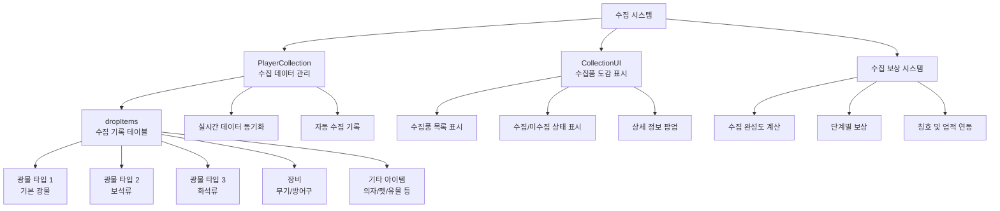

# 기능별 가이드 - 플레이어 관리 - 수집 시스템

## 개요
수집 시스템은 플레이어가 게임 플레이 중 획득한 모든 아이템의 기록을 관리하고, 수집 진행도에 따른 보상을 제공하는 시스템입니다. 이 시스템은 플레이어의 성취감을 높이고 장기적인 게임 목표를 제공하여 지속적인 플레이 동기를 부여합니다.

## 수집 시스템 구조

### 시스템 아키텍처


## 관련 파일 경로

### 수집 시스템 핵심 컴포넌트
```
RootDesk/MyDesk/Components/Player/Collection/
├── PlayerCollection.mlua             # 수집 데이터 관리 시스템
├── PlayerCollection.codeblock        # 수집 데이터 비주얼 스크립팅
├── CollectionUI.mlua                 # 수집품 도감 UI
├── CollectionUI.codeblock            # 수집품 도감 비주얼
├── CollectionSlotButton.mlua         # 수집품 슬롯 버튼
├── CollectionSlotButton.codeblock    # 수집품 슬롯 비주얼
├── CollectionOpenButton.mlua         # 수집품 도감 열기 버튼
└── CollectionOpenButton.codeblock    # 도감 열기 버튼 비주얼
```

### 수집 관련 UI
```
ui/
└── CollectionGroup.ui                # 수집품 도감 UI 그룹
```

### 수집 데이터 테이블
```
RootDesk/MyDesk/DataSets/
├── DropItem.csv                      # 수집 대상 아이템 정보
├── DropItem.userdataset              # 드롭 아이템 데이터셋
├── CollectionReward.csv              # 수집 보상 정보 (추정)
└── Achievement.csv                   # 수집 관련 업적
```

## PlayerCollection 시스템 상세 분석

### 핵심 데이터 구조
```lua
@Component
script PlayerCollection extends Component

    property SyncTable<number> dropItems    -- 아이템별 수집 수량 기록
```

### 초기화 시스템
```lua
method void OnBeginPlay()
    -- 테이블 동기화 설정
    self._T.tableList = {dropItems = self.dropItems}
    self._T.tableType = {dropItems = "number"}
    
    -- 모든 수집 가능한 아이템을 0으로 초기화
    local dropItemTable = _DataService:GetTable("DropItem")
    for i=1, dropItemTable:GetRowCount() do
        self.dropItems[i] = 0
    end
end
```

### 수집 기록 시스템
```lua
@ExecSpace("Server")
method void RecordData(number idx, number amount)
    -- 수집량 누적
    self.dropItems[idx] = self.dropItems[idx] + amount
    
    -- 클라이언트에 실시간 동기화
    self:SetTableElementClient("dropItems", idx, tostring(self.dropItems[idx]), self.Entity.OwnerId)
end
```

### 자동 수집 연동
```lua
-- PlayerBackpack.mlua의 AddItem 메서드에서 자동 호출
method void AddItem(number itemIdx, number amount)
    -- ... 아이템 추가 로직 ...
    
    -- 수집 시스템에 자동 기록
    self.Entity.PlayerCollection:RecordData(itemIdx, amount)
    
    -- ... 기타 처리 ...
end
```

### 클라이언트 동기화 시스템
```lua
@ExecSpace("Client")
method void SetTableElementClient(string tableName, number index, string value)
    -- 서버에서 전송된 데이터를 클라이언트 테이블에 반영
    local t = self._T.tableList[tableName]
    if not t then return end
    
    -- 문자열을 적절한 타입으로 파싱
    local parsedValue = _ParsingLogic:ParseByType(value, self._T.tableType[tableName])
    t[index] = parsedValue
    
    -- UI 업데이트 트리거
    self:ChangedTable(tableName)
end

@ExecSpace("Client")
method void ChangedTable(string tableName)
    if tableName == "dropItems" then
        -- 수집품 UI 자동 새로고침
        local collectionUI = _EntityService:GetEntity("ca878eef-354f-475d-8f7e-62ebb4b2e661")
        collectionUI.CollectionUI:RefreshUI()
    end
end
```

### 수집 데이터 초기화
```lua
@ExecSpace("ServerOnly")
method void ClearAllProperty()
    local dropItemTable = _DataService:GetTable("DropItem")
    local count = dropItemTable:GetRowCount()
    
    -- 모든 수집 기록 초기화
    for i=1, count do
        self.dropItems[i] = 0
    end
    
    -- 클라이언트에 초기화 정보 전송
    self:ClearTableClient("dropItems", "0", count, self.Entity.OwnerId)
end
```

## CollectionUI 시스템 - 수집품 도감

### UI 초기화 및 슬롯 생성
```lua
@Component
script CollectionUI extends Component

    @ExecSpace("ClientOnly")
    method void OnBeginPlay()
        -- 기본 슬롯 엔티티 가져오기
        local slot = _EntityService:GetEntity("cebbdd75-fd7e-4d87-8542-131a3e4bdb62")
        local itemTable = _DataService:GetTable("DropItem")
        
        -- 모든 수집 가능한 아이템에 대해 슬롯 생성
        for i=1, itemTable:GetRowCount() do
            slot:Clone("Slot_"..tostring(i))
        end
        
        -- 상세 설명 UI 초기화
        self:RefreshDescUI()
    end
```

### 실시간 UI 업데이트 시스템
```lua
@ExecSpace("ClientOnly")
method void OnUpdate(number delta)
    -- 프레임별 UI 갱신 체크
    if self._T.refreshUI then
        self:RefreshUI_Inner()
        self._T.refreshUI = false
    end
end

@ExecSpace("Client")
method void RefreshUI()
    -- UI 새로고침 요청
    self._T.refreshUI = true
end
```

### 수집품 목록 표시 로직
```lua
@ExecSpace("Client")
method void RefreshUI_Inner()
    local dropItemTable = _DataService:GetTable("DropItem")
    local playerCollection = _UserService.LocalPlayer.PlayerCollection
    
    for i=1, dropItemTable:GetRowCount() do
        local listEntityId = "6337ee0e-fa49-4fa1-a79c-55d4435f2de5"
        local listUI = _EntityService:GetEntity(listEntityId) 
        local slotUI = listUI:GetChildByName("Slot_"..tostring(i))
        
        -- 아이템 등급 정보
        local grade = dropItemTable:GetCell(i, 3)
        
        -- 아이템 아이콘 설정
        local iconUI = slotUI:GetChildByName("Icon")
        local iconRUID = dropItemTable:GetCell(i, 2)
        iconUI.SpriteGUIRendererComponent.ImageRUID = iconRUID
        
        -- 수집 상태에 따른 표시
        if playerCollection.dropItems[i] == nil then
            -- 데이터 로딩 중
        elseif playerCollection.dropItems[i] > 0 then
            -- 수집 완료: 밝게 표시
            iconUI.SpriteGUIRendererComponent.Color = Color(1, 1, 1, 1)
        else
            -- 미수집: 어둡게 표시  
            iconUI.SpriteGUIRendererComponent.Color = Color(0, 0, 0, 0.4)
        end
    end
    
    -- 상세 설명 UI 업데이트
    self:RefreshDescUI()
end
```

### 수집 완성도 계산
```lua
method void RefreshDescUI()
    local dropItemTable = _DataService:GetTable("DropItem")
    local playerCollection = _UserService.LocalPlayer.PlayerCollection
    local collectedCount = 0
    local totalCount = dropItemTable:GetRowCount()
    
    -- 수집된 아이템 개수 계산
    for i=1, totalCount do
        if playerCollection.dropItems[i] ~= nil and playerCollection.dropItems[i] > 0 then
            collectedCount = collectedCount + 1
        end
    end
    
    -- 완성도 퍼센트 계산
    local completionRate = (collectedCount / totalCount) * 100
    
    -- UI에 표시
    local descUI = _EntityService:GetEntity("collection-desc-ui-id")
    if descUI then
        descUI:GetChildByName("CompletionText").TextComponent.Text = 
            string.format("수집 완성도: %d/%d (%.1f%%)", collectedCount, totalCount, completionRate)
    end
end
```

## CollectionSlotButton 시스템

### 슬롯 클릭 처리
```lua
@Component
script CollectionSlotButton extends Component

    @EventSender("Self")
    handler HandleButtonClickEvent(ButtonClickEvent event)
        -- 슬롯 번호 추출 (Slot_1, Slot_2, ... 형식)
        local idx = tonumber(string.sub(self.Entity.Name, 6, -1))
        
        -- 상세 정보 UI 업데이트
        local collectionUI = _EntityService:GetEntity("ca878eef-354f-475d-8f7e-62ebb4b2e661")
        collectionUI.CollectionUI:SetDescUI(idx)
    end
```

### 아이템 상세 정보 표시
```lua  
method void SetDescUI(number itemIdx)
    local dropItemTable = _DataService:GetTable("DropItem")
    local playerCollection = _UserService.LocalPlayer.PlayerCollection
    
    -- 아이템 기본 정보
    local itemName = dropItemTable:GetCell(itemIdx, 1)
    local itemGrade = dropItemTable:GetCell(itemIdx, 3)
    local itemType = dropItemTable:GetCell(itemIdx, 6)
    local collectedAmount = playerCollection.dropItems[itemIdx] or 0
    
    -- 상세 정보 UI 업데이트
    local detailPanel = _EntityService:GetEntity("collection-detail-panel-id")
    detailPanel:GetChildByName("ItemName").TextComponent.Text = itemName
    detailPanel:GetChildByName("ItemGrade").TextComponent.Text = "등급: " .. itemGrade
    detailPanel:GetChildByName("ItemType").TextComponent.Text = "분류: " .. itemType
    detailPanel:GetChildByName("CollectedAmount").TextComponent.Text = 
        "수집량: " .. _ThousandsSeparator:ConvertToMetricPrefixString(collectedAmount)
    
    -- 수집 상태 표시
    if collectedAmount > 0 then
        detailPanel:GetChildByName("CollectionStatus").TextComponent.Text = "✓ 수집 완료"
        detailPanel:GetChildByName("CollectionStatus").TextComponent.FontColor = Color.green
    else
        detailPanel:GetChildByName("CollectionStatus").TextComponent.Text = "미수집"
        detailPanel:GetChildByName("CollectionStatus").TextComponent.FontColor = Color.gray
    end
end
```

## 수집 카테고리별 분류 시스템

### 아이템 타입별 분류
```lua
method void FilterByItemType(string itemType)
    local dropItemTable = _DataService:GetTable("DropItem")
    local filteredItems = {}
    
    -- 아이템 타입별 필터링
    for i=1, dropItemTable:GetRowCount() do
        local currentItemType = dropItemTable:GetCell(i, 6)
        if currentItemType == itemType then
            table.insert(filteredItems, i)
        end
    end
    
    -- 필터된 아이템만 UI에 표시
    self:DisplayFilteredItems(filteredItems)
end

-- 주요 아이템 타입들
local ITEM_TYPES = {
    "MineralType1",  -- 기본 광물
    "MineralType2",  -- 보석류
    "MineralType3",  -- 화석류
    "Equipment",     -- 장비류
    "Chair",         -- 의자류
    "Pet",           -- 펫류
    "Relic"          -- 유물류
}
```

### 등급별 분류 시스템
```lua
method void FilterByGrade(string grade)
    local dropItemTable = _DataService:GetTable("DropItem")
    local gradeItems = {}
    
    -- 등급별 필터링
    for i=1, dropItemTable:GetRowCount() do
        local itemGrade = dropItemTable:GetCell(i, 3)
        if itemGrade == grade then
            table.insert(gradeItems, i)
        end
    end
    
    self:DisplayFilteredItems(gradeItems)
end

-- 주요 등급 분류
local ITEM_GRADES = {
    "Common",        -- 일반
    "Uncommon",      -- 고급  
    "Rare",          -- 희귀
    "Epic",          -- 영웅
    "Legendary"      -- 전설
}
```

## 수집 보상 시스템

### 단계별 보상 체계
```lua
method void CheckCollectionRewards()
    local totalItems = _DataService:GetTable("DropItem"):GetRowCount()
    local collectedItems = self:GetCollectedItemCount()
    local completionRate = (collectedItems / totalItems) * 100
    
    -- 단계별 보상 체크
    local rewardThresholds = {
        {percent = 10, reward = "골드 10만", claimed = false},
        {percent = 25, reward = "펫알 5개", claimed = false},
        {percent = 50, reward = "희귀 장비상자", claimed = false},
        {percent = 75, reward = "전설 칭호", claimed = false},
        {percent = 100, reward = "컬렉터 엠블럼", claimed = false}
    }
    
    for _, threshold in ipairs(rewardThresholds) do
        if completionRate >= threshold.percent and not threshold.claimed then
            self:ClaimCollectionReward(threshold)
        end
    end
end

method void ClaimCollectionReward(table rewardInfo)
    -- 보상 지급 로직
    if rewardInfo.reward == "골드 10만" then
        _UserService.LocalPlayer.PlayerData:GetMoney(100000)
    elseif rewardInfo.reward == "펫알 5개" then
        _UserService.LocalPlayer.PlayerStorage:AddCurrencyItems(3, 5, true)
    -- ... 기타 보상 처리
    end
    
    -- 보상 수령 완료 표시
    rewardInfo.claimed = true
    
    -- UI 알림
    _UIToast:ShowMessage("수집 보상 획득: " .. rewardInfo.reward)
end
```

### 업적 시스템 연동
```lua
-- PlayerBackpack.mlua에서 수집 시 업적 진행도 업데이트
method void UpdateCollectionAchievements(number itemType, number amount)
    local achievementComponent = self.Entity.PlayerAchievementComponent
    
    if itemType == "MineralType1" then
        -- 기본 광물 수집 업적 (10-16번)
        for i=10, 16 do
            achievementComponent:GetProgress(i, amount)
        end
    elseif itemType == "MineralType2" then
        -- 보석 수집 업적 (17-21번)
        for i=17, 21 do
            achievementComponent:GetProgress(i, amount)
        end
    elseif itemType == "MineralType3" then
        -- 화석 수집 업적 (22-25번) 
        for i=22, 25 do
            achievementComponent:GetProgress(i, amount)
        end
    end
end
```

## 수집 통계 시스템

### 상세 통계 제공
```lua
method table GetCollectionStatistics()
    local stats = {
        totalItems = 0,
        collectedItems = 0,
        byType = {},
        byGrade = {},
        rarest = nil,
        mostCollected = nil
    }
    
    local dropItemTable = _DataService:GetTable("DropItem")
    local playerCollection = _UserService.LocalPlayer.PlayerCollection
    
    stats.totalItems = dropItemTable:GetRowCount()
    
    for i=1, stats.totalItems do
        local itemType = dropItemTable:GetCell(i, 6)
        local itemGrade = dropItemTable:GetCell(i, 3)
        local collectedAmount = playerCollection.dropItems[i] or 0
        
        -- 수집 완료 개수 계산
        if collectedAmount > 0 then
            stats.collectedItems = stats.collectedItems + 1
        end
        
        -- 타입별 통계
        if not stats.byType[itemType] then
            stats.byType[itemType] = {total = 0, collected = 0}
        end
        stats.byType[itemType].total = stats.byType[itemType].total + 1
        if collectedAmount > 0 then
            stats.byType[itemType].collected = stats.byType[itemType].collected + 1
        end
        
        -- 등급별 통계
        if not stats.byGrade[itemGrade] then
            stats.byGrade[itemGrade] = {total = 0, collected = 0}
        end
        stats.byGrade[itemGrade].total = stats.byGrade[itemGrade].total + 1
        if collectedAmount > 0 then
            stats.byGrade[itemGrade].collected = stats.byGrade[itemGrade].collected + 1
        end
        
        -- 가장 많이 수집한 아이템 추적
        if not stats.mostCollected or collectedAmount > playerCollection.dropItems[stats.mostCollected] then
            stats.mostCollected = i
        end
    end
    
    return stats
end
```

### 수집 진행도 시각화
```lua
method void UpdateProgressVisualization()
    local stats = self:GetCollectionStatistics()
    
    -- 전체 진행도 바
    local progressBar = _EntityService:GetEntity("collection-progress-bar")
    local progressPercent = (stats.collectedItems / stats.totalItems) * 100
    progressBar.SpriteGUIRendererComponent.FillAmount = progressPercent / 100
    
    -- 타입별 진행도
    for itemType, typeStats in pairs(stats.byType) do
        local typeProgressBar = _EntityService:GetEntity("progress-bar-" .. itemType)
        local typePercent = (typeStats.collected / typeStats.total) * 100
        typeProgressBar.SpriteGUIRendererComponent.FillAmount = typePercent / 100
        
        -- 퍼센트 텍스트 업데이트
        local percentText = _EntityService:GetEntity("progress-text-" .. itemType)
        percentText.TextComponent.Text = string.format("%.1f%% (%d/%d)", 
            typePercent, typeStats.collected, typeStats.total)
    end
end
```

## 성능 최적화

### 대용량 수집 데이터 처리
```lua
-- 페이징을 통한 UI 최적화
method void DisplayItemsWithPaging(number page, number itemsPerPage)
    local startIdx = (page - 1) * itemsPerPage + 1
    local endIdx = math.min(startIdx + itemsPerPage - 1, dropItemTable:GetRowCount())
    
    -- 현재 페이지 아이템만 활성화
    for i=startIdx, endIdx do
        self:EnableSlot(i, true)
        self:UpdateSlotData(i)
    end
    
    -- 나머지 슬롯 비활성화
    for i=1, dropItemTable:GetRowCount() do
        if i < startIdx or i > endIdx then
            self:EnableSlot(i, false)
        end
    end
end
```

### 메모리 사용량 최적화
```lua
-- 텍스처 캐싱 시스템
local iconCache = {}

method void LoadIconWithCache(number itemIdx)
    local iconRUID = dropItemTable:GetCell(itemIdx, 2)
    
    if not iconCache[iconRUID] then
        -- 캐시에 없으면 로드
        iconCache[iconRUID] = _ResourceService:LoadTexture(iconRUID)
    end
    
    return iconCache[iconRUID]
end
```

## 확장 가능성

### 새로운 수집 카테고리 추가
```lua
-- 새로운 아이템 타입 추가 시 필요한 작업
method void AddNewItemType(string newType)
    -- 1. DropItem.csv에 새 아이템 정보 추가
    -- 2. UI 필터에 새 카테고리 탭 추가  
    -- 3. 수집 보상 테이블에 새 타입 보상 추가
    -- 4. 업적 시스템에 새 수집 업적 추가
end
```

### 소셜 기능 확장
```lua
-- 친구와의 수집 경쟁
method void CompareCollectionWithFriend(string friendId)
    local myStats = self:GetCollectionStatistics()
    local friendStats = self:GetFriendCollectionStats(friendId)
    
    -- 수집 비교 UI 표시
    self:ShowCollectionComparison(myStats, friendStats)
end

-- 수집품 교환 시스템
method void RequestItemTrade(string targetPlayerId, number myItemId, number requestedItemId)
    -- 플레이어 간 수집품 교환 요청
end
```

## 일반적인 문제 해결

### 수집 기록이 업데이트되지 않는 경우
1. `PlayerBackpack.AddItem`에서 `RecordData` 호출 확인
2. 서버-클라이언트 동기화 상태 점검
3. `dropItems` 테이블 인덱스 범위 확인

### UI가 새로고침되지 않는 경우
1. `ChangedTable` 메서드에서 UI 새로고침 호출 확인
2. UI 엔티티 참조 ID 정확성 점검
3. `RefreshUI` 플래그 상태 확인

### 수집 완성도 계산 오류
1. `dropItemTable:GetRowCount()` 반환값 확인
2. nil 값 처리 로직 점검
3. 수집량 누적 계산 검증

