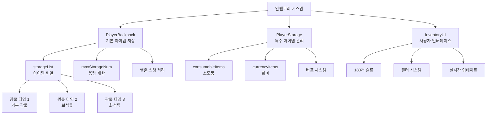

# 기능별 가이드 - 플레이어 관리 - 인벤토리 시스템

## 개요
인벤토리 시스템은 플레이어가 채굴한 광물, 구매한 장비, 획득한 소모품 등 모든 아이템을 저장하고 관리하는 핵심 시스템입니다. 동적 용량 관리, 아이템 타입별 분류, 드래그 앤 드롭 기능, 그리고 직관적인 UI를 제공하여 효율적인 아이템 관리를 지원합니다.

## 인벤토리 시스템 구조

### 시스템 아키텍처


## 관련 파일 경로

### 인벤토리 핵심 컴포넌트
```
RootDesk/MyDesk/Components/Player/Inventory/
├── PlayerBackpack.mlua                # 기본 아이템 저장 시스템
├── PlayerBackpack.codeblock          # 백팩 비주얼 스크립팅
├── PlayerStorage.mlua                # 특수 아이템 및 화폐 관리
├── PlayerStorage.codeblock           # 저장소 비주얼 스크립팅
├── InventoryUI.mlua                  # 인벤토리 사용자 인터페이스
├── InventoryUI.codeblock             # 인벤토리 UI 비주얼
├── InventorySlotButton.mlua          # 인벤토리 슬롯 버튼
├── InventorySlotButton.codeblock     # 슬롯 버튼 비주얼
├── InventoryEquipedSlotButton.mlua   # 장착 슬롯 버튼
├── InventoryEquipedSlotButton.codeblock # 장착 슬롯 비주얼
├── StorageUI.mlua                    # 저장고 UI
├── StorageUI.codeblock               # 저장고 UI 비주얼
├── StorageUI_SlotButton.mlua         # 저장고 슬롯 버튼
├── StorageUI_SlotButton.codeblock    # 저장고 슬롯 비주얼
├── EquipmentStorageUI_NormalSlotButton.mlua    # 장비 저장소 슬롯
└── EquipmentStorageUI_NormalSlotButton.codeblock # 장비 저장소 슬롯 비주얼
```

### 인벤토리 UI 그룹
```
ui/
├── InventoryGroup.ui                 # 인벤토리 UI 그룹
├── EquipmentStorageGroup.ui          # 장비 저장소 UI 그룹
└── VoidItemGroup.ui                  # 보이드 아이템 UI 그룹
```

### 관련 컴포넌트
```
RootDesk/MyDesk/Components/
├── InventoryButtonUI.mlua            # 인벤토리 버튼 UI
└── Player/VoidItem/PlayerVoidItem.mlua # 보이드 아이템 시스템
```

### 데이터 테이블
```
RootDesk/MyDesk/DataSets/
├── DropItem.csv                      # 드롭 아이템 정보
├── DropItem.userdataset             # 드롭 아이템 데이터셋
├── Equipment.csv                     # 장비 정보
├── Equipment.userdataset            # 장비 데이터셋
├── ConsumableItems.csv              # 소모품 정보
└── ConsumableItems.userdataset      # 소모품 데이터셋
```

## PlayerBackpack 시스템 상세 분석

### 핵심 데이터 구조
```lua
@Component
script PlayerBackpack extends Component

    property SyncTable<number> storageList    -- 아이템 저장 배열
    @Sync
    property number maxStorageNum = 0         -- 최대 저장 용량
    property number failStack = 0             -- 가방 꽉참 경고 스택
```

### 아이템 추가 로직
```lua
@ExecSpace("Server")
method void AddItem(number itemIdx, number amount)
    -- 1. 현재 보유량 계산
    local storageAmount = 0
    for i=1, #self.storageList do
        storageAmount = storageAmount + self.storageList[i]
    end
    
    -- 2. 행운 스탯 적용 (2배 획득 확률)
    if itemIdx > 4 then  -- 기본 광물 제외
        local randValue = _UtilLogic:RandomDouble() * 100
        if randValue < self.Entity.PlayerData.Luck then
            amount = amount * 2  -- 행운 발동 시 2배
        end
    end
    
    -- 3. 용량 제한 확인
    local allowedAmount = self.maxStorageNum - storageAmount
    if allowedAmount < amount then
        amount = allowedAmount
        
        -- 가방이 꽉 찬 경우 경고 메시지
        if amount <= 0 then
            _CustomLocalizationLogic:SendLocalizedToastMessageFromServer(
                "Message_BackpackIsFull", self.Entity.OwnerId)
                
            -- failStack 증가: 8회 누적 시 가방 구매 안내
            self.failStack = self.failStack + 1
            if self.failStack >= 8 then
                local showGuideMessage = function()
                    _CustomLocalizationLogic:SendLocalizedToastMessageFromServer(
                        "Message_Tip_BuyBackpack", self.Entity.OwnerId)
                end
                _TimerService:SetTimerOnce(showGuideMessage, 4)
            end
            return
        end
    end
    
    -- 4. 아이템 저장 및 클라이언트 동기화
    self.storageList[itemIdx] = self.storageList[itemIdx] + amount
    self:SetTableElementClient("storageList", itemIdx, tostring(self.storageList[itemIdx]), self.Entity.OwnerId)
    
    -- 5. 수집 시스템 연동
    self.Entity.PlayerCollection:RecordData(itemIdx, amount)
    
    -- 6. 아이템 타입별 로그 및 업적 처리
    local itemTable = _DataService:GetTable("DropItem")
    local itemType = itemTable:GetCell(itemIdx, 6)
    local itemRUID = itemTable:GetCell(itemIdx, 2)
    
    if itemType == "MineralType1" then  -- 기본 광물 (흰색)
        _UIGetLog:AddLog(Color.white, itemTable:GetCell(itemIdx, 1), amount, true, itemType, itemRUID, self.Entity.OwnerId)
        for i=10, 16 do  -- 관련 업적 진행도 업데이트
            self.Entity.PlayerAchievementComponent:GetProgress(i, amount)
        end
        
    elseif itemType == "MineralType2" then  -- 보석류 (빨간색)
        _UIGetLog:AddLog(Color.FromHexCode("#FF7878"), itemTable:GetCell(itemIdx, 1), amount, true, itemType, itemRUID, self.Entity.OwnerId)
        for i=17, 21 do
            self.Entity.PlayerAchievementComponent:GetProgress(i, amount)
        end
        
    elseif itemType == "MineralType3" then  -- 화석류 (노란색)
        _UIGetLog:AddLog(Color.FromHexCode("#FFD926"), itemTable:GetCell(itemIdx, 1), amount, true, itemType, itemRUID, self.Entity.OwnerId)
        for i=22, 25 do
            self.Entity.PlayerAchievementComponent:GetProgress(i, amount)
        end
    end
    
    -- 7. 아이템 획득 사운드 재생
    _SoundService:PlaySound("2e4f923874f749fda5f69170aee85061", 0.5, self.Entity.OwnerId)
end
```

### 아이템 판매 시스템
```lua
@ExecSpace("Server")
method void SellItem(number itemIdx, number sellAmount)
    if self.storageList[itemIdx] >= sellAmount then
        -- 아이템 차감
        self.storageList[itemIdx] = self.storageList[itemIdx] - sellAmount
        
        -- 판매 가격 계산 및 골드 지급
        local itemTable = _DataService:GetTable("DropItem")
        local sellPrice = itemTable:GetCell(itemIdx, 3) * sellAmount
        self.Entity.PlayerData:GetMoney(sellPrice)
        
        -- 클라이언트 동기화
        self:SetTableElementClient("storageList", itemIdx, tostring(self.storageList[itemIdx]), self.Entity.OwnerId)
    end
end
```

## PlayerStorage 시스템 - 특수 아이템 관리

### 데이터 구조
```lua
@Component  
script PlayerStorage extends Component

    -- 소모품 (유물상자, 계약서, 뿌리기류, 장신구상자 등)
    property SyncTable<number> consumableItems
    
    -- 화폐류 (골드, 젬, 펫알, 감정표현토큰, 환생코인 등)  
    property SyncTable<number> currencyItems
    
    -- 소모품 사용 시간 관리
    property SyncTable<number> consumableItemStartTime
    property SyncTable<number> consumableItemDuration
    property SyncTable<boolean> consumableItemAvailable
    
    -- 버프 UI 시스템
    property Entity buffUI = "090d60e0-cba6-4fe4-8362-ead22d244aba"
    property SyncTable<string> buffIconRUID
    property SyncTable<string> buffName
    property SyncTable<string> buffDesc
```

### 소모품 시스템
```lua
method void OnBeginPlay()
    -- 소모품 지속시간 설정
    local consumableItemTable = _DataService:GetTable("ConsumableItems")
    for i=1, consumableItemTable:GetRowCount() do
        local filterIdx = tonumber(consumableItemTable:GetCell(i, "FilterType"))
        
        if filterIdx == 1 then
            self.consumableItemDuration[i] = 1800  -- 30분
        elseif filterIdx == 2 then
            self.consumableItemDuration[i] = 600   -- 10분  
        else
            self.consumableItemDuration[i] = 0     -- 영구/즉시 사용
        end 
    end
    
    -- 버프 정보 로딩 (클라이언트)
    if self:IsClient() then
        for i=1, consumableItemTable:GetRowCount() do
            self.buffIconRUID[i] = consumableItemTable:GetCell(i, "IconRUID")
            self.buffName[i] = _LocalizationService:GetText(consumableItemTable:GetCell(i, "Name"))
            self.buffDesc[i] = _LocalizationService:GetText(consumableItemTable:GetCell(i, "Desc"))
        end
    end
end
```

### 화폐 시스템 
```lua
-- 화폐 추가
@ExecSpace("Server")  
method void AddCurrencyItems(number currencyType, number amount, boolean showEffect)
    self.currencyItems[currencyType] = self.currencyItems[currencyType] + amount
    
    if showEffect then
        -- 획득 효과 표시
        self:ShowCurrencyGainEffect(currencyType, amount)
    end
end

-- 화폐 사용
@ExecSpace("Server")
method boolean SpendCurrencyItems(number currencyType, number amount)
    if self.currencyItems[currencyType] >= amount then
        self.currencyItems[currencyType] = self.currencyItems[currencyType] - amount
        return true
    else
        return false  -- 잔액 부족
    end
end
```

## InventoryUI 시스템 - 사용자 인터페이스

### UI 구조 및 초기화
```lua
@Component
script InventoryUI extends Component

    property number filterIdx = 1         -- 필터 인덱스 (1:광물, 2:장비 등)
    property number showDetailIdx = 0     -- 상세 정보 표시 아이템

    @ExecSpace("ClientOnly")
    method void OnBeginPlay()
        -- 1. 지역화 텍스트 설정
        _EntityService:GetEntityByPath("/ui/InventoryGroup/Inventory/DetailInfoPopup/Panel/Button_Equip")
            .TextComponent.Text = _LocalizationService:GetText("Equip")
        _EntityService:GetEntityByPath("/ui/InventoryGroup/Inventory/DetailInfoPopup/Panel/Button_Equip_dismount")
            .TextComponent.Text = _LocalizationService:GetText("Unequip")
        
        -- 2. 180개 인벤토리 슬롯 생성
        local invenSlot = _EntityService:GetEntityByPath("/ui/InventoryGroup/Inventory/Panel/Panel_right/ListPanel/Slot")
        for i=1, 180 do
            invenSlot:Clone("Slot_"..tostring(i))
        end
        
        -- 3. 능력치 슬롯 13개 생성
        local abilitySlot = _EntityService:GetEntity("49feef06-c09d-4890-bb0c-44ffcc4faaff")
        for i=1, 13 do
            abilitySlot:Clone("List_"..tostring(i))
        end
        
        -- 4. 기본 필터 설정 (광물)
        self:SetFilterIdx(1)
    end
```

### 실시간 UI 업데이트 시스템
```lua
@ExecSpace("ClientOnly")
method void OnUpdate(number delta)
    -- 프레임별 UI 갱신 체크
    if self._T.refreshUI then
        self:RefreshUI_Inner()
        self._T.refreshUI = false
    end
end

@ExecSpace("Client")
method void RefreshUI_Inner()
    local user = _UserService.LocalPlayer
    
    -- 1. 용량 정보 표시
    local maxStorage = user.PlayerBackpack.maxStorageNum
    local currentStorage = 0
    
    for i=1, #user.PlayerBackpack.storageList do
        if user.PlayerBackpack.storageList[i] ~= nil then
            currentStorage = currentStorage + user.PlayerBackpack.storageList[i]
        end
    end
    
    -- 2. 용량 바 UI 업데이트
    local fill = _EntityService:GetEntity("f2d5b6f7-8b9c-4321-a0e1-2f3g4h5i6j7k")
    local ratioNum = _EntityService:GetEntity("a1b2c3d4-e5f6-7890-1234-567890abcdef")
    
    fill.UITransformComponent.RectSize = Vector2(566 * currentStorage / maxStorage, 29)
    ratioNum.TextComponent.Text = string.format("%.2f%%", currentStorage / maxStorage * 100)
    
    -- 3. 필터별 아이템 목록 표시
    if self.filterIdx == 1 then  -- 광물 필터
        self:DisplayMineralItems()
    elseif self.filterIdx == 2 then  -- 장비 필터  
        self:DisplayEquipmentItems()
    elseif self.filterIdx == 3 then  -- 의자 필터
        self:DisplayChairItems()
    elseif self.filterIdx == 4 then  -- 펫 필터
        self:DisplayPetItems()
    elseif self.filterIdx == 5 then  -- 칭호 필터
        self:DisplayTitleItems()
    elseif self.filterIdx == 6 then  -- 유물 필터
        self:DisplayRelicItems()
    end
end
```

### 광물 아이템 표시 시스템
```lua
method void DisplayMineralItems()
    local user = _UserService.LocalPlayer
    local itemTable = _DataService:GetTable("DropItem")
    local listPanel = _EntityService:GetEntity("23b2aa35-795f-44da-b215-36c5892e1da5")
    local maxIdx = itemTable:GetRowCount()
    
    for i=1, maxIdx do
        local haveAmount = user.PlayerBackpack.storageList[i]
        local slot = listPanel:GetChildByName("Slot_"..tostring(i))
        
        -- 슬롯 상태 초기화
        slot:GetChildByName("EquipedSlot").Enable = false
        slot:GetChildByName("PetGrade").Enable = false
        slot:GetChildByName("IsDirtyRelic").Enable = false
        
        if haveAmount == nil then
            log("have amount is nil")
            return
        elseif haveAmount == 0 then
            -- 보유하지 않은 아이템은 숨김
            slot.Enable = false
        else
            -- 보유한 아이템 표시
            slot.Enable = true
            slot.ButtonComponent.Enable = true
            
            -- 아이템 아이콘 설정
            slot:GetChildByName("Icon").SpriteGUIRendererComponent.ImageRUID = itemTable:GetCell(i, 2)
            slot:GetChildByName("Icon").SpriteGUIRendererComponent.Color = Color.white
            slot:GetChildByName("Icon").SpriteGUIRendererComponent.LocalScale = Vector2.one
            
            -- 수량 표시 (천 단위 구분)
            slot:GetChildByName("Amount").TextComponent.Text = 
                _ThousandsSeparator:ConvertToMetricPrefixString(haveAmount)
        end
    end
    
    -- 사용하지 않는 슬롯 비활성화
    for i=maxIdx+1, 180 do
        local slot = listPanel:GetChildByName("Slot_"..tostring(i))
        slot.Enable = false
        slot.ButtonComponent.Enable = false
    end
end
```

## 인벤토리 버튼 UI 시스템

### 용량 표시 및 애니메이션
```lua
@Component
script InventoryButtonUI extends Component

    property boolean isCalledByStorageList = false  -- 스토리지 변화 플래그

    method void RefreshUI_Inner()
        local user = _UserService.LocalPlayer
        local maxStorage = user.PlayerBackpack.maxStorageNum
        local currentStorage = 0
        
        -- 현재 사용량 계산
        for i=1, #user.PlayerBackpack.storageList do
            if user.PlayerBackpack.storageList[i] ~= nil then
                currentStorage = currentStorage + user.PlayerBackpack.storageList[i]
            end
        end
        
        local amountRate = currentStorage / maxStorage
        
        -- 퍼센트 텍스트 업데이트
        local btnAmountTextUI = _EntityService:GetEntity("c8f3715f-0080-4e95-9e4f-a080b26adc48")
        btnAmountTextUI.TextComponent.Text = string.format("%.2f%%", amountRate * 100)
        
        -- 게이지 바 애니메이션 (아이템 획득 시)
        local btnAmountFillUI = _EntityService:GetEntity("9c0a3c39-2638-4610-bd31-43ea0b0c9672")
        
        if self.isCalledByStorageList == true then
            -- 부드러운 게이지 증가 애니메이션
            local beforeFillAmount = btnAmountFillUI.SpriteGUIRendererComponent.FillAmount
            local gap = amountRate - beforeFillAmount
            local delta = gap / 30
            
            local SetFillAmount = function()
                local currentFillAmount = btnAmountFillUI.SpriteGUIRendererComponent.FillAmount
                if currentFillAmount == nil then currentFillAmount = 0 end
                
                local newFillAmount = currentFillAmount + delta
                btnAmountFillUI.SpriteGUIRendererComponent.FillAmount = newFillAmount
            end
            
            -- 30프레임에 걸쳐 애니메이션
            for i=1, 30 do
                _TimerService:SetTimerOnce(SetFillAmount, i/30)
            end
            
            self.isCalledByStorageList = false
        else
            -- 즉시 업데이트 (애니메이션 없음)
            btnAmountFillUI.SpriteGUIRendererComponent.FillAmount = amountRate
        end
    end
```

## 용량 관리 및 확장 시스템

### 가방 확장 메커니즘
```lua
-- PlayerBackpack.mlua의 maxStorageNum 업데이트
@ExecSpace("Server")
method void ExpandStorage(number additionalSlots)
    self.maxStorageNum = self.maxStorageNum + additionalSlots
    -- 클라이언트에 동기화
    self:SyncStorageCapacity()
end

-- 장비를 통한 가방 확장 (EquipmentShopUI.mlua 참조)
method void ApplyBackpackEquipment(number equipmentLevel)
    local backpackCapacity = self:GetBackpackCapacityByLevel(equipmentLevel)
    _UserService.LocalPlayer.PlayerBackpack.maxStorageNum = backpackCapacity
end
```

### 가방 꽉참 경고 시스템
```lua
-- 8회 연속 가방 꽉참 시 구매 안내
method void HandleFullBackpackWarning()
    self.failStack = self.failStack + 1
    
    if self.failStack >= 8 then
        local showGuideMessage = function()
            _CustomLocalizationLogic:SendLocalizedToastMessageFromServer(
                "Message_Tip_BuyBackpack", self.Entity.OwnerId)
        end
        _TimerService:SetTimerOnce(showGuideMessage, 4)
        
        -- failStack 초기화
        self.failStack = 0
    end
end
```

## 아이템 분류 및 필터 시스템

### 아이템 카테고리
1. **광물 (MineralType1)**: 기본 광물, 흰색 로그
2. **보석 (MineralType2)**: 희귀 보석, 빨간색 로그  
3. **화석 (MineralType3)**: 고대 화석, 노란색 로그
4. **장비**: 무기, 방어구, 액세서리
5. **의자**: 휴식용 가구 아이템
6. **펫**: 동반자 펫들
7. **칭호**: 플레이어 칭호 시스템
8. **유물**: 특별한 효과를 가진 유물들

### 필터 전환 시스템
```lua
method void SetFilterIdx(number newFilterIdx)
    self.filterIdx = newFilterIdx
    
    -- 필터 UI 업데이트
    local filterButtons = _EntityService:GetEntityByPath("/ui/InventoryGroup/Inventory/Panel/Panel_left/FilterList")
    
    for i=1, 6 do
        local filterButton = filterButtons:GetChildByName("Filter_"..tostring(i))
        if i == newFilterIdx then
            filterButton.SpriteGUIRendererComponent.Color = Color.yellow  -- 선택됨
        else
            filterButton.SpriteGUIRendererComponent.Color = Color.white   -- 기본색
        end
    end
    
    -- UI 새로고침
    self:RefreshUI()
end
```

## 드래그 앤 드롭 시스템

### 슬롯 간 아이템 이동
```lua
-- InventorySlotButton.mlua에서 구현
method void OnDragStart()
    -- 드래그 시작 시 아이템 정보 저장
    local dragData = {
        itemId = self.itemId,
        itemAmount = self.itemAmount,
        sourceSlot = self.slotIndex
    }
    
    _DragDropService:StartDrag(dragData)
end

method void OnDragEnd(Entity targetSlot)
    -- 드롭 대상이 유효한 슬롯인지 확인
    if targetSlot and targetSlot.InventorySlotButton then
        -- 아이템 교환 또는 이동
        self:SwapItems(targetSlot)
    end
    
    _DragDropService:EndDrag()
end
```

### 아이템 교환 로직
```lua
method void SwapItems(Entity targetSlot)
    local sourceItemId = self.itemId
    local sourceAmount = self.itemAmount
    local targetItemId = targetSlot.InventorySlotButton.itemId
    local targetAmount = targetSlot.InventorySlotButton.itemAmount
    
    -- 같은 아이템인 경우 수량 합치기
    if sourceItemId == targetItemId then
        targetSlot.InventorySlotButton:AddAmount(sourceAmount)
        self:ClearSlot()
    else
        -- 다른 아이템인 경우 위치 교환
        self:SetItem(targetItemId, targetAmount)
        targetSlot.InventorySlotButton:SetItem(sourceItemId, sourceAmount)
    end
end
```

## 성능 최적화

### UI 업데이트 최적화
```lua
-- 필요 시에만 UI 갱신
property boolean _needsRefresh = false

method void RequestRefresh()
    self._needsRefresh = true
end

method void OnUpdate(number delta) 
    if self._needsRefresh then
        self:RefreshUI_Inner()
        self._needsRefresh = false
    end
end
```

### 메모리 관리
- 사용하지 않는 슬롯 비활성화
- 아이템 아이콘 텍스처 캐싱
- 대용량 인벤토리를 위한 가상화 스크롤

## 확장 가능성

### 새로운 아이템 타입 추가
1. `DropItem.csv`에 새 아이템 정보 추가
2. `InventoryUI.mlua`에 새 필터 로직 구현
3. UI에 새 필터 탭 추가
4. 아이템별 특수 처리 로직 구현

### 추가 기능 구현
```lua
-- 아이템 정렬 기능
method void SortInventory()
    -- 아이템 타입별, 등급별, 수량별 정렬
end

-- 빠른 판매 기능  
method void QuickSell(table itemTypes)
    -- 특정 타입 아이템 일괄 판매
end

-- 아이템 검색 기능
method void SearchItems(string keyword)
    -- 이름으로 아이템 검색 및 필터링
end
```

## 일반적인 문제 해결

### 아이템이 추가되지 않는 경우
1. `maxStorageNum` 용량 확인
2. `AddItem` 메서드의 권한 확인 (Server 실행공간)
3. `storageList` 인덱스 범위 확인

### UI가 업데이트되지 않는 경우  
1. `RefreshUI()` 호출 확인
2. 클라이언트-서버 동기화 상태 점검
3. UI 엔티티 참조 경로 확인

### 드래그 앤 드롭이 작동하지 않는 경우
1. 슬롯 버튼의 `ButtonComponent.Enable` 상태 확인
2. 드래그 허용 설정 점검
3. 충돌 영역 확인
