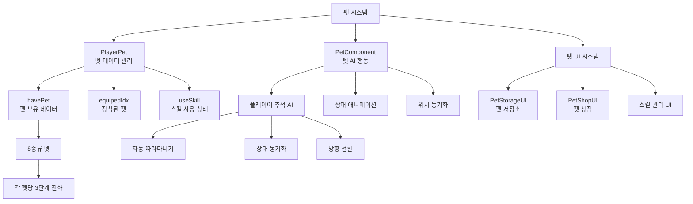

# 기능별 가이드 - 플레이어 관리 - 펫 시스템

## 개요
펫 시스템은 플레이어가 동반자 펫을 소환하여 게임플레이를 도와주는 시스템입니다. 펫은 플레이어를 자동으로 따라다니며, 고유한 스킬을 가지고 있어 다양한 도움을 제공합니다. 펫알을 통해 획득할 수 있으며, 8종류의 서로 다른 펫이 존재합니다.

## 펫 시스템 구조

### 시스템 아키텍처


## 관련 파일 경로

### 펫 시스템 핵심 컴포넌트
```
RootDesk/MyDesk/Components/Player/Pet/
├── PlayerPet.mlua                    # 플레이어 펫 데이터 관리
├── PlayerPet.codeblock              # 펫 데이터 비주얼 스크립팅
├── PetComponent.mlua                # 개별 펫 AI 컴포넌트
├── PetComponent.codeblock           # 펫 AI 비주얼 스크립팅
├── PetStorageUI.mlua                # 펫 저장소 UI
├── PetStorageUI.codeblock           # 펫 저장소 비주얼
├── PetShopUI.mlua                   # 펫 상점 UI
├── PetShopUI.codeblock              # 펫 상점 비주얼
├── PetStorageUI_EquipButton.mlua    # 펫 장착 버튼
├── PetStorageUI_EquipButton.codeblock # 펫 장착 버튼 비주얼
├── PetStorageUI_SlotInfoPopup.mlua  # 펫 정보 팝업
├── PetStorageUI_SlotInfoPopup.codeblock # 펫 정보 팝업 비주얼
├── PetStorageUI_UseSkillButton.mlua # 펫 스킬 사용 버튼
└── PetStorageUI_UseSkillButton.codeblock # 펫 스킬 버튼 비주얼
```

### 펫 관련 UI 그룹
```
ui/
└── PetShopGroup.ui                  # 펫 상점 UI 그룹
```

### 펫 데이터 테이블
```
RootDesk/MyDesk/DataSets/
├── Pet.csv                          # 펫 기본 정보
├── Pet.userdataset                  # 펫 데이터셋
├── PetSkill.csv                     # 펫 스킬 정보 (추정)
└── PetSkill.userdataset             # 펫 스킬 데이터셋 (추정)
```

### 펫 모델 리소스
```
RootDesk/MyDesk/Models/
└── Players/                         # 펫 모델들 (펫은 Players 폴더에 포함)
```

## PlayerPet 시스템 상세 분석

### 핵심 데이터 구조
```lua
@Component
script PlayerPet extends Component

    @Sync
    property Entity petEntity = nil      -- 소환된 펫 엔티티
    
    property SyncTable<number> havePet   -- 보유한 펫 데이터 (8종 x 각 3단계)
    
    @Sync
    property number equipedIdx = 0       -- 현재 장착된 펫 인덱스 (0=미장착)
    
    property SyncTable<boolean> useSkill -- 펫 스킬 사용 상태
```

### 펫 시스템 초기화
```lua
method void OnBeginPlay()
    -- 테이블 동기화 설정
    self._T.tableList = { 
        havePet = self.havePet,
        useSkill = self.useSkill,
    }
    self._T.tableType = { 
        havePet = "number",
        useSkill = "boolean",
    }
    
    -- 펫 데이터 초기화 (8종류 펫)
    local petNum = _DataService:GetRowCount("Pet")
    for i=1, petNum do
        self.havePet[i] = 0  -- 0: 미보유, 1-3: 진화 단계
    end
    
    if self:IsServer() then
        self.equipedIdx = 0  -- 처음에는 펫 미장착
        
        -- 펫 엔티티 스폰 (비활성 상태로)
        self.petEntity = _SpawnService:SpawnByModelId(
            "model://8d924b3c-89e6-4c50-9464-aaf62178e526",  -- 기본 펫 모델
            "Pet",
            Vector3(-self.Entity.ExtendPlayerControllerComponent.LookDirectionX, 0, 0),
            self.Entity)
        
        -- 펫-플레이어 연결
        self.petEntity.PetComponent.ownerEntity = self.Entity
        self.petEntity.NameTagComponent.Name = self.Entity.NameTagComponent.Name.."의 펫"
        self.petEntity.NameTagComponent.Enable = false
        
        self:ChangePetEntityParameter()
    end
end
```

### 펫 장착 시스템
```lua
@ExecSpace("Server")
method void ChangePetEntityParameter()
    local petIdx = self.equipedIdx
    
    if petIdx == 0 then
        -- 펫 미장착: 펫 엔티티 비활성화
        self:EnablePetEntity(false)
        return
    else 
        -- 펫 장착: 펫 엔티티 활성화
        self:EnablePetEntity(true)
    end
    
    -- 펫 데이터 로드
    local petTable = _DataService:GetTable("Pet")
    local petRUID = petTable:GetCell(petIdx, 2)  -- 펫 스프라이트
    
    -- 펫 엔티티 설정
    local petEntity = self.Entity:GetChildByName("Pet")
    petEntity.SpriteRendererComponent.SpriteRUID = petRUID
    
    -- 펫 애니메이션 설정
    local animMove = petTable:GetCell(petIdx, 3)
    local animIdle = petTable:GetCell(petIdx, 4)
    local animJump = petTable:GetCell(petIdx, 5)
    
    -- StateAnimationComponent에 애니메이션 적용
    self:SetPetAnimations(animMove, animIdle, animJump)
end

@ExecSpace("Server")
method void EnablePetEntity(boolean enable)
    if isvalid(self.petEntity) then
        self.petEntity.Enable = enable
        
        if enable then
            -- 펫 활성화: 플레이어 뒤에 배치
            local playerPos = self.Entity.TransformComponent.WorldPosition
            local lookDir = self.Entity.ExtendPlayerControllerComponent.LookDirectionX
            self.petEntity.TransformComponent.WorldPosition = 
                Vector3(playerPos.x - lookDir * 0.5, playerPos.y, playerPos.z)
        end
    end
end
```

### 펫 획득 시스템
```lua
@ExecSpace("Server")
method void GetPet(number petIdx)
    -- 해당 펫이 이미 최대 진화 상태인지 확인
    if self.havePet[petIdx] >= 3 then
        -- 이미 최대 진화: 다른 보상 지급 (예: 젬)
        self.Entity.PlayerStorage:AddCurrencyItems(2, 10, true)  -- 젬 10개
        return
    end
    
    -- 펫 진화 단계 증가
    self.havePet[petIdx] = self.havePet[petIdx] + 1
    
    -- 클라이언트 동기화
    self:SetTableElementClient("havePet", petIdx, tostring(self.havePet[petIdx]), self.Entity.OwnerId)
    
    -- UI 새로고침
    local petStorageUI = _EntityService:GetEntityByPath("/ui/PetShopGroup/PetStorage")
    petStorageUI.PetStorageUI:RefreshUI()
end
```

## PetComponent - 펫 AI 시스템

### 펫 행동 패턴
```lua
@Component
script PetComponent extends Component

    @Sync
    property EntityRef ownerEntity = nil  -- 주인 플레이어
    
    property SyncTable<number> animTimer  -- 애니메이션 타이머

    method void OnBeginPlay()
        -- 상태 애니메이션 초기화
        local stateAnimCompo = self.Entity.StateAnimationComponent
        local stateCompo = self.Entity.StateComponent
        
        -- 모든 애니메이션 상태를 StateComponent에 등록
        for i=1, stateAnimCompo.ActionSheet.Count do
            stateCompo:AddState(stateAnimCompo.ActionSheet.Keys[i])
        end
    end
```

### 펫 상태 관리
```lua
@ExecSpace("Server")
method void ChangeState(string state)
    if state == "Move" then
        self.Entity.StateComponent:ChangeState("MOVE")
    elseif state == "Idle" then
        self.Entity.StateComponent:ChangeState("STAND")
    elseif state == "Jump" then
        self.Entity.StateComponent:ChangeState("JUMP")
    end
end
```

### 플레이어 추적 시스템
```lua
@ExecSpace("Server")
method void ChangePos(number lookAt)
    -- 플레이어 방향으로 이동
    local moveDir = -lookAt
    self:ChangeState("Move")
    
    -- 부드러운 이동 애니메이션 (2초간 120프레임)
    local goToBehindPlayer = function()
        self.Entity.TransformComponent:Translate(moveDir * 1/60, 0)
    end
    
    -- 기존 애니메이션 타이머 정리
    table.clear(self.animTimer)
    
    -- 120프레임에 걸쳐 부드럽게 이동
    for i=1, 120 do
        local animFrame = _TimerService:SetTimerOnce(goToBehindPlayer, i/120)
        table.insert(self.animTimer, animFrame)
    end
    
    -- 이동 완료 후 대기 상태로 전환
    local changeStateToIdle = function()
        if self.ownerEntity.StateComponent.CurrentStateName == "IDLE" then
            self:ChangeState("Idle")
        end
        
        -- 플레이어와 같은 방향으로 향하기
        local lookAt = self.ownerEntity.ExtendPlayerControllerComponent.LookDirectionX
        self.Entity.SpriteRendererComponent.FlipX = (lookAt > 0)
    end
    
    _TimerService:SetTimerOnce(changeStateToIdle, 1)
end
```

## PetStorageUI - 펫 저장소 시스템

### UI 초기화 및 슬롯 생성
```lua
@Component
script PetStorageUI extends Component

    @ExecSpace("ClientOnly")
    method void OnBeginPlay()
        local slot = _EntityService:GetEntityByPath("/ui/PetShopGroup/PetStorage/Panel/ListPanel/Slot")
        local petTable = _DataService:GetTable("Pet")
        
        -- 8개 펫 슬롯 생성
        for i=1, 8 do
            local clonedSlot = slot:Clone("Slot_"..tostring(i))
            
            -- 펫 아이콘 설정
            local iconEntity = clonedSlot:GetChildByName("Icon_back"):GetChildByName("Icon")
            iconEntity.SpriteGUIRendererComponent.ImageRUID = petTable:GetCell(i, 2)
            iconEntity.SpriteGUIRendererComponent.LocalPosition = 
                Vector2(tonumber(petTable:GetCell(i, 6)), tonumber(petTable:GetCell(i, 7)))
            
            -- 펫 이름 설정
            clonedSlot:GetChildByName("Name").TextComponent.Text = 
                _LocalizationService:GetText(petTable:GetCell(i, 1))
            
            -- 펫 스킬 아이콘 설정
            _EntityService:GetEntityByPath(clonedSlot.Path.."/Ability_skill/Icon_skill")
                .SpriteGUIRendererComponent.ImageRUID = petTable:GetCell(i, "PetSkillIconRUID")
        end
        
        -- 활성화된 스킬 목록 UI 초기화
        local activatedSkillListEntity = _EntityService:GetEntityByPath(
            "/ui/PetShopGroup/PetStorage/Panel/FixedPanel/ActiveSkill_box/Scroll_Layout")
        for i=1, 8 do
            activatedSkillListEntity:GetChildByName("skill_"..tostring(i))
                .SpriteGUIRendererComponent.ImageRUID = petTable:GetCell(i, "PetSkillIconRUID")
        end
    end
```

### 펫 상태 표시 시스템
```lua
method void RefreshUI_Inner()
    local listPanel = _EntityService:GetEntityByPath("/ui/PetShopGroup/PetStorage/Panel/ListPanel")
    local petTable = _DataService:GetTable("Pet")
    local playerPet = _UserService.LocalPlayer.PlayerPet
    
    for i=1, 8 do
        local slot = listPanel:GetChildByName("Slot_"..tostring(i))
        local havePetLevel = playerPet.havePet[i] or 0
        
        -- 펫 보유 상태에 따른 UI 업데이트
        if havePetLevel == 0 then
            -- 미보유: 회색 처리
            slot:GetChildByName("Icon_back"):GetChildByName("Icon")
                .SpriteGUIRendererComponent.Color = Color(0.3, 0.3, 0.3, 1)
            slot:GetChildByName("Name").TextComponent.FontColor = Color.gray
            slot:GetChildByName("Lock").Enable = true
            
        else
            -- 보유: 정상 색상
            slot:GetChildByName("Icon_back"):GetChildByName("Icon")
                .SpriteGUIRendererComponent.Color = Color.white
            slot:GetChildByName("Name").TextComponent.FontColor = Color.white  
            slot:GetChildByName("Lock").Enable = false
            
            -- 진화 단계 표시 (1-3성)
            for star=1, 3 do
                local starIcon = slot:GetChildByName("Star"..tostring(star))
                starIcon.Enable = (star <= havePetLevel)
            end
        end
        
        -- 현재 장착된 펫 표시
        local equippedIcon = slot:GetChildByName("EquippedIcon")
        equippedIcon.Enable = (playerPet.equipedIdx == i)
    end
end
```

## PetShopUI - 펫 상점 시스템

### 펫알 시스템
```lua
@Component
script PetShopUI extends Component

    method void RefreshUI_Inner()
        local player = _UserService.LocalPlayer
        
        -- 보유 펫알 수량 표시
        local havingEggNumUI = _EntityService:GetEntity("5f83ab94-7f35-48df-9724-963c8269c955")
        havingEggNumUI.TextComponent.Text = string.format("%d", player.PlayerData.PetEgg)
        
        -- 모든 펫을 최대 진화시켰는지 확인
        local havePet = player.PlayerPet.havePet
        local haveAllPet = true
        
        for i=1, #havePet do
            if havePet[i] < 3 then  -- 3단계 미만이면 아직 완성 안됨
                haveAllPet = false
                break
            end
        end
        
        if haveAllPet == true then
            -- 모든 펫 완성: 버튼 비활성화
            local hidePanel = _EntityService:GetEntity("945cdb6a-49c2-4278-8f41-549b4d5965b0")
            hidePanel.Enable = true
            self:ButtonEnable(false)
        else
            -- 미완성 펫 존재: 버튼 활성화
            self:ButtonEnable(true)
        end
    end
```

### 펫 뽑기 시스템
```lua
@ExecSpace("Server")
method void OpenPetEgg()
    local player = self.Entity
    
    -- 펫알 보유량 확인
    if player.PlayerData.PetEgg <= 0 then
        _UIToast:ShowMessage("펫알이 부족합니다.", player.OwnerId)
        return
    end
    
    -- 펫알 소모
    player.PlayerData:UsePetEgg(1)
    
    -- 랜덤 펫 선택 (가중치 적용)
    local petWeights = {100, 80, 60, 40, 30, 20, 15, 10}  -- 펫 1-8번의 가중치
    local selectedPet = self:SelectRandomPetByWeight(petWeights)
    
    -- 펫 획득
    player.PlayerPet:GetPet(selectedPet)
    
    -- 결과 UI 표시
    self:ShowPetGachaResult(selectedPet)
end

method number SelectRandomPetByWeight(table weights)
    local totalWeight = 0
    for _, weight in ipairs(weights) do
        totalWeight = totalWeight + weight
    end
    
    local randomValue = _UtilLogic:RandomDouble() * totalWeight
    local currentWeight = 0
    
    for i, weight in ipairs(weights) do
        currentWeight = currentWeight + weight
        if randomValue <= currentWeight then
            return i
        end
    end
    
    return 1  -- 기본값
end
```

## 펫 스킬 시스템

### 스킬 활성화 시스템
```lua
-- PetStorageUI_UseSkillButton.mlua
method void OnSkillButtonClick()
    local slotIdx = self:GetPetSlotIndex()
    local playerPet = _UserService.LocalPlayer.PlayerPet
    local currentSkillState = playerPet.useSkill[slotIdx] or false
    
    if currentSkillState then
        -- 스킬 비활성화
        playerPet:ChangePetSkillUseState(slotIdx, false)
        self:SetButtonState(false)
    else
        -- 스킬 활성화
        playerPet:ChangePetSkillUseState(slotIdx, true)
        self:SetButtonState(true)
    end
end

@ExecSpace("Server")
method void ChangePetSkillUseState(number petIdx, boolean useSkill)
    self.useSkill[petIdx] = useSkill
    
    -- 클라이언트 동기화
    self:SetTableElementClient("useSkill", petIdx, tostring(useSkill), self.Entity.OwnerId)
    
    -- 펫 스킬 효과 적용/해제
    if useSkill then
        self:ApplyPetSkill(petIdx)
    else
        self:RemovePetSkill(petIdx)
    end
end
```

### 펫별 고유 스킬 효과
```lua
method void ApplyPetSkill(number petIdx)
    local petTable = _DataService:GetTable("Pet")
    local skillType = petTable:GetCell(petIdx, "SkillType")
    
    if skillType == "AutoCollection" then
        -- 자동 수집: 드롭된 아이템 자동 획득
        self:EnableAutoCollection()
        
    elseif skillType == "AttackPower" then
        -- 공격력 증가: 플레이어 능력치 버프
        local buffAmount = tonumber(petTable:GetCell(petIdx, "SkillValue"))
        self.Entity.PlayerData:AddBuff("AttackPower", buffAmount)
        
    elseif skillType == "MiningSpeed" then
        -- 채굴 속도 증가
        local speedBonus = tonumber(petTable:GetCell(petIdx, "SkillValue"))
        self.Entity.PlayerData:AddBuff("MiningSpeed", speedBonus)
        
    elseif skillType == "ExpBonus" then
        -- 경험치 보너스
        local expMultiplier = tonumber(petTable:GetCell(petIdx, "SkillValue"))
        self.Entity.PlayerData:AddBuff("ExpMultiplier", expMultiplier)
        
    elseif skillType == "LuckBonus" then
        -- 행운 증가 (2배 드롭 확률 증가)
        local luckBonus = tonumber(petTable:GetCell(petIdx, "SkillValue"))
        self.Entity.PlayerData:AddBuff("Luck", luckBonus)
    end
end
```

## 펫 데이터 구조

### Pet.csv 데이터 구조
```csv
ID,Name,SpriteRUID,MoveAnim,IdleAnim,JumpAnim,OffsetX,OffsetY,PetSkillIconRUID,SkillType,SkillValue
1,"Pet_Dog","sprite-ruid-1","dog_move","dog_idle","dog_jump",0,0,"skill-icon-1","AutoCollection",0
2,"Pet_Cat","sprite-ruid-2","cat_move","cat_idle","cat_jump",0,0,"skill-icon-2","AttackPower",10
3,"Pet_Bird","sprite-ruid-3","bird_move","bird_idle","bird_jump",0,0,"skill-icon-3","MiningSpeed",20
...
```

### 펫 진화 시스템
- **1단계**: 기본 펫 (스킬 효과 50%)
- **2단계**: 1차 진화 (스킬 효과 75%)  
- **3단계**: 최종 진화 (스킬 효과 100%)

## 자동 아이템 수집 시스템

### DroppedItem 자동 수집
```lua
-- DroppedItem.mlua에서 구현된 자동 수집
method void OnBeginPlay()
    -- 아이템이 플레이어를 향해 이동
    local chasePlayer = function()
        local playerPos = self.OwnerEntity.TransformComponent.WorldPosition
        local targetPos = Vector3(playerPos.x, playerPos.y + 0.25, playerPos.z)
        local dir = targetPos - self.Entity.TransformComponent.WorldPosition
        dir = dir * (frame/30)
        
        self.Entity.TransformComponent:Translate(dir.x, dir.y)
    end
    
    -- 30프레임에 걸쳐 플레이어에게 이동
    for i=1, 30 do
        _TimerService:SetTimerOnce(chasePlayer, i/30)
    end
    
    -- 자동 획득
    local autoPickup = function()
        _EffectService:PlayEffectAttached(effectRUID, self.OwnerEntity, effectPos, 0, scale)
        _EntityService:Destroy(self.Entity)
    end
    
    _TimerService:SetTimerOnce(autoPickup, 0.95)
end
```

## 성능 최적화

### 펫 AI 최적화
```lua
-- 펫이 비활성화 상태일 때 AI 업데이트 중지
method void OnUpdate(number delta)
    if not self.Entity.Enable or self.equipedIdx == 0 then
        return
    end
    
    self:UpdatePetAI(delta)
end
```

### 메모리 관리
- 미사용 펫 엔티티 비활성화
- 애니메이션 타이머 정리
- 펫 스킬 효과의 적절한 해제

## 확장 가능성

### 새로운 펫 추가
1. **Pet.csv**에 새 펫 정보 추가
2. 펫 스프라이트 및 애니메이션 추가
3. **PetStorageUI**의 슬롯 수 조정
4. 새로운 스킬 타입 구현

### 고급 펫 기능
```lua
-- 펫 레벨 시스템
property number petLevel = 1
property number petExp = 0

-- 펫 장비 시스템  
property SyncTable<number> petEquipment

-- 펫 간 상호작용
method void PetInteraction(Entity otherPet)
    -- 펫끼리 상호작용 로직
end
```

## 일반적인 문제 해결

### 펫이 소환되지 않는 경우
1. `equipedIdx` 값이 올바른지 확인
2. `ChangePetEntityParameter()` 호출 확인
3. 펫 엔티티의 `Enable` 상태 점검

### 펫이 따라오지 않는 경우
1. `PetComponent.ownerEntity` 참조 확인
2. `ChangePos()` 메서드 호출 확인
3. 애니메이션 타이머 상태 점검

### 펫 스킬이 작동하지 않는 경우
1. `useSkill` 테이블 동기화 상태 확인
2. 스킬 효과 적용 로직 점검
3. 플레이어 능력치 버프 시스템 확인
