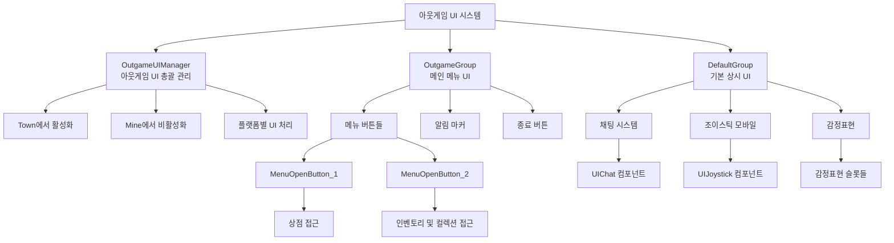

# UI 시스템 - 게임 내 UI - 아웃게임 UI

## 개요
아웃게임 UI는 플레이어가 마을(Town)에 있을 때 표시되는 UI 시스템입니다. 주로 OutgameGroup과 DefaultGroup을 중심으로 구성되며, 메뉴 접근, 채팅, 감정표현, 각종 상점 및 시스템 접근을 위한 인터페이스를 제공합니다. 인게임 UI와는 반대로 Town에서 활성화되고 Mine에서 비활성화됩니다.

## 아웃게임 UI 시스템 구조

### 시스템 아키텍처


## 관련 파일 경로

### UI 그룹 파일들
```
ui/
├── OutgameGroup.ui                     # 메인 아웃게임 UI 그룹
├── DefaultGroup.ui                     # 기본 상시 UI 그룹
├── ShopGroup.ui                        # 상점 관련 UI 그룹
├── InventoryGroup.ui                   # 인벤토리 UI 그룹
├── CollectionGroup.ui                  # 컬렉션 UI 그룹
├── EquipShopGroup.ui                   # 장비 상점 UI 그룹
├── GemShopGroup.ui                     # 젬 상점 UI 그룹
├── PetShopGroup.ui                     # 펫 상점 UI 그룹
├── ConstructionGroup.ui                # 건설 UI 그룹
├── AchievementGroup.ui                 # 업적 UI 그룹
├── TitleStorageGroup.ui                # 칭호 저장소 UI 그룹
├── TeleportGroup.ui                    # 텔레포트 UI 그룹
└── HelpGuideGroup.ui                   # 도움말 가이드 UI 그룹
```

### UI 관리 컴포넌트
```
RootDesk/MyDesk/Components/UI/
├── OutgameUIManager.mlua               # 아웃게임 UI 총괄 관리자
├── OutgameUIManager.codeblock          # 아웃게임 UI 관리 비주얼
├── ButtonUIOpen.mlua                   # UI 열기 버튼 컴포넌트
├── ButtonUIOpen.codeblock              # UI 열기 버튼 비주얼
├── ExitButton.mlua                     # 종료 버튼 컴포넌트
├── ExitButton.codeblock                # 종료 버튼 비주얼
├── UIButtonSound.mlua                  # UI 버튼 사운드
├── UIButtonSound.codeblock             # UI 버튼 사운드 비주얼
├── UIHelpGuide.mlua                    # 도움말 가이드 시스템
├── UIHelpGuide.codeblock               # 도움말 가이드 비주얼
├── UIGuideNavigatorButton.mlua         # 가이드 내비게이션 버튼
└── UIGuideNavigatorButton.codeblock    # 가이드 내비게이션 비주얼
```

### 개별 UI 시스템 컴포넌트
```
RootDesk/MyDesk/Components/Player/
├── PlayerData.mlua                     # 플레이어 기본 데이터 (메뉴 정보 연동)
├── Inventory/                          # 인벤토리 관련 컴포넌트들
├── Collection/                         # 컬렉션 관련 컴포넌트들
├── Equipment/                          # 장비 관련 컴포넌트들
├── Pet/                               # 펫 관련 컴포넌트들
└── Construction/                       # 건설 관련 컴포넌트들
```

## OutgameUIManager - 아웃게임 UI 총괄 관리

### 핵심 기능 및 데이터 구조
```lua
@Component
script OutgameUIManager extends Component

    property boolean AutoEnableOnOutgame = false    -- 아웃게임에서 자동 활성화 여부
```

### 맵별 UI 활성화 관리
```lua
@EventSender("LocalPlayer")
handler HandleLocalPlayerMapEnterEvent(LocalPlayerMapEnterEvent event)
    local EnteredMapType = event.EnteredMapType
    
    if EnteredMapType == "Mine" then
        -- 광산 진입: 아웃게임 UI 비활성화
        self.Entity.Enable = false
        
    elseif EnteredMapType == "Town" and self.AutoEnableOnOutgame == true then
        -- 마을 진입: 아웃게임 UI 활성화
        self.Entity.Enable = true
        
        -- 플랫폼별 UI 처리
        if (tostring(self.Entity.UITransformComponent.ActivePlatform) == "Mobile" and 
            Environment:IsMobilePlatform() == false) or
           (tostring(self.Entity.UITransformComponent.ActivePlatform) == "PC" and 
            Environment:IsPCPlatform() == false) then
            self.Entity.Enable = false
        else
            self.Entity.Enable = true
        end
    end
end
```

## OutgameGroup - 메인 메뉴 UI

### UI 구성 요소

#### 1. 종료 버튼
```json
{
  "path": "/ui/OutgameGroup/ExitButton_back",
  "components": ["ButtonComponent", "OutgameUIManager"],
  "description": "게임 종료 또는 메뉴 닫기 버튼"
}
```

#### 2. 메뉴 열기 버튼 1
```json
{
  "path": "/ui/OutgameGroup/MenuOpenButton_1",
  "components": ["ButtonComponent", "ButtonUIOpen", "OutgameUIManager", "UIButtonSound"],
  "children": [
    {
      "path": "/ui/OutgameGroup/MenuOpenButton_1/icon_menu",
      "components": ["SpriteGUIRenderer"],
      "description": "메뉴 아이콘"
    },
    {
      "path": "/ui/OutgameGroup/MenuOpenButton_1/AlarmMarker",
      "components": ["SpriteGUIRenderer"],
      "description": "알림 마커 (새로운 콘텐츠 알림)"
    }
  ]
}
```

#### 3. 메뉴 열기 버튼 2
```json
{
  "path": "/ui/OutgameGroup/MenuOpenButton_2",
  "components": ["ButtonComponent", "ButtonUIOpen", "OutgameUIManager", "UIButtonSound"],
  "children": [
    {
      "path": "/ui/OutgameGroup/MenuOpenButton_2/icon_menu",
      "components": ["SpriteGUIRenderer"],
      "description": "다른 메뉴 카테고리 아이콘"
    }
  ]
}
```

### 메뉴 버튼 기능
```lua
-- ButtonUIOpen.mlua에서 UI 열기 처리
@Component
script ButtonUIOpen extends Component

    property Entity targetUI = nil    -- 열려는 대상 UI

    @EventSender("Self")
    handler HandleButtonClickEvent(ButtonClickEvent event)
        if self.targetUI ~= nil then
            -- 대상 UI 활성화
            self.targetUI.Enable = true
        end
    end
```

### 알림 마커 시스템
```lua
-- 알림 마커 표시/숨김 관리
method void UpdateAlarmMarker(string markerType, boolean isVisible)
    local alarmMarker = _EntityService:GetEntityByPath("/ui/OutgameGroup/MenuOpenButton_1/AlarmMarker")
    
    if markerType == "quest" then
        -- 업적/퀘스트 관련 알림
        alarmMarker.Enable = isVisible
        if isVisible then
            alarmMarker.SpriteGUIRendererComponent.Color = Color.red
        end
    elseif markerType == "shop" then
        -- 상점 관련 알림 (새 아이템 등)
        alarmMarker.Enable = isVisible
        if isVisible then
            alarmMarker.SpriteGUIRendererComponent.Color = Color.yellow
        end
    elseif markerType == "collection" then
        -- 컬렉션 관련 알림
        alarmMarker.Enable = isVisible
        if isVisible then
            alarmMarker.SpriteGUIRendererComponent.Color = Color.blue
        end
    end
end
```

## DefaultGroup - 기본 상시 UI

### UI 구성 요소

#### 1. 채팅 시스템 (UIChat)
```json
{
  "path": "/ui/DefaultGroup/UIChat",
  "components": ["ChatComponent"],
  "description": "멀티플레이어 채팅 시스템"
}
```

```lua
-- 채팅 시스템 관리
method void InitializeChatSystem()
    local chatComponent = _EntityService:GetEntityByPath("/ui/DefaultGroup/UIChat").ChatComponent
    
    -- 채팅 설정
    chatComponent.MaxMessageCount = 50  -- 최대 메시지 수
    chatComponent.AutoScroll = true     -- 자동 스크롤
    chatComponent.ShowTimestamp = true  -- 타임스탬프 표시
    
    -- 채팅 필터 설정
    chatComponent:AddMessageFilter("All")      -- 전체 채팅
    chatComponent:AddMessageFilter("System")   -- 시스템 메시지
    chatComponent:AddMessageFilter("Guild")    -- 길드 채팅
end

-- 채팅 메시지 전송
method void SendChatMessage(string message, string channel)
    local chatComponent = _EntityService:GetEntityByPath("/ui/DefaultGroup/UIChat").ChatComponent
    chatComponent:SendMessage(message, channel, _UserService.LocalPlayer.PlayerName)
end
```

#### 2. 조이스틱 (UIJoystick) - 모바일 전용
```json
{
  "path": "/ui/DefaultGroup/UIJoystick",
  "components": ["JoystickComponent"],
  "description": "모바일 가상 조이스틱"
}
```

```lua
-- 조이스틱 시스템 초기화
method void InitializeJoystick()
    local joystick = _EntityService:GetEntityByPath("/ui/DefaultGroup/UIJoystick").JoystickComponent
    
    if Environment:IsMobilePlatform() then
        joystick.Enable = true
        
        -- 조이스틱 설정
        joystick.MovementRange = 100        -- 이동 범위
        joystick.ReturnToCenter = true      -- 중앙으로 자동 복귀
        joystick.Sensitivity = 1.5          -- 감도
        
        -- 조이스틱 이벤트 처리
        joystick.OnValueChanged:Connect(self.OnJoystickValueChanged)
    else
        joystick.Enable = false
    end
end

method void OnJoystickValueChanged(Vector2 joystickValue)
    -- 플레이어 이동 처리
    local player = _UserService.LocalPlayer
    local moveDirection = Vector3(joystickValue.x, 0, joystickValue.y)
    
    player.PlayerMovement:SetMoveDirection(moveDirection)
end
```

#### 3. 감정표현 시스템 (Emoticon)
```json
{
  "path": "/ui/DefaultGroup/Emoticon",
  "components": ["ScrollLayoutGroupComponent"],
  "children": [
    {
      "path": "/ui/DefaultGroup/Emoticon/Slot",
      "components": ["ButtonComponent", "EmoticonPlayButton"],
      "children": [
        {
          "path": "/ui/DefaultGroup/Emoticon/Slot/icon_emoticon",
          "components": ["SpriteGUIRenderer"]
        },
        {
          "path": "/ui/DefaultGroup/Emoticon/Slot/Thumbnail",
          "components": ["SpriteGUIRenderer"]
        }
      ]
    }
  ]
}
```

```lua
-- 감정표현 시스템 초기화
method void InitializeEmoticonSystem()
    local emoticonPanel = _EntityService:GetEntityByPath("/ui/DefaultGroup/Emoticon")
    local emoticonSlot = _EntityService:GetEntityByPath("/ui/DefaultGroup/Emoticon/Slot")
    
    -- 플레이어가 보유한 감정표현 로드
    local playerEmoticons = _UserService.LocalPlayer.PlayerEmoticon
    local emoticonTable = _DataService:GetTable("Emoticon")
    
    -- 보유한 감정표현들에 대해 슬롯 생성
    for i=1, emoticonTable:GetRowCount() do
        if playerEmoticons.haveEmoticon[i] == true then
            local newSlot = emoticonSlot:Clone("EmoticonSlot_"..i)
            
            -- 감정표현 아이콘 설정
            local iconRUID = emoticonTable:GetCell(i, "IconRUID")
            newSlot:GetChildByName("icon_emoticon").SpriteGUIRendererComponent.ImageRUID = iconRUID
            newSlot:GetChildByName("Thumbnail").SpriteGUIRendererComponent.ImageRUID = iconRUID
            
            -- 클릭 이벤트 설정
            newSlot.EmoticonPlayButton.emoticonIndex = i
        end
    end
end

-- EmoticonPlayButton.mlua에서 감정표현 재생
@Component
script EmoticonPlayButton extends Component

    property number emoticonIndex = 0

    @EventSender("Self")
    handler HandleButtonClickEvent(ButtonClickEvent event)
        if self.emoticonIndex > 0 then
            -- 플레이어 위에 감정표현 표시
            _UserService.LocalPlayer.PlayerEmoticon:PlayEmoticon(self.emoticonIndex)
        end
    end
```

## UI 네비게이션 시스템

### 메뉴 계층 구조
```lua
-- 메뉴 시스템 계층 정의
local menuHierarchy = {
    ["MainMenu"] = {
        ["상점"] = {
            ["장비상점"] = "EquipShopGroup",
            ["젬상점"] = "GemShopGroup", 
            ["펫상점"] = "PetShopGroup"
        },
        ["관리"] = {
            ["인벤토리"] = "InventoryGroup",
            ["컬렉션"] = "CollectionGroup",
            ["칭호"] = "TitleStorageGroup"
        },
        ["시스템"] = {
            ["건설"] = "ConstructionGroup",
            ["업적"] = "AchievementGroup",
            ["텔레포트"] = "TeleportGroup"
        }
    }
}

-- 메뉴 네비게이션
method void NavigateToMenu(string menuPath)
    local pathParts = string.split(menuPath, "/")
    local targetUIGroup = self:ResolveMenuPath(pathParts)
    
    if targetUIGroup then
        -- 기존 열린 UI들 닫기
        self:CloseAllMenuUIs()
        
        -- 대상 UI 열기
        local targetUI = _EntityService:GetEntityByPath("/ui/"..targetUIGroup)
        targetUI.Enable = true
        
        -- 뒤로가기 스택에 추가
        self:PushToNavigationStack(targetUIGroup)
    end
end
```

### 뒤로가기 시스템
```lua
-- UI 네비게이션 스택 관리
property table navigationStack = {}

method void PushToNavigationStack(string uiGroup)
    table.insert(self.navigationStack, uiGroup)
end

method void GoBack()
    if #self.navigationStack > 1 then
        -- 현재 UI 제거
        table.remove(self.navigationStack)
        
        -- 이전 UI로 돌아가기
        local previousUI = self.navigationStack[#self.navigationStack]
        self:NavigateToMenu(previousUI)
    else
        -- 스택이 비었으면 메인 메뉴로
        self:CloseAllMenuUIs()
    end
end

method void CloseAllMenuUIs()
    local menuUIGroups = {
        "EquipShopGroup", "GemShopGroup", "PetShopGroup",
        "InventoryGroup", "CollectionGroup", "TitleStorageGroup",
        "ConstructionGroup", "AchievementGroup", "TeleportGroup"
    }
    
    for _, uiGroup in ipairs(menuUIGroups) do
        local ui = _EntityService:GetEntityByPath("/ui/"..uiGroup)
        ui.Enable = false
    end
    
    -- 네비게이션 스택 초기화
    self.navigationStack = {}
end
```

## 도움말 가이드 시스템

### 가이드 표시 및 내비게이션
```lua
-- UIHelpGuide.mlua에서 도움말 시스템 관리
@Component
script UIHelpGuide extends Component

    property table guidePages = {}      -- 가이드 페이지들
    property number currentPage = 1     -- 현재 페이지

    method void InitializeGuideSystem()
        -- 가이드 페이지 데이터 로드
        local guideTable = _DataService:GetTable("HelpGuide")
        
        for i=1, guideTable:GetRowCount() do
            local pageData = {
                title = _LocalizationService:GetText(guideTable:GetCell(i, "Title")),
                content = _LocalizationService:GetText(guideTable:GetCell(i, "Content")),
                imageRUID = guideTable:GetCell(i, "ImageRUID")
            }
            table.insert(self.guidePages, pageData)
        end
    end
    
    method void ShowGuidePage(number pageIndex)
        if pageIndex < 1 or pageIndex > #self.guidePages then
            return
        end
        
        self.currentPage = pageIndex
        local pageData = self.guidePages[pageIndex]
        
        -- 가이드 UI 업데이트
        local guideUI = _EntityService:GetEntityByPath("/ui/HelpGuideGroup/HelpGuide")
        guideUI:GetChildByName("Title").TextComponent.Text = pageData.title
        guideUI:GetChildByName("Content").TextComponent.Text = pageData.content
        guideUI:GetChildByName("Image").SpriteGUIRendererComponent.ImageRUID = pageData.imageRUID
        
        -- 네비게이션 버튼 상태 업데이트
        self:UpdateNavigationButtons()
    end
    
    method void UpdateNavigationButtons()
        local prevButton = _EntityService:GetEntityByPath("/ui/HelpGuideGroup/HelpGuide/PrevButton")
        local nextButton = _EntityService:GetEntityByPath("/ui/HelpGuideGroup/HelpGuide/NextButton")
        local pageInfo = _EntityService:GetEntityByPath("/ui/HelpGuideGroup/HelpGuide/PageInfo")
        
        -- 이전/다음 버튼 활성화 상태
        prevButton.ButtonComponent.Enable = (self.currentPage > 1)
        nextButton.ButtonComponent.Enable = (self.currentPage < #self.guidePages)
        
        -- 페이지 정보 표시
        pageInfo.TextComponent.Text = string.format("%d / %d", self.currentPage, #self.guidePages)
    end
```

## 플랫폼별 UI 적응

### 모바일 최적화
```lua
method void OptimizeForMobile()
    if Environment:IsMobilePlatform() then
        -- 조이스틱 활성화
        local joystick = _EntityService:GetEntityByPath("/ui/DefaultGroup/UIJoystick")
        joystick.Enable = true
        
        -- 버튼 크기 확대
        local menuButtons = {
            "/ui/OutgameGroup/MenuOpenButton_1",
            "/ui/OutgameGroup/MenuOpenButton_2"
        }
        
        for _, buttonPath in ipairs(menuButtons) do
            local button = _EntityService:GetEntityByPath(buttonPath)
            button.UITransformComponent.LocalScale = Vector3(1.2, 1.2, 1)
        end
        
        -- 감정표현 UI 크기 조정
        local emoticonPanel = _EntityService:GetEntityByPath("/ui/DefaultGroup/Emoticon")
        emoticonPanel.UITransformComponent.LocalScale = Vector3(1.1, 1.1, 1)
    else
        -- PC에서는 조이스틱 비활성화
        local joystick = _EntityService:GetEntityByPath("/ui/DefaultGroup/UIJoystick")
        joystick.Enable = false
    end
end
```

### 해상도별 UI 조정
```lua
method void AdjustUIForResolution()
    local screenWidth = Screen.width
    local screenHeight = Screen.height
    
    -- UI 앵커 조정
    local menuButton1 = _EntityService:GetEntityByPath("/ui/OutgameGroup/MenuOpenButton_1")
    local menuButton2 = _EntityService:GetEntityByPath("/ui/OutgameGroup/MenuOpenButton_2")
    
    if screenWidth > 1920 then
        -- 고해상도에서 UI 위치 조정
        menuButton1.UITransformComponent.AnchoredPosition = Vector2(-100, -100)
        menuButton2.UITransformComponent.AnchoredPosition = Vector2(-200, -100)
    else
        -- 표준 해상도 위치
        menuButton1.UITransformComponent.AnchoredPosition = Vector2(-80, -80)
        menuButton2.UITransformComponent.AnchoredPosition = Vector2(-160, -80)
    end
end
```

## 접근성 및 사용성 기능

### 키보드 단축키
```lua
-- 키보드 단축키 시스템
method void HandleKeyboardInput()
    if Input:GetKeyDown(KeyCode.I) then
        -- I키로 인벤토리 열기
        self:NavigateToMenu("관리/인벤토리")
    elseif Input:GetKeyDown(KeyCode.C) then
        -- C키로 컬렉션 열기
        self:NavigateToMenu("관리/컬렉션")
    elseif Input:GetKeyDown(KeyCode.B) then
        -- B키로 건설 메뉴 열기
        self:NavigateToMenu("시스템/건설")
    elseif Input:GetKeyDown(KeyCode.Escape) then
        -- ESC키로 뒤로가기 또는 메뉴 닫기
        self:GoBack()
    end
end
```

### 툴팁 시스템
```lua
-- UI 요소별 툴팁 표시
@Component
script UITooltip extends Component

    property string tooltipText = ""
    property Entity tooltipPanel = nil

    method void OnMouseEnter()
        if self.tooltipText ~= "" then
            self:ShowTooltip()
        end
    end
    
    method void OnMouseExit()
        self:HideTooltip()
    end
    
    method void ShowTooltip()
        if self.tooltipPanel == nil then
            self.tooltipPanel = _EntityService:GetEntityByPath("/ui/TooltipPanel")
        end
        
        self.tooltipPanel.Enable = true
        self.tooltipPanel:GetChildByName("Text").TextComponent.Text = 
            _LocalizationService:GetText(self.tooltipText)
        
        -- 마우스 위치에 툴팁 표시
        local mousePos = Input.mousePosition
        self.tooltipPanel.UITransformComponent.Position = 
            Vector3(mousePos.x + 10, mousePos.y + 10, 0)
    end
    
    method void HideTooltip()
        if self.tooltipPanel ~= nil then
            self.tooltipPanel.Enable = false
        end
    end
```

## 성능 최적화

### UI 가시성 관리
```lua
-- 화면 밖 UI 요소 비활성화
method void UpdateUIVisibility()
    local activeUIGroups = self:GetActiveUIGroups()
    
    for uiGroupName, uiGroup in pairs(allUIGroups) do
        if not table.contains(activeUIGroups, uiGroupName) then
            -- 비활성 UI 그룹은 완전히 비활성화
            uiGroup.Enable = false
        end
    end
end

-- UI 애니메이션 최적화
method void OptimizeAnimations()
    local frameRate = Application.targetFrameRate
    
    if frameRate < 30 then
        -- 낮은 프레임레이트에서는 애니메이션 단순화
        self:SimplifyAnimations()
    end
end
```

### 메모리 관리
```lua
-- 사용하지 않는 UI 리소스 해제
method void CleanupUnusedResources()
    -- 장시간 사용하지 않은 UI 그룹 언로드
    for uiGroupName, lastUsedTime in pairs(uiUsageTracker) do
        if (_TimeService:GetTime() - lastUsedTime) > 300 then  -- 5분
            local uiGroup = _EntityService:GetEntityByPath("/ui/"..uiGroupName)
            uiGroup:UnloadResources()
        end
    end
end
```

## 일반적인 문제 해결

### UI가 표시되지 않는 경우
1. `OutgameUIManager`의 활성화 상태 확인
2. 맵 타입이 "Town"인지 확인
3. `AutoEnableOnOutgame` 설정 점검

### 버튼이 작동하지 않는 경우
1. `ButtonUIOpen.targetUI` 설정 확인
2. 대상 UI의 Enable 상태 점검
3. 버튼 컴포넌트 활성화 상태 확인

### 플랫폼별 UI 문제
1. `UITransformComponent.ActivePlatform` 설정 확인
2. 조이스틱 활성화 조건 점검
3. 해상도별 UI 스케일링 적용 확인
