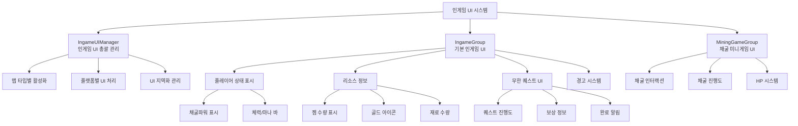

# UI 시스템 - 게임 내 UI - 인게임 UI

## 개요
인게임 UI는 플레이어가 광산에서 게임을 플레이하는 동안 화면에 표시되는 모든 UI 요소들을 관리합니다. IngameGroup과 MiningGameGroup을 중심으로 구성되며, 플레이어의 상태 정보, 채굴 진행도, 리소스 현황, 무한 퀘스트 등 핵심 게임플레이 정보를 실시간으로 표시합니다.

## 인게임 UI 시스템 구조

### 시스템 아키텍처


## 관련 파일 경로

### UI 그룹 파일들
```
ui/
├── IngameGroup.ui                      # 기본 인게임 UI 그룹
├── MiningGameGroup.ui                  # 채굴 미니게임 UI 그룹
├── StatusGroup.ui                      # 플레이어 상태 UI 그룹
└── ToastGroup.ui                       # 알림 메시지 UI 그룹
```

### UI 관리 컴포넌트
```
RootDesk/MyDesk/Components/UI/
├── IngameUIManager.mlua                # 인게임 UI 총괄 관리자
├── IngameUIManager.codeblock           # 인게임 UI 관리 비주얼
├── OutgameUIManager.mlua               # 아웃게임 UI 관리자 (대조용)
├── OutgameUIManager.codeblock          # 아웃게임 UI 관리 비주얼
├── LoadingManager.mlua                 # 로딩 화면 관리
├── LoadingManager.codeblock            # 로딩 화면 비주얼
├── UIButtonSound.mlua                  # UI 버튼 사운드
├── UIButtonSound.codeblock             # UI 버튼 사운드 비주얼
├── UIFlickering.mlua                   # UI 깜박임 효과
├── UIFlickering.codeblock              # UI 깜박임 비주얼
└── WarningFlickeringUI.mlua            # 경고 UI 깜박임
```

### 게임 메커니즘 연동 컴포넌트
```
RootDesk/MyDesk/Components/
├── Mine/
│   └── MiningGame.mlua                 # 채굴 미니게임 로직
└── Player/
    ├── InfiniteQuest/
    │   └── PlayerInfiniteQuest.mlua    # 무한 퀘스트 UI 연동
    └── Inventory/
        └── PlayerStorage.mlua          # 리소스 UI 업데이트
```

## IngameUIManager - 인게임 UI 총괄 관리

### 핵심 기능 및 데이터 구조
```lua
@Component
script IngameUIManager extends Component

    property boolean AutoEnableOnMine = false    -- 광산 진입 시 자동 활성화 여부
```

### 맵별 UI 활성화 관리
```lua
@EventSender("LocalPlayer")
handler HandleLocalPlayerMapEnterEvent(LocalPlayerMapEnterEvent event)
    local EnteredMapType = event.EnteredMapType
    
    if EnteredMapType == "Town" then
        -- 마을 진입: 인게임 UI 비활성화
        self.Entity.Enable = false
        
    elseif EnteredMapType == "Mine" and self.AutoEnableOnMine == true then
        -- 광산 진입: 인게임 UI 활성화
        self.Entity.Enable = true
        
        -- 플랫폼별 UI 처리
        if (tostring(self.Entity.UITransformComponent.ActivePlatform) == "Mobile" and 
            Environment:IsMobilePlatform() == false) or
           (tostring(self.Entity.UITransformComponent.ActivePlatform) == "PC" and 
            Environment:IsPCPlatform() == false) then
            self.Entity.Enable = false
        else
            self.Entity.Enable = true
        end
    end
end
```

### UI 지역화 시스템
```lua
@ExecSpace("ClientOnly")
method void OnBeginPlay()
    -- IngameGroup 하위의 모든 텍스트 요소 자동 지역화
    local localizingTable = _DataService:GetTable("LocalizationTable")
    local keys = localizingTable:GetColumn(1)
    
    for i=1, #keys do
        if string.sub(keys[i], 1, 16) == "/ui/IngameGroup/" then
            local path = keys[i]
            local TextCompo = _EntityService:GetEntityByPath(path).TextComponent
            if TextCompo ~= nil then
                TextCompo.Text = _LocalizationService:GetText(path)
            end
        end
    end
end
```

## IngameGroup - 기본 인게임 UI

### UI 구성 요소

#### 1. 경고 시스템
```json
{
  "path": "/ui/IngameGroup/Warning",
  "components": ["UITransform", "SpriteGUIRenderer"],
  "children": [
    {
      "path": "/ui/IngameGroup/Warning/Part",
      "components": ["WarningFlickeringUI"]
    },
    {
      "path": "/ui/IngameGroup/Warning/Desc",
      "components": ["TextComponent"]
    },
    {
      "path": "/ui/IngameGroup/Warning/Desc/icon_warning_1",
      "components": ["SpriteGUIRenderer"]
    }
  ]
}
```

#### 2. 채굴파워 표시
```json
{
  "path": "/ui/IngameGroup/MiningPower",
  "components": ["UITransform", "SpriteGUIRenderer"],
  "children": [
    {
      "path": "/ui/IngameGroup/MiningPower/Num",
      "components": ["TextComponent"],
      "description": "플레이어의 현재 채굴파워 수치 표시"
    }
  ]
}
```

#### 3. 젬 수량 표시
```lua
-- PlayerStorage.mlua에서 젬 UI 업데이트
method void UpdateGemUI()
    local gemUI = _EntityService:GetEntityByPath("/ui/IngameGroup/Gem/Num")
    gemUI.TextComponent.Text = _ThousandsSeparator:ConvertToMetricPrefixString(
        self.currencyItems[2], nil)
end

-- 젬 획득 효과 연출
method void ShowGemEffect()
    local gemIcon = _EntityService:GetEntityByPath("/ui/IngameGroup/direction_gem_icon")
    -- 젬 아이콘 애니메이션 효과
end
```

#### 4. 무한 퀘스트 UI
```lua
-- PlayerInfiniteQuest.mlua에서 무한 퀘스트 UI 관리
method void RefreshInfiniteQuestUI()
    -- 퀘스트 진행도 표시
    local fillAmountTxt = _EntityService:GetEntityByPath("/ui/IngameGroup/InfiniteQuest/QuestGauge/Percent")
    local fillAmountSlider = _EntityService:GetEntityByPath("/ui/IngameGroup/InfiniteQuest/QuestGauge/Bg_QuestGauge/Fill")
    
    -- 보상 수량 표시
    local rewardAmountTxt = _EntityService:GetEntityByPath("/ui/IngameGroup/InfiniteQuest/QuestGauge/ClearButton/txt_pc")
    
    -- 퀘스트 아이콘 업데이트
    local questIcon = _EntityService:GetEntityByPath("/ui/IngameGroup/InfiniteQuest/QuestGauge/Icon_quest")
    
    -- 진행도 계산 및 UI 업데이트
    local progressPercent = (currentProgress / maxProgress) * 100
    fillAmountTxt.TextComponent.Text = string.format("%.1f%%", progressPercent)
    
    -- 슬라이더 바 크기 조정
    local fillWidth = 200 * (currentProgress / maxProgress)
    fillAmountSlider.UITransformComponent.RectSize = Vector2(fillWidth, fillAmountSlider.UITransformComponent.RectSize.y)
end

-- 퀘스트 완료 시 알림 표시
method void ShowQuestCompleteAlert()
    local alertPaper = _EntityService:GetEntityByPath("/ui/IngameGroup/InfiniteQuest/AlertPaper")
    local alertEffect = _EntityService:GetEntityByPath("/ui/IngameGroup/InfiniteQuest/AlertEffect")
    
    alertPaper.Enable = true
    alertEffect.Enable = true
    
    -- 3초 후 자동 숨김
    local hideAlert = function()
        alertPaper.Enable = false
        alertEffect.Enable = false
    end
    _TimerService:SetTimerOnce(hideAlert, 3.0)
end
```

#### 5. 리소스 연출 시스템
```lua
-- 골드 획득 연출
method void ShowGoldEffect()
    local goldIcon = _EntityService:GetEntityByPath("/ui/IngameGroup/direction_gold_icon")
    
    -- 골드 아이콘이 UI로 이동하는 애니메이션
    local startPos = Vector2(goldIcon.UITransformComponent.LocalPosition.x, goldIcon.UITransformComponent.LocalPosition.y)
    local targetPos = Vector2(50, -50)  -- 골드 UI 위치
    
    local animationStep = function(frame)
        local progress = frame / 30.0  -- 0.5초 애니메이션
        local currentPos = Vector2.Lerp(startPos, targetPos, progress)
        goldIcon.UITransformComponent.LocalPosition = currentPos
        
        if frame >= 30 then
            goldIcon.Enable = false  -- 애니메이션 완료 후 숨김
        end
    end
    
    for i=1, 30 do
        _TimerService:SetTimerOnce(function() animationStep(i) end, i/30)
    end
end

-- 유물상자 보상 연출
method void ShowRelicBoxReward()
    local rewardSprite = _EntityService:GetEntityByPath("/ui/IngameGroup/InfiniteQuest/RelicBoxSprite")
    rewardSprite.Enable = true
    
    -- 반짝임 효과
    local clearEffect = _EntityService:GetEntityByPath("/ui/IngameGroup/InfiniteQuest/ClearEffect")
    clearEffect.Enable = true
    
    -- 2초 후 효과 종료
    local endEffect = function()
        rewardSprite.Enable = false
        clearEffect.Enable = false
    end
    _TimerService:SetTimerOnce(endEffect, 2.0)
end
```

## MiningGameGroup - 채굴 미니게임 UI

### UI 구성 요소

#### 1. 채굴 인터랙션 버튼
```json
{
  "path": "/ui/MiningGameGroup/Mining/Button_Interaction",
  "components": ["ButtonComponent"],
  "children": [
    {
      "path": "/ui/MiningGameGroup/Mining/Button_Interaction/UIText",
      "components": ["TextComponent"],
      "description": "인터랙션 안내 텍스트"
    }
  ]
}
```

#### 2. 채굴 상태 메시지
```json
{
  "path": "/ui/MiningGameGroup/Mining/Message",
  "components": ["TextComponent"],
  "description": "채굴 진행 상황 또는 결과 메시지 표시"
}
```

#### 3. HP 시스템 UI
```json
{
  "path": "/ui/MiningGameGroup/Mining/HPBar",
  "components": ["SpriteGUIRenderer"],
  "children": [
    {
      "path": "/ui/MiningGameGroup/Mining/HPBar/Fill_back",
      "components": ["SpriteGUIRenderer"],
      "description": "HP 바 배경"
    },
    {
      "path": "/ui/MiningGameGroup/Mining/HPBar/Fill",
      "components": ["SpriteGUIRenderer"],
      "description": "HP 바 채움 부분"
    }
  ]
}
```

### 채굴 미니게임 로직 연동
```lua
-- MiningGame.mlua에서 UI 업데이트
@Component
script MiningGame extends Component

    method void UpdateMiningUI()
        -- 채굴 진행도 업데이트
        local progressMessage = _EntityService:GetEntityByPath("/ui/MiningGameGroup/Mining/Message")
        progressMessage.TextComponent.Text = "채굴 중..."
        
        -- 인터랙션 버튼 텍스트 업데이트
        local interactionText = _EntityService:GetEntityByPath("/ui/MiningGameGroup/Mining/Button_Interaction/UIText")
        interactionText.TextComponent.Text = _LocalizationService:GetText("MiningAction_Dig")
        
        -- HP 바 업데이트
        self:UpdateHPBar()
    end
    
    method void UpdateHPBar()
        local hpFill = _EntityService:GetEntityByPath("/ui/MiningGameGroup/Mining/HPBar/Fill")
        local hpRatio = currentHP / maxHP
        
        -- HP 바 크기 조정
        hpFill.UITransformComponent.RectSize = Vector2(100 * hpRatio, hpFill.UITransformComponent.RectSize.y)
        
        -- HP에 따른 색상 변화
        if hpRatio > 0.7 then
            hpFill.SpriteGUIRendererComponent.Color = Color.green
        elseif hpRatio > 0.3 then
            hpFill.SpriteGUIRendererComponent.Color = Color.yellow
        else
            hpFill.SpriteGUIRendererComponent.Color = Color.red
        end
    end
    
    method void OnMiningComplete()
        -- 채굴 완료 메시지
        local progressMessage = _EntityService:GetEntityByPath("/ui/MiningGameGroup/Mining/Message")
        progressMessage.TextComponent.Text = "채굴 완료!"
        
        -- 인터랙션 버튼 비활성화
        local interactionButton = _EntityService:GetEntityByPath("/ui/MiningGameGroup/Mining/Button_Interaction")
        interactionButton.ButtonComponent.Enable = false
        
        -- 2초 후 UI 초기화
        local resetUI = function()
            self:ResetMiningUI()
        end
        _TimerService:SetTimerOnce(resetUI, 2.0)
    end
```

## 플랫폼별 UI 시스템

### PC/모바일 대응
```lua
method void CheckPlatformCompatibility()
    local uiTransform = self.Entity.UITransformComponent
    local activePlatform = tostring(uiTransform.ActivePlatform)
    
    if activePlatform == "Mobile" and Environment:IsMobilePlatform() == false then
        -- 모바일 UI지만 PC에서 실행 중: 비활성화
        self.Entity.Enable = false
    elseif activePlatform == "PC" and Environment:IsPCPlatform() == false then
        -- PC UI지만 모바일에서 실행 중: 비활성화
        self.Entity.Enable = false
    else
        -- 플랫폼 일치: 활성화
        self.Entity.Enable = true
    end
end
```

### 해상도별 UI 조정
```lua
method void AdjustUIForResolution()
    local screenWidth = Screen.width
    local screenHeight = Screen.height
    local aspectRatio = screenWidth / screenHeight
    
    -- UI 스케일 조정
    local uiScale = 1.0
    if aspectRatio > 2.0 then
        uiScale = 0.8  -- 와이드 스크린에서 UI 축소
    elseif aspectRatio < 1.5 then
        uiScale = 1.2  -- 정사각형에 가까운 화면에서 UI 확대
    end
    
    self.Entity.UITransformComponent.LocalScale = Vector3(uiScale, uiScale, 1)
end
```

## UI 효과 시스템

### 깜박임 효과 (UIFlickering)
```lua
@Component
script UIFlickering extends Component

    property number flickerSpeed = 1.0      -- 깜박임 속도
    property number minAlpha = 0.3           -- 최소 투명도
    property number maxAlpha = 1.0           -- 최대 투명도

    method void OnUpdate(number delta)
        local time = _TimeService:GetTime()
        local alpha = Mathf.Lerp(self.minAlpha, self.maxAlpha, 
            (Mathf.Sin(time * self.flickerSpeed) + 1) / 2)
        
        self.Entity.SpriteGUIRendererComponent.Color.a = alpha
    end
```

### 경고 UI 깜박임 (WarningFlickeringUI)
```lua
@Component
script WarningFlickeringUI extends Component

    method void StartWarningFlicker()
        local warningIcon = self.Entity
        
        -- 빠른 깜박임으로 주의 끌기
        local flickerStep = function(frame)
            local alpha = (frame % 20 < 10) and 1.0 or 0.3
            warningIcon.SpriteGUIRendererComponent.Color.a = alpha
        end
        
        for i=1, 120 do  -- 2초간 깜박임
            _TimerService:SetTimerOnce(function() flickerStep(i) end, i/60)
        end
    end
```

### 무지개 효과 (RainbowText)
```lua
@Component
script RainbowText extends Component

    method void OnUpdate(number delta)
        local time = _TimeService:GetTime()
        local hue = (time * 0.5) % 1.0  -- 0.5초마다 색상 사이클
        
        local color = Color.HSVToRGB(hue, 1.0, 1.0)
        self.Entity.TextComponent.FontColor = color
    end
```

## 성능 최적화

### UI 업데이트 주기 관리
```lua
-- 필요시에만 UI 업데이트
property boolean needsRefresh = false
property number lastUpdateTime = 0

method void OnUpdate(number delta)
    local currentTime = _TimeService:GetTime()
    
    if self.needsRefresh and (currentTime - self.lastUpdateTime) > 0.1 then  -- 10FPS로 제한
        self:RefreshUI()
        self.needsRefresh = false
        self.lastUpdateTime = currentTime
    end
end

method void RequestRefresh()
    self.needsRefresh = true
end
```

### UI 요소 풀링
```lua
-- UI 요소 재사용을 위한 풀링 시스템
local uiElementPool = {}

method Entity GetPooledUIElement(string elementType)
    if uiElementPool[elementType] == nil then
        uiElementPool[elementType] = {}
    end
    
    local pool = uiElementPool[elementType]
    if #pool > 0 then
        return table.remove(pool)
    else
        return self:CreateNewUIElement(elementType)
    end
end

method void ReturnToPool(Entity element, string elementType)
    element.Enable = false
    table.insert(uiElementPool[elementType], element)
end
```

## 확장 가능성

### 커스텀 UI 컴포넌트 시스템
```lua
-- 재사용 가능한 UI 컴포넌트 생성
@Component
script CustomProgressBar extends Component

    property number currentValue = 0
    property number maxValue = 100
    property Color fillColor = Color.blue

    method void SetValue(number value)
        self.currentValue = Mathf.Clamp(value, 0, self.maxValue)
        self:UpdateBar()
    end
    
    method void UpdateBar()
        local fillRatio = self.currentValue / self.maxValue
        local fillBar = self.Entity:GetChildByName("Fill")
        
        fillBar.UITransformComponent.RectSize = 
            Vector2(200 * fillRatio, fillBar.UITransformComponent.RectSize.y)
        fillBar.SpriteGUIRendererComponent.Color = self.fillColor
    end
```

### 동적 UI 생성
```lua
-- 런타임에 UI 요소 동적 생성
method Entity CreateDynamicUI(string uiType, Vector2 position)
    local newUI = _EntityService:CreateEntity(uiType)
    newUI.Parent = self.Entity
    newUI.UITransformComponent.LocalPosition = position
    
    return newUI
end
```

## 일반적인 문제 해결

### UI가 표시되지 않는 경우
1. `IngameUIManager`의 활성화 상태 확인
2. 맵 타입별 UI 활성화 로직 점검
3. 플랫폼별 UI 호환성 확인

### UI 업데이트가 지연되는 경우
1. UI 업데이트 호출 주기 확인
2. `needsRefresh` 플래그 상태 점검
3. UI 요소 참조 경로 검증

### 플랫폼별 UI 문제
1. `UITransformComponent.ActivePlatform` 설정 확인
2. 해상도별 UI 스케일링 적용
3. 입력 시스템 호환성 점검
