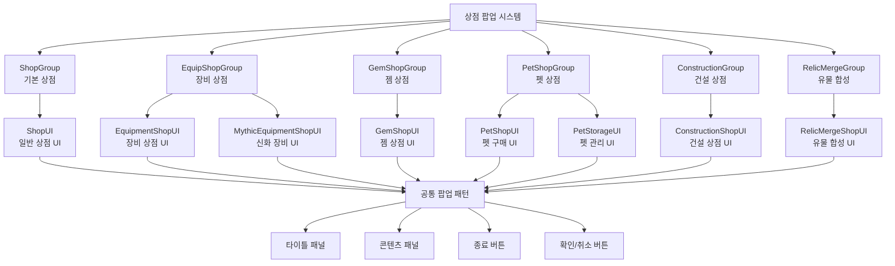

# UI 시스템 - 팝업 시스템 - 상점 팝업

## 개요
상점 팝업 시스템은 다양한 상점 UI들을 통합 관리하는 팝업 기반 인터페이스 시스템입니다. ShopGroup, EquipShopGroup, GemShopGroup, PetShopGroup, ConstructionGroup 등 각 상점별로 특화된 UI 그룹을 제공하며, 공통된 팝업 패턴과 상호작용을 통해 일관된 사용자 경험을 제공합니다.

## 상점 팝업 시스템 구조

### 시스템 아키텍처


## 관련 파일 경로

### 상점 UI 그룹 파일들
```
ui/
├── ShopGroup.ui                        # 기본 상점 UI 그룹
├── EquipShopGroup.ui                   # 장비 상점 UI 그룹  
├── GemShopGroup.ui                     # 젬 상점 UI 그룹
├── PetShopGroup.ui                     # 펫 상점 UI 그룹
├── ConstructionGroup.ui                # 건설 상점 UI 그룹
├── RelicMergeGroup.ui                  # 유물 합성 UI 그룹
├── PopupGroup.ui                       # 공통 팝업 UI 그룹
└── ToastGroup.ui                       # 알림 메시지 UI 그룹
```

### 상점별 컴포넌트 구조
```
RootDesk/MyDesk/Components/Town/
├── EquipmentShop/                      # 장비 상점 관련 컴포넌트들
│   ├── EquipmentShopUI.mlua           # 장비 상점 메인 UI
│   ├── EquipmentShopSlotButton.mlua   # 장비 슬롯 버튼
│   ├── EquipmentShopBundleSlotButton.mlua # 번들 구매 버튼
│   └── MythicEquipmentShopUI.mlua     # 신화 장비 상점
├── GemShop/                           # 젬 상점 관련 컴포넌트들
│   ├── GemShopUI.mlua                 # 젬 상점 메인 UI
│   ├── GemShopLogic.mlua              # 젬 구매 로직
│   └── GemShopUI_SlotButton.mlua      # 젬 상점 슬롯 버튼
├── RelicMergeShop/                    # 유물 합성 관련 컴포넌트들
│   ├── RelicMergeShopUI.mlua          # 유물 합성 UI
│   ├── RelicMergeShopUI_MaterialButton.mlua # 재료 선택 버튼
│   └── RelicMergeShopUI_MaterialSlotButton.mlua # 재료 슬롯 버튼
└── NPCInteraction.mlua                # NPC 상호작용 (상점 열기)
```

### 플레이어 관련 상점 컴포넌트들
```
RootDesk/MyDesk/Components/Player/
├── Pet/                               # 펫 상점 관련
│   ├── PetShopUI.mlua                # 펫 구매 UI
│   └── PetStorageUI.mlua             # 펫 보관함 UI
├── Construction/                      # 건설 상점 관련
│   ├── ConstructionShopUI.mlua       # 건설 상점 UI
│   ├── ConstructionShopUI_BuyButton.mlua # 구매 버튼
│   └── ConstructionShopUI_UnlockButton.mlua # 해금 버튼
└── VoidItem/                         # 공허 아이템 상점
    └── VoidItemShopUI.mlua           # 공허 아이템 상점 UI
```

## 공통 팝업 패턴

### 표준 팝업 구조
모든 상점 팝업은 다음과 같은 공통 구조를 따릅니다:

```json
{
  "상점그룹": {
    "path": "/ui/{ShopType}Group",
    "components": ["UIGroupComponent", "CanvasGroupComponent"],
    "children": {
      "상점메인": {
        "path": "/ui/{ShopType}Group/{ShopName}",
        "components": ["SpriteGUIRenderer", "{ShopType}UI", "OutgameUIManager"],
        "children": {
          "패널": {
            "path": "/ui/{ShopType}Group/{ShopName}/Panel",
            "children": {
              "타이틀패널": {
                "path": "/ui/{ShopType}Group/{ShopName}/Panel/TitlePanel",
                "children": {
                  "타이틀": "상점 이름 텍스트",
                  "종료버튼": "ExitButton 컴포넌트"
                }
              },
              "콘텐츠패널": "상점별 고유 콘텐츠"
            }
          }
        }
      }
    }
  }
}
```

### 공통 UI 컴포넌트들

#### 1. ExitButton - 종료 버튼
```lua
@Component
script ExitButton extends Component

    @EventSender("Self")
    handler HandleButtonClickEvent(ButtonClickEvent event)
        -- 현재 팝업 닫기
        self.Entity.Parent.Parent.Parent.Enable = false
        
        -- 사운드 재생
        _SoundService:PlaySound("ui_close_sound", 0.5)
    end
```

#### 2. UIButtonSound - 버튼 사운드
```lua
@Component  
script UIButtonSound extends Component

    property string soundRUID = "ui_button_click"
    property number volume = 0.8

    @EventSender("Self")
    handler HandleButtonClickEvent(ButtonClickEvent event)
        _SoundService:PlaySound(self.soundRUID, self.volume)
    end
```

#### 3. OutgameUIManager - 아웃게임 UI 관리
모든 상점 UI는 `OutgameUIManager` 컴포넌트를 포함하여 Town에서만 활성화됩니다.

## 상점별 팝업 상세 분석

### 1. ShopGroup - 기본 상점
```json
{
  "경로": "/ui/ShopGroup/Shop",
  "주요컴포넌트": ["ShopUI", "OutgameUIManager"],
  "주요기능": [
    "기본 아이템 구매/판매",
    "재료 아이템 거래",
    "소모품 구매"
  ]
}
```

#### ShopUI 기본 구조
```lua
@Component
script ShopUI extends Component

    property number currentCategory = 1  -- 현재 카테고리
    property table itemList = {}         -- 상품 목록

    method void RefreshShopUI()
        -- 상품 목록 새로고침
        local itemTable = _DataService:GetTable("ShopItems")
        local playerMoney = _UserService.LocalPlayer.PlayerData.Money
        
        -- 플레이어 보유 골드 표시
        local moneyUI = _EntityService:GetEntityByPath("/ui/ShopGroup/Shop/Panel/MoneyPanel/Amount")
        moneyUI.TextComponent.Text = _ThousandsSeparator:ConvertToMetricPrefixString(playerMoney)
        
        -- 카테고리별 상품 표시
        self:DisplayItemsByCategory(self.currentCategory)
    end

    method void DisplayItemsByCategory(number category)
        local listPanel = _EntityService:GetEntityByPath("/ui/ShopGroup/Shop/Panel/ItemList")
        
        -- 기존 아이템 슬롯들 정리
        self:ClearItemSlots()
        
        -- 해당 카테고리 아이템들 표시
        local itemTable = _DataService:GetTable("ShopItems")
        for i=1, itemTable:GetRowCount() do
            local itemCategory = tonumber(itemTable:GetCell(i, "Category"))
            if itemCategory == category then
                self:CreateItemSlot(i, itemTable:GetRow(i))
            end
        end
    end
```

### 2. EquipShopGroup - 장비 상점
```json
{
  "경로": "/ui/EquipShopGroup/EquipShop",
  "주요컴포넌트": ["EquipmentShopUI", "OutgameUIManager"],
  "특수기능": [
    "40레벨 장비 시스템",
    "타입별 필터링 (무기/방어구/가방/신발)",
    "번들 구매 시스템",
    "신화 장비 업그레이드"
  ]
}
```

#### 장비 상점 팝업 특화 기능
```lua
-- EquipmentShopUI.mlua에서 팝업 관리
method void ShowDetailPopup(number equipmentIdx)
    local detailPopup = _EntityService:GetEntityByPath("/ui/EquipShopGroup/EquipShop/DetailInfoPopup")
    detailPopup.Enable = true
    
    -- 장비 정보 표시
    self:UpdateEquipmentDetails(equipmentIdx)
    
    -- 팝업 배경 클릭 시 닫기
    local background = detailPopup:GetChildByName("Background")
    background.ButtonComponent.OnClick:Connect(function()
        detailPopup.Enable = false
    end)
end

method void ShowBundlePurchasePopup()
    local bundlePopup = _EntityService:GetEntityByPath("/ui/EquipShopGroup/EquipShop/BundlePurchasePopup")
    bundlePopup.Enable = true
    
    -- 번들 구매 정보 계산 및 표시
    self:CalculateBundleInfo()
end
```

### 3. GemShopGroup - 젬 상점
```json
{
  "경로": "/ui/GemShopGroup/GemShop",
  "주요컴포넌트": ["GemShopUI", "OutgameUIManager"],
  "특수기능": [
    "젬 결제 시스템",
    "소모품 필터링",
    "특별 상품 (의자뽑기, 감정표현토큰)"
  ]
}
```

#### 젬 상점 팝업 특화 기능
```lua
-- GemShopUI.mlua에서 구매 확인 팝업
method void ShowPurchaseConfirmPopup(number itemIdx)
    local confirmPopup = _EntityService:GetEntityByPath("/ui/GemShopGroup/GemShop/PurchaseConfirmPopup")
    confirmPopup.Enable = true
    
    -- 구매 정보 표시
    local itemTable = _DataService:GetTable("ConsumableItems")
    local itemName = itemTable:GetCell(itemIdx, "Name")
    local itemCost = itemTable:GetCell(itemIdx, "Price")
    
    confirmPopup:GetChildByName("ItemName").TextComponent.Text = _LocalizationService:GetText(itemName)
    confirmPopup:GetChildByName("Cost").TextComponent.Text = string.format("젬 %s개", itemCost)
    
    -- 확인 버튼 이벤트
    local confirmButton = confirmPopup:GetChildByName("ConfirmButton")
    confirmButton.ButtonComponent:ClearAllEvents()
    confirmButton.ButtonComponent.OnClick:Connect(function()
        self:ConfirmPurchase(itemIdx)
        confirmPopup.Enable = false
    end)
end
```

### 4. PetShopGroup - 펫 상점
```json
{
  "경로": "/ui/PetShopGroup",
  "주요컴포넌트": ["PetShopUI", "PetStorageUI"],
  "특수기능": [
    "펫알 뽑기 시스템",  
    "펫 관리 및 장착",
    "펫 스킬 활성화/비활성화"
  ]
}
```

#### 펫 상점 이중 팝업 구조
```lua
-- PetShopUI와 PetStorageUI가 탭 형태로 구성
method void SwitchToShopTab()
    local petShop = _EntityService:GetEntityByPath("/ui/PetShopGroup/PetShop")
    local petStorage = _EntityService:GetEntityByPath("/ui/PetShopGroup/PetStorage")
    
    petShop.Enable = true
    petStorage.Enable = false
    
    -- 탭 버튼 상태 업데이트
    self:UpdateTabButtons("shop")
end

method void SwitchToStorageTab()
    local petShop = _EntityService:GetEntityByPath("/ui/PetShopGroup/PetShop")
    local petStorage = _EntityService:GetEntityByPath("/ui/PetShopGroup/PetStorage")
    
    petShop.Enable = false
    petStorage.Enable = true
    
    -- 탭 버튼 상태 업데이트
    self:UpdateTabButtons("storage")
end
```

### 5. ConstructionGroup - 건설 상점
```json
{
  "경로": "/ui/ConstructionGroup/ConstructionShop",
  "주요컴포넌트": ["ConstructionShopUI", "OutgameUIManager"],
  "특수기능": [
    "건설물 해금 시스템",
    "레벨업 기능",
    "환생코인/황금열쇠 결제"
  ]
}
```

#### 건설 상점 확인 팝업
```lua
-- ConstructionShopUI.mlua에서 구매 확인
method void SetBuyCheckPopup(number buildingIdx)
    local checkPopup = _EntityService:GetEntityByPath("/ui/ConstructionGroup/ConstructionShop/BuyCheckPopup")
    checkPopup.Enable = true
    
    -- 건설물 정보 표시
    local constructionTable = _DataService:GetTable("Construction")
    local buildingName = constructionTable:GetCell(buildingIdx, "Name")
    local buildingCost = constructionTable:GetCell(buildingIdx, "ConstructionCost")
    
    checkPopup:GetChildByName("BuildingName").TextComponent.Text = _LocalizationService:GetText(buildingName)
    checkPopup:GetChildByName("Cost").TextComponent.Text = 
        string.format("환생코인 %s개", _ThousandsSeparator:ConvertToMetricPrefixString(buildingCost))
    
    -- 구매 버튼에 인덱스 설정
    local buyButton = checkPopup:GetChildByName("BuyButton")
    buyButton.ConstructionShopUI_BuyButton.buildingIdx = buildingIdx
end
```

## 팝업 애니메이션 시스템

### 팝업 열기/닫기 애니메이션
```lua
-- 공통 팝업 애니메이션 컴포넌트
@Component
script PopupAnimation extends Component

    property number animationDuration = 0.3
    property AnimationCurve scaleCurve = AnimationCurve.EaseOutBack

    method void ShowPopup()
        self.Entity.Enable = true
        self.Entity.UITransformComponent.LocalScale = Vector3.zero
        
        -- 스케일 애니메이션
        local animationStep = function(progress)
            local scale = self.scaleCurve:Evaluate(progress)
            self.Entity.UITransformComponent.LocalScale = Vector3(scale, scale, 1)
        end
        
        -- 30프레임에 걸쳐 애니메이션 실행
        for i=1, 30 do
            local progress = i / 30.0
            _TimerService:SetTimerOnce(function() animationStep(progress) end, 
                (i / 30.0) * self.animationDuration)
        end
    end
    
    method void HidePopup()
        -- 페이드 아웃 애니메이션
        local fadeStep = function(progress)
            local alpha = 1.0 - progress
            self.Entity.CanvasGroupComponent.Alpha = alpha
            
            if progress >= 1.0 then
                self.Entity.Enable = false
                self.Entity.CanvasGroupComponent.Alpha = 1.0  -- 복원
            end
        end
        
        for i=1, 20 do  -- 빠른 페이드 아웃
            local progress = i / 20.0
            _TimerService:SetTimerOnce(function() fadeStep(progress) end, 
                (i / 20.0) * 0.2)
        end
    end
```

### 팝업 백그라운드 블러 효과
```lua
-- 팝업 배경 블러 처리
method void EnableBackgroundBlur()
    local blurBackground = _EntityService:GetEntityByPath("/ui/PopupGroup/BlurBackground")
    blurBackground.Enable = true
    
    -- 블러 강도 점진적 증가
    local blurStep = function(progress)
        local blurStrength = progress * 5.0  -- 최대 블러 강도
        blurBackground.MaterialComponent:SetFloat("_BlurStrength", blurStrength)
    end
    
    for i=1, 15 do
        local progress = i / 15.0
        _TimerService:SetTimerOnce(function() blurStep(progress) end, i/30)
    end
end

method void DisableBackgroundBlur()
    local blurBackground = _EntityService:GetEntityByPath("/ui/PopupGroup/BlurBackground")
    
    -- 블러 점진적 제거 후 비활성화
    local fadeBlur = function(progress)
        local blurStrength = (1.0 - progress) * 5.0
        blurBackground.MaterialComponent:SetFloat("_BlurStrength", blurStrength)
        
        if progress >= 1.0 then
            blurBackground.Enable = false
        end
    end
    
    for i=1, 10 do
        local progress = i / 10.0
        _TimerService:SetTimerOnce(function() fadeBlur(progress) end, i/20)
    end
end
```

## 팝업 상태 관리

### 팝업 스택 시스템
```lua
-- 여러 팝업이 겹칠 때의 관리 시스템
local popupStack = {}

method void PushPopup(string popupName)
    table.insert(popupStack, popupName)
    
    -- Z-Order 설정 (나중에 열린 팝업이 위에)
    local popup = _EntityService:GetEntityByPath("/ui/" .. popupName)
    popup.UITransformComponent.SetAsLastSibling()
end

method void PopPopup()
    if #popupStack > 0 then
        local topPopup = table.remove(popupStack)
        local popup = _EntityService:GetEntityByPath("/ui/" .. topPopup)
        popup.Enable = false
        
        -- 이전 팝업에 포커스
        if #popupStack > 0 then
            local previousPopup = popupStack[#popupStack]
            local prevPopupEntity = _EntityService:GetEntityByPath("/ui/" .. previousPopup)
            prevPopupEntity.UITransformComponent.SetAsLastSibling()
        end
    end
end

-- ESC 키로 팝업 닫기
method void OnEscapeKeyPressed()
    if #popupStack > 0 then
        self:PopPopup()
    end
end
```

### 팝업 상호 배타성
```lua
-- 특정 팝업들이 동시에 열리지 않도록 관리
local exclusiveGroups = {
    ["shops"] = {"ShopGroup", "EquipShopGroup", "GemShopGroup", "PetShopGroup", "ConstructionGroup"},
    ["inventories"] = {"InventoryGroup", "CollectionGroup", "EquipmentStorageGroup"},
    ["systems"] = {"AchievementGroup", "TitleStorageGroup", "HelpGuideGroup"}
}

method void OpenPopup(string popupName)
    -- 같은 그룹의 다른 팝업들 닫기
    for groupName, popupList in pairs(exclusiveGroups) do
        if table.contains(popupList, popupName) then
            for _, otherPopup in ipairs(popupList) do
                if otherPopup ~= popupName then
                    local popup = _EntityService:GetEntityByPath("/ui/" .. otherPopup)
                    popup.Enable = false
                end
            end
            break
        end
    end
    
    -- 대상 팝업 열기
    local targetPopup = _EntityService:GetEntityByPath("/ui/" .. popupName)
    targetPopup.Enable = true
    self:PushPopup(popupName)
end
```

## 성능 최적화

### 팝업별 지연 로딩
```lua
-- 팝업이 실제로 열릴 때만 콘텐츠 로드
method void LazyLoadPopupContent(string popupName)
    local popup = _EntityService:GetEntityByPath("/ui/" .. popupName)
    
    if not popup.hasLoadedContent then
        -- 팝업별 콘텐츠 로딩
        if popupName == "EquipShopGroup" then
            popup.EquipmentShopUI:LoadEquipmentData()
        elseif popupName == "GemShopGroup" then  
            popup.GemShopUI:LoadConsumableItems()
        elseif popupName == "PetShopGroup" then
            popup.PetShopUI:LoadPetData()
        end
        
        popup.hasLoadedContent = true
    end
end
```

### 팝업 메모리 관리
```lua
-- 사용하지 않는 팝업 리소스 해제
method void CleanupInactivePopups()
    local inactiveTime = 300  -- 5분
    local currentTime = _TimeService:GetTime()
    
    for popupName, lastActiveTime in pairs(popupUsageTracker) do
        if (currentTime - lastActiveTime) > inactiveTime then
            local popup = _EntityService:GetEntityByPath("/ui/" .. popupName)
            popup:UnloadNonEssentialResources()
        end
    end
end
```

## 일반적인 문제 해결

### 팝업이 표시되지 않는 경우
1. `OutgameUIManager` 활성화 상태 확인
2. UI 그룹의 Enable 상태 점검
3. 다른 팝업과의 배타성 충돌 확인

### 팝업이 닫히지 않는 경우  
1. `ExitButton` 이벤트 바인딩 확인
2. 팝업 스택 상태 점검
3. 애니메이션 완료 여부 확인

### 팝업 애니메이션 문제
1. `PopupAnimation` 컴포넌트 설정 확인
2. 애니메이션 타이머 충돌 검사
3. UI 스케일 및 알파값 초기화 확인
