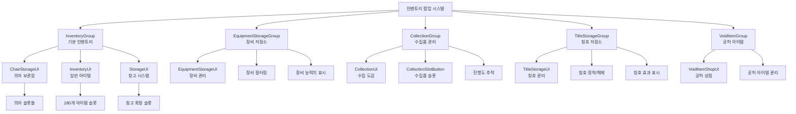

# UI 시스템 - 팝업 시스템 - 인벤토리 팝업

## 개요
인벤토리 팝업 시스템은 플레이어의 아이템, 장비, 수집품, 칭호 등을 관리하기 위한 다양한 팝업 UI들을 제공합니다. InventoryGroup, EquipmentStorageGroup, CollectionGroup, TitleStorageGroup 등으로 구성되며, 각각 특화된 기능과 인터페이스를 통해 효율적인 아이템 관리를 지원합니다.

## 인벤토리 팝업 시스템 구조

### 시스템 아키텍처


## 관련 파일 경로

### 인벤토리 UI 그룹 파일들
```
ui/
├── InventoryGroup.ui                   # 기본 인벤토리 UI 그룹
├── EquipmentStorageGroup.ui            # 장비 저장소 UI 그룹
├── CollectionGroup.ui                  # 수집품 관리 UI 그룹
├── TitleStorageGroup.ui                # 칭호 저장소 UI 그룹
├── VoidItemGroup.ui                    # 공허 아이템 UI 그룹
└── EmblemGroup.ui                      # 엠블럼 UI 그룹
```

### 인벤토리 관련 컴포넌트들
```
RootDesk/MyDesk/Components/Player/Inventory/
├── InventoryUI.mlua                    # 인벤토리 메인 UI
├── InventoryUI.codeblock               # 인벤토리 UI 비주얼
├── InventorySlotButton.mlua            # 인벤토리 슬롯 버튼
├── InventorySlotButton.codeblock       # 슬롯 버튼 비주얼
├── InventoryEquipedSlotButton.mlua     # 장착 슬롯 버튼
├── InventoryEquipedSlotButton.codeblock # 장착 슬롯 비주얼
├── StorageUI.mlua                      # 창고 UI
├── StorageUI.codeblock                 # 창고 UI 비주얼
├── StorageUI_SlotButton.mlua           # 창고 슬롯 버튼
├── StorageUI_SlotButton.codeblock      # 창고 슬롯 비주얼
├── PlayerBackpack.mlua                 # 백팩 시스템
├── PlayerBackpack.codeblock            # 백팩 비주얼
├── PlayerStorage.mlua                  # 저장소 시스템
└── PlayerStorage.codeblock             # 저장소 비주얼
```

### 특수 인벤토리 컴포넌트들
```
RootDesk/MyDesk/Components/Player/
├── Equipment/
│   ├── EquipmentStorageUI.mlua         # 장비 저장소 UI
│   ├── EquipmentStorageUI.codeblock    # 장비 저장소 비주얼
│   ├── EquipmentStorageUI_NormalSlotButton.mlua # 장비 슬롯 버튼
│   └── EquipmentStorageUI_NormalSlotButton.codeblock # 장비 슬롯 비주얼
├── Collection/
│   ├── CollectionUI.mlua               # 수집품 UI
│   ├── CollectionUI.codeblock          # 수집품 UI 비주얼
│   ├── CollectionSlotButton.mlua       # 수집품 슬롯 버튼
│   ├── CollectionSlotButton.codeblock  # 수집품 슬롯 비주얼
│   ├── PlayerCollection.mlua           # 수집 시스템
│   └── PlayerCollection.codeblock      # 수집 시스템 비주얼
├── Title/
│   ├── TitleStorageUI.mlua             # 칭호 저장소 UI
│   ├── TitleStorageUI.codeblock        # 칭호 저장소 비주얼
│   ├── PlayerTitle.mlua                # 칭호 시스템
│   └── PlayerTitle.codeblock           # 칭호 시스템 비주얼
├── Chair/
│   ├── ChairStorageUI.mlua             # 의자 보관함 UI
│   ├── ChairStorageUI.codeblock        # 의자 보관함 비주얼
│   ├── PlayerChair.mlua                # 의자 시스템
│   └── PlayerChair.codeblock           # 의자 시스템 비주얼
└── VoidItem/
    ├── VoidItemShopUI.mlua             # 공허 아이템 상점 UI
    ├── VoidItemShopUI.codeblock        # 공허 상점 비주얼
    ├── PlayerVoidItem.mlua             # 공허 아이템 시스템
    └── PlayerVoidItem.codeblock        # 공허 아이템 비주얼
```

## InventoryGroup - 기본 인벤토리 팝업

### UI 구성 요소

#### 1. 의자 보관함 (ChairStorageUI)
```json
{
  "path": "/ui/InventoryGroup/ChairStorage",
  "components": ["ChairStorageUI"],
  "주요기능": [
    "보유 의자 목록 표시",
    "의자 장착/해제",
    "의자 미리보기"
  ]
}
```

```lua
-- ChairStorageUI.mlua에서 의자 관리
@Component
script ChairStorageUI extends Component

    method void RefreshUI()
        local chairTable = _DataService:GetTable("Chair")
        local playerChair = _UserService.LocalPlayer.PlayerChair
        
        -- 보유 의자들 표시
        for i=1, chairTable:GetRowCount() do
            if playerChair.haveChair[i] == true then
                local chairSlot = self:CreateChairSlot(i)
                
                -- 의자 아이콘 설정
                local iconRUID = chairTable:GetCell(i, "IconRUID")
                chairSlot:GetChildByName("Icon").SpriteGUIRendererComponent.ImageRUID = iconRUID
                
                -- 현재 장착 중인 의자 표시
                if playerChair.equipedChair == i then
                    chairSlot:GetChildByName("EquipedMark").Enable = true
                end
            end
        end
    end
    
    method Entity CreateChairSlot(number chairIdx)
        local slotTemplate = _EntityService:GetEntityByPath("/ui/InventoryGroup/ChairStorage/Panel/SlotTemplate")
        local newSlot = slotTemplate:Clone("ChairSlot_"..chairIdx)
        
        -- 클릭 이벤트 설정
        newSlot.ButtonComponent:ClearAllEvents()
        newSlot.ButtonComponent.OnClick:Connect(function()
            self:EquipChair(chairIdx)
        end)
        
        return newSlot
    end
    
    method void EquipChair(number chairIdx)
        local playerChair = _UserService.LocalPlayer.PlayerChair
        playerChair:EquipChair(chairIdx)
        
        -- UI 새로고침
        self:RefreshUI()
    end
```

#### 2. 일반 아이템 인벤토리
```lua
-- InventoryUI.mlua에서 아이템 관리 (별도 팝업)
method void OpenInventoryPopup()
    local inventoryPopup = _EntityService:GetEntityByPath("/ui/InventoryPopup")
    inventoryPopup.Enable = true
    
    -- 인벤토리 데이터 로드
    self:RefreshInventorySlots()
end

method void RefreshInventorySlots()
    local playerBackpack = _UserService.LocalPlayer.PlayerBackpack
    local storageList = playerBackpack.storageList
    
    -- 180개 슬롯 업데이트
    for i=1, 180 do
        local slot = _EntityService:GetEntityByPath("/ui/InventoryPopup/SlotPanel/Slot_"..i)
        
        if storageList[i] > 0 then
            -- 아이템 표시
            self:DisplayItemInSlot(slot, storageList[i], i)
        else
            -- 빈 슬롯
            self:ClearSlot(slot)
        end
    end
end
```

## EquipmentStorageGroup - 장비 저장소 팝업

### UI 구성 요소
```json
{
  "path": "/ui/EquipmentStorageGroup/EquipmentStorage",
  "components": ["EquipmentStorageUI"],
  "주요기능": [
    "보유 장비 목록 표시",
    "장비 타입별 필터링",
    "장비 능력치 비교",
    "장비 장착/해제"
  ]
}
```

### EquipmentStorageUI 상세 구현
```lua
@Component
script EquipmentStorageUI extends Component

    property number currentFilter = 1    -- 현재 필터 (1:무기, 2:방어구, 3:가방, 4:신발)
    property table equipmentSlots = {}    -- 장비 슬롯들
    
    method void RefreshEquipmentStorage()
        local playerData = _UserService.LocalPlayer.PlayerData
        local equipmentTable = _DataService:GetTable("Equipment")
        
        -- 현재 필터에 해당하는 장비들만 표시
        self:ClearAllSlots()
        
        for i=1, equipmentTable:GetRowCount() do
            local equipType = tonumber(equipmentTable:GetCell(i, "Type"))
            
            if equipType == self.currentFilter then
                -- 플레이어가 보유한 장비인지 확인
                if playerData.haveEquipment[i] == true then
                    self:CreateEquipmentSlot(i)
                end
            end
        end
        
        -- 현재 장착 중인 장비 하이라이트
        self:HighlightEquippedItems()
    end
    
    method void CreateEquipmentSlot(number equipmentIdx)
        local slotTemplate = _EntityService:GetEntityByPath("/ui/EquipmentStorageGroup/EquipmentStorage/Panel/SlotTemplate")
        local newSlot = slotTemplate:Clone("EquipSlot_"..equipmentIdx)
        
        -- 장비 정보 표시
        self:UpdateEquipmentSlotInfo(newSlot, equipmentIdx)
        
        -- 클릭 이벤트 - 장착/해제
        newSlot.EquipmentStorageUI_NormalSlotButton.equipmentIdx = equipmentIdx
        
        -- 우클릭 이벤트 - 상세 정보
        newSlot.ButtonComponent.OnRightClick:Connect(function()
            self:ShowEquipmentDetailPopup(equipmentIdx)
        end)
        
        table.insert(self.equipmentSlots, newSlot)
    end
    
    method void UpdateEquipmentSlotInfo(Entity slot, number equipmentIdx)
        local equipmentTable = _DataService:GetTable("Equipment")
        local equipmentData = equipmentTable:GetRow(equipmentIdx)
        
        -- 아이콘 설정
        local iconRUID = equipmentData:GetItem("IconRUID")
        slot:GetChildByName("Icon").SpriteGUIRendererComponent.ImageRUID = iconRUID
        
        -- 장비 이름
        local equipmentName = equipmentData:GetItem("Name")
        slot:GetChildByName("Name").TextComponent.Text = _LocalizationService:GetText(equipmentName)
        
        -- 능력치 표시
        local power = equipmentData:GetItem("Power")
        slot:GetChildByName("Power").TextComponent.Text = "채굴파워 +"..power
        
        -- 등급 표시 (색상으로 구분)
        local grade = tonumber(equipmentData:GetItem("Grade"))
        local gradeColors = {Color.white, Color.green, Color.blue, Color.purple, Color.orange}
        slot:GetChildByName("GradeBorder").SpriteGUIRendererComponent.Color = gradeColors[grade] or Color.white
    end
    
    method void ShowEquipmentDetailPopup(number equipmentIdx)
        local detailPopup = _EntityService:GetEntityByPath("/ui/EquipmentStorageGroup/EquipmentStorage/DetailPopup")
        detailPopup.Enable = true
        
        -- 상세 정보 표시
        self:UpdateEquipmentDetails(detailPopup, equipmentIdx)
        
        -- 비교 기능 (현재 장착 장비와 비교)
        self:ShowEquipmentComparison(detailPopup, equipmentIdx)
    end
```

## CollectionGroup - 수집품 관리 팝업

### UI 구성 요소
```json
{
  "path": "/ui/CollectionGroup/Collection",
  "components": ["CollectionUI", "OutgameUIManager"],
  "주요기능": [
    "수집품 도감 표시",
    "수집 진행도 추적",
    "미수집 아이템 표시",
    "카테고리별 필터링"
  ]
}
```

### CollectionUI 상세 구현
```lua
@Component
script CollectionUI extends Component

    property number currentCategory = 1  -- 현재 카테고리 (1:광물, 2:보석, 3:화석)
    property table collectionData = {}   -- 수집품 데이터
    
    method void RefreshCollectionUI()
        local playerCollection = _UserService.LocalPlayer.PlayerCollection
        local dropItemTable = _DataService:GetTable("DropItem")
        
        -- 카테고리별 수집품 표시
        self:DisplayCollectionByCategory()
        
        -- 진행도 업데이트
        self:UpdateProgressBar()
    end
    
    method void DisplayCollectionByCategory()
        local collectionPanel = _EntityService:GetEntityByPath("/ui/CollectionGroup/Collection/MainPanel/CollectionPanel")
        
        -- 기존 슬롯들 정리
        self:ClearCollectionSlots()
        
        local dropItemTable = _DataService:GetTable("DropItem")
        local playerCollection = _UserService.LocalPlayer.PlayerCollection
        
        for i=1, dropItemTable:GetRowCount() do
            local itemCategory = tonumber(dropItemTable:GetCell(i, "Type"))
            
            if itemCategory == self.currentCategory then
                local collectionSlot = self:CreateCollectionSlot(i)
                
                -- 수집 여부에 따른 표시
                if playerCollection.collectionData[i] == true then
                    -- 수집 완료
                    self:SetCollectedSlot(collectionSlot, i)
                else
                    -- 미수집
                    self:SetUncollectedSlot(collectionSlot, i)
                end
            end
        end
    end
    
    method Entity CreateCollectionSlot(number itemIdx)
        local slotTemplate = _EntityService:GetEntityByPath("/ui/CollectionGroup/Collection/SlotTemplate")
        local newSlot = slotTemplate:Clone("CollectionSlot_"..itemIdx)
        
        -- 클릭 이벤트 - 상세 정보 표시
        newSlot.CollectionSlotButton.itemIdx = itemIdx
        
        return newSlot
    end
    
    method void SetCollectedSlot(Entity slot, number itemIdx)
        local dropItemTable = _DataService:GetTable("DropItem")
        local itemData = dropItemTable:GetRow(itemIdx)
        
        -- 아이템 아이콘 표시
        local iconRUID = itemData:GetItem("IconRUID")
        slot:GetChildByName("Icon").SpriteGUIRendererComponent.ImageRUID = iconRUID
        slot:GetChildByName("Icon").SpriteGUIRendererComponent.Color = Color.white
        
        -- 수집 완료 마크
        slot:GetChildByName("CollectedMark").Enable = true
        
        -- 아이템 이름 표시
        local itemName = itemData:GetItem("Name")
        slot:GetChildByName("Name").TextComponent.Text = _LocalizationService:GetText(itemName)
        slot:GetChildByName("Name").TextComponent.FontColor = Color.white
    end
    
    method void SetUncollectedSlot(Entity slot, number itemIdx)
        -- 실루엣으로 표시
        slot:GetChildByName("Icon").SpriteGUIRendererComponent.ImageRUID = "silhouette_icon"
        slot:GetChildByName("Icon").SpriteGUIRendererComponent.Color = Color.gray
        
        -- 수집 완료 마크 숨김
        slot:GetChildByName("CollectedMark").Enable = false
        
        -- 물음표 표시
        slot:GetChildByName("Name").TextComponent.Text = "???"
        slot:GetChildByName("Name").TextComponent.FontColor = Color.gray
    end
    
    method void UpdateProgressBar()
        local playerCollection = _UserService.LocalPlayer.PlayerCollection
        local dropItemTable = _DataService:GetTable("DropItem")
        
        -- 카테고리별 진행도 계산
        local totalItems = 0
        local collectedItems = 0
        
        for i=1, dropItemTable:GetRowCount() do
            local itemCategory = tonumber(dropItemTable:GetCell(i, "Type"))
            
            if itemCategory == self.currentCategory then
                totalItems = totalItems + 1
                if playerCollection.collectionData[i] == true then
                    collectedItems = collectedItems + 1
                end
            end
        end
        
        -- 진행도 바 업데이트
        local progressBar = _EntityService:GetEntityByPath("/ui/CollectionGroup/Collection/ProgressBar/Fill")
        local progressRatio = collectedItems / totalItems
        progressBar.UITransformComponent.RectSize = Vector2(300 * progressRatio, progressBar.UITransformComponent.RectSize.y)
        
        -- 진행도 텍스트
        local progressText = _EntityService:GetEntityByPath("/ui/CollectionGroup/Collection/ProgressText")
        progressText.TextComponent.Text = string.format("%d / %d (%.1f%%)", collectedItems, totalItems, progressRatio * 100)
    end
```

## TitleStorageGroup - 칭호 저장소 팝업

### UI 구성 요소
```json
{
  "path": "/ui/TitleStorageGroup/TitleStorage",
  "components": ["TitleStorageUI"],
  "주요기능": [
    "보유 칭호 목록 표시",
    "칭호 장착/해제",
    "칭호 효과 표시",
    "업적 연동"
  ]
}
```

### TitleStorageUI 상세 구현
```lua
@Component
script TitleStorageUI extends Component

    property table titleSlots = {}       -- 칭호 슬롯들
    property number selectedTitleIdx = 0 -- 선택된 칭호
    
    method void RefreshTitleStorage()
        local playerTitle = _UserService.LocalPlayer.PlayerTitle
        local titleTable = _DataService:GetTable("PlayerTitle")
        
        -- 보유 칭호들 표시
        self:DisplayOwnedTitles()
        
        -- 현재 장착 칭호 하이라이트
        self:HighlightEquippedTitle()
    end
    
    method void DisplayOwnedTitles()
        local titlePanel = _EntityService:GetEntityByPath("/ui/TitleStorageGroup/TitleStorage/Panel/TitleList")
        local playerTitle = _UserService.LocalPlayer.PlayerTitle
        local titleTable = _DataService:GetTable("PlayerTitle")
        
        -- 기존 슬롯들 정리
        self:ClearTitleSlots()
        
        for i=1, titleTable:GetRowCount() do
            if playerTitle.haveTitle[i] == true then
                local titleSlot = self:CreateTitleSlot(i)
                self:UpdateTitleSlotInfo(titleSlot, i)
            end
        end
    end
    
    method Entity CreateTitleSlot(number titleIdx)
        local slotTemplate = _EntityService:GetEntityByPath("/ui/TitleStorageGroup/TitleStorage/SlotTemplate")
        local newSlot = slotTemplate:Clone("TitleSlot_"..titleIdx)
        
        -- 클릭 이벤트 - 칭호 장착
        newSlot.ButtonComponent.OnClick:Connect(function()
            self:EquipTitle(titleIdx)
        end)
        
        -- 우클릭 이벤트 - 칭호 해제
        newSlot.ButtonComponent.OnRightClick:Connect(function()
            self:UnequipTitle()
        end)
        
        table.insert(self.titleSlots, newSlot)
        return newSlot
    end
    
    method void UpdateTitleSlotInfo(Entity slot, number titleIdx)
        local titleTable = _DataService:GetTable("PlayerTitle")
        local titleData = titleTable:GetRow(titleIdx)
        
        -- 칭호 이름
        local titleName = titleData:GetItem("Name")
        slot:GetChildByName("TitleName").TextComponent.Text = _LocalizationService:GetText(titleName)
        
        -- 칭호 효과
        local titleEffect = titleData:GetItem("Effect")
        slot:GetChildByName("TitleEffect").TextComponent.Text = _LocalizationService:GetText(titleEffect)
        
        -- 칭호 등급 (색상으로 표시)
        local titleGrade = tonumber(titleData:GetItem("Grade"))
        local gradeColors = {Color.gray, Color.white, Color.green, Color.blue, Color.purple, Color.orange}
        slot:GetChildByName("GradeBorder").SpriteGUIRendererComponent.Color = gradeColors[titleGrade] or Color.white
        
        -- 획득 방법 표시
        local obtainMethod = titleData:GetItem("ObtainMethod")
        slot:GetChildByName("ObtainInfo").TextComponent.Text = _LocalizationService:GetText(obtainMethod)
    end
    
    method void EquipTitle(number titleIdx)
        local playerTitle = _UserService.LocalPlayer.PlayerTitle
        playerTitle:EquipTitle(titleIdx)
        
        -- UI 새로고침
        self:RefreshTitleStorage()
        
        -- 칭호 장착 알림
        local titleTable = _DataService:GetTable("PlayerTitle")
        local titleName = titleTable:GetCell(titleIdx, "Name")
        _UIToast:ShowMessage(string.format("칭호 '%s' 장착됨", _LocalizationService:GetText(titleName)))
    end
    
    method void UnequipTitle()
        local playerTitle = _UserService.LocalPlayer.PlayerTitle
        playerTitle:UnequipTitle()
        
        -- UI 새로고침
        self:RefreshTitleStorage()
        
        _UIToast:ShowMessage("칭호를 해제했습니다")
    end
    
    method void HighlightEquippedTitle()
        local playerTitle = _UserService.LocalPlayer.PlayerTitle
        local equippedTitleIdx = playerTitle.equippedTitle
        
        for i, slot in ipairs(self.titleSlots) do
            local isEquipped = (slot.titleIdx == equippedTitleIdx)
            slot:GetChildByName("EquippedMark").Enable = isEquipped
            
            if isEquipped then
                slot.SpriteGUIRendererComponent.Color = Color.yellow
            else
                slot.SpriteGUIRendererComponent.Color = Color.white
            end
        end
    end
```

## VoidItemGroup - 공허 아이템 팝업

### UI 구성 요소
```json
{
  "path": "/ui/VoidItemGroup/VoidItemShop",
  "components": ["VoidItemShopUI"],
  "주요기능": [
    "공허 아이템 상점",
    "레거시 코인 거래",
    "특수 효과 아이템"
  ]
}
```

### VoidItemShopUI 상세 구현
```lua
@Component
script VoidItemShopUI extends Component

    method void RefreshVoidItemShop()
        local playerVoidItem = _UserService.LocalPlayer.PlayerVoidItem
        local playerStorage = _UserService.LocalPlayer.PlayerStorage
        
        -- 레거시 코인 표시
        local legacyCoinUI = _EntityService:GetEntityByPath("/ui/VoidItemGroup/VoidItemShop/LegacyCoinAmount")
        legacyCoinUI.TextComponent.Text = _ThousandsSeparator:ConvertToMetricPrefixString(
            playerStorage.currencyItems[7])  -- 레거시 코인
        
        -- 공허 아이템 목록 표시
        self:DisplayVoidItems()
    end
    
    method void DisplayVoidItems()
        local voidItemTable = _DataService:GetTable("VoidItem")
        local playerVoidItem = _UserService.LocalPlayer.PlayerVoidItem
        
        for i=1, voidItemTable:GetRowCount() do
            local itemSlot = self:CreateVoidItemSlot(i)
            
            -- 보유 레벨 표시
            local currentLevel = playerVoidItem.voidItemLevels[i] or 0
            itemSlot:GetChildByName("Level").TextComponent.Text = string.format("Lv.%d", currentLevel)
            
            -- 업그레이드 비용 계산
            local upgradeCost = self:CalculateUpgradeCost(i, currentLevel)
            itemSlot:GetChildByName("Cost").TextComponent.Text = _ThousandsSeparator:ConvertToMetricPrefixString(upgradeCost)
            
            -- 효과 설명
            local effectDesc = self:GetVoidItemEffect(i, currentLevel)
            itemSlot:GetChildByName("Effect").TextComponent.Text = effectDesc
        end
    end
```

## 공통 팝업 기능들

### 드래그 앤 드롭 시스템
```lua
-- 인벤토리 간 아이템 이동
@Component
script DragDropHandler extends Component

    property Entity draggedItem = nil
    property Vector2 originalPosition = Vector2.zero
    
    method void OnDragStart(Entity item)
        self.draggedItem = item
        self.originalPosition = item.UITransformComponent.LocalPosition
        
        -- 드래그 중 시각적 효과
        item.CanvasGroupComponent.Alpha = 0.7
        item.UITransformComponent.SetAsLastSibling()  -- 최상위로
    end
    
    method void OnDragEnd(Entity dropTarget)
        if self.draggedItem ~= nil then
            if dropTarget ~= nil and self:IsValidDropTarget(dropTarget) then
                -- 아이템 이동 처리
                self:MoveItem(self.draggedItem, dropTarget)
            else
                -- 원래 위치로 복원
                self.draggedItem.UITransformComponent.LocalPosition = self.originalPosition
            end
            
            -- 시각적 효과 복원
            self.draggedItem.CanvasGroupComponent.Alpha = 1.0
            self.draggedItem = nil
        end
    end
    
    method boolean IsValidDropTarget(Entity target)
        -- 드롭 대상 유효성 검사
        return target:HasComponent("InventorySlot") or target:HasComponent("EquipmentSlot")
    end
    
    method void MoveItem(Entity sourceItem, Entity targetSlot)
        -- 서버에 아이템 이동 요청
        local sourceIdx = sourceItem.InventorySlotButton.slotIndex
        local targetIdx = targetSlot.InventorySlotButton.slotIndex
        
        _UserService.LocalPlayer.PlayerBackpack:MoveItem(sourceIdx, targetIdx)
    end
```

### 팝업 간 전환 시스템
```lua
-- 인벤토리 팝업 간 빠른 전환
method void SwitchInventoryPopup(string targetPopup)
    -- 현재 열린 인벤토리 팝업 찾기
    local currentPopup = self:GetCurrentInventoryPopup()
    
    if currentPopup then
        -- 부드러운 전환 애니메이션
        self:PlayTransitionAnimation(currentPopup, targetPopup)
    else
        -- 직접 열기
        local popup = _EntityService:GetEntityByPath("/ui/"..targetPopup)
        popup.Enable = true
    end
end

method void PlayTransitionAnimation(string fromPopup, string toPopup)
    local fromEntity = _EntityService:GetEntityByPath("/ui/"..fromPopup)
    local toEntity = _EntityService:GetEntityByPath("/ui/"..toPopup)
    
    -- 페이드 아웃 -> 페이드 인 애니메이션
    local fadeOutStep = function(progress)
        fromEntity.CanvasGroupComponent.Alpha = 1.0 - progress
        if progress >= 1.0 then
            fromEntity.Enable = false
            toEntity.Enable = true
            
            -- 페이드 인 시작
            self:PlayFadeInAnimation(toEntity)
        end
    end
    
    for i=1, 15 do
        local progress = i / 15.0
        _TimerService:SetTimerOnce(function() fadeOutStep(progress) end, i/30)
    end
end
```

## 성능 최적화

### 가상화 스크롤링
```lua
-- 대량의 아이템을 효율적으로 표시
@Component
script VirtualizedScrollView extends Component

    property number visibleItemCount = 10   -- 화면에 보이는 아이템 수
    property number totalItemCount = 0      -- 전체 아이템 수
    property number scrollPosition = 0      -- 현재 스크롤 위치
    property table itemPool = {}            -- 아이템 풀
    
    method void UpdateVirtualizedList()
        -- 현재 보여야 할 아이템 범위 계산
        local startIndex = math.floor(self.scrollPosition / 60)  -- 60은 아이템 높이
        local endIndex = math.min(startIndex + self.visibleItemCount, self.totalItemCount)
        
        -- 필요한 만큼만 아이템 슬롯 활성화
        for i=1, self.visibleItemCount do
            local itemIndex = startIndex + i
            local itemSlot = self.itemPool[i]
            
            if itemIndex <= endIndex then
                itemSlot.Enable = true
                self:UpdateItemSlotData(itemSlot, itemIndex)
            else
                itemSlot.Enable = false
            end
        end
    end
```

### 메모리 관리
```lua
-- 사용하지 않는 UI 리소스 해제
method void CleanupInventoryResources()
    -- 비활성화된 팝업의 텍스처 해제
    local inactivePopups = {"InventoryGroup", "EquipmentStorageGroup", "CollectionGroup"}
    
    for _, popupName in ipairs(inactivePopups) do
        local popup = _EntityService:GetEntityByPath("/ui/"..popupName)
        
        if not popup.Enable and popup.hasLoadedTextures then
            popup:UnloadTextures()
            popup.hasLoadedTextures = false
        end
    end
end
```

## 일반적인 문제 해결

### 팝업이 올바르게 새로고침되지 않는 경우
1. 데이터 동기화 상태 확인
2. UI 새로고침 이벤트 바인딩 점검
3. 플레이어 데이터 로드 완료 여부 확인

### 드래그 앤 드롭이 작동하지 않는 경우
1. `DragDropHandler` 컴포넌트 설정 확인
2. 드롭 대상 유효성 검사 로직 점검
3. UI 레이어 순서 및 레이캐스트 차단 확인

### 슬롯 아이템이 표시되지 않는 경우
1. 아이콘 RUID 경로 확인
2. 아이템 데이터 테이블 로드 상태 점검
3. 슬롯 인덱스와 데이터 인덱스 일치 여부 확인
