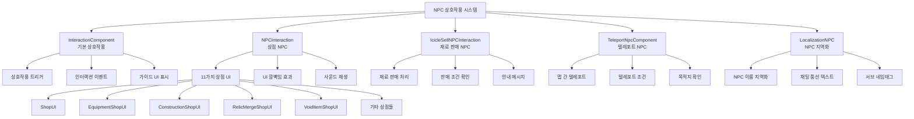

# 게임 메커니즘 - 상호작용 시스템 - NPC 상호작용

## 개요
NPC 상호작용 시스템은 플레이어가 마을의 다양한 NPC들과 상호작용할 수 있도록 하는 핵심 게임 메커니즘입니다. 상점 운영, 재료 판매, 텔레포트 서비스, 튜토리얼 가이드 등 다양한 기능을 제공하며, 직관적인 인터랙션 UI와 지역화 시스템을 통해 몰입감 있는 게임 경험을 제공합니다.

## NPC 상호작용 시스템 구조

### 시스템 아키텍처


## 관련 파일 경로

### NPC 상호작용 핵심 컴포넌트
```
RootDesk/MyDesk/Components/Town/
├── NPCInteraction.mlua                 # 상점 NPC 상호작용
└── NPCInteraction.codeblock           # 상점 NPC 비주얼

RootDesk/MyDesk/Components/
├── IcicleSellNPCInteraction.mlua      # 재료 판매 NPC
├── IcicleSellNPCInteraction.codeblock # 재료 판매 NPC 비주얼
└── Localization/
    ├── LocalizationNPC.mlua           # NPC 지역화
    ├── LocalizationNPC.codeblock      # NPC 지역화 비주얼
    ├── LocalizationUIModel.mlua       # UI 모델 지역화
    └── LocalizationUIModel.codeblock  # UI 모델 비주얼
```

### 포털 및 텔레포트 NPC
```
RootDesk/MyDesk/Components/Portals/
├── TeleportNpcComponent.mlua          # 텔레포트 NPC 컴포넌트
├── TeleportNpcComponent.codeblock     # 텔레포트 NPC 비주얼
├── Portal_TownToTownInteraction.mlua  # 마을 간 이동
├── Portal_TownToTownInteraction.codeblock # 마을 간 이동 비주얼
├── PortalToMineInteraction.mlua       # 마을→광산 이동
├── PortalToMineInteraction.codeblock  # 마을→광산 이동 비주얼
├── PortalToTownInteraction.mlua       # →마을 이동
└── PortalToTownInteraction.codeblock  # →마을 이동 비주얼
```

### NPC 모델 및 에셋
```
RootDesk/MyDesk/Models/NPCs/
├── Model_NPC_Standard.model           # 기본 NPC 모델
├── Model_NPC_Adventure.model          # 모험 NPC 모델
├── Model_NPC_Merchant.model           # 상인 NPC 모델
├── Model_NPC_Blacksmith.model         # 대장장이 NPC 모델
├── Model_NPC_MagicShop.model          # 마법상점 NPC 모델
├── Model_NPC_TeleportMaster.model     # 텔레포트 마스터 NPC
├── Model_NPC_IcicleSeller.model       # 빙하 상인 NPC
├── Model_NPC_ConstructionMaster.model # 건설 마스터 NPC
├── Model_NPC_RelicMaster.model        # 유물 마스터 NPC
├── Model_NPC_VoidMerchant.model       # 공허 상인 NPC
└── Model_NPC_TimeKeeper.model         # 시간 관리자 NPC
```

### 튜토리얼 및 대화 시스템
```
RootDesk/MyDesk/Logic/
├── TutorialGuide.mlua                 # 튜토리얼 가이드 시스템
└── TutorialGuide.codeblock           # 튜토리얼 가이드 비주얼

RootDesk/MyDesk/DataSets/
├── NPCTable.csv                       # NPC 기본 정보
├── NPCTable.userdataset              # NPC 데이터셋
├── TutorialDialog.csv                 # 튜토리얼 대화
└── TutorialDialog.userdataset        # 튜토리얼 대화 데이터셋
```

## NPCInteraction - 상점 NPC 시스템

### 핵심 데이터 구조
```lua
@Component
script NPCInteraction extends InteractionComponent

    property Entity TargetUI = nil              -- 열릴 대상 UI
    property string UIOpenSound = ""            -- 상호작용 사운드
    property boolean SetSortingLayerAutomately = true  -- 소팅 레이어 자동 설정
```

### 상점별 UI 새로고침
```lua
@ExecSpace("Client")
method void RefreshTargetUI()
    -- ShopUI (일반 상점)
    if self.TargetUI == _EntityService:GetEntity("c22b0f71-6a6d-40bb-a02e-47e4b03b906f") then
        self.TargetUI.ShopUI:RefreshUI()
        
    -- EquipmentShopUI (장비 상점)
    elseif self.TargetUI == _EntityService:GetEntityByPath("/ui/EquipShopGroup/EquipShop") then
        -- 장비 능력치 가이드 패널 깜빡임 효과
        local equipmentAbiltiyGuidePanel = _EntityService:GetEntityByPath("/ui/EquipShopGroup/EquipShop/Panel/DescPanel")
        local guideText = equipmentAbiltiyGuidePanel:GetChildByName("Desc")
        equipmentAbiltiyGuidePanel.Enable = true
        
        local alpha = 1
        local flickeringUp = function()
            alpha = alpha + 1/20
            equipmentAbiltiyGuidePanel.SpriteGUIRendererComponent.Color.a = alpha
            guideText.TextComponent.FontColor.a = alpha
        end
        
        local flickeringDown = function()
            alpha = alpha - 1/20
            equipmentAbiltiyGuidePanel.SpriteGUIRendererComponent.Color.a = alpha
            guideText.TextComponent.FontColor.a = alpha
        end
        
        -- 60프레임에 걸친 깜빡임 애니메이션
        for i=1, 60 do
            if (i >= 1 and i <= 10) or (i >= 21 and i <= 30) or (i >= 41 and i <= 50) then
                _TimerService:SetTimerOnce(flickeringDown, 0.04 * i)
            else
                _TimerService:SetTimerOnce(flickeringUp, 0.04 * i)
            end
        end
        
        self.TargetUI.EquipmentShopUI:RefreshUI()
        
    -- 각 상점별 특화 처리
    elseif self.TargetUI == _EntityService:GetEntityByPath("/ui/RelicGachaShopGroup/RelicGachaShop") then
        self.TargetUI.RelicGachaShopUI:RefreshUI()
    elseif self.TargetUI == _EntityService:GetEntityByPath("/ui/ConstructionGroup/ConstructionShop") then
        self.TargetUI.ConstructionShopUI:RefreshUI()
    elseif self.TargetUI == _EntityService:GetEntityByPath("/ui/RelicMergeGroup/RelicMergeShop") then
        self.TargetUI.RelicMergeShopUI:SelectGrade(0)
        self.TargetUI.RelicMergeShopUI:RefreshMainPanel()
    elseif self.TargetUI == _EntityService:GetEntityByPath("/ui/VoidItemGroup/VoidItemShop") then
        self.TargetUI.VoidItemShopUI:RefreshUI()
    -- ... 기타 상점들
    end
end
```

### 상호작용 이벤트 처리
```lua
@ExecSpace("Client")
method void OnInteractionEvent()
    if self.TargetUI and self.TargetUI.Enable == false then
        
        -- UI 오픈 사운드 재생
        if self.UIOpenSound ~= nil and self.UIOpenSound ~= "" then
            _SoundService:PlaySound(self.UIOpenSound, 0.7)
        end
        
        -- 소팅 레이어 자동 설정
        if self.SetSortingLayerAutomately then
            self.TargetUI.SortingLayer = 30
        end
        
        -- 대상 UI 새로고침 및 활성화
        self:RefreshTargetUI()
        self.TargetUI.Enable = true
        
        -- UI 열림 로그
        log("NPC 상호작용: " .. self.TargetUI.Path .. " 열림")
    end
end
```

### 지원하는 상점 UI 목록
```lua
-- NPCInteraction에서 지원하는 모든 상점 UI들
local supportedShops = {
    "ShopUI",                    -- 일반 상점
    "EquipmentShopUI",           -- 장비 상점  
    "MythicEquipmentShopUI",     -- 신화 장비 상점
    "RelicGachaShopUI",          -- 유물 뽑기 상점
    "ConstructionShopUI",        -- 건설 상점
    "AccessoryMergeShopUI",      -- 장신구 합성 상점
    "RebornUI",                  -- 환생 시스템
    "VoidItemShopUI",            -- 공허 아이템 상점
    "KronosClockTowerUI",        -- 크로노스 시계탑
    "RelicMergeShopUI",          -- 유물 합성 상점
    "GemShopUI"                  -- 젬 상점 (추가 가능)
}
```

## IcicleSellNPCInteraction - 재료 판매 NPC

### 핵심 기능 및 데이터 구조
```lua
@Component
script IcicleSellNPCInteraction extends InteractionComponent

    property number Price = 10           -- 재료 판매 가격
    property boolean EnableSell = true   -- 판매 활성화 여부

    @ExecSpace("ClientOnly")
    method void OnBeginPlay()
        self.ShowActionInfo = false  -- 기본 액션 정보 숨김
    end
```

### 재료 판매 로직
```lua
@ExecSpace("Client")
method void OnInteractionEvent()
    local player = _UserService.LocalPlayer
    
    if player.PlayerStateAtStage.HavingMaterialNum > 0 then
        -- 보유 재료가 있으면 모든 재료 판매
        player.PlayerStateAtStage:SellAllMaterial()
        
        -- 판매 완료 메시지 표시
        local soldAmount = player.PlayerStateAtStage.HavingMaterialNum
        local totalPrice = soldAmount * self.Price
        
        _UIToast:ShowMessage(string.format("재료 %d개를 %d골드에 판매했습니다", 
            soldAmount, totalPrice))
    else
        -- 보유 재료가 없으면 안내 메시지
        _UIToast:ShowMessage(_LocalizationService:GetText("Message_NoIcicleMaterial"))
    end
end
```

### 상호작용 가이드 UI 시스템
```lua
@ExecSpace("ClientOnly")
handler HandleInteractionEnterEvent(InteractionEnterEvent event)
    local InteractionEntity = event.InteractionEntity
    
    -- 가이드 키 UI 생성
    local guideKeyWorldUI = self.Entity:GetChildByName("Guide_Key")
    if guideKeyWorldUI == nil then
        local spawnPos = Vector3(0, 1.25, 0)  -- NPC 위 1.25m 높이
        local guideUI = _SpawnService:SpawnByModelId(
            "model://85ad2718-739a-4bf9-aee4-f439cda53303", 
            "Guide_Key", spawnPos, self.Entity)
            
        -- 가이드 텍스트 설정
        guideUI:GetChildByName("UIText").TextComponent.Text = 
            _LocalizationService:GetText("InteractionGuide_SellIcicle")
        
        -- 로컬 플레이어에게만 표시
        if InteractionEntity ~= _UserService.LocalPlayer then
            guideUI.Enable = false
        else
            guideUI.Enable = true
        end
    else
        guideKeyWorldUI.Enable = true
    end
end

@ExecSpace("ClientOnly")
handler HandleInteractionExitEvent(InteractionExitEvent event)
    -- 상호작용 영역을 벗어나면 가이드 UI 숨김
    local guideKeyWorldUI = self.Entity:GetChildByName("Guide_Key")
    if guideKeyWorldUI ~= nil then
        guideKeyWorldUI.Enable = false
    end
end
```

## LocalizationNPC - NPC 지역화 시스템

### NPC 텍스트 지역화
```lua
@Component
script LocalizationNPC extends Component

    property string key = ""    -- 지역화 키

    method void OnBeginPlay()
        if self:IsClient() then
            self.key = self.Entity.Path  -- 엔티티 경로를 키로 사용
            self:Localize()
        end
    end
```

### NPCTable 기반 지역화
```lua
@ExecSpace("ClientOnly")
method void Localize()
    local data = _DataService:GetTable("NPCTable")
    local keys = data:GetColumn(1)  -- 첫 번째 컬럼에서 키 목록 가져오기
    
    for i=1, #keys do
        if self.key == keys[i] then
            -- NPC 이름 지역화
            if data:GetCell(i, "Key_Name") ~= "none" then
                self.Entity.NameTagComponent.Name = 
                    _LocalizationService:GetText(data:GetCell(i, "Key_Name"))
            end
            
            -- 채팅 풍선 지역화
            if data:GetCell(i, "Key_ChatBalloon") ~= "none" then
                self.Entity.ChatBalloonComponent.Message = 
                    _LocalizationService:GetText(data:GetCell(i, "Key_ChatBalloon"))
            end
            
            -- 서브 네임태그 지역화
            if data:GetCell(i, "Tag") ~= "" then
                local subNameTag = self.Entity:GetChildByName("SubNameTag")
                if subNameTag then
                    subNameTag.NameTagComponent.Name = 
                        _LocalizationService:GetText(data:GetCell(i, "Tag"))
                end
            end
            
            return
        end
    end
end
```

### 수동 지역화 방식 (백업)
```lua
@ExecSpace("ClientOnly")
method void SetLocalization()
    -- 경로 기반 키 생성
    local nameKey = self.key .. "_Type_Name"
    local chatBalloonKey = self.key .. "_Type_Chatballoon"
    
    -- 컴포넌트별 지역화 적용
    if isvalid(self.Entity.NameTagComponent) then
        local localizedName = _LocalizationService:GetText(nameKey)
        self.Entity.NameTagComponent.Name = localizedName
    end
    
    if isvalid(self.Entity.ChatBalloonComponent) then
        local localizedMessage = _LocalizationService:GetText(chatBalloonKey)
        self.Entity.ChatBalloonComponent.Message = localizedMessage
    end
    
    -- 서브 네임태그 지역화
    local subNameTag = self.Entity:GetChildByName("SubNameTag")
    if isvalid(subNameTag) then
        local subNameKey = subNameTag.Path .. "_Type_NameTag"
        local localizedSubName = _LocalizationService:GetText(subNameKey)
        subNameTag.NameTagComponent.Name = localizedSubName
    end
end
```

## TutorialGuide - 대화 및 튜토리얼 시스템

### 대화 큐 시스템
```lua
-- TutorialGuide.mlua에서 대화 관리
local SpeakerQueue = {}      -- 발화자 큐
local MessageQueue = {}      -- 메시지 큐

method void AddTutorialDialog(string speaker, string message)
    table.insert(SpeakerQueue, speaker)
    table.insert(MessageQueue, message)
end

method void ShowNextMessage()
    if SpeakerQueue[1] ~= nil then
        local fromField = _EntityService:GetEntity("f65d7ce8-7ef4-424b-ab92-2ff6f0f3ccf2")
        local messageField = _EntityService:GetEntity("a38d3a6d-dd4c-465a-9882-a829dcb1bd99")
        local npcImageField = _EntityService:GetEntity("3d6d2ca0-329b-4756-84ff-0ecf6c595c58")
        
        -- NPC 이미지 교체
        if SpeakerQueue[1] == "TutorialNPC_1" then
            npcImageField.SpriteGUIRendererComponent.ImageRUID = "05b924095af34482bd582448ad2ccc65"
        elseif SpeakerQueue[1] == "TutorialNPC_2" then
            npcImageField.SpriteGUIRendererComponent.ImageRUID = "2193e3721cd3441e93a67bac90b5537d"
        elseif SpeakerQueue[1] == "TutorialNPC_3" then
            npcImageField.SpriteGUIRendererComponent.ImageRUID = "bc8fb37b35a7400ba3f539ad46155cec"
        end
        
        -- 발화자 이름 표시
        fromField.TextComponent.Text = "From: " .. _LocalizationService:GetText(SpeakerQueue[1])
        
        -- 튜토리얼 그룹 활성화
        local tutorialGroup = _EntityService:GetEntity("44202060-27a8-4974-8ff8-3f5dd0dc47b2")
        tutorialGroup:SetEnable(true)
        
        -- 메시지 타이핑 효과
        self:PlayTypingAnimation(MessageQueue[1])
    end
end
```

### 타이핑 애니메이션
```lua
method void PlayTypingAnimation(string message)
    local messageField = _EntityService:GetEntity("a38d3a6d-dd4c-465a-9882-a829dcb1bd99")
    local playNextButton = _EntityService:GetEntityByPath("/ui/TutorialGroup/PopupType/PlayNextButton")
    local clickIcon = _EntityService:GetEntityByPath("/ui/TutorialGroup/PopupType/ChatBallonImage")
    local exitButton = _EntityService:GetEntityByPath("/ui/TutorialGroup/PopupType/ExitButton")
    
    -- 버튼들 비활성화
    playNextButton.Enable = false
    clickIcon.Enable = false  
    exitButton.Enable = false
    
    -- 메시지 필드 초기화
    messageField.Enable = true
    messageField.TextComponent.Text = ""
    
    -- 한 글자씩 타이핑 효과
    local localizedMessage = _LocalizationService:GetText(message)
    for i=1, utf8.len(localizedMessage) do
        local setDialogFragment = function()
            local fragment = utf8.sub(localizedMessage, 1, i)
            messageField.TextComponent.Text = fragment
            
            -- 타이핑 사운드 재생
            if i % 3 == 0 then  -- 3글자마다 사운드
                _SoundService:PlaySound("typing_sound", 0.3)
            end
        end
        
        _TimerService:SetTimerOnce(setDialogFragment, i * 0.05)  -- 50ms 간격
    end
    
    -- 타이핑 완료 후 버튼들 활성화
    local enableButtons = function()
        playNextButton.Enable = true
        clickIcon.Enable = true
        exitButton.Enable = true
    end
    
    _TimerService:SetTimerOnce(enableButtons, utf8.len(localizedMessage) * 0.05 + 0.5)
end
```

## TeleportNpcComponent - 텔레포트 NPC

### 텔레포트 서비스
```lua
@Component
script TeleportNpcComponent extends Component

    property string destinationMap = ""     -- 목적지 맵 이름
    property Vector3 teleportPosition = Vector3.zero  -- 텔레포트 위치
    property number teleportCost = 0        -- 텔레포트 비용

    method void OnInteractionEvent()
        local player = _UserService.LocalPlayer
        
        -- 텔레포트 비용 확인
        if self.teleportCost > 0 then
            if player.PlayerData.Money < self.teleportCost then
                _UIToast:ShowMessage(string.format("골드가 부족합니다. (%d골드 필요)", self.teleportCost))
                return
            end
            
            -- 비용 차감
            player.PlayerData:UseMoney(self.teleportCost)
        end
        
        -- 텔레포트 실행
        if self.destinationMap ~= "" then
            _TeleportService:TeleportToMap(self.destinationMap, self.teleportPosition)
            
            -- 텔레포트 사운드 및 효과
            _SoundService:PlaySound("teleport_sound", 1.0)
            self:PlayTeleportEffect()
        end
    end
    
    method void PlayTeleportEffect()
        -- 텔레포트 효과 파티클 재생
        local teleportEffect = _EntityService:GetEntityByPath("/Effects/TeleportEffect")
        if teleportEffect then
            teleportEffect.ParticleSystemComponent:Play()
            
            -- 3초 후 효과 정리
            local cleanupEffect = function()
                teleportEffect.ParticleSystemComponent:Stop()
            end
            _TimerService:SetTimerOnce(cleanupEffect, 3.0)
        end
    end
```

## 상호작용 트리거 시스템

### 트리거 영역 관리
```lua
-- InteractionComponent의 기본 트리거 시스템
method void OnTriggerEnter(Entity triggerEntity)
    if triggerEntity.TagComponent and triggerEntity.TagComponent.Tags[1] == "player" then
        -- 플레이어가 상호작용 영역에 진입
        local interactionEnterEvent = InteractionEnterEvent()
        interactionEnterEvent.InteractionEntity = triggerEntity
        self.Entity:SendEvent(interactionEnterEvent)
        
        -- 가이드 UI 표시
        self:ShowInteractionGuide(true)
    end
end

method void OnTriggerExit(Entity triggerEntity)
    if triggerEntity.TagComponent and triggerEntity.TagComponent.Tags[1] == "player" then
        -- 플레이어가 상호작용 영역에서 벗어남
        local interactionExitEvent = InteractionExitEvent()
        interactionExitEvent.InteractionEntity = triggerEntity
        self.Entity:SendEvent(interactionExitEvent)
        
        -- 가이드 UI 숨김
        self:ShowInteractionGuide(false)
    end
end

method void ShowInteractionGuide(boolean show)
    local guideUI = self.Entity:GetChildByName("InteractionGuide")
    if guideUI then
        guideUI.Enable = show
        
        if show then
            -- 가이드 텍스트 설정
            local guideText = guideUI:GetChildByName("GuideText")
            if guideText then
                guideText.TextComponent.Text = _LocalizationService:GetText("Interaction_Guide_PressF")
            end
            
            -- 깜빡임 효과
            self:PlayGuideFlickeringEffect(guideUI)
        end
    end
end

method void PlayGuideFlickeringEffect(Entity guideUI)
    local flickerStep = function(frame)
        local alpha = (math.sin(frame * 0.3) + 1) / 2  -- 0.0 ~ 1.0 사이 값
        guideUI.SpriteGUIRendererComponent.Color.a = alpha
    end
    
    -- 지속적인 깜빡임 효과 (상호작용 영역에 있는 동안)
    for i=1, 60 do  -- 1초간 깜빡임
        _TimerService:SetTimerOnce(function() flickerStep(i) end, i/60)
    end
end
```

### 키 입력 처리
```lua
-- 플레이어 입력 처리 시스템
method void HandleInteractionInput()
    if Input:GetKeyDown(KeyCode.F) then
        local nearbyNPCs = self:GetNearbyInteractableNPCs()
        
        if #nearbyNPCs > 0 then
            -- 가장 가까운 NPC와 상호작용
            local closestNPC = self:GetClosestNPC(nearbyNPCs)
            
            local interactionEvent = InteractionEvent()
            interactionEvent.InteractionEntity = _UserService.LocalPlayer
            closestNPC:SendEvent(interactionEvent)
        end
    end
end

method table GetNearbyInteractableNPCs()
    local playerPosition = _UserService.LocalPlayer.Transform.Position
    local interactionRange = 3.0  -- 3미터 내 NPC들
    local nearbyNPCs = {}
    
    -- 모든 NPC 엔티티 검색
    local allNPCs = _EntityService:GetEntitiesByTag("NPC")
    for _, npc in ipairs(allNPCs) do
        local distance = Vector3.Distance(playerPosition, npc.Transform.Position)
        if distance <= interactionRange and npc:HasComponent("InteractionComponent") then
            table.insert(nearbyNPCs, {npc = npc, distance = distance})
        end
    end
    
    return nearbyNPCs
end
```

## NPC 배치 및 관리

### 마을별 NPC 구성
```lua
-- 마을별 NPC 배치 정보
local townNPCConfigs = {
    ["Town"] = {
        {type = "ShopNPC", position = Vector3(10, 0, 5), targetUI = "ShopGroup"},
        {type = "TeleportNPC", position = Vector3(15, 0, 0), destination = "Town2"}
    },
    ["Town2"] = {
        {type = "EquipmentNPC", position = Vector3(8, 0, 3), targetUI = "EquipShopGroup"},
        {type = "ConstructionNPC", position = Vector3(12, 0, 7), targetUI = "ConstructionGroup"}
    },
    ["Town5"] = {
        {type = "IcicleSellNPC", position = Vector3(6, 0, 4), sellPrice = 10},
        {type = "EmoticonNPC", position = Vector3(14, 0, 8), targetUI = "EmoticonGroup"}
    }
    -- ... 기타 마을들
}

method void SpawnTownNPCs(string townName)
    local npcConfigs = townNPCConfigs[townName]
    if not npcConfigs then return end
    
    for _, config in ipairs(npcConfigs) do
        local npc = self:SpawnNPC(config.type, config.position)
        
        -- NPC 설정 적용
        if config.targetUI then
            npc.NPCInteraction.TargetUI = _EntityService:GetEntityByPath("/ui/"..config.targetUI)
        end
        
        if config.sellPrice then
            npc.IcicleSellNPCInteraction.Price = config.sellPrice
        end
        
        if config.destination then
            npc.TeleportNpcComponent.destinationMap = config.destination
        end
    end
end
```

### 동적 NPC 관리
```lua
-- 조건에 따른 NPC 활성화/비활성화
method void UpdateNPCAvailability()
    local player = _UserService.LocalPlayer
    
    -- 플레이어 레벨에 따른 NPC 해금
    local playerLevel = player.PlayerData.Level
    
    if playerLevel >= 5 then
        self:EnableNPC("EquipmentShopNPC")
    end
    
    if playerLevel >= 10 then
        self:EnableNPC("ConstructionNPC")
    end
    
    if playerLevel >= 20 then
        self:EnableNPC("VoidMerchantNPC")
    end
    
    -- 퀘스트 진행도에 따른 NPC 변화
    local questProgress = player.PlayerQuest.currentQuestProgress
    
    if questProgress >= 50 then
        self:UpdateNPCDialog("TutorialNPC", "Quest_Progress_50_Dialog")
    end
end

method void EnableNPC(string npcName)
    local npc = _EntityService:GetEntityByName(npcName)
    if npc then
        npc.Enable = true
        
        -- NPC 등장 효과
        self:PlayNPCAppearanceEffect(npc)
    end
end

method void PlayNPCAppearanceEffect(Entity npc)
    -- NPC 등장 시 반짝이는 효과
    local appearanceEffect = _SpawnService:SpawnByModelId(
        "model://appearance_effect", "AppearanceEffect", 
        npc.Transform.Position, npc)
        
    appearanceEffect.ParticleSystemComponent:Play()
    
    -- 3초 후 효과 제거
    local cleanupEffect = function()
        appearanceEffect:Destroy()
    end
    _TimerService:SetTimerOnce(cleanupEffect, 3.0)
end
```

## 성능 최적화

### NPC 가시성 관리
```lua
-- 화면에 보이지 않는 NPC의 업데이트 빈도 조절
method void OptimizeNPCUpdates()
    local playerPosition = _UserService.LocalPlayer.Transform.Position
    local allNPCs = _EntityService:GetEntitiesByTag("NPC")
    
    for _, npc in ipairs(allNPCs) do
        local distance = Vector3.Distance(playerPosition, npc.Transform.Position)
        
        if distance > 50 then
            -- 멀리 있는 NPC는 업데이트 빈도 낮춤
            npc.UpdateInterval = 2.0  -- 2초마다 업데이트
        elseif distance > 20 then
            npc.UpdateInterval = 0.5  -- 0.5초마다 업데이트
        else
            npc.UpdateInterval = 0.0  -- 기본 업데이트
        end
    end
end
```

### 메모리 관리
```lua
-- 사용하지 않는 NPC 다이얼로그 리소스 해제
method void CleanupNPCResources()
    local inactiveNPCs = self:GetInactiveNPCs()
    
    for _, npc in ipairs(inactiveNPCs) do
        -- 대화 텍스트 캐시 해제
        if npc:HasComponent("LocalizationNPC") then
            npc.LocalizationNPC:UnloadCachedText()
        end
        
        -- 사용하지 않는 UI 참조 해제
        if npc:HasComponent("NPCInteraction") then
            npc.NPCInteraction:ClearUIReferences()
        end
    end
end
```

## 일반적인 문제 해결

### NPC와 상호작용이 되지 않는 경우
1. `InteractionComponent` 설정 확인
2. 트리거 콜라이더 크기 및 위치 점검
3. NPC 태그 설정 확인 (`"NPC"` 태그 필요)

### UI가 열리지 않는 경우
1. `TargetUI` 경로 설정 확인
2. 대상 UI의 활성화 상태 점검
3. UI 새로고침 메서드 호출 여부 확인

### 지역화 텍스트가 표시되지 않는 경우
1. `NPCTable.csv` 데이터 확인
2. 지역화 키 매핑 점검
3. `LocalizationNPC` 컴포넌트 설정 확인