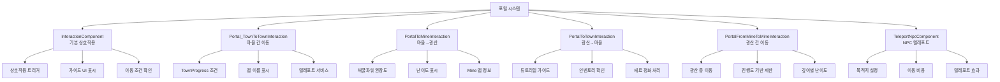

# 게임 메커니즘 - 상호작용 시스템 - 포털 시스템

## 개요
포털 시스템은 플레이어가 다양한 맵 간을 이동할 수 있도록 하는 핵심 게임 메커니즘입니다. 마을 간 이동, 광산 진입, 신전 탐험, 유적지 방문 등 다양한 이동 경로를 제공하며, 각 포털마다 고유한 이동 조건, 권장 수준, 튜토리얼 가이드를 통해 플레이어의 게임 진행을 안내합니다.

## 포털 시스템 구조

### 시스템 아키텍처


## 관련 파일 경로

### 포털 상호작용 컴포넌트들
```
RootDesk/MyDesk/Components/Portals/
├── Portal_TownToTownInteraction.mlua      # 마을 간 이동 포털
├── Portal_TownToTownInteraction.codeblock # 마을 간 이동 비주얼
├── PortalToMineInteraction.mlua           # 마을→광산 이동 포털
├── PortalToMineInteraction.codeblock      # 마을→광산 이동 비주얼
├── PortalToTownInteraction.mlua           # 광산→마을 이동 포털
├── PortalToTownInteraction.codeblock      # 광산→마을 이동 비주얼
├── PortalFromMineToMineInteraction.mlua   # 광산 간 이동 포털
├── PortalFromMineToMineInteraction.codeblock # 광산 간 이동 비주얼
├── PortalToHistoricSiteInteraction.mlua   # 유적지 이동 포털
├── PortalToHistoricSiteInteraction.codeblock # 유적지 이동 비주얼
├── PortalToNextHistoricSiteInteraction.mlua # 다음 유적지 이동
├── PortalToNextHistoricSiteInteraction.codeblock # 다음 유적지 비주얼
├── TeleportNpcComponent.mlua              # NPC 텔레포트 서비스
├── TeleportNpcComponent.codeblock         # NPC 텔레포트 비주얼
├── TeleportTownController.mlua            # 마을 텔레포트 컨트롤러
└── TeleportTownController.codeblock       # 마을 텔레포트 비주얼
```

### 포털 관련 데이터 테이블
```
RootDesk/MyDesk/DataSets/
├── Map_Town.csv                           # 마을 맵 정보
├── Map_Town.userdataset                   # 마을 맵 데이터셋
├── Map_Mine.csv                           # 광산 맵 정보
├── Map_Mine.userdataset                   # 광산 맵 데이터셋
├── Map_Temple.csv                         # 신전 맵 정보
└── Map_Temple.userdataset                 # 신전 맵 데이터셋
```

### 포털 가이드 모델들
```
RootDesk/MyDesk/Models/Guide_Key/
├── Model_Guide_Key_F.model                # F키 가이드
├── Model_Guide_Key_E.model                # E키 가이드
├── Model_MinePortalGuide.model            # 광산 포털 가이드
├── Model_TownPortalGuide.model            # 마을 포털 가이드
└── Model_TeleportGuide.model              # 텔레포트 가이드
```

## Portal_TownToTownInteraction - 마을 간 이동

### 핵심 데이터 구조
```lua
@Component
script Portal_TownToTownInteraction extends InteractionComponent

    @Sync
    property number TownCategory = 0    -- 목적지 마을 번호 (1~10)
```

### 마을 진입 조건 확인
```lua
@ExecSpace("Server")
method void OnInteractionEvent(Entity player)
    -- TownCategory 1 (기본 마을)은 항상 이용 가능
    if self.TownCategory ~= 1 and player.PlayerData.TownProgress[self.TownCategory] == false then
        if self.TownCategory == 10 then
            -- 신전 진입 조건 미달
            _CustomLocalizationLogic:SendLocalizedToastMessageFromServer(
                "Message_CannotEnterTemple", player.OwnerId)
        else
            -- 일반 마을 진입 조건 미달 (열쇠 필요)
            _CustomLocalizationLogic:SendLocalizedToastMessageFromServer(
                "Message_CannotEnterBecauseOfKey", player.OwnerId)
        end
        log("마을 " .. self.TownCategory .. " 조건 미달")
        return
    end
    
    -- 조건을 만족하면 텔레포트 실행
    self:OnInteractionEventOnClient(player.OwnerId)
end
```

### 텔레포트 실행
```lua
@ExecSpace("Client")
method void OnInteractionEventOnClient()
    local currentTownIdx = string.sub(self.Entity.Parent.Name, 5, -1)
    if tonumber(currentTownIdx) == nil then
        currentTownIdx = "1"  -- 기본값
    end
    
    local Player = _UserService.LocalPlayer
    
    if self.TownCategory == 1 then
        -- 기본 마을로 이동
        _TeleportService:TeleportToEntityPath(Player, 
            "/maps/Town/Portal_TownToTown_" .. currentTownIdx)
    else
        -- 특정 마을로 이동
        local destinationPath = string.format("/maps/Town%d/Portal_TownToTown_%s", 
            math.floor(self.TownCategory), currentTownIdx)
        _TeleportService:TeleportToEntityPath(Player, destinationPath)
        
        log("이동 경로: " .. destinationPath)
    end
end
```

### 포털 가이드 UI 생성
```lua
@ExecSpace("ClientOnly")
method void OnBeginPlay()
    local portalGuideUI = self.Entity:GetChildByName("MinePortalGuide")
    
    if portalGuideUI == nil then
        local spawnPos = Vector3(0, 1.7, 0)  -- 포털 위 1.7m
        local guideUI = _SpawnService:SpawnByModelId(
            "model://a3e04974-9f26-4033-a3a7-cffe3b0c0cf9", 
            "MinePortalGuide", spawnPos, self.Entity)
        
        -- 목적지 마을 이름 표시
        local mapTable = _DataService:GetTable("Map_Town")
        local mapName = _LocalizationService:GetText(string.format("%d", 7200 + self.TownCategory))
        guideUI.TextComponent.Text = mapName
    else
        portalGuideUI.Enable = true
    end
end
```

## PortalToMineInteraction - 마을→광산 이동

### 핵심 데이터 구조
```lua
@Component
script PortalToMineInteraction extends InteractionComponent

    property string Tag = ""    -- 광산 맵 식별자 (예: "Mine1", "Mine2")
```

### 권장 채굴파워 시스템
```lua
@ExecSpace("ClientOnly")
method void OnBeginPlay()
    local portalGuideUI = self.Entity:GetChildByName("TownToMinePortalGuide")
    local mapTable = _DataService:GetTable("Map_Mine")
    
    if portalGuideUI == nil then
        local spawnPos = Vector3(0, 2.15, 0)  -- 포털 위 2.15m
        local guideUI = _SpawnService:SpawnByModelId(
            "model://588a8382-990c-4d45-8cfc-6b00b646b02b", 
            "TownToMinePortalGuide", spawnPos, self.Entity)
        
        -- 광산 이름 표시
        local mineIndex = tonumber(string.sub(self.Tag, 5, -1)) * 4 - 3  -- Mine1 → 1, Mine2 → 5
        local mapName = mapTable:GetCell(mineIndex, 2)
        guideUI:GetChildByName("ModelEntrancePanelMine").TextComponent.Text = 
            _LocalizationService:GetText(mapName)
        
        -- 권장 채굴파워 계산 및 표시
        self:UpdateRecommendedPower(guideUI, mineIndex)
    else
        portalGuideUI.Enable = true
        -- 기존 UI의 권장 채굴파워 업데이트
        local mineIndex = tonumber(string.sub(self.Tag, 5, 5)) * 4 - 3
        self:UpdateRecommendedPower(portalGuideUI, mineIndex)
    end
end

method void UpdateRecommendedPower(Entity guideUI, number mineIndex)
    local mapTable = _DataService:GetTable("Map_Mine")
    local minPower = tonumber(mapTable:GetCell(mineIndex, 5))
    local maxPower = tonumber(mapTable:GetCell(mineIndex, 6))
    local userPower = _UserService.LocalPlayer.PlayerIngameData.MiningPower
    
    -- 난이도 판정
    local recommendInfo = ""
    if minPower <= userPower and userPower < maxPower then
        recommendInfo = "[" .. _LocalizationService:GetText("Recommend") .. "]"  -- 권장
    elseif minPower > userPower then
        recommendInfo = "[" .. _LocalizationService:GetText("Hard") .. "]"       -- 어려움
    else
        recommendInfo = "[" .. _LocalizationService:GetText("Easy") .. "]"       -- 쉬움
    end
    
    -- 권장 채굴파워 텍스트 설정
    local powerRangeText = string.format("%s~%s", 
        _ThousandsSeparator:ConvertToMetricPrefixString(minPower),
        _ThousandsSeparator:ConvertToMetricPrefixString(maxPower))
    
    guideUI:GetChildByName("WarningText").TextComponent.Text = 
        _LocalizationService:GetText("RecommendedPower") .. "\n" ..
        powerRangeText .. "\n" .. recommendInfo
end
```

### 광산 진입 처리
```lua
@ExecSpace("Client")
method void OnInteractionEvent()
    local Player = _UserService.LocalPlayer
    
    -- 광산 맵으로 텔레포트
    local destinationPath = "/maps/" .. self.Tag .. "_1/Portal_MineToTown"
    _TeleportService:TeleportToEntityPath(Player, destinationPath)
    
    -- 광산 진입 사운드
    _SoundService:PlaySound("portal_enter_sound", 0.8)
    
    log("광산 진입: " .. self.Tag)
end
```

## PortalToTownInteraction - 광산→마을 이동

### 핵심 데이터 구조
```lua
@Component
script PortalToTownInteraction extends InteractionComponent

    property number TownCategory = 0        -- 목적지 마을 번호
    property boolean canInteraction = false -- 상호작용 가능 여부

    @ExecSpace("ClientOnly")
    method void OnBeginPlay()
        self.ShowActionInfo = false  -- 기본 액션 정보 숨김
    end
```

### 튜토리얼 가이드 연동
```lua
@ExecSpace("Client")
method void OnInteractionEvent()
    -- 사망 상태에서는 상호작용 불가
    if _UserService.LocalPlayer.PlayerIngameData.isIngame == false then
        return
    end
    
    -- 튜토리얼 가이드 1: 빈손으로 복귀 로봇에게 접근
    if self.Entity.Path == "/maps/Mine1_1/Model_NPC_ReturnRobo" and 
       _TutorialGuide.IsPlayed[1] == false then
        
        local playerInvenStorage = _UserService.LocalPlayer.PlayerBackpack.storageList
        local haveItem = false
        
        -- 인벤토리에 아이템이 있는지 확인
        for i=1, #playerInvenStorage do
            if playerInvenStorage[i] > 0 then
                haveItem = true
                break
            end
        end
        
        -- 아이템이 없으면 튜토리얼 재생
        if haveItem == false then
            _TutorialGuide:PlayGuide(1)
            return
        end
    end
    
    -- 튜토리얼 가이드 2: 아이템을 가지고 복귀
    if self.Entity.Path == "/maps/Mine1_1/Model_NPC_ReturnRobo" and 
       _TutorialGuide.IsPlayed[2] == false then
        _TutorialGuide:AddCondition(2)
    end
    
    -- 실제 마을로 이동 처리
    self:ExecuteTownTeleport()
end
```

### 재료 정화 및 마을 이동
```lua
method void ExecuteTownTeleport()
    local Player = _UserService.LocalPlayer
    
    -- 미정화 재료 정화 처리
    if Player.PlayerRelic.HavingDirtyItem then
        Player.PlayerRelic:Purifying()  -- 유물 정화
    end
    
    if Player.PlayerStateAtStage.HavingMaterialNum > 0 then
        -- 광산 재료를 골드로 변환하여 저장
        Player.PlayerStateAtStage:ConvertMaterialToGold()
    end
    
    -- 목적지 마을 결정
    local destinationTown = "Town"
    if self.TownCategory > 1 then
        destinationTown = "Town" .. tostring(self.TownCategory)
    end
    
    -- 마을로 텔레포트
    local destinationPath = "/maps/" .. destinationTown .. "/Portal_MineToTown"
    _TeleportService:TeleportToEntityPath(Player, destinationPath)
    
    -- 마을 복귀 사운드
    _SoundService:PlaySound("town_return_sound", 0.8)
    
    log("마을 복귀: " .. destinationTown)
end
```

## PortalFromMineToMineInteraction - 광산 간 이동

### 층별 이동 시스템
```lua
@Component
script PortalFromMineToMineInteraction extends InteractionComponent

    property number targetFloor = 0      -- 목적지 층
    property number currentFloor = 0     -- 현재 층
    property boolean isDownward = true   -- 하향 이동 여부

    method void OnInteractionEvent()
        local Player = _UserService.LocalPlayer
        
        -- 이동 조건 확인
        if not self:CanMoveToFloor(self.targetFloor) then
            self:ShowMovementRestrictionMessage()
            return
        end
        
        -- 층 간 이동 실행
        self:ExecuteFloorMovement(Player)
    end
    
    method boolean CanMoveToFloor(number floor)
        local Player = _UserService.LocalPlayer
        
        -- 하향 이동: 채굴파워 확인
        if self.isDownward then
            local requiredPower = self:GetRequiredMiningPower(floor)
            if Player.PlayerIngameData.MiningPower < requiredPower then
                return false
            end
        end
        
        -- 상향 이동: 항상 가능
        return true
    end
    
    method void ExecuteFloorMovement(Entity player)
        local mineType = string.sub(self.Entity.Parent.Name, 1, 5)  -- "Mine1", "Mine2" 등
        local destinationPath = string.format("/maps/%s_%d/Portal_FloorEntrance", 
            mineType, self.targetFloor)
        
        _TeleportService:TeleportToEntityPath(player, destinationPath)
        
        -- 층 이동 효과
        self:PlayFloorMovementEffect()
        
        log(string.format("광산 층 이동: %d층 → %d층", self.currentFloor, self.targetFloor))
    end
```

## TeleportNpcComponent - NPC 텔레포트 서비스

### 텔레포트 서비스 기본 구조
```lua
@Component
script TeleportNpcComponent extends Component

    property string destinationMap = ""        -- 목적지 맵
    property Vector3 teleportPosition = Vector3.zero  -- 텔레포트 좌표
    property number teleportCost = 100         -- 텔레포트 비용 (골드)
    property boolean requiresUnlock = false    -- 해금 필요 여부

    method void OnInteractionEvent()
        local Player = _UserService.LocalPlayer
        
        -- 해금 조건 확인
        if self.requiresUnlock and not self:IsDestinationUnlocked() then
            _UIToast:ShowMessage(_LocalizationService:GetText("Message_DestinationLocked"))
            return
        end
        
        -- 비용 확인 및 차감
        if not self:ProcessTeleportPayment(Player) then
            return
        end
        
        -- 텔레포트 실행
        self:ExecuteTeleport(Player)
    end
    
    method boolean ProcessTeleportPayment(Entity player)
        if self.teleportCost > 0 then
            if player.PlayerData.Money < self.teleportCost then
                local message = string.format("골드가 부족합니다. (%s골드 필요)", 
                    _ThousandsSeparator:ConvertToMetricPrefixString(self.teleportCost))
                _UIToast:ShowMessage(message)
                return false
            end
            
            -- 비용 차감
            player.PlayerData:UseMoney(self.teleportCost)
            
            local paymentMessage = string.format("%s골드를 지불했습니다", 
                _ThousandsSeparator:ConvertToMetricPrefixString(self.teleportCost))
            _UIToast:ShowMessage(paymentMessage)
        end
        
        return true
    end
    
    method void ExecuteTeleport(Entity player)
        if self.destinationMap ~= "" then
            if self.teleportPosition ~= Vector3.zero then
                -- 특정 좌표로 텔레포트
                _TeleportService:TeleportToPosition(player, self.destinationMap, self.teleportPosition)
            else
                -- 기본 스폰 지점으로 텔레포트
                _TeleportService:TeleportToMap(player, self.destinationMap)
            end
            
            -- 텔레포트 효과 및 사운드
            self:PlayTeleportEffects()
            
            log("NPC 텔레포트: " .. self.destinationMap)
        end
    end
    
    method void PlayTeleportEffects()
        -- 텔레포트 사운드
        _SoundService:PlaySound("npc_teleport_sound", 1.0)
        
        -- 텔레포트 파티클 효과
        local teleportEffect = _EntityService:GetChildByName("TeleportEffect")
        if teleportEffect and teleportEffect.ParticleSystemComponent then
            teleportEffect.ParticleSystemComponent:Play()
            
            -- 3초 후 효과 정리
            local cleanupEffect = function()
                teleportEffect.ParticleSystemComponent:Stop()
            end
            _TimerService:SetTimerOnce(cleanupEffect, 3.0)
        end
    end
```

## TeleportTownController - 마을 텔레포트 컨트롤러

### 마을 간 빠른 이동 시스템
```lua
@Component
script TeleportTownController extends Component

    property table townDestinations = {}     -- 이용 가능한 마을 목록
    property number currentTown = 1          -- 현재 마을

    method void InitializeTownDestinations()
        local Player = _UserService.LocalPlayer
        self.townDestinations = {}
        
        -- 해금된 마을들만 목록에 추가
        for i=1, 10 do
            if i == 1 or Player.PlayerData.TownProgress[i] == true then
                local townInfo = {
                    index = i,
                    name = self:GetTownName(i),
                    cost = self:GetTeleportCost(i),
                    isSpecial = (i == 10)  -- 신전
                }
                table.insert(self.townDestinations, townInfo)
            end
        end
    end
    
    method string GetTownName(number townIndex)
        local mapTable = _DataService:GetTable("Map_Town")
        local localizationKey = string.format("%d", 7200 + townIndex)
        return _LocalizationService:GetText(localizationKey)
    end
    
    method number GetTeleportCost(number townIndex)
        -- 거리 기반 비용 계산
        local baseCost = 50
        local distance = math.abs(townIndex - self.currentTown)
        return baseCost * distance
    end
    
    method void OpenTeleportMenu()
        self:InitializeTownDestinations()
        
        -- 텔레포트 메뉴 UI 생성
        local teleportMenu = _EntityService:GetEntityByPath("/ui/TeleportMenu")
        if teleportMenu then
            teleportMenu.Enable = true
            self:PopulateTeleportMenu(teleportMenu)
        end
    end
    
    method void PopulateTeleportMenu(Entity menuUI)
        local listPanel = menuUI:GetChildByName("DestinationList")
        
        -- 기존 목록 정리
        listPanel:ClearChildren()
        
        -- 이용 가능한 목적지들 표시
        for i, destination in ipairs(self.townDestinations) do
            local destSlot = self:CreateDestinationSlot(destination, i)
            destSlot.Parent = listPanel
        end
    end
    
    method Entity CreateDestinationSlot(table destination, number index)
        local slotTemplate = _EntityService:GetEntityByPath("/ui/TeleportMenu/DestinationSlotTemplate")
        local newSlot = slotTemplate:Clone("DestSlot_" .. index)
        
        -- 목적지 정보 설정
        newSlot:GetChildByName("TownName").TextComponent.Text = destination.name
        newSlot:GetChildByName("Cost").TextComponent.Text = 
            string.format("비용: %s골드", _ThousandsSeparator:ConvertToMetricPrefixString(destination.cost))
        
        -- 특수 마을 (신전) 표시
        if destination.isSpecial then
            newSlot:GetChildByName("SpecialMark").Enable = true
        end
        
        -- 클릭 이벤트 설정
        newSlot.ButtonComponent.OnClick:Connect(function()
            self:TeleportToTown(destination.index, destination.cost)
        end)
        
        return newSlot
    end
    
    method void TeleportToTown(number townIndex, number cost)
        local Player = _UserService.LocalPlayer
        
        -- 비용 확인 및 차감
        if Player.PlayerData.Money < cost then
            _UIToast:ShowMessage("골드가 부족합니다")
            return
        end
        
        Player.PlayerData:UseMoney(cost)
        
        -- 목적지 결정
        local destinationMap = "Town"
        if townIndex > 1 then
            destinationMap = "Town" .. tostring(townIndex)
        end
        
        -- 텔레포트 실행
        _TeleportService:TeleportToMap(Player, destinationMap)
        
        -- 텔레포트 메뉴 닫기
        local teleportMenu = _EntityService:GetEntityByPath("/ui/TeleportMenu")
        teleportMenu.Enable = false
        
        log("마을 텔레포트: " .. destinationMap)
    end
```

## 포털 가이드 UI 시스템

### 동적 가이드 생성
```lua
-- 포털별 가이드 UI 생성 및 관리
method Entity CreatePortalGuide(Vector3 position, string modelId, string guideName)
    local existingGuide = self.Entity:GetChildByName(guideName)
    
    if existingGuide == nil then
        -- 새 가이드 UI 생성
        local guideUI = _SpawnService:SpawnByModelId(modelId, guideName, position, self.Entity)
        
        -- 기본 설정
        guideUI.Enable = true
        
        return guideUI
    else
        -- 기존 가이드 UI 활성화
        existingGuide.Enable = true
        return existingGuide
    end
end

method void UpdateGuideText(Entity guideUI, string mainText, string subText)
    -- 메인 텍스트 설정
    local mainTextComponent = guideUI:GetChildByName("MainText")
    if mainTextComponent then
        mainTextComponent.TextComponent.Text = mainText
    end
    
    -- 서브 텍스트 설정 (권장 정보 등)
    local subTextComponent = guideUI:GetChildByName("SubText")
    if subTextComponent and subText ~= "" then
        subTextComponent.TextComponent.Text = subText
        subTextComponent.Enable = true
    end
end

method void PlayGuideAnimation(Entity guideUI)
    -- 가이드 UI 깜빡임 애니메이션
    local flickerStep = function(frame)
        local alpha = (math.sin(frame * 0.2) + 1) / 2  -- 부드러운 깜빡임
        
        if guideUI.SpriteGUIRendererComponent then
            guideUI.SpriteGUIRendererComponent.Color.a = alpha
        end
        
        -- 텍스트 컴포넌트들도 함께 깜빡임
        local textComponents = guideUI:GetComponentsInChildren("TextComponent")
        for _, textComp in ipairs(textComponents) do
            textComp.FontColor.a = alpha
        end
    end
    
    -- 지속적인 깜빡임 효과
    for i=1, 120 do  -- 2초간 깜빡임
        _TimerService:SetTimerOnce(function() flickerStep(i) end, i/60)
    end
end
```

## 포털 조건 시스템

### 마을 진행도 관리
```lua
-- PlayerData에서 마을 진행도 관리
method void UnlockTown(number townIndex)
    local Player = _UserService.LocalPlayer
    
    if townIndex >= 1 and townIndex <= 10 then
        Player.PlayerData.TownProgress[townIndex] = true
        
        -- 클라이언트 동기화
        Player.PlayerData:SaveData()
        
        -- 해금 알림
        local townName = self:GetTownName(townIndex)
        local unlockMessage = string.format("'%s' 해금되었습니다!", townName)
        _UIToast:ShowMessage(unlockMessage)
        
        log("마을 해금: " .. townName)
    end
end

method boolean CheckTownRequirement(number townIndex)
    local Player = _UserService.LocalPlayer
    
    -- 기본 마을은 항상 이용 가능
    if townIndex == 1 then
        return true
    end
    
    -- 신전 (townIndex 10) 특별 조건
    if townIndex == 10 then
        return self:CheckTempleRequirement()
    end
    
    -- 일반 마을 조건 (열쇠 아이템 또는 퀘스트 완료)
    return Player.PlayerData.TownProgress[townIndex] == true
end

method boolean CheckTempleRequirement()
    local Player = _UserService.LocalPlayer
    
    -- 신전 입장 조건 (예: 특정 레벨, 퀘스트 완료, 특별 아이템 보유)
    local requiredLevel = 30
    local requiredQuest = "MainQuest_Temple"
    
    if Player.PlayerData.Level < requiredLevel then
        return false
    end
    
    -- 기타 신전 입장 조건들...
    return Player.PlayerData.TownProgress[10] == true
end
```

### 광산 진입 조건
```lua
method boolean CheckMineRequirement(string mineTag)
    local Player = _UserService.LocalPlayer
    local mineLevel = tonumber(string.sub(mineTag, 5, -1))  -- "Mine3" → 3
    
    -- Mine1은 항상 이용 가능
    if mineLevel == 1 then
        return true
    end
    
    -- 이전 광산 클리어 여부 확인
    local previousMine = "Mine" .. (mineLevel - 1)
    if not Player.PlayerData.MineProgress[previousMine] then
        return false
    end
    
    -- 권장 채굴파워 확인 (경고만, 강제 제한 아님)
    local mapTable = _DataService:GetTable("Map_Mine")
    local mineIndex = mineLevel * 4 - 3
    local minPower = tonumber(mapTable:GetCell(mineIndex, 5))
    
    if Player.PlayerIngameData.MiningPower < minPower then
        -- 경고 메시지만 표시, 진입은 허용
        _UIToast:ShowMessage("채굴파워가 부족합니다. 주의하세요!")
    end
    
    return true
end
```

## 텔레포트 효과 시스템

### 포털 이용 효과
```lua
method void PlayPortalEffect(Entity portal, Entity player)
    -- 포털 진입 효과
    local enterEffect = portal:GetChildByName("PortalEnterEffect")
    if enterEffect and enterEffect.ParticleSystemComponent then
        enterEffect.ParticleSystemComponent:Play()
    end
    
    -- 플레이어 주변 효과
    local playerEffect = _SpawnService:SpawnByModelId(
        "model://teleport_player_effect", "PlayerTeleportEffect", 
        player.Transform.Position, player)
    
    -- 화면 전환 효과
    self:PlayScreenTransition()
    
    -- 사운드 효과
    _SoundService:PlaySound("portal_travel_sound", 1.0)
    
    -- 효과 정리 (3초 후)
    local cleanupEffect = function()
        if playerEffect then
            playerEffect:Destroy()
        end
        if enterEffect then
            enterEffect.ParticleSystemComponent:Stop()
        end
    end
    _TimerService:SetTimerOnce(cleanupEffect, 3.0)
end

method void PlayScreenTransition()
    -- 화면 페이드 아웃/인 효과
    local fadeOverlay = _EntityService:GetEntityByPath("/ui/FadeOverlay")
    if fadeOverlay then
        fadeOverlay.Enable = true
        fadeOverlay.SpriteGUIRendererComponent.Color.a = 0
        
        -- 페이드 아웃
        local fadeOutStep = function(progress)
            fadeOverlay.SpriteGUIRendererComponent.Color.a = progress
        end
        
        for i=1, 30 do
            local progress = i / 30.0
            _TimerService:SetTimerOnce(function() fadeOutStep(progress) end, i/60)
        end
        
        -- 1초 후 페이드 인 시작
        local startFadeIn = function()
            for i=1, 30 do
                local progress = 1.0 - (i / 30.0)
                _TimerService:SetTimerOnce(function() fadeOutStep(progress) end, 1.0 + i/60)
            end
            
            -- 페이드 완료 후 오버레이 비활성화
            _TimerService:SetTimerOnce(function() fadeOverlay.Enable = false end, 2.0)
        end
        _TimerService:SetTimerOnce(startFadeIn, 1.0)
    end
end
```

## 성능 최적화

### 포털 가시성 관리
```lua
-- 화면에 보이지 않는 포털의 가이드 UI 비활성화
method void OptimizePortalGuides()
    local playerPosition = _UserService.LocalPlayer.Transform.Position
    local allPortals = _EntityService:GetEntitiesByTag("Portal")
    
    for _, portal in ipairs(allPortals) do
        local distance = Vector3.Distance(playerPosition, portal.Transform.Position)
        local guideUI = portal:GetChildByName("Guide")
        
        if guideUI then
            if distance > 15 then
                -- 멀리 있는 포털의 가이드 UI 비활성화
                guideUI.Enable = false
            elseif distance > 5 then
                -- 중간 거리의 포털은 저품질 가이드로 전환
                guideUI:SetQualityLevel(1)  -- 낮은 품질
            else
                -- 가까운 포털은 고품질 가이드
                guideUI.Enable = true
                guideUI:SetQualityLevel(3)  -- 높은 품질
            end
        end
    end
end
```

## 일반적인 문제 해결

### 포털이 작동하지 않는 경우
1. `InteractionComponent` 설정 확인
2. 트리거 콜라이더 크기 및 레이어 설정 점검
3. 목적지 맵 경로와 엔티티 존재 여부 확인

### 텔레포트 조건이 제대로 작동하지 않는 경우
1. `TownProgress` 데이터 동기화 상태 확인
2. 조건 검사 로직의 논리 오류 점검
3. 서버-클라이언트 간 데이터 일치 여부 확인

### 가이드 UI가 표시되지 않는 경우
1. 모델 ID와 경로 설정 확인
2. 스폰 위치 좌표 검증
3. UI 컴포넌트 활성화 상태 점검