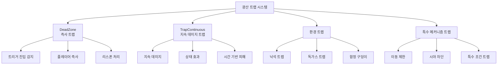

# 게임 메커니즘 - 트랩 시스템 - 광산 트랩

## 개요
광산 트랩 시스템은 광산 탐험에 도전과 위험 요소를 추가하는 게임 메커니즘입니다. 다양한 종류의 트랩들이 각 광산 층에 배치되어 있으며, 플레이어의 진행을 방해하거나 특별한 도전 과제를 제공합니다. DeadZone, 지속 데미지 트랩, 환경 트랩 등 다양한 형태로 구성됩니다.

## 트랩 시스템 구조

### 시스템 아키텍처


## 관련 파일 경로

### 트랩 핵심 컴포넌트
```
RootDesk/MyDesk/Components/Traps/
├── 다양한 트랩 컴포넌트들
└── 트랩별 비주얼 스크립팅

RootDesk/MyDesk/Components/Mine/
├── DeadZone.mlua                       # 즉사 트랩
├── DeadZone.codeblock                  # 즉사 트랩 비주얼
└── 기타 광산 특수 트랩들

RootDesk/MyDesk/Models/Traps/
├── 다양한 트랩 모델들
└── 트랩 에셋들
```

## DeadZone - 즉사 트랩

### 핵심 기능
```lua
@Component
script DeadZone extends Component

    @EventSender("Self")
    handler HandleTriggerEnterEvent(TriggerEnterEvent event)
        local TriggerBodyEntity = event.TriggerBodyEntity
        
        -- 플레이어 태그 확인 및 클라이언트에서만 실행
        if TriggerBodyEntity.TagComponent and
           TriggerBodyEntity.TagComponent.Tags[1] == "player" and
           self:IsClient() then
           
            log("DeadZone 접촉 감지")
            TriggerBodyEntity.PlayerIngameData:Die()
        end
    end
```

### DeadZone 특징
- **즉시 사망**: 접촉 시 플레이어 즉시 사망
- **클라이언트 처리**: 지연 없는 즉각적인 반응
- **로그 기록**: 디버깅을 위한 접촉 로그
- **태그 기반 필터링**: 플레이어만 영향받음

## 지속 데미지 트랩

### TrapContinuous - 연속 피해 트랩
```lua
@Component
script TrapContinuous extends Component

    property number damageAmount = 10     -- 초당 데미지
    property number damageInterval = 1.0  -- 데미지 간격
    property string trapType = "poison"   -- 트랩 타입
    property table affectedPlayers = {}   -- 영향받는 플레이어들

    @EventSender("Self")
    handler HandleTriggerEnterEvent(TriggerEnterEvent event)
        local player = event.TriggerBodyEntity
        
        if self:IsValidPlayer(player) then
            -- 지속 데미지 시작
            self:StartContinuousDamage(player)
            table.insert(self.affectedPlayers, player)
        end
    end

    @EventSender("Self")  
    handler HandleTriggerExitEvent(TriggerExitEvent event)
        local player = event.TriggerBodyEntity
        
        if self:IsValidPlayer(player) then
            -- 지속 데미지 중단
            self:StopContinuousDamage(player)
            self:RemovePlayerFromList(player)
        end
    end

    method void StartContinuousDamage(Entity player)
        local damageTimer = function()
            if self:IsPlayerInTrap(player) then
                self:ApplyDamage(player)
                -- 다음 데미지 예약
                _TimerService:SetTimerOnce(damageTimer, self.damageInterval)
            end
        end
        
        _TimerService:SetTimerOnce(damageTimer, self.damageInterval)
    end

    method void ApplyDamage(Entity player)
        if player.PlayerIngameData then
            player.PlayerIngameData:TakeDamage(self.damageAmount, self.trapType)
            
            -- 데미지 효과 표시
            self:ShowDamageEffect(player)
        end
    end
```

## 특수 트랩 메커니즘

### 낙석 트랩
```lua
@Component
script FallingRockTrap extends Component

    property number triggerDelay = 2.0    -- 트리거 지연 시간
    property number rockCount = 5         -- 떨어지는 돌 개수
    property Entity rockPrefab = nil      -- 돌 프리팹

    handler HandleTriggerEnterEvent(TriggerEnterEvent event)
        local player = event.TriggerBodyEntity
        
        if self:IsValidPlayer(player) then
            -- 경고 표시
            self:ShowWarningEffect()
            
            -- 지연 후 낙석 시작
            _TimerService:SetTimerOnce(function()
                self:StartRockFall()
            end, self.triggerDelay)
        end
    end

    method void StartRockFall()
        for i=1, self.rockCount do
            local delay = i * 0.2  -- 0.2초 간격으로 순차 낙하
            
            _TimerService:SetTimerOnce(function()
                self:SpawnFallingRock()
            end, delay)
        end
    end

    method void SpawnFallingRock()
        local spawnPos = self:GetRandomSpawnPosition()
        local rock = _SpawnService:SpawnByModelId(self.rockPrefab, "FallingRock", spawnPos)
        
        -- 물리 효과 적용
        rock.RigidbodyComponent.Velocity = Vector3(0, -10, 0)
        
        -- 5초 후 자동 정리
        _TimerService:SetTimerOnce(function()
            rock:Destroy()
        end, 5.0)
    end
```

### 독가스 트랩
```lua
@Component
script PoisonGasTrap extends Component

    property number gasLifetime = 10.0    -- 가스 지속 시간
    property number poisonDamage = 5      -- 독 데미지
    property Entity gasPrefab = nil       -- 가스 파티클 프리팹

    method void ActivateTrap()
        -- 독가스 생성
        local gasEffect = _SpawnService:SpawnByModelId(self.gasPrefab, "PoisonGas", 
            self.Entity.Transform.Position)
        
        -- 가스 범위 내 플레이어들에게 지속 데미지
        self:StartGasDamage()
        
        -- 가스 제거
        _TimerService:SetTimerOnce(function()
            gasEffect:Destroy()
            self:StopGasDamage()
        end, self.gasLifetime)
    end

    method void StartGasDamage()
        local damageTimer = function()
            local playersInGas = self:GetPlayersInGasRange()
            
            for _, player in ipairs(playersInGas) do
                player.PlayerIngameData:TakeDamage(self.poisonDamage, "poison")
                self:ApplyPoisonEffect(player)
            end
            
            -- 다음 데미지 사이클
            _TimerService:SetTimerOnce(damageTimer, 1.0)
        end
        
        self.gasDamageTimer = damageTimer
        damageTimer()
    end
```

## 광산별 트랩 배치

### 광산 레벨별 트랩 난이도
```lua
-- 광산별 트랩 설정
local mineTrapConfigs = {
    ["Mine1"] = {
        deadZones = 2,
        continuousTraps = 1,
        specialTraps = 0,
        difficulty = 1
    },
    ["Mine5"] = {
        deadZones = 5,
        continuousTraps = 3,
        specialTraps = 1,
        difficulty = 3
    },
    ["Mine9"] = {
        deadZones = 8,
        continuousTraps = 5,
        specialTraps = 3,
        difficulty = 5
    }
}

method void SetupMineTraps(string mineName)
    local config = mineTrapConfigs[mineName]
    if not config then return end
    
    -- DeadZone 배치
    for i=1, config.deadZones do
        self:SpawnDeadZone(self:GetRandomTrapPosition())
    end
    
    -- 지속 트랩 배치
    for i=1, config.continuousTraps do
        self:SpawnContinuousTrap(self:GetRandomTrapPosition())
    end
    
    -- 특수 트랩 배치
    for i=1, config.specialTraps do
        self:SpawnSpecialTrap(self:GetRandomTrapPosition())
    end
end
```

### 트랩 활성화 조건
```lua
method boolean ShouldActivateTrap(Entity player, table trapConfig)
    -- 플레이어 레벨 확인
    if player.PlayerData.Level < trapConfig.minLevel then
        return false
    end
    
    -- 트랩 쿨다운 확인
    if trapConfig.lastActivated and 
       (_TimeService:GetTime() - trapConfig.lastActivated) < trapConfig.cooldown then
        return false
    end
    
    -- 확률 기반 활성화
    local random = _UtilLogic:RandomDouble()
    return random < trapConfig.activationChance
end
```

## 트랩 경고 시스템

### 시각적 경고
```lua
method void ShowTrapWarning(Vector3 position, number warningTime)
    -- 경고 UI 생성
    local warningUI = _SpawnService:SpawnByModelId(
        "model://trap_warning_ui", "TrapWarning", position)
    
    -- 깜빡임 효과
    local blinkStep = function(frame)
        local alpha = (frame % 20 < 10) and 1.0 or 0.3
        warningUI.SpriteGUIRendererComponent.Color.a = alpha
    end
    
    for i=1, math.floor(warningTime * 60) do
        _TimerService:SetTimerOnce(function() blinkStep(i) end, i/60)
    end
    
    -- 경고 제거
    _TimerService:SetTimerOnce(function()
        warningUI:Destroy()
    end, warningTime)
end
```

### 사운드 경고
```lua
method void PlayTrapWarningSound(string trapType)
    local soundMap = {
        ["falling_rock"] = "warning_rockfall",
        ["poison_gas"] = "warning_gas",
        ["spike_trap"] = "warning_spike",
        ["fire_trap"] = "warning_fire"
    }
    
    local soundId = soundMap[trapType] or "warning_generic"
    _SoundService:PlaySound(soundId, 0.8)
end
```

## 트랩 회피 시스템

### 플레이어 회피 메커니즘
```lua
method boolean CanPlayerAvoidTrap(Entity player, string trapType)
    local avoidanceSkills = {
        ["agility"] = player.PlayerData.Agility,
        ["perception"] = player.PlayerData.Perception,
        ["luck"] = player.PlayerData.Luck
    }
    
    local requiredSkill = self:GetRequiredAvoidanceSkill(trapType)
    local skillValue = avoidanceSkills[requiredSkill] or 0
    
    -- 회피 확률 계산
    local avoidChance = math.min(skillValue / 100.0, 0.8)  -- 최대 80%
    local random = _UtilLogic:RandomDouble()
    
    return random < avoidChance
end

method void HandleTrapAvoidance(Entity player, string trapType)
    if self:CanPlayerAvoidTrap(player, trapType) then
        -- 회피 성공
        _UIToast:ShowMessage("트랩을 성공적으로 회피했습니다!", player.OwnerId)
        _SoundService:PlaySound("trap_avoid_success", 0.6)
        
        -- 경험치 보상
        player.PlayerData:AddExperience(10)
    else
        -- 회피 실패, 트랩 효과 적용
        self:ApplyTrapEffect(player, trapType)
    end
end
```

## 트랩 비활성화 시스템

### 도구를 이용한 비활성화
```lua
method boolean DisableTrapWithTool(Entity player, string toolType)
    local disarmTools = {
        ["wire_cutter"] = {"spike_trap", "electric_trap"},
        ["shovel"] = {"pit_trap", "buried_mine"},
        ["neutralizer"] = {"poison_gas", "acid_trap"}
    }
    
    local compatibleTraps = disarmTools[toolType]
    if not compatibleTraps or not table.contains(compatibleTraps, self.trapType) then
        return false
    end
    
    -- 비활성화 성공
    self:DeactivateTrap()
    
    -- 도구 내구도 감소
    player.PlayerInventory:ReduceToolDurability(toolType, 1)
    
    return true
end

method void DeactivateTrap()
    self.isActive = false
    
    -- 트랩 비활성화 효과
    local deactivateEffect = _SpawnService:SpawnByModelId(
        "model://trap_deactivate_effect", "DeactivateEffect", 
        self.Entity.Transform.Position)
    
    _SoundService:PlaySound("trap_deactivated", 0.7)
    
    -- 트랩 모델 변경 (비활성화된 모습)
    self:UpdateTrapVisual("deactivated")
    
    -- 효과 정리
    _TimerService:SetTimerOnce(function()
        deactivateEffect:Destroy()
    end, 2.0)
end
```

## 성능 최적화

### 트랩 활성화 관리
```lua
-- 플레이어 근처의 트랩만 활성화
method void OptimizeTrapActivation()
    local playerPositions = self:GetAllPlayerPositions()
    local allTraps = _EntityService:GetEntitiesByTag("Trap")
    
    for _, trap in ipairs(allTraps) do
        local nearPlayer = false
        
        for _, playerPos in ipairs(playerPositions) do
            local distance = Vector3.Distance(trap.Transform.Position, playerPos)
            if distance < 20 then  -- 20미터 내 트랩만 활성화
                nearPlayer = true
                break
            end
        end
        
        trap:SetActive(nearPlayer)
    end
end
```

## 일반적인 문제 해결

### 트랩이 작동하지 않는 경우
1. 트리거 콜라이더 설정 확인
2. 플레이어 태그 설정 검증
3. 트랩 활성화 조건 점검

### 성능 저하 문제
1. 트랩 최적화 시스템 활성화 확인
2. 불필요한 트랩 정리
3. 파티클 효과 제한 설정

