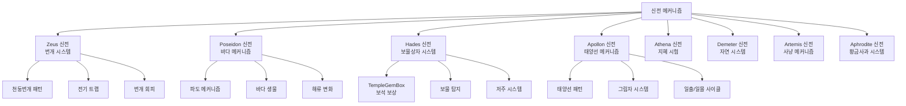

# 게임 메커니즘 - 특수 시스템 - 신전 메커니즘

## 개요
신전 메커니즘은 그리스 신화를 테마로 한 특별한 게임 영역에서 작동하는 고유한 시스템입니다. 각 신전마다 해당 신의 특성을 반영한 독특한 메커니즘과 상호작용을 제공하며, 플레이어에게 도전적이면서도 보상이 풍부한 경험을 선사합니다.

## 신전 메커니즘 시스템 구조

### 시스템 아키텍처


## 관련 파일 경로

### 신전 특화 컴포넌트들
```
RootDesk/MyDesk/ModelForTemple/RelatedComponents/
├── TemplePegasus.mlua                  # 페가수스 상호작용 (Zeus 신전)
├── TemplePegasus.codeblock             # 페가수스 비주얼
├── TempleGemBox.mlua                   # 보석 상자 (Hades 신전)
├── TempleGemBox.codeblock              # 보석 상자 비주얼
├── TempleGoldstatus.mlua               # 황금 지팡이 (Plutus)
├── TempleGoldstatus.codeblock          # 황금 지팡이 비주얼
├── TempleFountain.mlua                 # 신전 분수
├── TempleFountain.codeblock            # 신전 분수 비주얼
├── TempleExplorerBox.mlua              # 탐험가 상자
├── TempleExplorerBox.codeblock         # 탐험가 상자 비주얼
└── 기타 신전 특화 오브젝트들
```

### 신전별 레벨 디자인
```
RootDesk/MyDesk/LevelDesign0109~/
├── Zeus/                               # 제우스 신전 메커니즘
│   ├── Model_Zeus_ThunderCloud.model   # 천둥구름
│   ├── Model_Zeus_Lightning.model      # 번개
│   └── ZeusThunderManager.mlua         # 번개 관리자
├── Poseidon/                           # 포세이돈 신전 메커니즘
│   ├── Model_Poseidon_Wave.model       # 파도
│   ├── Model_Poseidon_Trident.model    # 삼지창
│   └── PoseidonWaveController.mlua     # 파도 컨트롤러
├── Hades/                              # 하데스 신전 메커니즘
│   ├── Model_Hades_TreasureChest.model # 보물상자
│   ├── Model_Hades_Soul.model          # 영혼
│   └── HadesTreasureManager.mlua       # 보물 관리자
├── Apollon/                            # 아폴론 신전 메커니즘
│   ├── Model_Apollon_SunChariot.model  # 태양마차
│   ├── Model_Apollon_SunBeam.model     # 태양광선
│   └── ApollonSunController.mlua       # 태양 컨트롤러
└── 기타 신전들/
```

### 신전 맵 및 데이터
```
map/
├── Temple_Zeus_1.map                   # 제우스 신전 1층
├── Temple_Poseidon_1.map               # 포세이돈 신전 1층
├── Temple_Hades_8.map                  # 하데스 신전 8층
└── 기타 신전 맵들

RootDesk/MyDesk/DataSets/
├── TempleReward.csv                    # 신전 보상 데이터
├── TempleReward.userdataset            # 신전 보상 데이터셋
├── TempleMechanism.csv                 # 신전 메커니즘 설정
└── TempleMechanism.userdataset         # 신전 메커니즘 데이터셋
```

## Zeus 신전 - 번개 메커니즘

### TemplePegasus - 페가수스 상호작용
```lua
@Component
script TemplePegasus extends InteractionComponent

    @ExecSpace("Server")
    method void OnInteractionEvent(Entity player)
        -- 인벤토리 비우기 (페가수스의 정화 능력)
        local backpack = player.PlayerBackpack
        local totalCleared = 0
        
        for i=1, #backpack.storageList do
            if backpack.storageList[i] > 0 then
                totalCleared = totalCleared + backpack.storageList[i]
                backpack.storageList[i] = 0
            end
        end
        
        -- 인벤토리 동기화
        backpack:SetTableClient("storageList", 
            _UtilLogic:TableToString(backpack.storageList), player.OwnerId)
        
        -- 골드 보상 (건설 레벨에 따라)
        local constructionLevel = player.PlayerConstruction.haveItems[3] or 1
        local goldReward = 50000 * constructionLevel * totalCleared
        
        if goldReward > 0 then
            player.PlayerData:AddMoney(goldReward)
            
            -- 보상 메시지
            _CustomLocalizationLogic:SendLocalizedFormattedToastMessageFromServer(
                "Message_PegasusReward", {_ThousandsSeparator:ConvertToMetricPrefixString(goldReward)}, 
                player.OwnerId)
        end
        
        log(string.format("페가수스 상호작용: %d 아이템 정화, %d 골드 보상", totalCleared, goldReward))
    end
```

### Zeus 번개 시스템
```lua
-- ZeusThunderManager.mlua (신전별 특화 시스템)
@Component
script ZeusThunderManager extends Component

    property number lightningInterval = 5.0    -- 번개 간격
    property table lightningZones = {}          -- 번개 구역들
    property boolean isStormActive = false     -- 폭풍 활성 상태

    method void OnBeginPlay()
        -- 번개 구역 초기화
        self:InitializeLightningZones()
        
        -- 번개 패턴 시작
        self:StartLightningSequence()
    end
    
    method void InitializeLightningZones()
        local zonePositions = {
            Vector3(10, 15, 5), Vector3(-5, 15, 8), Vector3(0, 15, -10),
            Vector3(12, 15, -3), Vector3(-8, 15, 6)
        }
        
        for i, pos in ipairs(zonePositions) do
            local zone = {
                position = pos,
                radius = 3.0,
                isActive = false,
                warningTime = 2.0
            }
            table.insert(self.lightningZones, zone)
        end
    end
    
    method void StartLightningSequence()
        local lightningTimer = function()
            if self.isStormActive then
                self:TriggerRandomLightning()
            end
            
            _TimerService:SetTimerOnce(lightningTimer, self.lightningInterval)
        end
        
        self.isStormActive = true
        lightningTimer()
    end
    
    method void TriggerRandomLightning()
        local zoneIndex = _UtilLogic:RandomIntegerRange(1, #self.lightningZones)
        local zone = self.lightningZones[zoneIndex]
        
        -- 경고 표시
        self:ShowLightningWarning(zone)
        
        -- 번개 발생
        _TimerService:SetTimerOnce(function()
            self:StrikeLightning(zone)
        end, zone.warningTime)
    end
    
    method void StrikeLightning(table zone)
        -- 번개 이펙트 생성
        local lightning = _SpawnService:SpawnByModelId(
            "model://lightning_effect", "Lightning", zone.position)
        
        -- 범위 내 플레이어들에게 데미지
        local players = _EntityService:GetEntitiesByTag("Player")
        for _, player in ipairs(players) do
            local distance = Vector3.Distance(player.Transform.Position, zone.position)
            if distance <= zone.radius then
                player.PlayerIngameData:TakeDamage(30, "lightning")
                self:ApplyLightningEffect(player)
            end
        end
        
        -- 번개 사운드
        _SoundService:PlaySound("zeus_lightning_strike", 1.0)
        
        -- 이펙트 정리
        _TimerService:SetTimerOnce(function()
            lightning:Destroy()
        end, 2.0)
    end
```

## Hades 신전 - 보물상자 시스템

### TempleGemBox - 보석 상자 메커니즘
```lua
@Component
script TempleGemBox extends InteractionComponent

    @ExecSpace("Server")
    method void OnInteractionEvent(Entity player)
        -- 건설 레벨에 따른 젬 보상
        local constructionLevel = player.PlayerConstruction.haveItems[8] or 1
        local baseGemReward = 100
        local gemReward = baseGemReward * constructionLevel
        
        -- 젬 지급
        player.PlayerStorage:AddCurrencyItems(2, gemReward, true)  -- 젬 = 타입 2
        
        -- 보상 메시지
        _CustomLocalizationLogic:SendLocalizedFormattedToastMessageFromServer(
            "Message_HadesTreasure", 
            {_ThousandsSeparator:ConvertToMetricPrefixString(gemReward)}, 
            player.OwnerId)
        
        -- 보물상자 이펙트
        self:PlayTreasureEffect()
        
        -- 상자 비활성화 (일정 시간 후 재활성화)
        self:DeactivateTemporarily(300)  -- 5분 쿨다운
        
        log(string.format("하데스 보물상자: %d 젬 획득", gemReward))
    end
    
    method void PlayTreasureEffect()
        local treasureEffect = _SpawnService:SpawnByModelId(
            "model://hades_treasure_effect", "TreasureEffect", 
            self.Entity.Transform.Position)
        
        _SoundService:PlaySound("hades_treasure_open", 0.8)
        
        _TimerService:SetTimerOnce(function()
            treasureEffect:Destroy()
        end, 3.0)
    end
    
    method void DeactivateTemporarily(number cooldownSeconds)
        self.Entity.Enable = false
        
        _TimerService:SetTimerOnce(function()
            self.Entity.Enable = true
            self:PlayReactivationEffect()
        end, cooldownSeconds)
    end
```

### Hades 영혼 시스템
```lua
-- HadesSoulManager.mlua
@Component
script HadesSoulManager extends Component

    property table wanderingSouls = {}      -- 방랑하는 영혼들
    property number soulSpawnRate = 10.0    -- 영혼 생성 주기

    method void SpawnWanderingSoul()
        local spawnPosition = self:GetRandomSpawnPosition()
        local soul = _SpawnService:SpawnByModelId(
            "model://hades_wandering_soul", "WanderingSoul", spawnPosition)
        
        -- 영혼 AI 설정
        soul.SoulAI:SetWanderPattern("random")
        soul.SoulAI:SetInteractionReward("currency", 2, 10)  -- 젬 10개
        
        table.insert(self.wanderingSouls, soul)
        
        -- 영혼 수명 (60초 후 자연 소멸)
        _TimerService:SetTimerOnce(function()
            self:RemoveSoul(soul)
        end, 60.0)
    end
    
    method void OnSoulInteraction(Entity soul, Entity player)
        -- 영혼과의 상호작용 시 특별 보상
        local rewardType = _UtilLogic:RandomIntegerRange(1, 3)
        
        if rewardType == 1 then
            -- 젬 보상
            player.PlayerStorage:AddCurrencyItems(2, 15, true)
        elseif rewardType == 2 then
            -- 유물 조각
            player.PlayerRelic:AddRelic(false, _UtilLogic:RandomIntegerRange(1, 20))
        else
            -- 특별 버프
            self:ApplySoulBuff(player)
        end
        
        self:RemoveSoul(soul)
    end
```

## Plutus (금전신) - 황금 지팡이 시스템

### TempleGoldstatus - 황금 지팡이 메커니즘
```lua
@Component
script TempleGoldstatus extends InteractionComponent

    @ExecSpace("Server")
    method void OnInteractionEvent(Entity player)
        -- 건설 레벨과 신전 층수에 따른 골드 보상
        local constructionLevel = player.PlayerConstruction.haveItems[4] or 1
        local templeFloor = player.PlayerIngameData.TempleFloor or 1
        
        -- 기본 보상 계산
        local baseGoldReward = 10000
        local floorMultiplier = math.max(1, templeFloor / 10)  -- 10층마다 배수 증가
        local constructionMultiplier = constructionLevel
        
        local goldReward = baseGoldReward * floorMultiplier * constructionMultiplier
        
        -- 골드 지급
        player.PlayerData:AddMoney(goldReward)
        
        -- 특별 이펙트
        self:PlayGoldenEffect()
        
        -- 보상 메시지
        _CustomLocalizationLogic:SendLocalizedFormattedToastMessageFromServer(
            "Message_PlutusBlessing", 
            {_ThousandsSeparator:ConvertToMetricPrefixString(goldReward)}, 
            player.OwnerId)
        
        log(string.format("플루투스 축복: %d골드 획득 (층수:%d, 건설레벨:%d)", 
            goldReward, templeFloor, constructionLevel))
    end
    
    method void PlayGoldenEffect()
        -- 황금 파티클 이펙트
        local goldenEffect = _SpawnService:SpawnByModelId(
            "model://plutus_golden_effect", "GoldenBlessing", 
            self.Entity.Transform.Position)
        
        -- 황금 사운드
        _SoundService:PlaySound("plutus_golden_blessing", 1.0)
        
        -- 황금 오라 확산 효과
        local expandEffect = function(frame)
            local scale = 1.0 + (frame / 60.0) * 2.0  -- 2초에 걸쳐 3배 확대
            goldenEffect.Transform.LocalScale = Vector3(scale, scale, scale)
            
            local alpha = 1.0 - (frame / 120.0)  -- 2초에 걸쳐 페이드아웃
            goldenEffect.ParticleSystemComponent.Color.a = alpha
        end
        
        for i=1, 120 do
            _TimerService:SetTimerOnce(function() expandEffect(i) end, i/60)
        end
        
        -- 이펙트 정리
        _TimerService:SetTimerOnce(function()
            goldenEffect:Destroy()
        end, 3.0)
    end
```

## Apollon 신전 - 태양선 메커니즘

### 태양마차 시스템
```lua
-- ApollonSunController.mlua
@Component
script ApollonSunController extends Component

    property Entity sunChariot = nil        -- 태양마차
    property table sunBeamZones = {}        -- 태양광선 구역들
    property number dayNightCycle = 60.0    -- 하루 사이클 (60초)

    method void OnBeginPlay()
        self:InitializeSunChariot()
        self:StartDayNightCycle()
    end
    
    method void InitializeSunChariot()
        local chariotPath = self.Entity.Transform.Position + Vector3(0, 20, 0)
        self.sunChariot = _SpawnService:SpawnByModelId(
            "model://apollon_sun_chariot", "SunChariot", chariotPath)
        
        -- 태양마차 이동 패턴 설정
        self.sunChariot.SunChariotMovement:SetOrbitPattern("ellipse", 30.0, 15.0)
    end
    
    method void StartDayNightCycle()
        local cycleTimer = function(elapsedTime)
            local cycleProgress = (elapsedTime % self.dayNightCycle) / self.dayNightCycle
            
            -- 태양마차 위치 업데이트
            self:UpdateSunChariotPosition(cycleProgress)
            
            -- 태양광선 시전
            if cycleProgress > 0.2 and cycleProgress < 0.8 then  -- 낮 시간
                self:CastSunBeams()
            end
            
            -- 환경 조명 업데이트
            self:UpdateTempleLighting(cycleProgress)
        end
        
        -- 지속적인 사이클 실행
        for i=1, math.huge do
            _TimerService:SetTimerOnce(function() cycleTimer(i/60) end, i/60)
            if i > 3600 then break end  -- 1시간 한계
        end
    end
    
    method void CastSunBeams()
        local beamTargets = self:GetRandomBeamTargets(3)  -- 3개 지점에 태양광선
        
        for _, target in ipairs(beamTargets) do
            -- 태양광선 경고
            self:ShowSunBeamWarning(target, 2.0)
            
            -- 2초 후 태양광선 발사
            _TimerService:SetTimerOnce(function()
                self:FireSunBeam(target)
            end, 2.0)
        end
    end
    
    method void FireSunBeam(Vector3 targetPosition)
        local sunBeam = _SpawnService:SpawnByModelId(
            "model://apollon_sun_beam", "SunBeam", targetPosition)
        
        -- 범위 내 플레이어들에게 효과 적용
        local players = _EntityService:GetEntitiesByTag("Player")
        for _, player in ipairs(players) do
            local distance = Vector3.Distance(player.Transform.Position, targetPosition)
            if distance <= 2.0 then
                -- 태양광선의 이중 효과: 데미지 or 치유
                if self:IsPlayerPure(player) then
                    -- 순수한 플레이어는 치유
                    player.PlayerIngameData:Heal(20)
                else
                    -- 그렇지 않으면 데미지
                    player.PlayerIngameData:TakeDamage(25, "sunbeam")
                end
            end
        end
        
        -- 태양광선 사운드
        _SoundService:PlaySound("apollon_sun_beam", 0.9)
        
        -- 이펙트 정리
        _TimerService:SetTimerOnce(function()
            sunBeam:Destroy()
        end, 5.0)
    end
```

## Demeter 신전 - 자연 성장 시스템

### 계절 변화 메커니즘
```lua
-- DemeterSeasonManager.mlua
@Component
script DemeterSeasonManager extends Component

    property table seasons = {"Spring", "Summer", "Autumn", "Winter"}
    property number currentSeason = 1
    property number seasonDuration = 120.0  -- 각 계절 2분

    method void OnBeginPlay()
        self:StartSeasonCycle()
    end
    
    method void StartSeasonCycle()
        local seasonTimer = function()
            self:ChangeSeason()
            _TimerService:SetTimerOnce(seasonTimer, self.seasonDuration)
        end
        
        seasonTimer()
    end
    
    method void ChangeSeason()
        self.currentSeason = (self.currentSeason % 4) + 1
        local seasonName = self.seasons[self.currentSeason]
        
        -- 계절별 환경 변화
        self:UpdateEnvironmentForSeason(seasonName)
        
        -- 계절별 특수 효과
        self:ApplySeasonalEffects(seasonName)
        
        log("데메테르 신전 계절 변화: " .. seasonName)
    end
    
    method void UpdateEnvironmentForSeason(string season)
        if season == "Spring" then
            -- 봄: 생명력 회복, 성장 가속
            self:SpawnFlowers()
            self:BoostGrowthRate(2.0)
        elseif season == "Summer" then
            -- 여름: 풍요로운 수확, 에너지 증폭
            self:ActivateHarvestBonus()
            self:IncreaseEnergyGeneration(1.5)
        elseif season == "Autumn" then
            -- 가을: 수확의 계절, 보상 증가
            self:TriggerHarvestSeason()
            self:IncreaseRewardDrops(2.0)
        else -- Winter
            -- 겨울: 휴면기, 방어력 증가하지만 속도 감소
            self:ApplyWinterEffects()
            self:ReduceMovementSpeed(0.7)
        end
    end
```

## 신전 공통 메커니즘

### 신전 층수 시스템
```lua
-- TempleFloorManager.mlua (모든 신전 공통)
@Component
script TempleFloorManager extends Component

    method void OnPlayerEnterTemple(Entity player)
        -- 첫 신전 진입 시 초기 층수 설정
        if player.PlayerIngameData.TempleFloor == 0 then
            player.PlayerIngameData.TempleFloor = 1
        end
        
        -- 신전별 특수 입장 조건 확인
        if not self:CheckTempleEntry(player) then
            self:EjectPlayer(player, "조건을 만족하지 않습니다")
            return
        end
        
        -- 신전 진입 성공
        self:ApplyTempleEntryEffects(player)
        log(string.format("플레이어 %s 신전 %d층 진입", player.Name, player.PlayerIngameData.TempleFloor))
    end
    
    method boolean CheckTempleEntry(Entity player)
        local requiredLevel = 25
        local requiredQuest = "TempleAccess"
        
        -- 레벨 조건
        if player.PlayerData.Level < requiredLevel then
            return false
        end
        
        -- 퀘스트 진행도 조건
        -- if not player.PlayerQuest:IsQuestCompleted(requiredQuest) then
        --     return false
        -- end
        
        return true
    end
    
    method void ApplyTempleEntryEffects(Entity player)
        -- 신전 진입 시 특수 효과
        player.PlayerIngameData:ApplyBuff("TempleBlessing", 300)  -- 5분간 축복
        
        -- 신전 전용 아이템 효과 활성화
        self:ActivateTempleItems(player)
        
        -- 신전 진입 메시지
        _CustomLocalizationLogic:SendLocalizedToastMessageFromServer(
            "Message_TempleEntry", player.OwnerId)
    end
```

### 신전 보상 시스템
```lua
method void CalculateTempleReward(Entity player, string templeType)
    local baseReward = {
        gold = 1000,
        gems = 10,
        experience = 100
    }
    
    -- 신전 타입별 보상 배수
    local templeMultipliers = {
        ["Zeus"] = {gold = 1.5, gems = 1.0, experience = 1.2},
        ["Poseidon"] = {gold = 1.2, gems = 1.5, experience = 1.0},
        ["Hades"] = {gold = 1.8, gems = 2.0, experience = 0.8},
        ["Apollon"] = {gold = 1.0, gems = 1.0, experience = 2.0}
    }
    
    local multiplier = templeMultipliers[templeType] or {gold = 1.0, gems = 1.0, experience = 1.0}
    local templeFloor = player.PlayerIngameData.TempleFloor
    
    -- 최종 보상 계산
    local finalReward = {
        gold = math.floor(baseReward.gold * multiplier.gold * (1 + templeFloor * 0.1)),
        gems = math.floor(baseReward.gems * multiplier.gems * (1 + templeFloor * 0.05)),
        experience = math.floor(baseReward.experience * multiplier.experience * (1 + templeFloor * 0.15))
    }
    
    -- 보상 지급
    player.PlayerData:AddMoney(finalReward.gold)
    player.PlayerStorage:AddCurrencyItems(2, finalReward.gems, true)
    player.PlayerData:AddExperience(finalReward.experience)
    
    return finalReward
end
```

## 성능 최적화

### 신전 메커니즘 최적화
```lua
-- 활성 플레이어 근처의 메커니즘만 실행
method void OptimizeTempleMechanisms()
    local activeRange = 50.0  -- 50미터 내의 메커니즘만 활성화
    local allPlayers = _EntityService:GetEntitiesByTag("Player")
    
    for _, mechanism in ipairs(self.templeMechanisms) do
        local nearPlayer = false
        
        for _, player in ipairs(allPlayers) do
            local distance = Vector3.Distance(mechanism.Transform.Position, player.Transform.Position)
            if distance <= activeRange then
                nearPlayer = true
                break
            end
        end
        
        mechanism:SetActive(nearPlayer)
    end
end
```

## 일반적인 문제 해결

### 신전 메커니즘이 작동하지 않는 경우
1. 플레이어 진입 조건 확인
2. 신전별 특수 컴포넌트 설정 점검
3. 신전 층수 데이터 동기화 상태 확인

### 보상이 지급되지 않는 경우
1. 건설 레벨 데이터 확인
2. 보상 계산 로직 점검
3. 플레이어 데이터 저장 상태 확인
